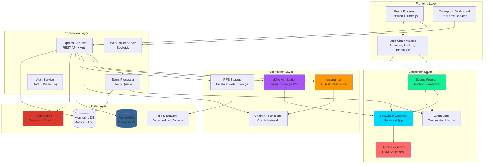
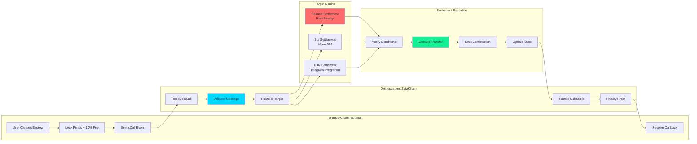
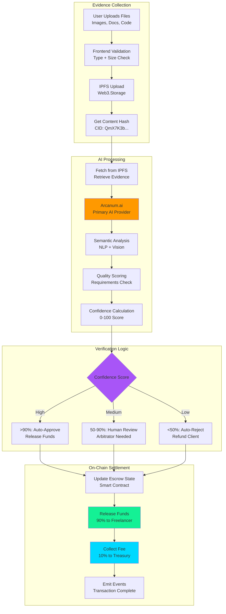
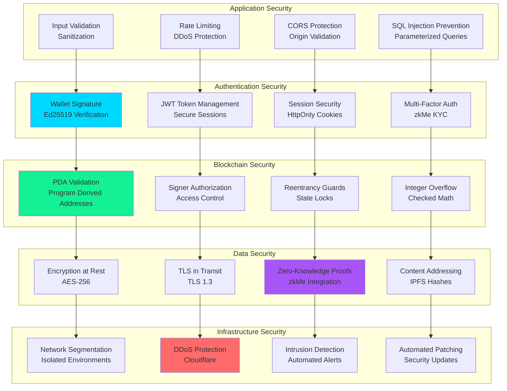

# Architecture Diagrams

This file contains all system architecture diagrams for AetherLock Protocol.

## System Architecture Diagram (All Components)

## Cross-Chain Message Flow Diagram

## AI Verification Pipeline Diagram

## Security Layers Diagram

## Proof-of-Task Verification (PoTV) Flow Diagram

```mermaid
flowchart TB
    subgraph "Phase 1: Evidence Submission"
        A[Freelancer Submits Evidence<br/>Images, Docs, Code]
        B[Upload to IPFS<br/>Decentralized Storage]
        C[Get Content Hash<br/>CID: QmX7K3b...]
        D[Submit Hash On-Chain<br/>Solana Program]
    end
    
    subgraph "Phase 2: AI Analysis"
        E[Chainlink Oracle<br/>Fetch Evidence from IPFS]
        F[Arcanum.ai Analysis<br/>Primary AI Provider]
        G[Fallback Chain<br/>OpenAI → Claude → Gemini]
        H[Quality Assessment<br/>Requirements Matching]
        I[Confidence Score<br/>0-100 Scale]
        J[Cryptographic Signing<br/>HMAC-SHA256]
    end
    
    subgraph "Phase 3: Zero-Knowledge Proof"
        K[Generate ZK Proof<br/>zkMe SDK]
        L[Proof Components<br/>- Verification occurred<br/>- Confidence threshold met<br/>- Timestamp valid]
        M[No Evidence Exposure<br/>Privacy Preserved]
    end
    
    subgraph "Phase 4: Oracle Verification"
        N[Chainlink Functions<br/>Decentralized Oracle Network]
        O[Multiple Nodes Verify<br/>ZK Proof Validation]
        P[Consensus Mechanism<br/>Majority Agreement]
        Q[On-Chain Submission<br/>Signed Transaction]
    end
    
    subgraph "Phase 5: Smart Contract Validation"
        R[Solana Anchor Program<br/>Verify PoTV Chain]
        S[Validate Components<br/>- AI signature valid<br/>- ZK proof correct<br/>- Oracle consensus reached<br/>- Timestamp fresh]
        T[Execute Settlement<br/>Release Funds or Dispute]
        U[Emit Events<br/>Immutable Audit Trail]
    end
    
    A --> B
    B --> C
    C --> D
    D --> E
    
    E --> F
    F --> H
    F -.->|Failure| G
    G --> H
    H --> I
    I --> J
    
    J --> K
    K --> L
    L --> M
    
    M --> N
    N --> O
    O --> P
    P --> Q
    
    Q --> R
    R --> S
    S --> T
    T --> U
    
    style F fill:#FF9900
    style K fill:#A855F7
    style N fill:#00D9FF
    style R fill:#14F195
    style T fill:#FFD700
```

**PoTV Consensus Analogy:**

| Consensus Type | What It Proves | How It Works |
|----------------|----------------|--------------|
| **Proof-of-Work (PoW)** | Proves computational work | Miners solve mathematical puzzles to validate blocks |
| **Proof-of-Stake (PoS)** | Proves capital commitment | Validators lock tokens to secure the network |
| **Proof-of-Task Verification (PoTV)** | Proves human work completion | AI + ZK proofs + Oracles verify task quality on-chain |

**PoTV Innovation:**
- Developed by AetherLock Labs as the first consensus mechanism for verifying human task completion quality
- Combines AI analysis, zero-knowledge cryptography, decentralized oracles, and smart contracts
- Enables trustless verification of subjective work quality without exposing private evidence
- Provides cryptographic proof that human work meets specified requirements

