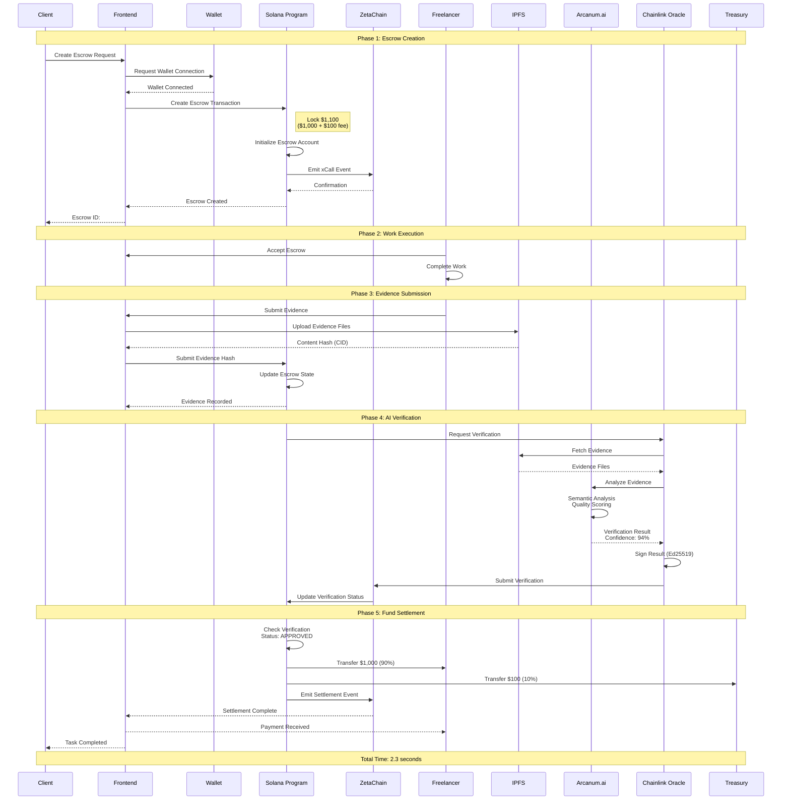
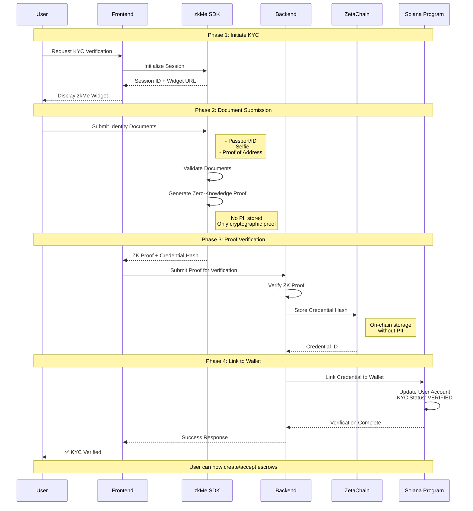
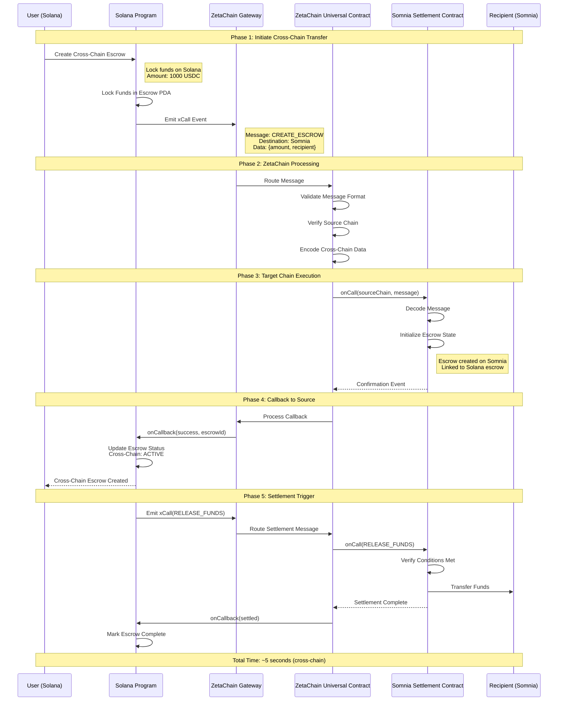
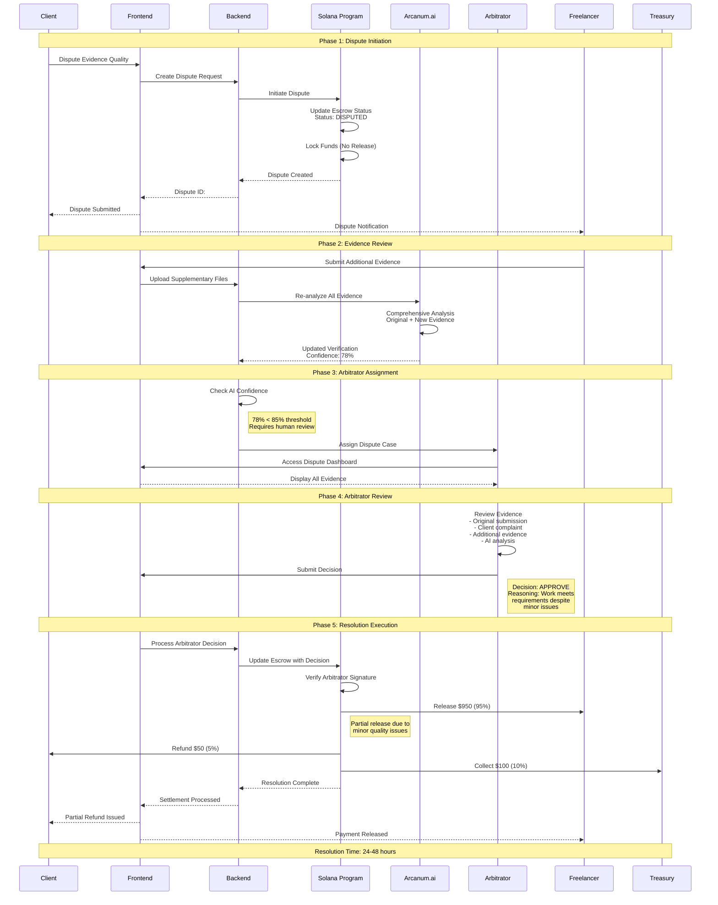
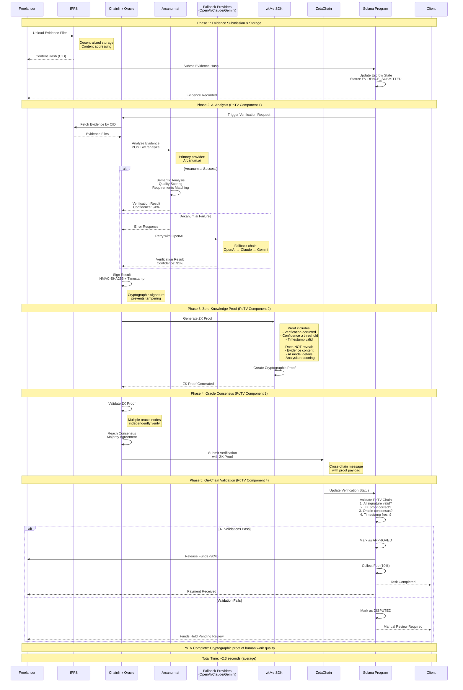

# Sequence Diagrams

This file contains all sequence diagrams for AetherLock Protocol workflows.

## Complete Escrow Flow (Client → Contract → Freelancer → AI → Treasury)

## KYC Verification Flow

## Cross-Chain Settlement Flow

## Dispute Resolution Flow

## Proof-of-Task Verification (PoTV) Detailed Flow

**PoTV Security Properties:**

1. **AI Result Integrity**: Cryptographic signatures prevent tampering with verification results
2. **Privacy Preservation**: Zero-knowledge proofs verify without exposing evidence content
3. **Decentralization**: Multiple oracle nodes prevent single point of failure
4. **Immutability**: On-chain validation creates permanent audit trail
5. **Fallback Resilience**: Provider chain ensures high availability (Arcanum.ai → OpenAI → Claude → Gemini)

