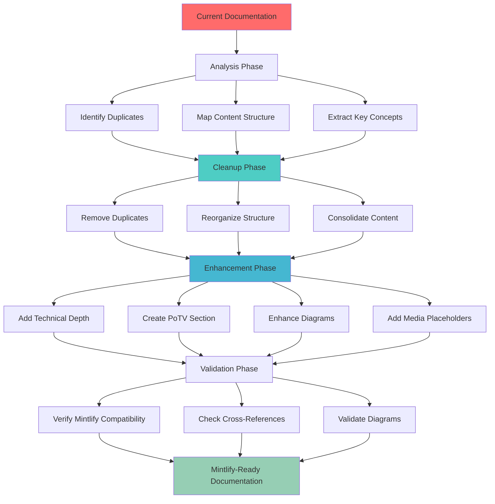

# Design Document

## Overview

This design document outlines the comprehensive strategy for enhancing and restructuring the AetherLock Universal Protocol documentation to achieve hackathon-ready, enterprise-level quality suitable for Mintlify deployment. The enhancement will transform the existing documentation into a unified resource that serves as a development guide, business pitch, and technical presentation simultaneously.

The design follows a preservation-first approach: all original content, wording, and intent will be maintained while improving organization, clarity, technical depth, and professional presentation. The enhanced documentation will be optimized for multiple audiences (developers, investors, judges) and deployed on Mintlify for professional rendering.

## Architecture

### Documentation Enhancement Pipeline



### Content Organization Strategy

| Current State | Target State | Rationale |
|---------------|--------------|-----------|
| Duplicate folders (design/design/, requirements/requirements/) | Single-level folders (design/, requirements/) | Eliminate confusion, improve navigation |
| Mixed content types in root | Organized by category (api/, design/, guides/, etc.) | Clear information architecture |
| Inconsistent formatting | Unified Mintlify markdown | Professional, consistent presentation |
| Missing PoTV deep-dive | Dedicated PoTV section | Highlight novel consensus mechanism |
| Limited diagrams | Comprehensive Mermaid diagrams | Visual learning, better comprehension |
| Basic Amazon Q documentation | Detailed tool usage with evidence | Hackathon compliance, demonstrate value |

## Components and Interfaces

### 1. Content Analyzer

**Purpose**: Analyze existing documentation to identify duplicates, structure, and enhancement opportunities

**Interface**:
```typescript
interface ContentAnalyzer {
  scanWorkspace(): Promise<AnalysisResult>;
  identifyDuplicates(): Promise<DuplicateReport>;
  mapContentStructure(): Promise<ContentMap>;
  extractKeyConceptsFrom(file: string): Promise<Concept[]>;
}

interface AnalysisResult {
  totalFiles: number;
  duplicateFiles: string[];
  contentCategories: ContentCategory[];
  missingDiagrams: string[];
  enhancementOpportunities: Enhancement[];
}

interface DuplicateReport {
  duplicateFolders: FolderPair[];
  duplicateFiles: FilePair[];
  consolidationPlan: ConsolidationAction[];
}

interface ContentMap {
  categories: {
    technical: string[];
    business: string[];
    guides: string[];
    api: string[];
    design: string[];
  };
  crossReferences: Reference[];
  brokenLinks: string[];
}
```

### 2. Content Enhancer

**Purpose**: Enhance existing content while preserving original intent and wording

**Interface**:
```typescript
interface ContentEnhancer {
  enhanceTechnicalDepth(file: string): Promise<EnhancedContent>;
  addDiagrams(file: string, diagramType: DiagramType): Promise<string>;
  addMediaPlaceholders(file: string): Promise<string>;
  improveFormatting(file: string): Promise<string>;
  ensureMintlifyCompatibility(file: string): Promise<ValidationResult>;
}

interface EnhancedContent {
  originalContent: string;
  enhancedContent: string;
  changesApplied: Change[];
  preservedSections: string[];
}

interface Change {
  type: 'formatting' | 'diagram' | 'depth' | 'organization';
  description: string;
  location: string;
  preservesOriginal: boolean;
}
```

### 3. PoTV Section Builder

**Purpose**: Create comprehensive Proof-of-Task Verification documentation

**Interface**:
```typescript
interface PoTVSectionBuilder {
  createOverview(): Promise<string>;
  documentClientWorkflow(): Promise<string>;
  documentFreelancerWorkflow(): Promise<string>;
  createVerificationFlowDiagram(): Promise<string>;
  documentDisputeResolution(): Promise<string>;
  createComparisonTables(): Promise<string>;
}

interface PoTVSection {
  overview: string;
  consensusComparison: string; // PoW vs PoS vs PoTV
  fourStepFlow: string; // AI → ZK → Oracle → Contract
  clientWorkflow: string;
  freelancerWorkflow: string;
  scoringMetrics: string;
  disputeResolution: string;
  diagrams: PoTVDiagram[];
  codeExamples: CodeExample[];
}

interface PoTVDiagram {
  type: 'sequence' | 'flowchart' | 'state-machine' | 'decision-matrix';
  title: string;
  mermaidCode: string;
  description: string;
}
```

### 4. Diagram Generator

**Purpose**: Create and validate Mermaid diagrams for all workflows

**Interface**:
```typescript
interface DiagramGenerator {
  generateSystemOverview(): Promise<string>;
  generateAIVerificationFlow(): Promise<string>;
  generateCrossChainFlow(): Promise<string>;
  generatePoTVConsensusFlow(): Promise<string>;
  generateEscrowLifecycle(): Promise<string>;
  generateDataFlowDiagram(): Promise<string>;
  validateMermaidSyntax(diagram: string): Promise<boolean>;
}

interface DiagramSpec {
  title: string;
  type: 'graph' | 'sequence' | 'state' | 'flowchart' | 'erDiagram';
  components: Component[];
  relationships: Relationship[];
  styling: StyleConfig;
}
```

### 5. Mintlify Optimizer

**Purpose**: Ensure all content is optimized for Mintlify deployment

**Interface**:
```typescript
interface MintlifyOptimizer {
  validateMarkdownSyntax(file: string): Promise<ValidationResult>;
  optimizeImagePaths(file: string): Promise<string>;
  ensureProperHeadings(file: string): Promise<string>;
  validateCodeBlocks(file: string): Promise<ValidationResult>;
  checkCrossReferences(file: string): Promise<Reference[]>;
  generateMintConfig(): Promise<MintConfig>;
}

interface MintConfig {
  name: string;
  logo: LogoConfig;
  navigation: NavigationItem[];
  colors: ColorScheme;
  topbarLinks: Link[];
  anchors: Anchor[];
}

interface NavigationItem {
  group: string;
  pages: string[];
}
```

## Data Models

### Documentation Structure

```typescript
interface DocumentationStructure {
  root: string;
  categories: {
    introduction: IntroductionPages;
    technical: TechnicalPages;
    potv: PoTVPages;
    business: BusinessPages;
    guides: GuidePages;
    api: APIPages;
    design: DesignPages;
    security: SecurityPages;
    diagrams: DiagramPages;
    tools: ToolPages;
  };
  assets: AssetManifest;
  mintConfig: MintConfig;
}

interface IntroductionPages {
  index: string; // Main landing page
  introduction: string; // Project overview
  howItWorks: string; // 4-step process
  technicalArchitecture: string; // System architecture
}

interface PoTVPages {
  overview: string; // PoTV introduction and comparison
  consensusMechanism: string; // Detailed PoTV explanation
  clientWorkflow: string; // Client perspective
  freelancerWorkflow: string; // Freelancer perspective
  verificationFlow: string; // 4-step verification
  scoringMetrics: string; // Confidence thresholds
  disputeResolution: string; // Handling disputes
  codeExamples: string; // Implementation examples
}

interface TechnicalPages {
  architecture: string; // System design
  solanaContracts: string; // Base chain contracts
  zetachainIntegration: string; // Cross-chain messaging
  somniaIntegration: string; // Reputation/rewards
  dataModels: string; // Entity definitions
  aiVerification: string; // Arcanum.ai integration
  zkmeIntegration: string; // Zero-knowledge KYC
  chainlinkOracles: string; // Oracle network
  ipfsStorage: string; // Decentralized storage
}

interface BusinessPages {
  businessModel: string; // Revenue model
  marketAnalysis: string; // Market opportunity
  traction: string; // Current metrics
  partners: string; // Technology partners
}

interface ToolPages {
  amazonQUsage: string; // Amazon Q Developer evidence
  kiroIDE: string; // Kiro IDE workflow
  developmentTimeline: string; // 6-week timeline
}
```

### Enhancement Tracking

```typescript
interface EnhancementTracker {
  file: string;
  originalWordCount: number;
  enhancedWordCount: number;
  changesApplied: Change[];
  diagramsAdded: number;
  mediaPlaceholdersAdded: number;
  mintlifyCompatible: boolean;
  reviewStatus: 'pending' | 'approved' | 'needs-revision';
}

interface Change {
  type: ChangeType;
  description: string;
  preservesOriginal: boolean;
  addedValue: string;
}

enum ChangeType {
  FORMATTING = 'formatting',
  DIAGRAM = 'diagram',
  TECHNICAL_DEPTH = 'technical_depth',
  ORGANIZATION = 'organization',
  MEDIA_PLACEHOLDER = 'media_placeholder',
  CROSS_REFERENCE = 'cross_reference'
}
```

## Correctness Properties

*A property is a characteristic or behavior that should hold true across all valid executions of a system—essentially, a formal statement about what the system should do. Properties serve as the bridge between human-readable specifications and machine-verifiable correctness guarantees.*

### Property 1: Content preservation
*For any* enhanced documentation file, the original technical content, wording, and intent should be preserved exactly
**Validates: Requirements 10.1, 10.2, 10.6**

### Property 2: Mintlify compatibility
*For any* documentation page, it should render correctly in Mintlify without syntax errors or broken formatting
**Validates: Requirements 1.2, 1.6**

### Property 3: No duplicate files
*For any* file path in the enhanced documentation, there should be exactly one file at that path (no duplicates in nested folders)
**Validates: Requirements 1.1, 8.1, 8.2**

### Property 4: Complete PoTV documentation
*For any* PoTV-related concept (client workflow, freelancer workflow, verification flow, scoring, disputes), there should be comprehensive documentation in the dedicated PoTV section
**Validates: Requirements 3.2, 3.3, 3.4, 3.5, 3.6, 3.7, 3.8**

### Property 5: Diagram validity
*For any* Mermaid diagram in the documentation, the syntax should be valid and the diagram should render correctly
**Validates: Requirements 9.1, 9.2, 9.3, 9.4, 9.6**

### Property 6: Cross-reference accuracy
*For any* internal link or cross-reference in the documentation, it should point to an existing, non-duplicate file
**Validates: Requirements 8.4**

### Property 7: Multi-audience suitability
*For any* documentation page, it should be comprehensible and valuable to at least one of the target audiences (developers, investors, judges)
**Validates: Requirements 1.7**

### Property 8: Technical depth completeness
*For any* technical component (Solana, ZetaChain, Somnia, AI, zkMe, Chainlink, IPFS), there should be detailed documentation including architecture, integration, and code examples
**Validates: Requirements 2.1, 2.2, 2.3, 2.4, 2.5, 2.6**

### Property 9: Amazon Q evidence completeness
*For any* claim about Amazon Q Developer usage, there should be supporting evidence (commands, timestamps, code examples, or placeholders for screenshots)
**Validates: Requirements 5.1, 5.2, 5.3, 5.4, 5.5, 5.6**

### Property 10: Business model clarity
*For any* revenue stream or cost component, there should be clear documentation with examples and calculations
**Validates: Requirements 6.1, 6.2, 6.3, 6.4, 6.5**

### Property 11: API documentation completeness
*For any* smart contract function, there should be documentation of inputs, outputs, events, error cases, and gas/compute considerations
**Validates: Requirements 7.1, 7.2, 7.3, 7.4, 7.5, 7.6**

### Property 12: Visual aid presence
*For any* complex workflow or concept, there should be at least one visual aid (diagram, flowchart, or table)
**Validates: Requirements 9.1, 9.2, 9.3, 9.4, 9.5**

## Error Handling

### Content Preservation Errors

**Original Content Loss**:
- **Cause**: Overly aggressive enhancement removes original wording
- **Handling**: Maintain backup of original files, compare before/after
- **Recovery**: Restore original content, apply more conservative enhancements

**Intent Misinterpretation**:
- **Cause**: Enhancement changes meaning of original content
- **Handling**: Flag significant changes for manual review
- **Recovery**: Revert to original, clarify enhancement guidelines

### Mintlify Compatibility Errors

**Markdown Syntax Errors**:
- **Cause**: Invalid markdown that doesn't render in Mintlify
- **Handling**: Validate all markdown before committing changes
- **Recovery**: Fix syntax errors, test in Mintlify preview

**Broken Image Paths**:
- **Cause**: Image references don't match Mintlify path conventions
- **Handling**: Standardize all image paths to `/assets/` directory
- **Recovery**: Update image paths, verify rendering

**Invalid Mermaid Diagrams**:
- **Cause**: Mermaid syntax errors prevent diagram rendering
- **Handling**: Validate all Mermaid code before adding to documentation
- **Recovery**: Fix syntax, test in Mermaid live editor

### Duplicate Handling Errors

**Accidental Content Deletion**:
- **Cause**: Removing duplicate deletes unique content
- **Handling**: Compare file contents before deletion, merge unique content
- **Recovery**: Restore from backup, manually merge content

**Broken Cross-References**:
- **Cause**: Removing duplicate breaks links from other files
- **Handling**: Update all cross-references when consolidating duplicates
- **Recovery**: Find and fix broken links, update references

## Testing Strategy

### Documentation Enhancement Testing

This is a documentation enhancement project, so testing focuses on verifying content quality, accuracy, and Mintlify compatibility rather than code execution.

#### Property-Based Tests

**Property Test 1: Content Preservation**
- **Property**: All enhanced files preserve original technical content
- **Test**: Compare original and enhanced files, verify key technical details unchanged
- **Generator**: List of all enhanced documentation files
- **Assertion**: Original technical specifications, code examples, and factual claims are preserved
- **Validates: Property 1**

**Property Test 2: Mintlify Compatibility**
- **Property**: All documentation pages render correctly in Mintlify
- **Test**: Validate markdown syntax, check image paths, verify code block formatting
- **Generator**: List of all documentation files
- **Assertion**: No syntax errors, all images load, code blocks render correctly
- **Validates: Property 2**

**Property Test 3: No Duplicate Files**
- **Property**: No duplicate files exist in nested folders
- **Test**: Scan workspace for duplicate file paths
- **Generator**: Complete file tree
- **Assertion**: Each logical file exists in exactly one location
- **Validates: Property 3**

**Property Test 4: PoTV Documentation Completeness**
- **Property**: All PoTV concepts are comprehensively documented
- **Test**: Check for presence of client workflow, freelancer workflow, verification flow, scoring, disputes
- **Generator**: List of PoTV documentation files
- **Assertion**: All required PoTV sections exist with substantial content
- **Validates: Property 4**

**Property Test 5: Diagram Validity**
- **Property**: All Mermaid diagrams have valid syntax
- **Test**: Parse all Mermaid code blocks, validate syntax
- **Generator**: List of files containing Mermaid diagrams
- **Assertion**: All diagrams parse without errors
- **Validates: Property 5**

**Property Test 6: Cross-Reference Accuracy**
- **Property**: All internal links point to existing files
- **Test**: Extract all internal links, verify target files exist
- **Generator**: List of files with internal links
- **Assertion**: No broken links, all targets exist
- **Validates: Property 6**

**Property Test 7: Multi-Audience Suitability**
- **Property**: Each page serves at least one target audience
- **Test**: Analyze content for technical depth (developers), business metrics (investors), innovation (judges)
- **Generator**: List of all documentation pages
- **Assertion**: Each page has clear value for at least one audience
- **Validates: Property 7**

**Property Test 8: Technical Depth Completeness**
- **Property**: All technical components have detailed documentation
- **Test**: Check for architecture, integration, and code examples for each component
- **Generator**: List of technical components (Solana, ZetaChain, Somnia, AI, zkMe, Chainlink, IPFS)
- **Assertion**: Each component has comprehensive documentation
- **Validates: Property 8**

**Property Test 9: Amazon Q Evidence Completeness**
- **Property**: All Amazon Q claims have supporting evidence
- **Test**: Find all Amazon Q mentions, verify evidence exists
- **Generator**: List of Amazon Q usage claims
- **Assertion**: Each claim has commands, timestamps, code examples, or screenshot placeholders
- **Validates: Property 9**

**Property Test 10: Business Model Clarity**
- **Property**: All revenue streams and costs are clearly documented
- **Test**: Check for examples and calculations for each financial component
- **Generator**: List of business model components
- **Assertion**: Each component has clear documentation with numbers
- **Validates: Property 10**

**Property Test 11: API Documentation Completeness**
- **Property**: All smart contract functions are fully documented
- **Test**: Check for inputs, outputs, events, errors, and gas considerations
- **Generator**: List of smart contract functions
- **Assertion**: Each function has complete documentation
- **Validates: Property 11**

**Property Test 12: Visual Aid Presence**
- **Property**: Complex concepts have visual aids
- **Test**: Identify complex workflows, verify diagrams/tables exist
- **Generator**: List of complex concepts
- **Assertion**: Each complex concept has at least one visual aid
- **Validates: Property 12**

#### Unit Tests (Example-Based)

**Test 1: PoTV Overview Contains Consensus Comparison**
- **Input**: PoTV overview file
- **Expected**: Contains comparison table with PoW, PoS, and PoTV
- **Validates: Requirements 3.1**

**Test 2: Technical Architecture Has All Layer Diagrams**
- **Input**: Technical architecture file
- **Expected**: Contains system overview, AI flow, cross-chain flow, PoTV flow diagrams
- **Validates: Requirements 2.4**

**Test 3: Amazon Q Usage Has Evidence Placeholders**
- **Input**: Amazon Q usage file
- **Expected**: Contains placeholders for screenshots with descriptive labels
- **Validates: Requirements 5.4**

**Test 4: Business Model Has Revenue Scenarios**
- **Input**: Business model file
- **Expected**: Contains example revenue calculations for different transaction volumes
- **Validates: Requirements 6.3**

**Test 5: Smart Contract API Has Error Documentation**
- **Input**: Smart contract API files
- **Expected**: Each function documents error cases and recovery strategies
- **Validates: Requirements 7.6**

### Manual Validation Checklist

After automated tests pass, perform manual review:

**Content Quality**:
- [ ] All original technical content is preserved
- [ ] Enhancements add value without changing intent
- [ ] Terminology is consistent throughout
- [ ] Writing is clear and professional
- [ ] No grammatical or spelling errors

**Mintlify Compatibility**:
- [ ] All pages render correctly in Mintlify preview
- [ ] Images load and display properly
- [ ] Code blocks have correct syntax highlighting
- [ ] Mermaid diagrams render correctly
- [ ] Navigation structure works as expected

**PoTV Documentation**:
- [ ] PoTV overview explains consensus mechanism clearly
- [ ] Client workflow is comprehensive and actionable
- [ ] Freelancer workflow is comprehensive and actionable
- [ ] 4-step verification flow is well-documented
- [ ] Scoring metrics and thresholds are clear
- [ ] Dispute resolution process is explained
- [ ] Diagrams support understanding
- [ ] Code examples are accurate and helpful

**Technical Depth**:
- [ ] Solana smart contract structure is detailed
- [ ] ZetaChain onCall/onRevert/onAbort flows are explained
- [ ] Somnia integration is documented
- [ ] AI verification process is comprehensive
- [ ] zkMe integration is clear
- [ ] Chainlink oracle role is explained
- [ ] IPFS storage is documented
- [ ] All components have code examples

**Amazon Q & Kiro Evidence**:
- [ ] Amazon Q commands are documented with timestamps
- [ ] Kiro IDE workflow is explained
- [ ] Impact metrics are quantified
- [ ] Screenshot placeholders are present
- [ ] Before/after comparisons are included
- [ ] AI provider decision rationale is documented

**Business Model**:
- [ ] 10% fee structure is clear
- [ ] Cost breakdowns are comprehensive
- [ ] Revenue scenarios are realistic
- [ ] Arcanum.ai cost analysis is detailed
- [ ] Profit margins are documented
- [ ] Market opportunity is quantified

**Organization**:
- [ ] No duplicate files or folders
- [ ] Logical folder structure
- [ ] Clear naming conventions
- [ ] Proper categorization
- [ ] Easy navigation

**Visual Aids**:
- [ ] All major workflows have diagrams
- [ ] Complex concepts have flowcharts
- [ ] Comparisons use tables
- [ ] Diagrams are properly labeled
- [ ] Visual hierarchy is clear

This testing strategy ensures comprehensive validation of all documentation enhancements while maintaining the integrity and accuracy of the AetherLock documentation for Mintlify deployment.

