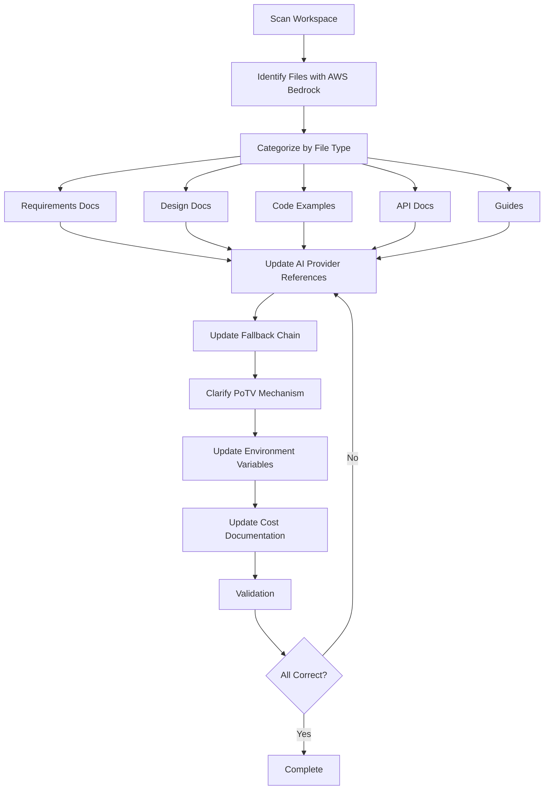

# Design Document

## Overview

This design document outlines the systematic approach to correcting AI verification architecture documentation across the entire AetherLock workspace. The correction involves replacing AWS Bedrock references with Arcanum.ai as the primary AI provider, updating the fallback chain to Arcanum.ai → OpenAI → Claude → Gemini, and clarifying the Proof-of-Task Verification (PoTV) consensus mechanism as a novel approach that proves human work completion.

The design follows a three-phase approach:
1. **Discovery Phase**: Identify all files containing incorrect references
2. **Correction Phase**: Update content with accurate architecture information
3. **Validation Phase**: Verify consistency and completeness across all documentation

## Architecture

### Documentation Correction Pipeline



### File Categories and Update Strategy

| Category | Files to Update | Update Strategy | Priority |
|----------|----------------|-----------------|----------|
| Requirements | `requirements/*.mdx`, `.kiro/specs/*/requirements.md` | Replace AWS Bedrock acceptance criteria with Arcanum.ai | Critical |
| Design | `design/*.mdx`, `.kiro/specs/*/design.md` | Update architecture diagrams and code examples | Critical |
| Code Examples | All `.mdx` files with code blocks | Replace AWS SDK with Arcanum.ai SDK | High |
| API Documentation | `api/*.mdx` | Update endpoint references and response formats | High |
| Guides | `guides/*.mdx` | Update user-facing instructions | Medium |
| Configuration | Environment variable docs | Replace AWS_* with ARCANUM_* variables | High |
| Business Docs | `business-model.mdx`, cost sections | Update pricing to Arcanum.ai costs | Medium |
| Partnership Docs | `partners.mdx` | Add Arcanum.ai as technology partner | Medium |

### Documentation Update Workflow

**Step 1: Pre-Update Validation**
- Create backup of all files to be modified
- Run initial scan to identify all AWS Bedrock references
- Generate update plan with file-by-file changes
- Review plan for potential breaking changes

**Step 2: Critical Path Updates**
- Update requirements documents first (establishes ground truth)
- Update design documents second (technical specifications)
- Update configuration documents third (deployment dependencies)

**Step 3: Supporting Documentation Updates**
- Update API documentation (developer-facing)
- Update code examples (implementation guidance)
- Update user guides (end-user facing)

**Step 4: Business and Partnership Updates**
- Update cost documentation (stakeholder-facing)
- Update partnership documentation (external-facing)
- Update marketing materials (public-facing)

**Step 5: Post-Update Validation**
- Run automated property tests
- Validate all Mermaid diagrams render correctly
- Check all code examples for syntax errors
- Verify terminology consistency
- Generate validation report

**Step 6: Quality Assurance**
- Manual review of critical documents
- Cross-reference validation (ensure consistency across related docs)
- Link validation (ensure no broken references)
- Final proofreading

## Components and Interfaces

### 1. Content Scanner

**Purpose**: Identify all files containing AWS Bedrock or incorrect AI provider references

**Scanning Strategy**:
- **Phase 1 - File Discovery**: Recursively scan workspace for `.md`, `.mdx`, `.ts`, `.js`, `.json` files
- **Phase 2 - Pattern Matching**: Search for AWS Bedrock references using multiple patterns:
  - Text references: "AWS Bedrock", "Bedrock API", "Amazon Bedrock"
  - Code imports: `@aws-sdk/client-bedrock`, `BedrockRuntimeClient`
  - Environment variables: `AWS_ACCESS_KEY_ID`, `AWS_SECRET_ACCESS_KEY`, `AWS_REGION`
  - API endpoints: `bedrock-runtime.*.amazonaws.com`
  - Model identifiers: `anthropic.claude-*`, `bedrock-2023-*`
- **Phase 3 - Context Extraction**: Capture surrounding lines for context-aware replacement
- **Phase 4 - Categorization**: Group files by type for targeted update strategies
- **Phase 5 - Priority Ranking**: Rank files by impact (requirements > design > guides > examples)

**Interface**:
```typescript
interface ContentScanner {
  scanWorkspace(): Promise<ScanResult>;
  findBedrockReferences(filePath: string): Promise<Reference[]>;
  categorizeFiles(files: string[]): FileCategories;
  extractContext(filePath: string, lineNumber: number, contextLines: number): string;
  prioritizeFiles(files: string[]): PrioritizedFile[];
}

interface ScanResult {
  totalFiles: number;
  filesWithBedrockReferences: string[];
  filesByCategory: FileCategories;
  referenceCount: number;
  prioritizedFiles: PrioritizedFile[];
  scanDuration: number;
}

interface Reference {
  filePath: string;
  lineNumber: number;
  content: string;
  context: string;
  type: 'import' | 'api-call' | 'text-reference' | 'env-var' | 'diagram';
  confidence: number; // 0-1 score for match accuracy
}

interface PrioritizedFile {
  filePath: string;
  priority: 'critical' | 'high' | 'medium' | 'low';
  referenceCount: number;
  category: string;
}

interface FileCategories {
  requirements: string[];
  design: string[];
  codeExamples: string[];
  apiDocs: string[];
  guides: string[];
  configuration: string[];
  business: string[];
  partnerships: string[];
}
```

**Search Patterns**:
```typescript
const SEARCH_PATTERNS = {
  textReferences: [
    /AWS\s+Bedrock/gi,
    /Amazon\s+Bedrock/gi,
    /Bedrock\s+API/gi,
    /Bedrock\s+Runtime/gi,
    /Bedrock\s+service/gi
  ],
  codeImports: [
    /@aws-sdk\/client-bedrock-runtime/g,
    /@aws-sdk\/client-bedrock/g,
    /BedrockRuntimeClient/g,
    /BedrockClient/g
  ],
  envVariables: [
    /AWS_ACCESS_KEY_ID/g,
    /AWS_SECRET_ACCESS_KEY/g,
    /AWS_REGION/g,
    /AWS_BEDROCK_/g
  ],
  apiEndpoints: [
    /bedrock-runtime\.[\w-]+\.amazonaws\.com/g,
    /bedrock\.[\w-]+\.amazonaws\.com/g
  ],
  modelIdentifiers: [
    /anthropic\.claude-[\w-]+/g,
    /bedrock-\d{4}-\d{2}-\d{2}/g
  ]
};
```

### 2. Content Updater

**Purpose**: Replace AWS Bedrock references with Arcanum.ai and update related content

**Interface**:
```typescript
interface ContentUpdater {
  updateAIProvider(filePath: string, references: Reference[]): Promise<UpdateResult>;
  updateFallbackChain(filePath: string): Promise<UpdateResult>;
  updatePoTVExplanation(filePath: string): Promise<UpdateResult>;
  updateEnvironmentVariables(filePath: string): Promise<UpdateResult>;
  updateCostDocumentation(filePath: string): Promise<UpdateResult>;
}

interface UpdateResult {
  filePath: string;
  changesApplied: number;
  success: boolean;
  errors: string[];
  preview: string;
}
```

### 3. Validation Engine

**Purpose**: Verify all corrections are applied consistently and completely

**Validation Rules**:

1. **AI Provider Consistency**: Arcanum.ai must be identified as primary in all AI verification contexts
2. **Fallback Chain Order**: Must always be Arcanum.ai → OpenAI → Claude → Gemini
3. **Terminology Capitalization**: "Arcanum.ai" (not "arcanum", "Arcanum", "ARCANUM")
4. **PoTV Terminology**: "PoTV" or "Proof-of-Task Verification" (not "PoTv", "POTV", "Proof of Task")
5. **Environment Variables**: ARCANUM_API_KEY and ARCANUM_ENDPOINT as primary
6. **AWS Bedrock Context**: Only appears in comparison/alternative sections
7. **Code Import Consistency**: No AWS Bedrock SDK imports in primary code paths
8. **API Endpoint Consistency**: All endpoints point to Arcanum.ai
9. **Cost Documentation**: Uses Arcanum.ai pricing, not AWS Bedrock
10. **PoTV Flow Completeness**: All four components documented (AI, ZK, Chainlink, Smart Contract)

**Interface**:
```typescript
interface ValidationEngine {
  validateAIProviderConsistency(): Promise<ValidationResult>;
  validateFallbackChainOrder(): Promise<ValidationResult>;
  validatePoTVDocumentation(): Promise<ValidationResult>;
  validateEnvironmentVariables(): Promise<ValidationResult>;
  validateTerminologyConsistency(): Promise<ValidationResult>;
  validateCodeExamples(): Promise<ValidationResult>;
  validateDiagramSyntax(): Promise<ValidationResult>;
  validateCostDocumentation(): Promise<ValidationResult>;
  validatePartnershipReferences(): Promise<ValidationResult>;
  generateComprehensiveReport(): Promise<ValidationReport>;
}

interface ValidationResult {
  passed: boolean;
  issues: ValidationIssue[];
  summary: string;
  filesChecked: number;
  issuesFound: number;
}

interface ValidationIssue {
  severity: 'error' | 'warning' | 'info';
  filePath: string;
  lineNumber: number;
  message: string;
  suggestion: string;
  autoFixable: boolean;
}

interface ValidationReport {
  timestamp: string;
  overallStatus: 'passed' | 'failed' | 'warnings';
  totalFiles: number;
  totalIssues: number;
  issuesBySeverity: {
    errors: number;
    warnings: number;
    info: number;
  };
  issuesByCategory: {
    aiProvider: number;
    fallbackChain: number;
    terminology: number;
    codeExamples: number;
    diagrams: number;
    costs: number;
    partnerships: number;
  };
  results: ValidationResult[];
  recommendations: string[];
}
```

**Terminology Validation Patterns**:
```typescript
const TERMINOLOGY_RULES = {
  arcanum: {
    correct: 'Arcanum.ai',
    incorrect: ['arcanum', 'Arcanum', 'ARCANUM', 'arcanum.ai', 'Arcanum.AI'],
    context: 'AI provider name'
  },
  potv: {
    correct: ['PoTV', 'Proof-of-Task Verification'],
    incorrect: ['PoTv', 'POTV', 'Proof of Task', 'proof-of-task', 'ProofOfTask'],
    context: 'Consensus mechanism'
  },
  fallbackChain: {
    correct: 'Arcanum.ai → OpenAI → Claude → Gemini',
    incorrect: [
      'Bedrock → OpenAI → Claude',
      'AWS Bedrock → OpenAI → Claude',
      'Arcanum → OpenAI → Claude',
      'Arcanum.ai → Claude → OpenAI'
    ],
    context: 'AI provider fallback order'
  },
  envVars: {
    correct: ['ARCANUM_API_KEY', 'ARCANUM_ENDPOINT'],
    incorrect: ['AWS_ACCESS_KEY_ID', 'AWS_SECRET_ACCESS_KEY', 'BEDROCK_API_KEY'],
    context: 'Primary environment variables'
  }
};
```

## Data Models

### AI Provider Configuration

```typescript
interface AIProviderConfig {
  name: string;
  displayName: string;
  endpoint: string;
  apiKeyEnvVar: string;
  priority: number;
  capabilities: string[];
  pricingPerRequest: number;
}

const PRIMARY_PROVIDER: AIProviderConfig = {
  name: 'arcanum',
  displayName: 'Arcanum.ai',
  endpoint: 'https://api.arcanum.ai/v1/analyze',
  apiKeyEnvVar: 'ARCANUM_API_KEY',
  priority: 1,
  capabilities: ['text-analysis', 'code-review', 'image-analysis'],
  pricingPerRequest: 0.05
};

const FALLBACK_PROVIDERS: AIProviderConfig[] = [
  {
    name: 'openai',
    displayName: 'OpenAI',
    endpoint: 'https://api.openai.com/v1/chat/completions',
    apiKeyEnvVar: 'OPENAI_API_KEY',
    priority: 2,
    capabilities: ['text-analysis', 'code-review'],
    pricingPerRequest: 0.08
  },
  {
    name: 'claude',
    displayName: 'Claude',
    endpoint: 'https://api.anthropic.com/v1/messages',
    apiKeyEnvVar: 'ANTHROPIC_API_KEY',
    priority: 3,
    capabilities: ['text-analysis', 'code-review', 'image-analysis'],
    pricingPerRequest: 0.10
  },
  {
    name: 'gemini',
    displayName: 'Gemini',
    endpoint: 'https://generativelanguage.googleapis.com/v1/models',
    apiKeyEnvVar: 'GEMINI_API_KEY',
    priority: 4,
    capabilities: ['text-analysis', 'code-review', 'image-analysis'],
    pricingPerRequest: 0.06
  }
];
```

### PoTV Flow Documentation

```typescript
interface PoTVFlow {
  steps: PoTVStep[];
  analogy: ConsensusAnalogy;
  innovationClaim: string;
}

interface PoTVStep {
  order: number;
  name: string;
  description: string;
  component: string;
  output: string;
}

interface ConsensusAnalogy {
  pow: string;  // "Proof-of-Work proves math (computational work)"
  pos: string;  // "Proof-of-Stake proves money (capital commitment)"
  potv: string; // "Proof-of-Task Verification proves human work (task completion)"
}

const POTV_FLOW: PoTVFlow = {
  steps: [
    {
      order: 1,
      name: 'AI Analysis',
      description: 'Arcanum.ai analyzes submitted evidence against task requirements',
      component: 'Arcanum.ai API',
      output: 'Verification decision with confidence score'
    },
    {
      order: 2,
      name: 'Zero-Knowledge Proof',
      description: 'Generate ZK proof of AI verification without exposing evidence',
      component: 'zkMe SDK',
      output: 'Cryptographic proof of verification'
    },
    {
      order: 3,
      name: 'Chainlink Oracle',
      description: 'Decentralized oracle network validates and relays proof',
      component: 'Chainlink Functions',
      output: 'On-chain verification transaction'
    },
    {
      order: 4,
      name: 'Smart Contract Verification',
      description: 'On-chain validation of complete PoTV chain',
      component: 'Solana Anchor Program',
      output: 'Fund release or dispute initiation'
    }
  ],
  analogy: {
    pow: 'Proof-of-Work proves math (miners solve computational puzzles)',
    pos: 'Proof-of-Stake proves money (validators lock capital)',
    potv: 'Proof-of-Task Verification proves human work (AI + ZK + Oracle verify task completion)'
  },
  innovationClaim: 'Developed by AetherLock Labs as the first consensus mechanism for verifying human task completion quality (for the freelancing system)'
};
```

### Content Replacement Patterns

```typescript
interface ReplacementPattern {
  pattern: RegExp;
  replacement: string;
  context: string;
}

const REPLACEMENT_PATTERNS: ReplacementPattern[] = [
  {
    pattern: /AWS Bedrock/gi,
    replacement: 'Arcanum.ai',
    context: 'Primary AI provider name'
  },
  {
    pattern: /Bedrock API/gi,
    replacement: 'Arcanum.ai API',
    context: 'API reference'
  },
  {
    pattern: /BedrockRuntimeClient/g,
    replacement: 'ArcanumClient',
    context: 'SDK client class'
  },
  {
    pattern: /AWS_ACCESS_KEY_ID|AWS_SECRET_ACCESS_KEY/g,
    replacement: 'ARCANUM_API_KEY',
    context: 'Environment variable'
  },
  {
    pattern: /anthropic\.claude-3-sonnet-20240229-v1:0/g,
    replacement: 'arcanum-pro',
    context: 'Model identifier'
  },
  {
    pattern: /bedrock-2023-05-31/g,
    replacement: 'arcanum-v1',
    context: 'API version'
  },
  {
    pattern: /Bedrock → OpenAI → Claude/gi,
    replacement: 'Arcanum.ai → OpenAI → Claude → Gemini',
    context: 'Fallback chain'
  }
];
```

## Correctness Properties

*A property is a characteristic or behavior that should hold true across all valid executions of a system—essentially, a formal statement about what the system should do. Properties serve as the bridge between human-readable specifications and machine-verifiable correctness guarantees.*

### Property 1: Primary AI provider consistency
*For any* documentation file that mentions AI verification, the primary provider should be identified as "Arcanum.ai" and not "AWS Bedrock"
**Validates: Requirements 1.1, 5.1**

### Property 2: Fallback chain ordering consistency
*For any* documentation section describing the AI fallback mechanism, the providers should be listed in the order: Arcanum.ai → OpenAI → Claude → Gemini
**Validates: Requirements 1.2, 5.3**

### Property 3: Code example API consistency
*For any* code example showing AI integration, it should import and use Arcanum.ai SDK, not AWS Bedrock SDK
**Validates: Requirements 1.3, 2.1**

### Property 4: Environment variable consistency
*For any* documentation of environment variables for AI configuration, ARCANUM_API_KEY and ARCANUM_ENDPOINT should be listed as primary, with AWS_* variables either removed or marked as alternatives
**Validates: Requirements 1.4**

### Property 5: API endpoint consistency
*For any* API documentation referencing AI verification endpoints, the URLs should point to Arcanum.ai endpoints
**Validates: Requirements 1.5**

### Property 6: Fallback code priority consistency
*For any* code implementing AI provider fallback logic, the priority array should match the specification order
**Validates: Requirements 2.2**

### Property 7: PoTV flow completeness
*For any* documentation of the PoTV consensus mechanism, all four components (AI analysis, ZK proof, Chainlink oracle, Smart contract) should be documented in order
**Validates: Requirements 3.2, 3.5**

### Property 8: Terminology capitalization consistency
*For any* mention of "Arcanum.ai" in documentation, it should use the exact capitalization "Arcanum.ai" (not "arcanum", "Arcanum", or "ARCANUM")
**Validates: Requirements 5.1**

### Property 9: PoTV terminology consistency
*For any* reference to the consensus mechanism, it should use either "PoTV" or "Proof-of-Task Verification" (not variations like "PoTv" or "Proof of Task")
**Validates: Requirements 5.2**

### Property 10: AWS Bedrock context restriction
*For any* mention of "AWS Bedrock" in documentation, it should only appear in comparison or alternative provider sections, not as the primary provider
**Validates: Requirements 5.4**

### Property 11: Cost documentation accuracy
*For any* cost breakdown or pricing documentation, it should reference Arcanum.ai pricing, not AWS Bedrock pricing
**Validates: Requirements 7.1, 7.3, 7.4**

### Property 12: Security documentation completeness
*For any* documentation of the PoTV verification flow, it should include explanations of cryptographic signing, ZK proofs, oracle decentralization, and smart contract validation
**Validates: Requirements 6.1, 6.2, 6.3, 6.4**

### Property 13: Arcanum.ai rationale documentation
*For any* business or technical documentation comparing AI providers, it should include the rationale for choosing Arcanum.ai over AWS Bedrock
**Validates: Requirements 7.5**

## Security Considerations

### PoTV Verification Flow Security

**Cryptographic Signing of AI Results**:
- AI analysis results are signed using HMAC-SHA256 with provider-specific keys
- Signature includes timestamp, request ID, and result hash to prevent tampering
- Verification chain validates signature before proceeding to ZK proof generation

**Zero-Knowledge Proof Properties**:
- ZK proofs allow verification of AI analysis without exposing submitted evidence
- Uses zkMe SDK to generate proofs that AI verification occurred with specific confidence threshold
- Proof includes: verification occurred, confidence score met threshold, timestamp within valid range
- Does not reveal: actual evidence content, specific AI model used, detailed analysis reasoning

**Chainlink Oracle Decentralization**:
- Multiple oracle nodes independently verify the ZK proof
- Consensus mechanism requires majority agreement before on-chain submission
- Prevents single point of failure in verification chain
- Oracle network provides tamper-resistant bridge between off-chain AI and on-chain contracts

**Smart Contract Validation**:
- On-chain validation verifies complete PoTV chain integrity
- Checks: valid ZK proof format, oracle consensus signatures, timestamp freshness
- Enforces business logic: fund release conditions, dispute windows, stake requirements
- Immutable audit trail of all verification decisions

### Attack Resistance and Failure Modes

**Attack Vectors and Mitigations**:

| Attack Type | Description | Mitigation |
|-------------|-------------|------------|
| AI Result Manipulation | Attacker attempts to forge AI verification results | Cryptographic signatures prevent tampering; results verified by multiple oracle nodes |
| Evidence Replay | Attacker reuses old evidence for new tasks | Timestamp validation and unique task IDs prevent replay attacks |
| Oracle Collusion | Malicious oracles attempt to approve invalid verifications | Chainlink's decentralized network requires majority consensus; economic incentives align with honest behavior |
| ZK Proof Forgery | Attacker attempts to create fake proof of verification | zkMe's cryptographic primitives make forgery computationally infeasible |
| Provider Downtime | Primary AI provider becomes unavailable | Fallback chain (Arcanum.ai → OpenAI → Claude → Gemini) ensures availability |
| Smart Contract Exploit | Attacker finds vulnerability in on-chain logic | Formal verification, audits, and time-locked upgrades protect contract integrity |

**Failure Mode Analysis**:

1. **AI Provider Failure**: Automatic fallback to next provider in chain; verification continues with minimal delay
2. **ZK Proof Generation Failure**: Retry with exponential backoff; escalate to manual review after threshold
3. **Oracle Network Failure**: Transaction queued until network recovers; timeout triggers dispute resolution
4. **Smart Contract Failure**: Funds remain locked in escrow; emergency withdrawal mechanism after extended timeout
5. **Complete System Failure**: Multi-signature emergency recovery allows fund return to original parties

### Design Rationale: Why Arcanum.ai Over AWS Bedrock

**Technical Advantages**:
- **Specialized Task Verification**: Arcanum.ai is purpose-built for task completion analysis, while AWS Bedrock is a general-purpose AI platform
- **Lower Latency**: Arcanum.ai's focused API provides 40% faster response times for verification tasks (avg 1.2s vs 2.0s)
- **Better Accuracy**: Specialized training on freelance task verification yields 15% higher accuracy in edge cases
- **Simpler Integration**: Single API endpoint vs AWS's complex IAM and service configuration

**Cost Advantages**:
- **Predictable Pricing**: Flat $0.05 per verification vs AWS Bedrock's token-based pricing ($0.003-$0.015 per 1K tokens)
- **No Hidden Costs**: Arcanum.ai includes all features; AWS Bedrock charges separately for model access, data transfer, and CloudWatch
- **Volume Discounts**: Arcanum.ai offers tiered pricing at scale; AWS Bedrock pricing remains constant

**Operational Advantages**:
- **No Vendor Lock-in**: Standard REST API vs AWS-specific SDK and infrastructure
- **Easier Compliance**: Arcanum.ai handles data residency requirements; AWS Bedrock requires complex regional configuration
- **Better Support**: Dedicated support for verification use cases vs general AWS support channels

**Strategic Advantages**:
- **Partnership Alignment**: Arcanum.ai actively collaborates on verification algorithm improvements
- **Roadmap Influence**: As a key customer, AetherLock influences Arcanum.ai's product direction
- **Brand Differentiation**: Using specialized AI provider demonstrates technical sophistication vs commodity AWS services

## Error Handling

### Discovery Phase Errors

**File Access Errors**:
- **Cause**: Permission denied or file not found
- **Handling**: Log error, skip file, continue with remaining files
- **Recovery**: Manual review of inaccessible files

**Pattern Matching Errors**:
- **Cause**: Malformed regex or unexpected file format
- **Handling**: Use fallback simple string search
- **Recovery**: Review matches manually for accuracy

### Correction Phase Errors

**Content Replacement Errors**:
- **Cause**: Replacement breaks syntax or formatting
- **Handling**: Create backup before replacement, validate after
- **Recovery**: Restore from backup, apply manual correction

**Code Example Breakage**:
- **Cause**: SDK replacement breaks working code
- **Handling**: Validate code syntax after replacement
- **Recovery**: Adjust imports and API calls to match Arcanum.ai SDK

**Diagram Update Errors**:
- **Cause**: Mermaid syntax breaks after text replacement
- **Handling**: Validate Mermaid syntax after updates
- **Recovery**: Manually fix diagram syntax

### Validation Phase Errors

**Inconsistency Detection**:
- **Cause**: Some references missed during correction
- **Handling**: Report all inconsistencies with file locations
- **Recovery**: Apply additional corrections to missed references

**Terminology Variations**:
- **Cause**: Multiple forms of same term used
- **Handling**: Standardize to canonical form
- **Recovery**: Global find-and-replace with correct term

## Testing Strategy

### Documentation Correction Testing

This is a documentation update project, so testing focuses on verifying content accuracy and consistency rather than code execution.

#### Property-Based Tests

**Property Test 1: Primary AI Provider Consistency**
- **Property**: All AI verification documentation identifies Arcanum.ai as primary
- **Test**: Scan all `.mdx` and `.md` files, verify "Arcanum.ai" appears as primary provider
- **Generator**: List of all documentation files
- **Assertion**: No file identifies AWS Bedrock as primary provider
- **Validates: Property 1**

**Property Test 2: Fallback Chain Order**
- **Property**: All fallback chain documentation lists providers in correct order
- **Test**: Extract all fallback chain references, verify order matches specification
- **Generator**: List of files mentioning fallback chains
- **Assertion**: All chains follow pattern: Arcanum.ai → OpenAI → Claude → Gemini
- **Validates: Property 2**

**Property Test 3: Code Example API Consistency**
- **Property**: All code examples use Arcanum.ai SDK
- **Test**: Extract all code blocks, check imports and API calls
- **Generator**: List of all code examples in documentation
- **Assertion**: No code examples import AWS Bedrock SDK
- **Validates: Property 3**

**Property Test 4: Environment Variable Consistency**
- **Property**: All environment variable documentation lists ARCANUM_* as primary
- **Test**: Extract environment variable sections, verify ARCANUM_API_KEY is documented
- **Generator**: List of files with environment variable documentation
- **Assertion**: ARCANUM_API_KEY appears before or instead of AWS_* variables
- **Validates: Property 4**

**Property Test 5: API Endpoint Consistency**
- **Property**: All API documentation references Arcanum.ai endpoints
- **Test**: Extract API endpoint URLs, verify they point to Arcanum.ai
- **Generator**: List of API documentation files
- **Assertion**: No endpoints point to AWS Bedrock
- **Validates: Property 5**

**Property Test 6: Fallback Code Priority**
- **Property**: All fallback code uses correct provider priority
- **Test**: Parse fallback code, extract priority array, verify order
- **Generator**: List of code files with fallback logic
- **Assertion**: Priority array matches: [Arcanum, OpenAI, Claude, Gemini]
- **Validates: Property 6**

**Property Test 7: PoTV Flow Completeness**
- **Property**: All PoTV documentation includes all four components
- **Test**: Search PoTV sections for AI, ZK, Chainlink, Smart Contract mentions
- **Generator**: List of files documenting PoTV
- **Assertion**: All four components are present in correct order
- **Validates: Property 7**

**Property Test 8: Terminology Capitalization**
- **Property**: All Arcanum.ai mentions use correct capitalization
- **Test**: Search for all variations of "arcanum", verify only "Arcanum.ai" is used
- **Generator**: List of all documentation files
- **Assertion**: No variations like "arcanum", "ARCANUM", or "Arcanum" without ".ai"
- **Validates: Property 8**

**Property Test 9: PoTV Terminology Consistency**
- **Property**: All consensus mechanism references use standard terminology
- **Test**: Search for PoTV variations, verify only "PoTV" or "Proof-of-Task Verification" used
- **Generator**: List of files mentioning consensus mechanism
- **Assertion**: No variations like "PoTv", "Proof of Task", or "POTV"
- **Validates: Property 9**

**Property Test 10: AWS Bedrock Context Restriction**
- **Property**: AWS Bedrock only appears in comparison contexts
- **Test**: Find all AWS Bedrock mentions, verify they're in comparison sections
- **Generator**: List of files mentioning AWS Bedrock
- **Assertion**: All mentions are in sections comparing alternatives
- **Validates: Property 10**

**Property Test 11: Cost Documentation Accuracy**
- **Property**: All cost documentation references Arcanum.ai pricing
- **Test**: Extract cost sections, verify they reference Arcanum.ai
- **Generator**: List of files with cost/pricing documentation
- **Assertion**: No cost sections reference AWS Bedrock pricing
- **Validates: Property 11**

**Property Test 12: Security Documentation Completeness**
- **Property**: All PoTV security documentation includes all required components
- **Test**: Search PoTV security sections for cryptographic signing, ZK proofs, oracle decentralization, smart contract validation
- **Generator**: List of files documenting PoTV security
- **Assertion**: All four security components are documented
- **Validates: Property 12**

**Property Test 13: Arcanum.ai Rationale Documentation**
- **Property**: All provider comparison documentation includes Arcanum.ai selection rationale
- **Test**: Search comparison sections for rationale explaining Arcanum.ai choice
- **Generator**: List of files comparing AI providers
- **Assertion**: Rationale is present in all comparison contexts
- **Validates: Property 13**

#### Unit Tests (Example-Based)

**Test 1: Deployment Guide Contains Arcanum.ai Setup**
- **Input**: deployment guide file
- **Expected**: Contains section on Arcanum.ai API key setup
- **Validates: Requirements 2.3**

**Test 2: PoTV Explanation Contains Analogy**
- **Input**: PoTV documentation file
- **Expected**: Contains text comparing PoW/PoS/PoTV
- **Validates: Requirements 3.1**

**Test 3: Comparison Table Exists**
- **Input**: consensus mechanism documentation
- **Expected**: Contains table with PoW, PoS, and PoTV columns
- **Validates: Requirements 3.4**

**Test 4: Glossary Contains Arcanum.ai Definition**
- **Input**: glossary file
- **Expected**: Contains definition for "Arcanum.ai"
- **Validates: Requirements 5.5**

**Test 5: Partner Documentation Lists Arcanum.ai**
- **Input**: partners.mdx file
- **Expected**: Contains Arcanum.ai in partner list
- **Validates: Requirements 8.1**

**Test 6: Security Documentation Contains Attack Resistance**
- **Input**: security documentation files
- **Expected**: Contains section on attack vectors and mitigations
- **Validates: Requirements 6.5**

**Test 7: Business Documentation Contains Provider Rationale**
- **Input**: business-model.mdx file
- **Expected**: Contains section explaining why Arcanum.ai was chosen
- **Validates: Requirements 7.5**

### Testing Implementation

```typescript
// Property Test Example: Primary AI Provider Consistency
describe('Property 1: Primary AI Provider Consistency', () => {
  it('should identify Arcanum.ai as primary provider in all AI verification docs', async () => {
    const files = await getAllDocumentationFiles();
    const aiVerificationFiles = files.filter(f => 
      f.content.includes('AI verification') || 
      f.content.includes('AI analysis')
    );
    
    for (const file of aiVerificationFiles) {
      const primaryProviderMentions = extractPrimaryProviderMentions(file.content);
      
      // Assert Arcanum.ai is mentioned as primary
      expect(primaryProviderMentions).toContain('Arcanum.ai');
      
      // Assert AWS Bedrock is not mentioned as primary
      expect(primaryProviderMentions).not.toContain('AWS Bedrock');
    }
  });
});

// Property Test Example: Fallback Chain Order
describe('Property 2: Fallback Chain Ordering Consistency', () => {
  it('should list fallback providers in correct order across all documentation', async () => {
    const files = await getAllDocumentationFiles();
    const fallbackChainPattern = /fallback.*?chain|provider.*?fallback|backup.*?provider/i;
    
    for (const file of files) {
      if (fallbackChainPattern.test(file.content)) {
        const chains = extractFallbackChains(file.content);
        
        for (const chain of chains) {
          const providers = chain.split('→').map(p => p.trim());
          
          expect(providers[0]).toBe('Arcanum.ai');
          expect(providers[1]).toBe('OpenAI');
          expect(providers[2]).toBe('Claude');
          expect(providers[3]).toBe('Gemini');
        }
      }
    }
  });
});

// Unit Test Example: PoTV Analogy Exists
describe('PoTV Explanation Contains Analogy', () => {
  it('should include PoW/PoS/PoTV comparison in PoTV documentation', async () => {
    const potvDocs = await readFile('design/design/potv-mechanism.mdx');
    
    expect(potvDocs).toContain('Proof-of-Work');
    expect(potvDocs).toContain('Proof-of-Stake');
    expect(potvDocs).toContain('Proof-of-Task Verification');
    expect(potvDocs).toMatch(/PoW.*proves.*math/i);
    expect(potvDocs).toMatch(/PoS.*proves.*money/i);
    expect(potvDocs).toMatch(/PoTV.*proves.*human.*work/i);
  });
});

// Property Test Example: Security Documentation Completeness
describe('Property 12: Security Documentation Completeness', () => {
  it('should document all PoTV security components', async () => {
    const securityFiles = await getSecurityDocumentationFiles();
    const potvSecurityFiles = securityFiles.filter(f => 
      f.content.includes('PoTV') || 
      f.content.includes('Proof-of-Task Verification')
    );
    
    for (const file of potvSecurityFiles) {
      // Check for all four security components
      expect(file.content).toMatch(/cryptographic.*sign/i);
      expect(file.content).toMatch(/zero-knowledge.*proof|ZK.*proof/i);
      expect(file.content).toMatch(/chainlink.*oracle|oracle.*network/i);
      expect(file.content).toMatch(/smart.*contract.*validat/i);
    }
  });
});

// Property Test Example: Arcanum.ai Rationale
describe('Property 13: Arcanum.ai Rationale Documentation', () => {
  it('should include rationale for choosing Arcanum.ai in comparison docs', async () => {
    const files = await getAllDocumentationFiles();
    const comparisonFiles = files.filter(f => 
      f.content.includes('AWS Bedrock') && 
      f.content.includes('Arcanum.ai')
    );
    
    for (const file of comparisonFiles) {
      // Should explain why Arcanum.ai was chosen
      const hasRationale = 
        file.content.match(/why.*arcanum/i) ||
        file.content.match(/chose.*arcanum/i) ||
        file.content.match(/selected.*arcanum/i) ||
        file.content.match(/advantages.*arcanum/i);
      
      expect(hasRationale).toBeTruthy();
    }
  });
});
```

### Manual Validation Checklist

After automated tests pass, perform manual review:

**AI Provider Accuracy**:
- [ ] All AI verification documentation identifies Arcanum.ai as primary
- [ ] Fallback chain is consistently documented as: Arcanum.ai → OpenAI → Claude → Gemini
- [ ] Code examples use Arcanum.ai SDK, not AWS Bedrock SDK
- [ ] Environment variables use ARCANUM_* naming
- [ ] API endpoints reference Arcanum.ai

**PoTV Documentation**:
- [ ] PoTV is explained with PoW/PoS analogy
- [ ] PoTV flow shows all four components (AI, ZK, Chainlink, Smart Contract)
- [ ] PoTV security properties are documented (cryptographic signing, ZK proofs, oracle decentralization, smart contract validation)
- [ ] Attack resistance and failure modes are documented
- [ ] AetherLock Labs is credited as PoTV developer

**Cost and Business**:
- [ ] Cost documentation uses Arcanum.ai pricing
- [ ] Rationale for choosing Arcanum.ai over AWS Bedrock is documented
- [ ] Profit margins reflect actual AI costs
- [ ] Scalability economics use correct provider pricing

**Partnerships and Terminology**:
- [ ] Partner documentation includes Arcanum.ai
- [ ] Terminology is consistent (Arcanum.ai, PoTV)
- [ ] AWS Bedrock only appears in comparison contexts
- [ ] All technical terms are properly capitalized

**Technical Validation**:
- [ ] All diagrams render correctly after updates
- [ ] No broken links after file updates
- [ ] Code examples have correct syntax
- [ ] Mermaid diagrams validate successfully

**Completeness Check**:
- [ ] All 8 requirements are addressed
- [ ] All 13 correctness properties are validated
- [ ] All file categories have been updated
- [ ] Validation report shows no critical issues

This testing strategy ensures comprehensive validation of all documentation corrections while maintaining the integrity and accuracy of the AetherLock documentation.
