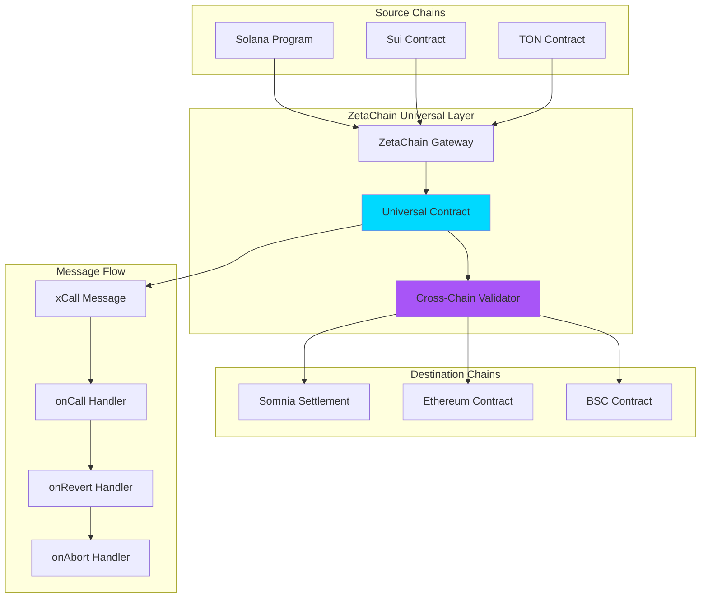
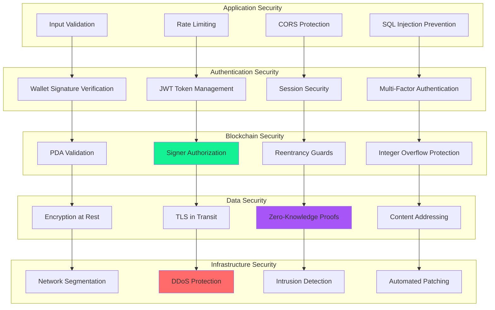
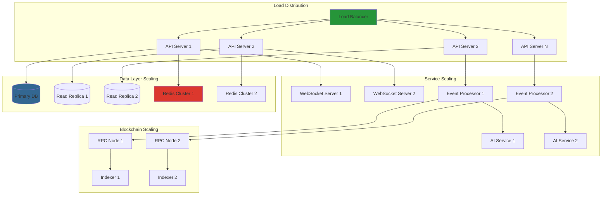
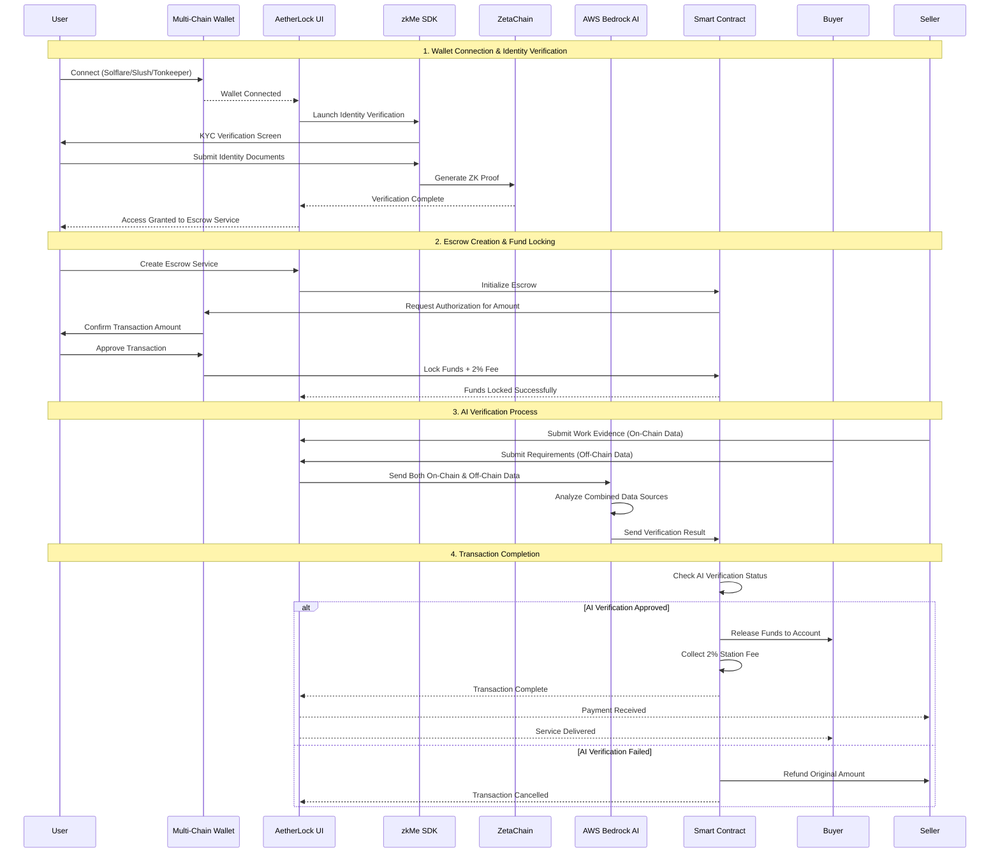

# System Architecture

## Component Overview

AetherLock's architecture is built on a modular, omnichain-first design that enables seamless cross-chain escrow operations with AI-powered verification. Each component is designed for scalability, security, and interoperability.

## 🏗️ Detailed Component Descriptions

### Frontend Layer Components

#### React Application
**Responsibility**: User interface and wallet integration
**Technology**: React 18 + TypeScript + Tailwind CSS
**Key Features**:
- Multi-chain wallet adapter integration (Solana, Sui, TON)
- Real-time escrow status updates via WebSocket
- Cyberpunk-themed responsive UI
- Progressive Web App (PWA) capabilities

```typescript
// Wallet integration example
interface WalletManager {
  connectWallet(chain: 'solana' | 'sui' | 'ton'): Promise<WalletConnection>;
  signTransaction(transaction: Transaction): Promise<SignedTransaction>;
  getBalance(tokenMint?: string): Promise<bigint>;
}

class AetherLockWalletManager implements WalletManager {
  private adapters: Map<string, WalletAdapter> = new Map();
  
  async connectWallet(chain: string): Promise<WalletConnection> {
    const adapter = this.adapters.get(chain);
    if (!adapter) throw new Error(`Unsupported chain: ${chain}`);
    
    await adapter.connect();
    return {
      address: adapter.publicKey.toString(),
      chain,
      connected: true
    };
  }
}
```

#### State Management
**Technology**: Zustand + React Query
**Purpose**: Centralized state management with optimistic updates
**Features**:
- Escrow state synchronization
- Wallet connection persistence
- Real-time notification handling

### Backend Layer Components

#### Express API Server
**Responsibility**: Business logic orchestration and API gateway
**Technology**: Node.js + Express + TypeScript
**Key Features**:
- RESTful API endpoints for escrow management
- JWT-based authentication with wallet signature verification
- Rate limiting and DDoS protection
- Comprehensive logging and monitoring

```typescript
// API endpoint example
@Controller('/api/v1/escrows')
export class EscrowController {
  @Post('/')
  @UseGuards(WalletAuthGuard)
  async createEscrow(
    @Body() createEscrowDto: CreateEscrowDto,
    @User() user: AuthenticatedUser
  ): Promise<EscrowResponse> {
    // Validate KYC status
    await this.kycService.validateUser(user.walletAddress);
    
    // Create escrow on blockchain
    const escrowId = await this.blockchainService.createEscrow({
      payer: user.walletAddress,
      payee: createEscrowDto.payee,
      amount: createEscrowDto.amount,
      deadline: createEscrowDto.deadline
    });
    
    // Store metadata in database
    const escrow = await this.escrowService.create({
      ...createEscrowDto,
      escrowId,
      status: EscrowStatus.CREATED
    });
    
    return this.transformToResponse(escrow);
  }
}
```

#### WebSocket Server
**Responsibility**: Real-time communication and event broadcasting
**Technology**: Socket.io
**Features**:
- Real-time escrow status updates
- Cross-chain transaction notifications
- AI verification progress tracking

#### Event Processing Service
**Responsibility**: Blockchain event monitoring and processing
**Technology**: Node.js workers with Redis queues
**Features**:
- Multi-chain event listening
- Event deduplication and ordering
- Automatic retry mechanisms

### Verification Layer Components

#### AWS Bedrock AI Service
**Responsibility**: Evidence analysis and task verification
**Technology**: AWS Bedrock (Claude 3 Sonnet)
**Key Features**:
- Multi-modal evidence analysis (text, images, documents)
- Confidence scoring with explainable AI
- Fallback provider chain for reliability

```typescript
class AIVerificationService {
  private readonly models = [
    'anthropic.claude-3-sonnet-20240229-v1:0',
    'anthropic.claude-3-haiku-20240307-v1:0'
  ];
  
  async analyzeEvidence(evidenceHash: string): Promise<VerificationResult> {
    const evidence = await this.ipfsService.retrieve(evidenceHash);
    
    const prompt = this.buildAnalysisPrompt(evidence);
    
    for (const modelId of this.models) {
      try {
        const response = await this.bedrock.invokeModel({
          modelId,
          body: JSON.stringify({
            anthropic_version: 'bedrock-2023-05-31',
            messages: [{ role: 'user', content: prompt }],
            max_tokens: 2000,
            temperature: 0.1
          })
        });
        
        const result = this.parseAIResponse(response);
        
        // Sign result for authenticity
        const signature = await this.cryptoService.signEd25519(
          JSON.stringify(result),
          process.env.AI_SIGNING_KEY
        );
        
        return { ...result, signature };
      } catch (error) {
        console.warn(`Model ${modelId} failed, trying next...`);
        continue;
      }
    }
    
    throw new Error('All AI models failed');
  }
}
```

#### zkMe Identity Verification
**Responsibility**: Zero-knowledge KYC and identity verification
**Technology**: zkMe SDK + ZetaChain storage
**Features**:
- Privacy-preserving identity verification
- Credential management without PII storage
- Cross-chain identity portability

#### Chainlink Oracle Network
**Responsibility**: AI result authentication and cross-chain data relay
**Technology**: Chainlink Functions + Ed25519 signatures
**Features**:
- Cryptographic proof of AI verification results
- Cross-chain data transmission
- Decentralized consensus on verification outcomes

### Blockchain Layer Components

#### Solana Anchor Program
**Responsibility**: Primary escrow fund management
**Technology**: Rust + Anchor Framework
**Key Features**:
- PDA-based escrow accounts
- Multi-token support (SOL, SPL tokens)
- Automated fee collection (10% treasury fee)

```rust
#[program]
pub mod aetherlock_escrow {
    use super::*;
    
    pub fn create_escrow(
        ctx: Context<CreateEscrow>,
        escrow_id: u64,
        amount: u64,
        payee: Pubkey,
        deadline: i64
    ) -> Result<()> {
        let escrow = &mut ctx.accounts.escrow;
        let clock = Clock::get()?;
        
        require!(deadline > clock.unix_timestamp, EscrowError::InvalidDeadline);
        
        escrow.escrow_id = escrow_id;
        escrow.payer = ctx.accounts.payer.key();
        escrow.payee = payee;
        escrow.amount = amount;
        escrow.treasury_fee = amount.checked_mul(10).unwrap().checked_div(100).unwrap();
        escrow.deadline = deadline;
        escrow.status = EscrowStatus::Created;
        escrow.created_at = clock.unix_timestamp;
        escrow.kyc_verified = false;
        escrow.ai_verified = false;
        
        emit!(EscrowCreated {
            escrow_id,
            payer: escrow.payer,
            payee,
            amount,
            deadline
        });
        
        Ok(())
    }
}
```

#### ZetaChain Universal App
**Responsibility**: Omnichain orchestration and message routing
**Technology**: Solidity + ZetaChain Protocol
**Features**:
- Cross-chain message passing
- Universal contract deployment
- Atomic cross-chain transactions

#### Somnia Settlement Contract
**Responsibility**: High-throughput settlement execution
**Technology**: Solidity + Somnia EVM
**Features**:
- Fast finality (sub-second)
- Low gas costs
- High transaction throughput

### Storage Layer Components

#### IPFS Network
**Responsibility**: Decentralized evidence and metadata storage
**Technology**: IPFS + Pinata/Web3.Storage
**Features**:
- Content-addressed storage
- Redundant pinning across multiple providers
- Encrypted storage for sensitive data

#### PostgreSQL Database
**Responsibility**: Structured data persistence
**Technology**: PostgreSQL 15 + Prisma ORM
**Features**:
- ACID compliance for critical data
- Full-text search capabilities
- Automated backups and replication

#### Redis Cache
**Responsibility**: Performance optimization and session management
**Technology**: Redis 7 + ioredis client
**Features**:
- Sub-millisecond data access
- Pub/sub for real-time features
- Distributed caching across regions

## 🌐 Omnichain Infrastructure via ZetaChain

### Universal App Architecture

ZetaChain serves as the omnichain orchestration layer, enabling AetherLock to operate seamlessly across multiple blockchain networks without requiring separate deployments or bridge protocols.



### Cross-Chain Message Flow Implementation

```solidity
// ZetaChain Universal Contract
contract AetherLockUniversal is UniversalContract {
    struct CrossChainEscrow {
        uint256 sourceChain;
        address payer;
        address payee;
        uint256 amount;
        uint256 deadline;
        EscrowStatus status;
        bytes32 evidenceHash;
        bool aiVerified;
    }
    
    mapping(bytes32 => CrossChainEscrow) public escrows;
    
    function onCall(
        MessageContext calldata context,
        address zrc20,
        uint256 amount,
        bytes calldata message
    ) external override onlySystem {
        (
            string memory action,
            bytes32 escrowId,
            bytes memory data
        ) = abi.decode(message, (string, bytes32, bytes));
        
        if (keccak256(bytes(action)) == keccak256("CREATE_ESCROW")) {
            _handleCreateEscrow(context, escrowId, data);
        } else if (keccak256(bytes(action)) == keccak256("VERIFY_ESCROW")) {
            _handleVerifyEscrow(context, escrowId, data);
        } else if (keccak256(bytes(action)) == keccak256("RELEASE_FUNDS")) {
            _handleReleaseFunds(context, escrowId, data);
        }
    }
    
    function _handleCreateEscrow(
        MessageContext memory context,
        bytes32 escrowId,
        bytes memory data
    ) internal {
        (address payer, address payee, uint256 amount, uint256 deadline) = 
            abi.decode(data, (address, address, uint256, uint256));
        
        escrows[escrowId] = CrossChainEscrow({
            sourceChain: context.chainID,
            payer: payer,
            payee: payee,
            amount: amount,
            deadline: deadline,
            status: EscrowStatus.Created,
            evidenceHash: bytes32(0),
            aiVerified: false
        });
        
        emit CrossChainEscrowCreated(escrowId, context.chainID, payer, payee, amount);
    }
}
```

## 🔒 Security Framework Documentation

### Multi-Layer Security Architecture



### Security Implementation Details

#### Smart Contract Security
- **PDA Validation**: All escrow accounts use Program Derived Addresses for deterministic security
- **Access Control**: Role-based permissions with multi-signature requirements for admin functions
- **Reentrancy Protection**: State changes before external calls, mutex locks where necessary
- **Integer Safety**: Checked arithmetic operations to prevent overflow/underflow

#### Cryptographic Security
- **Ed25519 Signatures**: AI verification results signed with Ed25519 for authenticity
- **Zero-Knowledge Proofs**: zkMe integration for privacy-preserving identity verification
- **Content Addressing**: IPFS hashes ensure evidence integrity and immutability
- **Encryption**: AES-256 encryption for sensitive off-chain data

#### Network Security
- **TLS 1.3**: All API communications encrypted with modern TLS
- **Rate Limiting**: Adaptive rate limiting based on user behavior and reputation
- **DDoS Protection**: Cloudflare protection with custom rules for blockchain applications
- **Network Segmentation**: Isolated environments for different service tiers

## 📈 Scalability and Performance Considerations

### Horizontal Scaling Architecture



### Performance Optimization Strategies

#### Database Optimization
- **Read Replicas**: Distribute read queries across multiple database replicas
- **Connection Pooling**: Efficient database connection management with pgBouncer
- **Query Optimization**: Indexed queries and materialized views for complex analytics
- **Partitioning**: Time-based partitioning for large transaction tables

#### Caching Strategy
- **Multi-Level Caching**: L1 (in-memory), L2 (Redis), L3 (CDN)
- **Cache Invalidation**: Event-driven cache invalidation for real-time consistency
- **Precomputation**: Background jobs for expensive calculations
- **Edge Caching**: Cloudflare edge caching for static assets and API responses

#### Blockchain Optimization
- **RPC Load Balancing**: Multiple RPC providers with automatic failover
- **Transaction Batching**: Batch multiple operations into single transactions
- **Event Indexing**: Custom indexers for fast event querying
- **State Caching**: Cache frequently accessed blockchain state

#### AI Service Optimization
- **Model Selection**: Dynamic model selection based on complexity and latency requirements
- **Prompt Caching**: Cache common prompts and responses
- **Parallel Processing**: Concurrent analysis of multiple evidence files
- **Result Caching**: Cache AI analysis results for similar evidence patterns

### Monitoring and Observability

```typescript
// Performance monitoring implementation
class PerformanceMonitor {
  private metrics = new Map<string, Metric>();
  
  async trackAPICall(endpoint: string, duration: number, success: boolean) {
    const metric = this.metrics.get(endpoint) || new APIMetric(endpoint);
    metric.recordCall(duration, success);
    
    // Alert on performance degradation
    if (metric.averageResponseTime > 1000) {
      await this.alertService.send({
        type: 'PERFORMANCE_ALERT',
        message: `High response time for ${endpoint}: ${metric.averageResponseTime}ms`,
        severity: 'WARNING'
      });
    }
  }
  
  async trackBlockchainCall(chain: string, method: string, gasUsed: number) {
    const gasMetric = this.metrics.get(`${chain}_gas`) || new GasMetric(chain);
    gasMetric.recordGasUsage(method, gasUsed);
    
    // Monitor gas price trends
    if (gasMetric.isGasPriceHigh()) {
      await this.optimizationService.suggestGasOptimizations(chain, method);
    }
  }
}
```

This comprehensive architecture ensures AetherLock can scale to handle millions of escrow transactions while maintaining security, performance, and cross-chain interoperability.

# Architecture

## AetherLock Data Flow



## Multi-Chain Wallet Integration

### Supported Wallets & Chains
```typescript
interface WalletConfig {
  solana: ['Solflare', 'Slush'];
  ton: ['Tonkeeper'];
  sui: ['Sui Wallet'];
  ethereum: ['MetaMask', 'WalletConnect'];
}

// Wallet Connection Flow
async function connectWallet(chain: string, walletType: string) {
  const wallet = await initializeWallet(chain, walletType);
  const address = await wallet.connect();
  
  // Trigger zkMe verification
  const kycResult = await launchZkMeVerification(address);
  
  if (kycResult.verified) {
    enableEscrowService(address);
  }
}
```

## ZetaChain Omnichain Architecture

### Cross-Chain Message Flow
```solidity
// ZetaChain Universal Contract
contract AetherLockOmnichain {
    struct CrossChainEscrow {
        uint256 sourceChain;
        address payer;
        address payee;
        uint256 amount;
        bool kycVerified;
        bool aiVerified;
    }
    
    function createOmnichainEscrow(
        uint256 destinationChain,
        address payee,
        uint256 amount
    ) external payable {
        require(isKYCVerified(msg.sender), "KYC required");
        
        // Lock funds on source chain
        lockFunds(msg.sender, amount + (amount * 2 / 100));
        
        // Send cross-chain message
        sendMessage(destinationChain, abi.encode(
            msg.sender, payee, amount, block.timestamp
        ));
    }
}
```

## AI Verification System

### On-Chain & Off-Chain Data Analysis
```typescript
interface VerificationData {
  onChainData: {
    transactionHashes: string[];
    contractStates: any[];
    blockchainEvents: Event[];
  };
  offChainData: {
    evidenceFiles: File[];
    communicationLogs: Message[];
    externalAPIs: APIResponse[];
  };
}

class AetherLockAI {
  async verifyTransaction(data: VerificationData): Promise<VerificationResult> {
    // Analyze on-chain data
    const onChainAnalysis = await this.analyzeOnChainData(data.onChainData);
    
    // Analyze off-chain data
    const offChainAnalysis = await this.analyzeOffChainData(data.offChainData);
    
    // Combined AI decision
    const combinedScore = this.calculateCombinedScore(
      onChainAnalysis, 
      offChainAnalysis
    );
    
    return {
      approved: combinedScore > 0.9,
      confidence: combinedScore,
      reasoning: this.generateReasoning(onChainAnalysis, offChainAnalysis)
    };
  }
}
```

## Smart Contract Fund Management

### Escrow & Fee Collection
```rust
// Solana Anchor Program
#[program]
pub mod aetherlock_escrow {
    pub fn create_escrow_with_fee(
        ctx: Context<CreateEscrow>,
        amount: u64,
        payee: Pubkey
    ) -> Result<()> {
        let escrow = &mut ctx.accounts.escrow_account;
        let fee = amount * 2 / 100; // 2% station fee
        let total_required = amount + fee;
        
        // Lock funds including fee
        escrow.locked_amount = amount;
        escrow.station_fee = fee;
        escrow.payer = ctx.accounts.payer.key();
        escrow.payee = payee;
        escrow.status = EscrowStatus::FundsLocked;
        
        Ok(())
    }
    
    pub fn release_funds_after_ai_verification(
        ctx: Context<ReleaseFunds>
    ) -> Result<()> {
        let escrow = &mut ctx.accounts.escrow_account;
        
        require!(escrow.ai_verified, EscrowError::AIVerificationRequired);
        
        // Transfer funds to buyer
        **ctx.accounts.buyer.lamports.borrow_mut() += escrow.locked_amount;
        
        // Collect station fee
        **ctx.accounts.treasury.lamports.borrow_mut() += escrow.station_fee;
        
        escrow.status = EscrowStatus::Completed;
        
        emit!(FundsReleased {
            escrow_id: escrow.id,
            buyer: escrow.payee,
            amount: escrow.locked_amount,
            fee_collected: escrow.station_fee
        });
        
        Ok(())
    }
}
```

## User Journey Flow

### Complete Transaction Process

1. **Multi-Chain Wallet Connection**
   - User connects Solflare (Solana), Tonkeeper (TON), or Sui Wallet
   - Wallet integration detects chain and initializes connection

2. **zkMe Identity Verification**
   - Verification screen pops up automatically
   - User completes KYC using zkMe SDK
   - Zero-knowledge proof generated and verified on ZetaChain

3. **Escrow Service Access**
   - UI enables escrow functionality after successful verification
   - User can create, manage, and participate in escrows

4. **Transaction Authorization**
   - AetherLock sends authorization request to wallet
   - User confirms transaction amount + 2% fee
   - Smart contract locks funds securely

5. **AI Verification Process**
   - AI analyzes both on-chain transaction data and off-chain evidence
   - Combined analysis generates confidence score
   - Automatic approval/rejection based on AI decision

6. **Fund Release & Fee Collection**
   - Smart contract releases funds to buyer's account
   - 2% station fee automatically collected
   - Transaction marked as complete

## Security & Compliance

### Multi-Layer Verification
- **Identity Layer**: zkMe zero-knowledge KYC
- **Transaction Layer**: Smart contract validation
- **Evidence Layer**: AI analysis of on/off-chain data
- **Cross-Chain Layer**: ZetaChain message verification

### Fee Structure
- **Station Fee**: 2% collected on every completed transaction
- **Gas Optimization**: Batched operations to minimize costs
- **Treasury Management**: Automated fee collection and distribution

This architecture ensures seamless multi-chain operation while maintaining security, privacy, and automated verification across all supported networks.