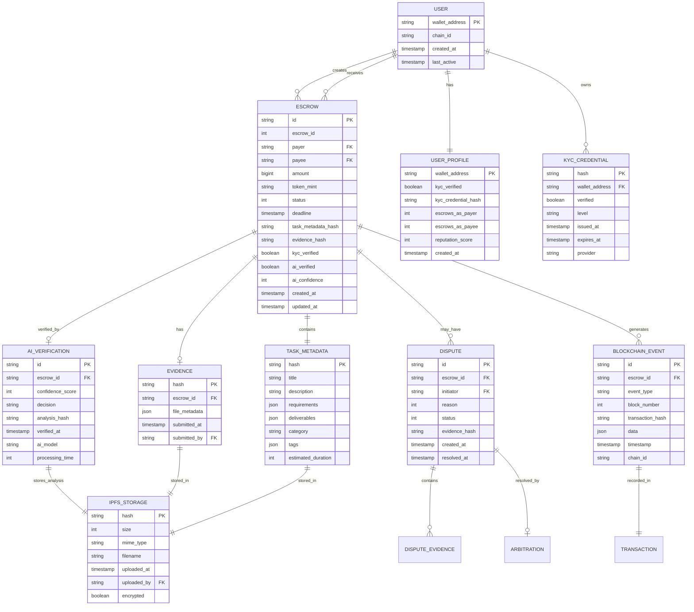
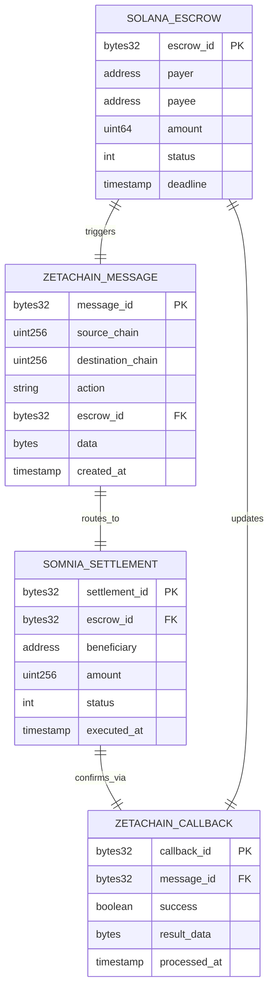
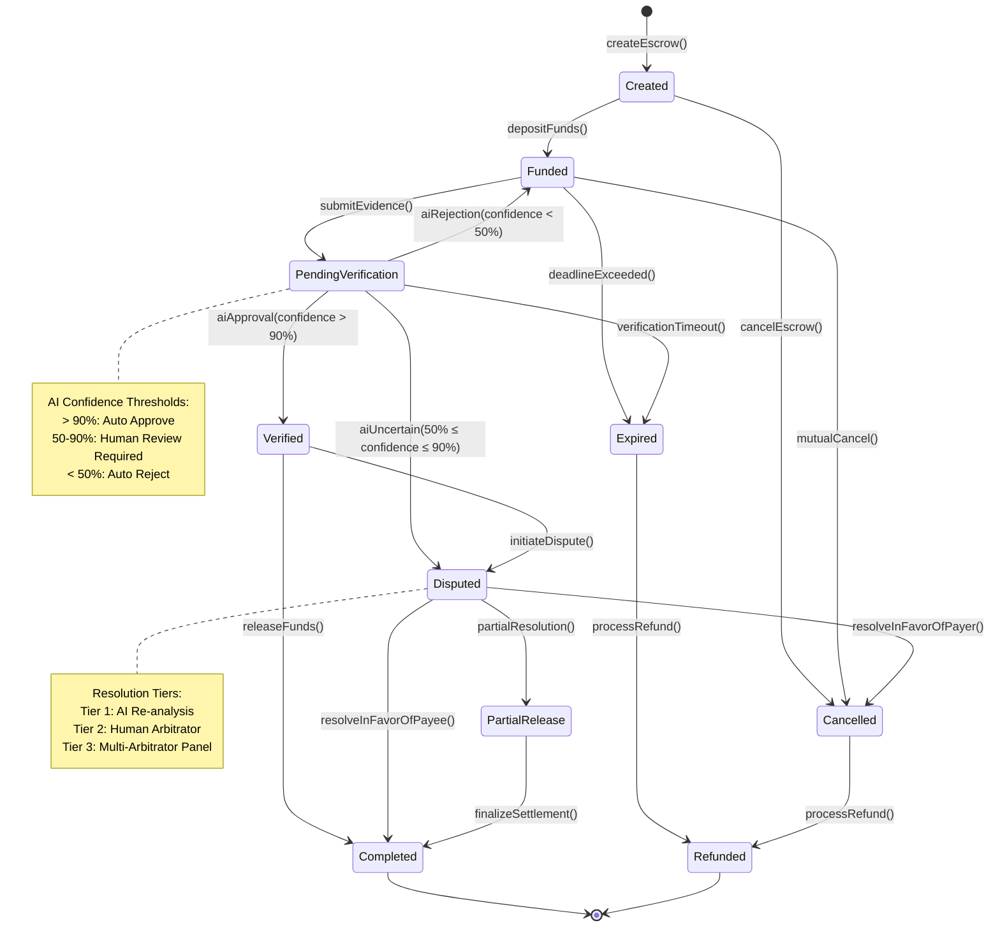
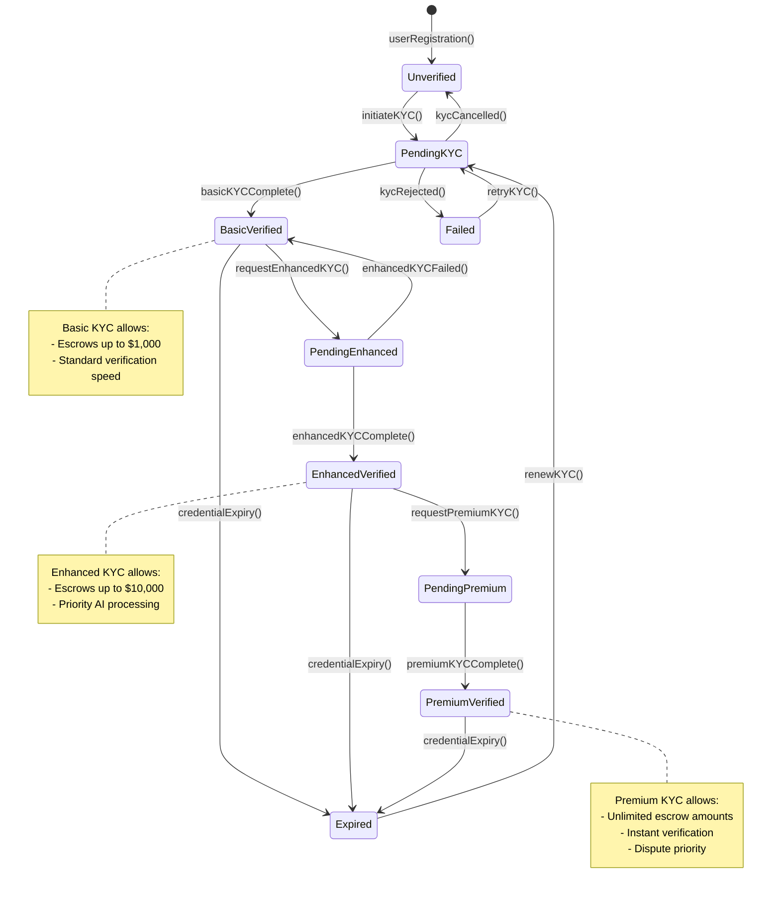
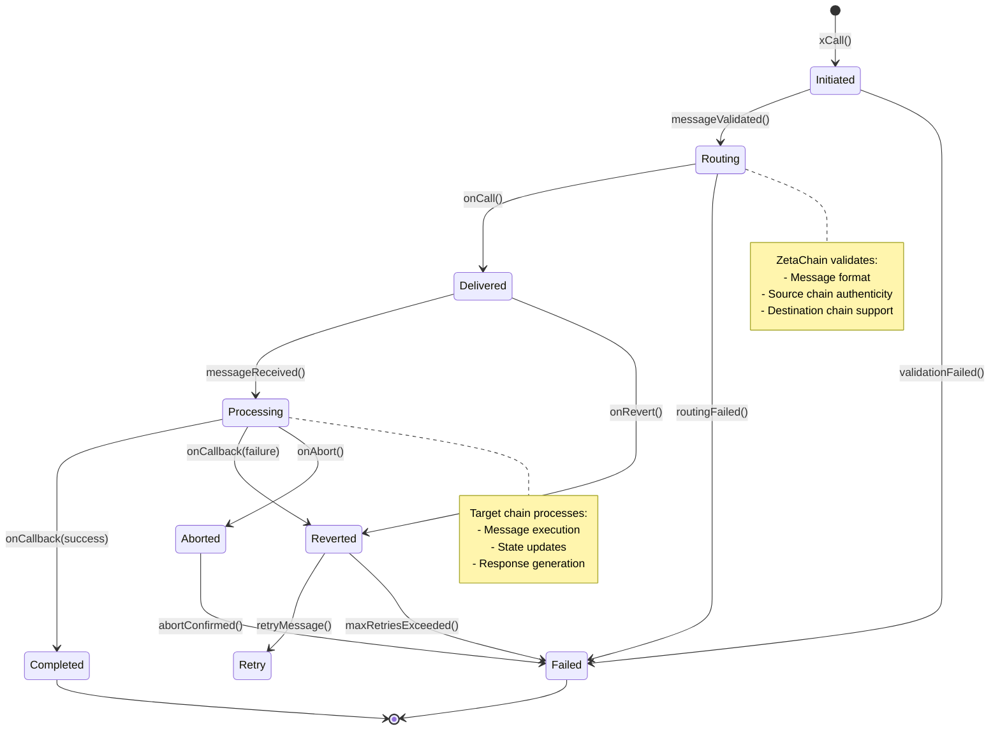

# Data Models

## 🏗️ Solana Account Structures

### Escrow Account Structure

```rust
use anchor_lang::prelude::*;

#[account]
pub struct EscrowAccount {
    /// Unique identifier for the escrow
    pub escrow_id: u64,
    
    /// Public key of the payer (client)
    pub payer: Pubkey,
    
    /// Public key of the payee (freelancer)
    pub payee: Pubkey,
    
    /// Amount locked in escrow (in lamports for SOL)
    pub amount: u64,
    
    /// Treasury fee (10% of amount)
    pub treasury_fee: u64,
    
    /// Token mint address (None for SOL)
    pub token_mint: Option<Pubkey>,
    
    /// Deadline for task completion (Unix timestamp)
    pub deadline: i64,
    
    /// Current status of the escrow
    pub status: EscrowStatus,
    
    /// IPFS hash of task metadata
    pub task_metadata_hash: [u8; 32],
    
    /// IPFS hash of submitted evidence
    pub evidence_hash: Option<[u8; 32]>,
    
    /// KYC verification status
    pub kyc_verified: bool,
    
    /// AI verification result
    pub ai_verified: bool,
    
    /// AI confidence score (0-100)
    pub ai_confidence: u8,
    
    /// Dispute status
    pub disputed: bool,
    
    /// Creation timestamp
    pub created_at: i64,
    
    /// Last update timestamp
    pub updated_at: i64,
    
    /// Bump seed for PDA derivation
    pub bump: u8,
}

impl EscrowAccount {
    pub const LEN: usize = 8 + // discriminator
        8 + // escrow_id
        32 + // payer
        32 + // payee
        8 + // amount
        8 + // treasury_fee
        1 + 32 + // token_mint (Option<Pubkey>)
        8 + // deadline
        1 + // status
        32 + // task_metadata_hash
        1 + 32 + // evidence_hash (Option<[u8; 32]>)
        1 + // kyc_verified
        1 + // ai_verified
        1 + // ai_confidence
        1 + // disputed
        8 + // created_at
        8 + // updated_at
        1; // bump
}

#[derive(AnchorSerialize, AnchorDeserialize, Clone, PartialEq, Eq)]
pub enum EscrowStatus {
    Created,
    Funded,
    PendingVerification,
    Verified,
    Disputed,
    Completed,
    Cancelled,
    Expired,
    Refunded,
}
```

### Treasury Account Structure

```rust
#[account]
pub struct TreasuryAccount {
    /// Authority that can withdraw from treasury
    pub authority: Pubkey,
    
    /// Total fees collected
    pub total_fees_collected: u64,
    
    /// Total escrows processed
    pub total_escrows: u64,
    
    /// Total volume processed
    pub total_volume: u64,
    
    /// Withdrawal history
    pub last_withdrawal: i64,
    
    /// Emergency pause status
    pub paused: bool,
    
    /// Bump seed for PDA
    pub bump: u8,
}

impl TreasuryAccount {
    pub const LEN: usize = 8 + // discriminator
        32 + // authority
        8 + // total_fees_collected
        8 + // total_escrows
        8 + // total_volume
        8 + // last_withdrawal
        1 + // paused
        1; // bump
}
```

### User Profile Account Structure

```rust
#[account]
pub struct UserProfile {
    /// User's wallet address
    pub wallet: Pubkey,
    
    /// KYC verification status
    pub kyc_verified: bool,
    
    /// KYC credential hash from zkMe
    pub kyc_credential_hash: Option<[u8; 32]>,
    
    /// Total escrows created as payer
    pub escrows_as_payer: u32,
    
    /// Total escrows completed as payee
    pub escrows_as_payee: u32,
    
    /// Total disputes initiated
    pub disputes_initiated: u32,
    
    /// Total disputes resolved favorably
    pub disputes_won: u32,
    
    /// Reputation score (0-100)
    pub reputation_score: u8,
    
    /// Account creation timestamp
    pub created_at: i64,
    
    /// Last activity timestamp
    pub last_active: i64,
    
    /// Bump seed for PDA
    pub bump: u8,
}

impl UserProfile {
    pub const LEN: usize = 8 + // discriminator
        32 + // wallet
        1 + // kyc_verified
        1 + 32 + // kyc_credential_hash (Option<[u8; 32]>)
        4 + // escrows_as_payer
        4 + // escrows_as_payee
        4 + // disputes_initiated
        4 + // disputes_won
        1 + // reputation_score
        8 + // created_at
        8 + // last_active
        1; // bump
}
```

## 🔗 Solidity Struct Definitions

### ZetaChain Universal Contract Structures

```solidity
// SPDX-License-Identifier: MIT
pragma solidity ^0.8.20;

contract AetherLockUniversal {
    struct CrossChainEscrow {
        uint256 sourceChain;
        uint256 destinationChain;
        address payer;
        address payee;
        uint256 amount;
        address tokenAddress;
        uint256 deadline;
        EscrowStatus status;
        bytes32 taskMetadataHash;
        bytes32 evidenceHash;
        bool kycVerified;
        bool aiVerified;
        uint8 aiConfidence;
        uint256 createdAt;
        uint256 updatedAt;
    }
    
    enum EscrowStatus {
        Created,
        Funded,
        PendingVerification,
        Verified,
        Disputed,
        Completed,
        Cancelled,
        Expired,
        Refunded
    }
    
    struct VerificationResult {
        bytes32 escrowId;
        bool approved;
        uint8 confidence;
        bytes32 analysisHash;
        bytes signature; // Ed25519 signature from AI service
        uint256 timestamp;
    }
    
    struct DisputeData {
        bytes32 escrowId;
        address initiator;
        DisputeReason reason;
        bytes32 evidenceHash;
        uint256 createdAt;
        DisputeStatus status;
    }
    
    enum DisputeReason {
        TaskNotCompleted,
        PoorQuality,
        DeadlineMissed,
        RequirementsNotMet,
        FraudulentEvidence
    }
    
    enum DisputeStatus {
        Open,
        UnderReview,
        Resolved,
        Appealed
    }
    
    struct CrossChainMessage {
        string action;
        bytes32 escrowId;
        bytes data;
        uint256 timestamp;
        bytes32 messageHash;
    }
}
```

### Somnia Settlement Contract Structures

```solidity
// SPDX-License-Identifier: MIT
pragma solidity ^0.8.20;

contract SomniaSettlement {
    struct SettlementOrder {
        bytes32 escrowId;
        uint256 sourceChain;
        address beneficiary;
        uint256 amount;
        address tokenAddress;
        SettlementStatus status;
        uint256 executedAt;
        bytes32 txHash;
    }
    
    enum SettlementStatus {
        Pending,
        Executed,
        Failed,
        Reverted
    }
    
    struct BatchSettlement {
        bytes32 batchId;
        SettlementOrder[] orders;
        uint256 totalAmount;
        uint256 executedAt;
        bool completed;
    }
    
    struct FeeDistribution {
        address treasury;
        uint256 treasuryAmount;
        address[] stakeholders;
        uint256[] amounts;
        uint256 distributedAt;
    }
}
```

## 📊 Entity-Relationship Diagrams

### Core Entity Relationships



### Cross-Chain Relationship Model



## 🔄 State Machine Transitions

### Escrow State Machine



### User KYC State Machine



### Cross-Chain Message State Machine



## 💾 Database Schema (PostgreSQL)

### Core Tables

```sql
-- Users table
CREATE TABLE users (
    wallet_address VARCHAR(44) PRIMARY KEY,
    chain_id VARCHAR(20) NOT NULL,
    created_at TIMESTAMP WITH TIME ZONE DEFAULT NOW(),
    last_active TIMESTAMP WITH TIME ZONE DEFAULT NOW(),
    updated_at TIMESTAMP WITH TIME ZONE DEFAULT NOW()
);

-- User profiles table
CREATE TABLE user_profiles (
    wallet_address VARCHAR(44) PRIMARY KEY REFERENCES users(wallet_address),
    kyc_verified BOOLEAN DEFAULT FALSE,
    kyc_level VARCHAR(20) DEFAULT 'none',
    kyc_credential_hash VARCHAR(64),
    escrows_as_payer INTEGER DEFAULT 0,
    escrows_as_payee INTEGER DEFAULT 0,
    disputes_initiated INTEGER DEFAULT 0,
    disputes_won INTEGER DEFAULT 0,
    reputation_score INTEGER DEFAULT 50 CHECK (reputation_score >= 0 AND reputation_score <= 100),
    created_at TIMESTAMP WITH TIME ZONE DEFAULT NOW(),
    updated_at TIMESTAMP WITH TIME ZONE DEFAULT NOW()
);

-- Escrows table
CREATE TABLE escrows (
    id UUID PRIMARY KEY DEFAULT gen_random_uuid(),
    escrow_id BIGINT NOT NULL,
    payer VARCHAR(44) NOT NULL REFERENCES users(wallet_address),
    payee VARCHAR(44) NOT NULL REFERENCES users(wallet_address),
    amount BIGINT NOT NULL,
    token_mint VARCHAR(44),
    status VARCHAR(20) NOT NULL DEFAULT 'created',
    deadline TIMESTAMP WITH TIME ZONE NOT NULL,
    task_metadata_hash VARCHAR(64) NOT NULL,
    evidence_hash VARCHAR(64),
    kyc_verified BOOLEAN DEFAULT FALSE,
    ai_verified BOOLEAN DEFAULT FALSE,
    ai_confidence INTEGER CHECK (ai_confidence >= 0 AND ai_confidence <= 100),
    disputed BOOLEAN DEFAULT FALSE,
    chain_id VARCHAR(20) NOT NULL,
    transaction_hash VARCHAR(128),
    created_at TIMESTAMP WITH TIME ZONE DEFAULT NOW(),
    updated_at TIMESTAMP WITH TIME ZONE DEFAULT NOW(),
    
    UNIQUE(escrow_id, chain_id)
);

-- AI verifications table
CREATE TABLE ai_verifications (
    id UUID PRIMARY KEY DEFAULT gen_random_uuid(),
    escrow_id UUID NOT NULL REFERENCES escrows(id),
    confidence_score INTEGER NOT NULL CHECK (confidence_score >= 0 AND confidence_score <= 100),
    decision VARCHAR(20) NOT NULL,
    analysis_hash VARCHAR(64) NOT NULL,
    verified_at TIMESTAMP WITH TIME ZONE DEFAULT NOW(),
    ai_model VARCHAR(50) NOT NULL,
    processing_time INTEGER NOT NULL, -- milliseconds
    review_required BOOLEAN DEFAULT FALSE
);

-- Disputes table
CREATE TABLE disputes (
    id UUID PRIMARY KEY DEFAULT gen_random_uuid(),
    escrow_id UUID NOT NULL REFERENCES escrows(id),
    initiator VARCHAR(44) NOT NULL REFERENCES users(wallet_address),
    reason VARCHAR(50) NOT NULL,
    status VARCHAR(20) NOT NULL DEFAULT 'open',
    evidence_hash VARCHAR(64),
    created_at TIMESTAMP WITH TIME ZONE DEFAULT NOW(),
    resolved_at TIMESTAMP WITH TIME ZONE,
    resolution_data JSONB
);

-- IPFS storage tracking
CREATE TABLE ipfs_storage (
    hash VARCHAR(64) PRIMARY KEY,
    size BIGINT NOT NULL,
    mime_type VARCHAR(100),
    filename VARCHAR(255),
    uploaded_at TIMESTAMP WITH TIME ZONE DEFAULT NOW(),
    uploaded_by VARCHAR(44) REFERENCES users(wallet_address),
    encrypted BOOLEAN DEFAULT FALSE,
    access_control JSONB
);

-- Blockchain events
CREATE TABLE blockchain_events (
    id UUID PRIMARY KEY DEFAULT gen_random_uuid(),
    escrow_id UUID REFERENCES escrows(id),
    event_type VARCHAR(50) NOT NULL,
    block_number BIGINT NOT NULL,
    transaction_hash VARCHAR(128) NOT NULL,
    log_index INTEGER,
    data JSONB NOT NULL,
    timestamp TIMESTAMP WITH TIME ZONE NOT NULL,
    chain_id VARCHAR(20) NOT NULL,
    processed BOOLEAN DEFAULT FALSE,
    
    UNIQUE(transaction_hash, log_index, chain_id)
);

-- Notifications
CREATE TABLE notifications (
    id UUID PRIMARY KEY DEFAULT gen_random_uuid(),
    user_id VARCHAR(44) NOT NULL REFERENCES users(wallet_address),
    type VARCHAR(50) NOT NULL,
    title VARCHAR(255) NOT NULL,
    message TEXT NOT NULL,
    data JSONB,
    read BOOLEAN DEFAULT FALSE,
    created_at TIMESTAMP WITH TIME ZONE DEFAULT NOW(),
    expires_at TIMESTAMP WITH TIME ZONE
);

-- Indexes for performance
CREATE INDEX idx_escrows_payer ON escrows(payer);
CREATE INDEX idx_escrows_payee ON escrows(payee);
CREATE INDEX idx_escrows_status ON escrows(status);
CREATE INDEX idx_escrows_created_at ON escrows(created_at);
CREATE INDEX idx_blockchain_events_escrow_id ON blockchain_events(escrow_id);
CREATE INDEX idx_blockchain_events_type ON blockchain_events(event_type);
CREATE INDEX idx_blockchain_events_timestamp ON blockchain_events(timestamp);
CREATE INDEX idx_notifications_user_read ON notifications(user_id, read);
```

This comprehensive data model ensures type safety, consistency, and optimal performance across all components of the AetherLock system while supporting complex cross-chain operations and AI verification workflows.

## Escrow Lifecycle State Diagram

```mermaid
stateDiagram-v2
    [*] --above  Created: Initialize Escrow
    Created --above  Funded: Deposit Funds
    Created --above  Cancelled: Cancel Before Funding
    
    Funded --above  PendingVerification: Submit Evidence
    Funded --above  Expired: Deadline Exceeded
    Funded --above  Cancelled: Mutual Cancellation
    
    PendingVerification --above  Verified: AI Approval (above 90 percent confidence)
    PendingVerification --above  Funded: AI Rejection (below 50 percent confidence)
    PendingVerification --above  Disputed: AI Uncertain (50-90 percent confidence)
    PendingVerification --above  Expired: Verification Timeout
    
    Verified --above  Completed: Release Funds
    Verified --above  Disputed: Manual Dispute
    
    Disputed --above  Completed: Resolution: Release
    Disputed --above  Cancelled: Resolution: Refund
    Disputed --above  PartialRelease: Resolution: Partial
    
    PartialRelease --above  Completed: Final Settlement
    
    Expired --above  Refunded: Auto Refund
    Cancelled --above  Refunded: Process Refund
    
    Completed --above  [*]
    Refunded --above  [*]
    
    note right of PendingVerification
        AI Confidence Thresholds:
        Above 90 percent: Auto Approve
        50-90 percent: Human Review
        Below 50 percent: Auto Reject
    end note
    
    note right of Disputed
        Multi-tier Resolution:
        Tier 1: AI Analysis
        Tier 2: Human Review
        Tier 3: Arbitration Panel
    end note
```

## TypeScript Data Models

### Core Escrow Interface

```typescript
interface Escrow {
  id: string;
  escrowId: number;
  payer: string; // Wallet address
  payee: string; // Wallet address
  amount: bigint; // Amount in smallest unit (lamports for SOL)
  tokenMint?: string; // Token mint address (undefined for SOL)
  status: EscrowStatus;
  deadline: number; // Unix timestamp
  taskMetadataHash: string; // IPFS hash
  evidenceHash?: string; // IPFS hash
  verificationResult?: VerificationResult;
  kycVerified: boolean;
  treasuryFee: bigint;
  createdAt: number;
  updatedAt: number;
  chainId: string;
  transactionHash: string;
}

enum EscrowStatus {
  CREATED = 'created',
  FUNDED = 'funded',
  PENDING_VERIFICATION = 'pending_verification',
  VERIFIED = 'verified',
  DISPUTED = 'disputed',
  COMPLETED = 'completed',
  CANCELLED = 'cancelled',
  EXPIRED = 'expired',
  REFUNDED = 'refunded',
  PARTIAL_RELEASE = 'partial_release'
}
```

### Verification and AI Models

```typescript
interface VerificationResult {
  confidenceScore: number; // 0-100
  decision: VerificationDecision;
  analysisHash: string; // IPFS hash of detailed analysis
  verifiedAt: number;
  aiModel: string; // e.g., 'claude-3-sonnet'
  processingTime: number; // milliseconds
  reviewRequired: boolean;
}

enum VerificationDecision {
  APPROVED = 'approved',
  REJECTED = 'rejected',
  NEEDS_REVIEW = 'needs_review'
}

interface AIAnalysis {
  escrowId: string;
  taskDescription: string;
  evidenceAnalysis: EvidenceAnalysis[];
  complianceCheck: ComplianceResult;
  riskAssessment: RiskAssessment;
  recommendation: string;
  confidence: number;
  reasoning: string[];
  suggestedImprovements?: string[];
}

interface EvidenceAnalysis {
  fileHash: string;
  fileType: string;
  analysisType: 'text' | 'image' | 'document' | 'video';
  extractedContent: string;
  relevanceScore: number;
  qualityScore: number;
  authenticity: number;
  findings: string[];
}
```

### User and Identity Models

```typescript
interface User {
  walletAddress: string;
  chainId: string;
  kycStatus: KYCStatus;
  reputation: UserReputation;
  preferences: UserPreferences;
  createdAt: number;
  lastActiveAt: number;
}

interface KYCStatus {
  verified: boolean;
  level: 'basic' | 'enhanced' | 'premium';
  issuedAt?: number;
  expiresAt?: number;
  credentialHash?: string;
  provider: 'zkme';
  chainVerified: string; // ZetaChain address
}

interface UserReputation {
  totalEscrows: number;
  completedEscrows: number;
  disputedEscrows: number;
  averageRating: number;
  trustScore: number; // 0-100
  badges: string[];
}

interface UserPreferences {
  theme: 'cyberpunk' | 'classic';
  notifications: NotificationSettings;
  defaultChain: string;
  language: string;
  timezone: string;
}
```

### Dispute Resolution Models

```typescript
interface Dispute {
  id: string;
  escrowId: string;
  initiatedBy: string; // wallet address
  reason: DisputeReason;
  status: DisputeStatus;
  tier: 1 | 2 | 3; // Resolution tier
  evidence: DisputeEvidence[];
  aiAnalysis?: AIDisputeAnalysis;
  arbitrators?: string[]; // wallet addresses
  resolution?: DisputeResolution;
  createdAt: number;
  resolvedAt?: number;
}

enum DisputeReason {
  TASK_NOT_COMPLETED = 'task_not_completed',
  POOR_QUALITY = 'poor_quality',
  DEADLINE_MISSED = 'deadline_missed',
  REQUIREMENTS_NOT_MET = 'requirements_not_met',
  FRAUDULENT_EVIDENCE = 'fraudulent_evidence',
  OTHER = 'other'
}

enum DisputeStatus {
  OPEN = 'open',
  UNDER_REVIEW = 'under_review',
  AWAITING_ARBITRATION = 'awaiting_arbitration',
  RESOLVED = 'resolved',
  APPEALED = 'appealed'
}

interface DisputeResolution {
  decision: 'release_full' | 'refund_full' | 'partial_release' | 'escalate';
  payeeAmount: bigint;
  payerRefund: bigint;
  reasoning: string;
  arbitratorFee: bigint;
  finalizedAt: number;
}
```

### Storage and Metadata Models

```typescript
interface IPFSMetadata {
  hash: string;
  size: number;
  mimeType: string;
  filename: string;
  uploadedAt: number;
  uploadedBy: string;
  encrypted: boolean;
  accessControl: AccessControl;
}

interface AccessControl {
  public: boolean;
  allowedUsers: string[]; // wallet addresses
  expiresAt?: number;
  requiresKYC: boolean;
}

interface TaskMetadata {
  title: string;
  description: string;
  requirements: string[];
  deliverables: string[];
  category: string;
  tags: string[];
  estimatedDuration: number; // hours
  skillsRequired: string[];
  attachments: IPFSMetadata[];
}
```

### Notification and Event Models

```typescript
interface Notification {
  id: string;
  userId: string;
  type: NotificationType;
  title: string;
  message: string;
  data: Recordbelow string, anyabove ;
  read: boolean;
  createdAt: number;
  expiresAt?: number;
}

enum NotificationType {
  ESCROW_CREATED = 'escrow_created',
  FUNDS_DEPOSITED = 'funds_deposited',
  EVIDENCE_SUBMITTED = 'evidence_submitted',
  VERIFICATION_COMPLETE = 'verification_complete',
  DISPUTE_INITIATED = 'dispute_initiated',
  FUNDS_RELEASED = 'funds_released',
  KYC_REQUIRED = 'kyc_required',
  DEADLINE_APPROACHING = 'deadline_approaching'
}

interface BlockchainEvent {
  id: string;
  escrowId: string;
  eventType: string;
  blockNumber: number;
  transactionHash: string;
  logIndex: number;
  data: Recordbelow string, anyabove ;
  timestamp: number;
  chainId: string;
}
```

These data models provide a comprehensive foundation for AetherLock's multi-chain escrow system, ensuring type safety and consistency across all components while supporting the complex workflows of AI verification and dispute resolution.