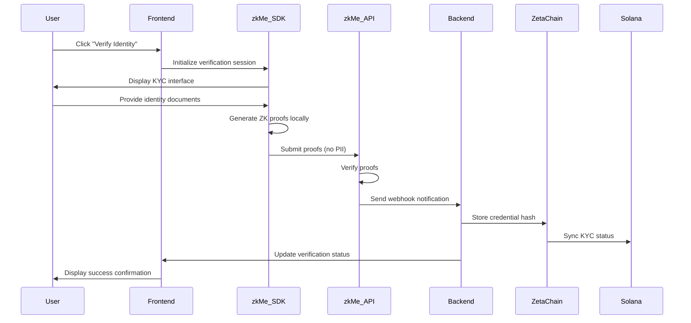

# zkMe Integration

## Overview

AetherLock integrates with zkMe to provide privacy-preserving Know Your Customer (KYC) verification. This integration enables users to prove their identity without revealing personal information, maintaining compliance while preserving privacy through zero-knowledge cryptographic proofs.

zkMe serves as AetherLock's official Identity Partner, providing enterprise-grade zero-knowledge identity verification that operates seamlessly across multiple blockchain networks through ZetaChain's omnichain infrastructure.

## Architecture

### Zero-Knowledge Identity Verification Flow



### Privacy-Preserving Process

1. **Local Proof Generation**: Zero-knowledge proofs are generated entirely on the user's device
2. **No PII Transmission**: Personal data never leaves the user's device
3. **Cryptographic Verification**: zkMe validators verify mathematical proofs, not raw documents
4. **On-Chain Commitments**: Only verification status and cryptographic hashes are stored on-chain
5. **Cross-Chain Synchronization**: Verification status is accessible across all supported networks

## Frontend Integration

### React KYC Component

```typescript
import React, { useState, useEffect } from 'react';
import { useWallet } from '@solana/wallet-adapter-react';
import { ZkMeWidget } from '@zkme/react-widget';

interface KYCVerificationProps {
  onVerificationComplete: (status: KYCStatus) => void;
  onError: (error: string) => void;
}

export const KYCVerification: React.FC<KYCVerificationProps> = ({
  onVerificationComplete,
  onError
}) => {
  const { publicKey, connected } = useWallet();
  const [verificationStatus, setVerificationStatus] = useState<KYCStatus | null>(null);
  const [isLoading, setIsLoading] = useState(false);

  // Check existing KYC status on component mount
  useEffect(() => {
    if (connected && publicKey) {
      checkExistingKYCStatus();
    }
  }, [connected, publicKey]);

  const checkExistingKYCStatus = async () => {
    try {
      const response = await fetch(`/api/kyc/status/${publicKey?.toString()}`);
      const status = await response.json();
      setVerificationStatus(status);
    } catch (error) {
      console.error('Failed to check KYC status:', error);
    }
  };

  const handleVerificationStart = async () => {
    if (!connected || !publicKey) {
      onError('Please connect your wallet first');
      return;
    }

    setIsLoading(true);
    
    try {
      // Initialize zkMe verification session
      const sessionResponse = await fetch('/api/kyc/initiate', {
        method: 'POST',
        headers: { 'Content-Type': 'application/json' },
        body: JSON.stringify({
          walletAddress: publicKey.toString(),
          verificationLevel: 'enhanced'
        })
      });

      const { sessionId, accessToken } = await sessionResponse.json();
      
      // Configure zkMe widget
      const zkmeConfig = {
        sessionId,
        accessToken,
        network: 'testnet',
        chainId: 'zetachain-athens-3',
        onSuccess: handleVerificationSuccess,
        onError: handleVerificationError,
        onClose: () => setIsLoading(false)
      };

      // Launch zkMe verification widget
      window.zkMe?.launch(zkmeConfig);
      
    } catch (error) {
      setIsLoading(false);
      onError('Failed to initialize KYC verification');
    }
  };

  const handleVerificationSuccess = async (result: any) => {
    setIsLoading(false);
    
    try {
      // Verify the result with our backend
      const response = await fetch('/api/kyc/verify', {
        method: 'POST',
        headers: { 'Content-Type': 'application/json' },
        body: JSON.stringify({
          walletAddress: publicKey?.toString(),
          zkmeResult: result
        })
      });

      const verifiedStatus = await response.json();
      setVerificationStatus(verifiedStatus);
      onVerificationComplete(verifiedStatus);
      
    } catch (error) {
      onError('Verification completed but failed to update status');
    }
  };

  const handleVerificationError = (error: any) => {
    setIsLoading(false);
    onError(`KYC verification failed: ${error.message}`);
  };

  // Render verification status badge
  const renderStatusBadge = () => {
    if (!verificationStatus) return null;

    const statusColors = {
      basic: 'bg-blue-100 text-blue-800',
      enhanced: 'bg-green-100 text-green-800',
      premium: 'bg-purple-100 text-purple-800'
    };

    return (
      <div className={`inline-flex items-center px-3 py-1 rounded-full text-sm font-medium ${statusColors[verificationStatus.level]}`}>
        <svg className="w-4 h-4 mr-2" fill="currentColor" viewBox="0 0 20 20">
          <path fillRule="evenodd" d="M10 18a8 8 0 100-16 8 8 0 000 16zm3.707-9.293a1 1 0 00-1.414-1.414L9 10.586 7.707 9.293a1 1 0 00-1.414 1.414l2 2a1 1 0 001.414 0l4-4z" clipRule="evenodd" />
        </svg>
        {verificationStatus.level.toUpperCase()} KYC Verified
      </div>
    );
  };

  return (
    <div className="kyc-verification-container">
      {verificationStatus?.verified ? (
        <div className="verification-complete">
          <div className="flex items-center justify-between p-4 bg-green-50 border border-green-200 rounded-lg">
            <div>
              <h3 className="text-lg font-semibold text-green-800">Identity Verified</h3>
              <p className="text-green-600">Your identity has been successfully verified using zero-knowledge proofs</p>
              <p className="text-sm text-green-500 mt-1">
                Verified: {new Date(verificationStatus.issuedAt * 1000).toLocaleDateString()}
                | Expires: {new Date(verificationStatus.expiresAt * 1000).toLocaleDateString()}
              </p>
            </div>
            {renderStatusBadge()}
          </div>
        </div>
      ) : (
        <div className="verification-required">
          <div className="p-6 bg-yellow-50 border border-yellow-200 rounded-lg">
            <div className="flex items-start">
              <svg className="w-6 h-6 text-yellow-600 mt-1" fill="currentColor" viewBox="0 0 20 20">
                <path fillRule="evenodd" d="M8.257 3.099c.765-1.36 2.722-1.36 3.486 0l5.58 9.92c.75 1.334-.213 2.98-1.742 2.98H4.42c-1.53 0-2.493-1.646-1.743-2.98l5.58-9.92zM11 13a1 1 0 11-2 0 1 1 0 012 0zm-1-8a1 1 0 00-1 1v3a1 1 0 002 0V6a1 1 0 00-1-1z" clipRule="evenodd" />
              </svg>
              <div className="ml-3">
                <h3 className="text-lg font-semibold text-yellow-800">Identity Verification Required</h3>
                <p className="text-yellow-700 mt-1">
                  Complete KYC verification to access escrow services. Your personal data stays private using zero-knowledge proofs.
                </p>
                <div className="mt-4">
                  <button
                    onClick={handleVerificationStart}
                    disabled={isLoading || !connected}
                    className="inline-flex items-center px-4 py-2 bg-blue-600 text-white rounded-lg hover:bg-blue-700 disabled:opacity-50 disabled:cursor-not-allowed"
                  >
                    {isLoading ? (
                      <>
                        <svg className="animate-spin -ml-1 mr-3 h-5 w-5 text-white" xmlns="http://www.w3.org/2000/svg" fill="none" viewBox="0 0 24 24">
                          <circle className="opacity-25" cx="12" cy="12" r="10" stroke="currentColor" strokeWidth="4"></circle>
                          <path className="opacity-75" fill="currentColor" d="M4 12a8 8 0 018-8V0C5.373 0 0 5.373 0 12h4zm2 5.291A7.962 7.962 0 014 12H0c0 3.042 1.135 5.824 3 7.938l3-2.647z"></path>
                        </svg>
                        Verifying...
                      </>
                    ) : (
                      'Start KYC Verification'
                    )}
                  </button>
                </div>
              </div>
            </div>
          </div>
        </div>
      )}
    </div>
  );
};

// TypeScript interfaces
interface KYCStatus {
  verified: boolean;
  level: 'basic' | 'enhanced' | 'premium';
  issuedAt: number;
  expiresAt: number;
  credentialHash: string;
  zkmeSessionId?: string;
}

interface ZkMeConfig {
  sessionId: string;
  accessToken: string;
  network: 'testnet' | 'mainnet';
  chainId: string;
  onSuccess: (result: any) => void;
  onError: (error: any) => void;
  onClose: () => void;
}

// Extend window object for zkMe SDK
declare global {
  interface Window {
    zkMe?: {
      launch: (config: ZkMeConfig) => void;
    };
  }
}
```

### zkMe SDK Integration Manager

```typescript
import { ZkMeSDK } from '@zkme/sdk';

export class KYCManager {
  private zkme: ZkMeSDK;
  private apiBaseUrl: string;

  constructor(config: {
    network: 'testnet' | 'mainnet';
    apiKey: string;
    apiBaseUrl: string;
  }) {
    this.zkme = new ZkMeSDK({
      network: config.network,
      chainId: config.network === 'testnet' ? 'zetachain-athens-3' : 'zetachain-mainnet',
      apiKey: config.apiKey,
      webhookUrl: `${config.apiBaseUrl}/api/kyc/webhook`
    });
    this.apiBaseUrl = config.apiBaseUrl;
  }

  /**
   * Initialize KYC verification session
   */
  async initiateKYC(walletAddress: string, verificationLevel: 'basic' | 'enhanced' | 'premium' = 'enhanced'): Promise<KYCSession> {
    try {
      const session = await this.zkme.createSession({
        userAddress: walletAddress,
        verificationLevel,
        requiredFields: this.getRequiredFields(verificationLevel),
        callbackUrl: `${this.apiBaseUrl}/api/kyc/callback`,
        expiresIn: 3600 // 1 hour
      });

      return {
        sessionId: session.id,
        accessToken: session.accessToken,
        expiresAt: session.expiresAt,
        verificationUrl: session.verificationUrl
      };
    } catch (error) {
      throw new Error(`Failed to initiate KYC: ${error.message}`);
    }
  }

  /**
   * Check KYC verification status
   */
  async checkKYCStatus(walletAddress: string): Promise<KYCStatus | null> {
    try {
      const status = await this.zkme.getVerificationStatus(walletAddress);
      
      if (!status.verified) {
        return null;
      }

      return {
        verified: status.verified,
        level: status.verificationLevel,
        issuedAt: status.issuedAt,
        expiresAt: status.expiresAt,
        credentialHash: status.credentialHash,
        zkmeSessionId: status.sessionId
      };
    } catch (error) {
      console.error('Failed to check KYC status:', error);
      return null;
    }
  }

  /**
   * Verify zkMe proof and update on-chain status
   */
  async verifyProof(walletAddress: string, proof: any): Promise<boolean> {
    try {
      const verificationResult = await this.zkme.verifyProof({
        userAddress: walletAddress,
        proof: proof.zkProof,
        publicInputs: proof.publicInputs,
        signature: proof.signature
      });

      return verificationResult.isValid;
    } catch (error) {
      console.error('Proof verification failed:', error);
      return false;
    }
  }

  /**
   * Get required fields based on verification level
   */
  private getRequiredFields(level: string): string[] {
    switch (level) {
      case 'basic':
        return ['identity'];
      case 'enhanced':
        return ['identity', 'address'];
      case 'premium':
        return ['identity', 'address', 'phone', 'email'];
      default:
        return ['identity'];
    }
  }
}

interface KYCSession {
  sessionId: string;
  accessToken: string;
  expiresAt: number;
  verificationUrl: string;
}
```

## Backend Integration

### Express Webhook Handler

```typescript
import express from 'express';
import crypto from 'crypto';
import { Connection, PublicKey } from '@solana/web3.js';
import { Program, AnchorProvider, Wallet } from '@project-serum/anchor';

const app = express();
app.use(express.json());

interface ZkMeWebhookPayload {
  eventType: 'verification.completed' | 'verification.failed' | 'verification.expired';
  sessionId: string;
  userAddress: string;
  verificationResult?: {
    verified: boolean;
    level: 'basic' | 'enhanced' | 'premium';
    credentialHash: string;
    zkProof: string;
    publicInputs: string;
    signature: string;
  };
  timestamp: number;
}

/**
 * zkMe webhook endpoint for receiving verification results
 */
app.post('/api/kyc/webhook', async (req, res) => {
  try {
    // Verify webhook signature
    const signature = req.headers['x-zkme-signature'] as string;
    const payload = JSON.stringify(req.body);
    
    if (!verifyWebhookSignature(payload, signature)) {
      return res.status(401).json({ error: 'Invalid signature' });
    }

    const webhookData: ZkMeWebhookPayload = req.body;
    
    switch (webhookData.eventType) {
      case 'verification.completed':
        await handleVerificationCompleted(webhookData);
        break;
      case 'verification.failed':
        await handleVerificationFailed(webhookData);
        break;
      case 'verification.expired':
        await handleVerificationExpired(webhookData);
        break;
    }

    res.status(200).json({ success: true });
  } catch (error) {
    console.error('Webhook processing error:', error);
    res.status(500).json({ error: 'Internal server error' });
  }
});

/**
 * Handle successful KYC verification
 */
async function handleVerificationCompleted(data: ZkMeWebhookPayload) {
  const { userAddress, verificationResult } = data;
  
  if (!verificationResult?.verified) {
    throw new Error('Verification result indicates failure');
  }

  try {
    // Store verification result in database
    await storeKYCResult({
      walletAddress: userAddress,
      verified: true,
      level: verificationResult.level,
      credentialHash: verificationResult.credentialHash,
      zkProof: verificationResult.zkProof,
      issuedAt: Math.floor(Date.now() / 1000),
      expiresAt: Math.floor(Date.now() / 1000) + (365 * 24 * 60 * 60) // 1 year
    });

    // Update on-chain KYC status via ZetaChain
    await updateOnChainKYCStatus(userAddress, verificationResult);

    // Send notification to user
    await sendKYCNotification(userAddress, 'verified', verificationResult.level);

    console.log(`KYC verification completed for ${userAddress}`);
  } catch (error) {
    console.error('Failed to process verification completion:', error);
    throw error;
  }
}

/**
 * Update KYC status on ZetaChain and sync to Solana
 */
async function updateOnChainKYCStatus(userAddress: string, result: any) {
  try {
    // ZetaChain contract call
    const zetaContract = getZetaChainContract();
    const tx = await zetaContract.updateKYCStatus(
      userAddress,
      result.level,
      result.credentialHash,
      result.zkProof
    );
    
    await tx.wait();
    console.log(`ZetaChain KYC update: ${tx.hash}`);

    // Cross-chain message to Solana will be handled by ZetaChain
    // The Universal App will automatically sync to Solana program
    
  } catch (error) {
    console.error('Failed to update on-chain KYC status:', error);
    throw error;
  }
}

/**
 * Verify zkMe webhook signature
 */
function verifyWebhookSignature(payload: string, signature: string): boolean {
  const expectedSignature = crypto
    .createHmac('sha256', process.env.ZKME_WEBHOOK_SECRET!)
    .update(payload)
    .digest('hex');
    
  return crypto.timingSafeEqual(
    Buffer.from(signature, 'hex'),
    Buffer.from(expectedSignature, 'hex')
  );
}

/**
 * API endpoint to initiate KYC verification
 */
app.post('/api/kyc/initiate', async (req, res) => {
  try {
    const { walletAddress, verificationLevel } = req.body;
    
    // Validate wallet address
    try {
      new PublicKey(walletAddress);
    } catch {
      return res.status(400).json({ error: 'Invalid wallet address' });
    }

    // Check if user already has valid KYC
    const existingKYC = await getKYCStatus(walletAddress);
    if (existingKYC?.verified && existingKYC.expiresAt > Date.now() / 1000) {
      return res.json({
        alreadyVerified: true,
        status: existingKYC
      });
    }

    // Initialize zkMe session
    const kycManager = new KYCManager({
      network: process.env.NODE_ENV === 'production' ? 'mainnet' : 'testnet',
      apiKey: process.env.ZKME_API_KEY!,
      apiBaseUrl: process.env.API_BASE_URL!
    });

    const session = await kycManager.initiateKYC(walletAddress, verificationLevel);
    
    res.json({
      sessionId: session.sessionId,
      accessToken: session.accessToken,
      expiresAt: session.expiresAt
    });
    
  } catch (error) {
    console.error('KYC initiation error:', error);
    res.status(500).json({ error: 'Failed to initiate KYC verification' });
  }
});

/**
 * API endpoint to check KYC status
 */
app.get('/api/kyc/status/:walletAddress', async (req, res) => {
  try {
    const { walletAddress } = req.params;
    
    // Validate wallet address
    try {
      new PublicKey(walletAddress);
    } catch {
      return res.status(400).json({ error: 'Invalid wallet address' });
    }

    const status = await getKYCStatus(walletAddress);
    res.json(status || { verified: false });
    
  } catch (error) {
    console.error('KYC status check error:', error);
    res.status(500).json({ error: 'Failed to check KYC status' });
  }
});

// Database operations (implement with your preferred database)
async function storeKYCResult(data: any) {
  // Implementation depends on your database choice
  // Example with MongoDB/PostgreSQL/etc.
}

async function getKYCStatus(walletAddress: string) {
  // Implementation depends on your database choice
}

async function sendKYCNotification(walletAddress: string, status: string, level: string) {
  // Implementation for user notifications (email, push, etc.)
}

function getZetaChainContract() {
  // Return configured ZetaChain contract instance
}
```

### Smart Contract Integration

```rust
// Solana Anchor program for KYC credential storage
use anchor_lang::prelude::*;
use anchor_lang::solana_program::clock::Clock;

declare_id!("AetherKYC1111111111111111111111111111111111");

#[program]
pub mod aether_kyc {
    use super::*;

    /**
     * Initialize KYC credential account for a user
     */
    pub fn initialize_kyc_credential(ctx: Context<InitializeKYCCredential>) -> Result<()> {
        let credential = &mut ctx.accounts.kyc_credential;
        credential.user = ctx.accounts.user.key();
        credential.verified = false;
        credential.verification_level = 0;
        credential.issued_at = 0;
        credential.expires_at = 0;
        credential.credential_hash = [0; 32];
        credential.bump = *ctx.bumps.get("kyc_credential").unwrap();
        
        Ok(())
    }

    /**
     * Update KYC verification status (called by ZetaChain cross-chain message)
     */
    pub fn update_kyc_status(
        ctx: Context<UpdateKYCStatus>,
        verification_level: u8,
        credential_hash: [u8; 32],
        zk_proof_hash: [u8; 32],
    ) -> Result<()> {
        let credential = &mut ctx.accounts.kyc_credential;
        let clock = Clock::get()?;
        
        // Verify the cross-chain message authority
        require!(
            ctx.accounts.zetachain_authority.key() == ZETACHAIN_AUTHORITY_PUBKEY,
            KYCError::UnauthorizedUpdate
        );
        
        // Update credential
        credential.verified = true;
        credential.verification_level = verification_level;
        credential.issued_at = clock.unix_timestamp;
        credential.expires_at = clock.unix_timestamp + (365 * 24 * 60 * 60); // 1 year
        credential.credential_hash = credential_hash;
        credential.zk_proof_hash = zk_proof_hash;
        
        emit!(KYCVerified {
            user: credential.user,
            level: verification_level,
            issued_at: credential.issued_at,
            expires_at: credential.expires_at,
        });
        
        Ok(())
    }

    /**
     * Check if user has valid KYC verification
     */
    pub fn is_kyc_valid(ctx: Context<CheckKYCStatus>) -> Result<bool> {
        let credential = &ctx.accounts.kyc_credential;
        let clock = Clock::get()?;
        
        Ok(credential.verified && clock.unix_timestamp < credential.expires_at)
    }
}

#[derive(Accounts)]
pub struct InitializeKYCCredential<'info> {
    #[account(mut)]
    pub user: Signer<'info>,
    
    #[account(
        init,
        payer = user,
        space = KYCCredential::LEN,
        seeds = [b"kyc", user.key().as_ref()],
        bump
    )]
    pub kyc_credential: Account<'info, KYCCredential>,
    
    pub system_program: Program<'info, System>,
}

#[derive(Accounts)]
pub struct UpdateKYCStatus<'info> {
    #[account(mut)]
    pub zetachain_authority: Signer<'info>,
    
    #[account(
        mut,
        seeds = [b"kyc", kyc_credential.user.as_ref()],
        bump = kyc_credential.bump
    )]
    pub kyc_credential: Account<'info, KYCCredential>,
}

#[derive(Accounts)]
pub struct CheckKYCStatus<'info> {
    #[account(
        seeds = [b"kyc", kyc_credential.user.as_ref()],
        bump = kyc_credential.bump
    )]
    pub kyc_credential: Account<'info, KYCCredential>,
}

#[account]
pub struct KYCCredential {
    pub user: Pubkey,                    // 32 bytes
    pub verified: bool,                  // 1 byte
    pub verification_level: u8,          // 1 byte (1=basic, 2=enhanced, 3=premium)
    pub issued_at: i64,                  // 8 bytes
    pub expires_at: i64,                 // 8 bytes
    pub credential_hash: [u8; 32],       // 32 bytes - zkMe credential hash
    pub zk_proof_hash: [u8; 32],         // 32 bytes - Zero-knowledge proof hash
    pub bump: u8,                        // 1 byte
}

impl KYCCredential {
    pub const LEN: usize = 8 + 32 + 1 + 1 + 8 + 8 + 32 + 32 + 1; // 123 bytes
}

#[event]
pub struct KYCVerified {
    pub user: Pubkey,
    pub level: u8,
    pub issued_at: i64,
    pub expires_at: i64,
}

#[error_code]
pub enum KYCError {
    #[msg("Unauthorized to update KYC status")]
    UnauthorizedUpdate,
    #[msg("Invalid zero-knowledge proof")]
    InvalidProof,
    #[msg("KYC verification has expired")]
    ExpiredVerification,
}

// ZetaChain authority public key (set during deployment)
pub const ZETACHAIN_AUTHORITY_PUBKEY: Pubkey = solana_program::pubkey!("ZetaAuth1111111111111111111111111111111111");
```
```

### ZetaChain Universal App

```solidity
// SPDX-License-Identifier: MIT
pragma solidity ^0.8.19;

import "@zetachain/protocol-contracts/contracts/zevm/SystemContract.sol";
import "@zetachain/protocol-contracts/contracts/zevm/interfaces/zContract.sol";
import "@zetachain/toolkit/contracts/BytesHelperLib.sol";

/**
 * AetherLock KYC Universal App on ZetaChain
 * Manages cross-chain KYC verification and synchronization
 */
contract AetherLockKYCUniversal is zContract {
    using BytesHelperLib for bytes;

    SystemContract public systemContract;
    
    // KYC credential storage
    mapping(address => KYCCredential) public credentials;
    mapping(bytes32 => bool) public usedProofs; // Prevent proof replay
    
    // Chain-specific contract addresses for cross-chain sync
    mapping(uint256 => bytes) public chainContracts;
    
    struct KYCCredential {
        bool verified;
        uint8 level; // 1=basic, 2=enhanced, 3=premium
        uint256 issuedAt;
        uint256 expiresAt;
        bytes32 credentialHash;
        bytes32 zkProofHash;
        string zkmeSessionId;
    }
    
    event KYCVerified(
        address indexed user,
        uint8 level,
        uint256 issuedAt,
        uint256 expiresAt,
        bytes32 credentialHash
    );
    
    event CrossChainKYCSync(
        uint256 indexed chainId,
        address indexed user,
        bytes32 credentialHash
    );
    
    modifier onlySystem() {
        require(msg.sender == address(systemContract), "Only system contract");
        _;
    }
    
    constructor(address systemContractAddress) {
        systemContract = SystemContract(systemContractAddress);
    }
    
    /**
     * Verify zkMe proof and store KYC credential
     */
    function verifyKYC(
        address user,
        uint8 level,
        bytes32 credentialHash,
        bytes32 zkProofHash,
        string calldata zkmeSessionId,
        bytes calldata zkProof,
        bytes calldata signature
    ) external {
        // Verify proof hasn't been used before
        require(!usedProofs[zkProofHash], "Proof already used");
        
        // Verify zkMe signature
        require(verifyZkMeSignature(zkProof, signature), "Invalid zkMe signature");
        
        // Mark proof as used
        usedProofs[zkProofHash] = true;
        
        // Store credential
        credentials[user] = KYCCredential({
            verified: true,
            level: level,
            issuedAt: block.timestamp,
            expiresAt: block.timestamp + 365 days,
            credentialHash: credentialHash,
            zkProofHash: zkProofHash,
            zkmeSessionId: zkmeSessionId
        });
        
        emit KYCVerified(user, level, block.timestamp, block.timestamp + 365 days, credentialHash);
        
        // Sync to connected chains
        syncToConnectedChains(user, credentialHash, level);
    }
    
    /**
     * Cross-chain message handler for KYC updates
     */
    function onCrossChainCall(
        zContext calldata context,
        address zrc20,
        uint256 amount,
        bytes calldata message
    ) external override onlySystem {
        // Decode cross-chain message
        (
            string memory action,
            address user,
            uint8 level,
            bytes32 credentialHash,
            bytes32 zkProofHash
        ) = abi.decode(message, (string, address, uint8, bytes32, bytes32));
        
        if (keccak256(bytes(action)) == keccak256(bytes("UPDATE_KYC"))) {
            // Update local KYC status from cross-chain message
            credentials[user] = KYCCredential({
                verified: true,
                level: level,
                issuedAt: block.timestamp,
                expiresAt: block.timestamp + 365 days,
                credentialHash: credentialHash,
                zkProofHash: zkProofHash,
                zkmeSessionId: ""
            });
            
            emit KYCVerified(user, level, block.timestamp, block.timestamp + 365 days, credentialHash);
        }
    }
    
    /**
     * Sync KYC status to connected blockchain networks
     */
    function syncToConnectedChains(
        address user,
        bytes32 credentialHash,
        uint8 level
    ) internal {
        // Sync to Solana
        if (chainContracts[101].length > 0) { // Solana mainnet chain ID
            bytes memory message = abi.encode(
                "UPDATE_KYC",
                user,
                level,
                credentialHash,
                block.timestamp
            );
            
            // Send cross-chain message to Solana
            systemContract.onCrossChainCall(
                zContext({
                    origin: msg.sender,
                    sender: address(this),
                    chainID: 101
                }),
                address(0), // No ZRC20 token transfer
                0, // No amount
                message
            );
            
            emit CrossChainKYCSync(101, user, credentialHash);
        }
        
        // Add other chains as needed (Ethereum, BSC, etc.)
    }
    
    /**
     * Check if user has valid KYC verification
     */
    function isKYCValid(address user) external view returns (bool) {
        KYCCredential memory cred = credentials[user];
        return cred.verified && block.timestamp < cred.expiresAt;
    }
    
    /**
     * Get user's KYC credential details
     */
    function getKYCCredential(address user) external view returns (KYCCredential memory) {
        return credentials[user];
    }
    
    /**
     * Verify zkMe signature (simplified for demo)
     */
    function verifyZkMeSignature(
        bytes calldata proof,
        bytes calldata signature
    ) internal pure returns (bool) {
        // In production, this would verify the zkMe signature
        // For demo purposes, we'll assume valid if signature is not empty
        return signature.length > 0;
    }
    
    /**
     * Set contract address for cross-chain synchronization
     */
    function setChainContract(uint256 chainId, bytes calldata contractAddress) external {
        // Add access control in production
        chainContracts[chainId] = contractAddress;
    }
    
    /**
     * Revoke KYC credential (for compliance)
     */
    function revokeKYC(address user) external {
        // Add proper access control (admin/governance)
        credentials[user].verified = false;
        credentials[user].expiresAt = block.timestamp;
        
        // Sync revocation to connected chains
        syncToConnectedChains(user, bytes32(0), 0);
    }
}
```

## Privacy Guarantees

### Zero-Knowledge Proof Implementation

AetherLock's zkMe integration ensures complete privacy through several cryptographic mechanisms:

#### 1. Local Proof Generation
- **Client-Side Processing**: All zero-knowledge proofs are generated entirely on the user's device
- **No Data Transmission**: Personal documents never leave the user's device
- **Secure Enclave**: Proof generation uses device secure enclaves when available

#### 2. Cryptographic Commitments
- **Hash-Only Storage**: Only cryptographic hashes of proofs are stored on-chain
- **Verifiable Credentials**: zkMe issues verifiable credentials without revealing underlying data
- **Tamper-Proof**: Credentials are cryptographically signed and cannot be forged

#### 3. Privacy-Preserving Verification
```typescript
// Example of privacy-preserving verification check
interface PrivacyPreservingKYC {
  // What is stored on-chain (public)
  credentialHash: string;        // Hash of the credential
  verificationLevel: number;     // 1, 2, or 3
  issuedTimestamp: number;       // When verification was completed
  expiryTimestamp: number;       // When verification expires
  
  // What is NOT stored (private)
  // - Name, address, phone, email
  // - Document images or scans
  // - Biometric data
  // - Any personally identifiable information
}

// Verification function that preserves privacy
function verifyUserCompliance(userAddress: string): boolean {
  const credential = getKYCCredential(userAddress);
  
  // Can verify compliance without accessing personal data
  return credential.verified && 
         credential.expiryTimestamp > Date.now() &&
         credential.verificationLevel >= REQUIRED_LEVEL;
}
```

#### 4. Regulatory Compliance Without Data Exposure
- **Audit Trail**: Verification events are logged without storing personal data
- **Compliance Reporting**: Aggregate statistics can be generated for regulators
- **Selective Disclosure**: Users can prove specific attributes without revealing others
```

## Testnet Configuration

### ZetaChain Athens Testnet Setup

```bash
# Network Configuration
ZETACHAIN_NETWORK=athens-3
ZETACHAIN_CHAIN_ID=7001
ZETACHAIN_RPC=https://zetachain-athens-evm.blockpi.network/v1/rpc/public
ZETACHAIN_EXPLORER=https://athens3.explorer.zetachain.com

# zkMe Testnet Configuration
ZKME_NETWORK=testnet
ZKME_API_KEY=your_zkme_testnet_api_key
ZKME_WEBHOOK_SECRET=your_webhook_secret
ZKME_WIDGET_URL=https://testnet-widget.zkme.org

# Contract Addresses (Testnet)
AETHERLOCK_KYC_UNIVERSAL=0x742d35Cc6634C0532925a3b8D4C9db96DfbF31d2
SOLANA_KYC_PROGRAM=AetherKYC1111111111111111111111111111111111
```

### Environment Variables

```typescript
// Environment configuration for different networks
interface NetworkConfig {
  zkme: {
    network: 'testnet' | 'mainnet';
    apiKey: string;
    webhookSecret: string;
    widgetUrl: string;
  };
  zetachain: {
    chainId: number;
    rpcUrl: string;
    contractAddress: string;
  };
  solana: {
    network: 'devnet' | 'testnet' | 'mainnet-beta';
    programId: string;
    rpcUrl: string;
  };
}

const testnetConfig: NetworkConfig = {
  zkme: {
    network: 'testnet',
    apiKey: process.env.ZKME_TESTNET_API_KEY!,
    webhookSecret: process.env.ZKME_WEBHOOK_SECRET!,
    widgetUrl: 'https://testnet-widget.zkme.org'
  },
  zetachain: {
    chainId: 7001,
    rpcUrl: 'https://zetachain-athens-evm.blockpi.network/v1/rpc/public',
    contractAddress: '0x742d35Cc6634C0532925a3b8D4C9db96DfbF31d2'
  },
  solana: {
    network: 'devnet',
    programId: 'AetherKYC1111111111111111111111111111111111',
    rpcUrl: 'https://api.devnet.solana.com'
  }
};
```

### Mock Identity Providers for Testing

```typescript
// Mock zkMe responses for development and testing
export class MockZkMeProvider {
  private testCredentials = new Map<string, any>();

  /**
   * Generate mock KYC verification for testing
   */
  async mockVerification(walletAddress: string, level: 'basic' | 'enhanced' | 'premium') {
    const mockCredential = {
      verified: true,
      level,
      issuedAt: Math.floor(Date.now() / 1000),
      expiresAt: Math.floor(Date.now() / 1000) + (365 * 24 * 60 * 60),
      credentialHash: this.generateMockHash(walletAddress, level),
      zkProof: this.generateMockProof(),
      sessionId: `mock_session_${Date.now()}`
    };

    this.testCredentials.set(walletAddress, mockCredential);
    return mockCredential;
  }

  /**
   * Generate deterministic mock hash for testing
   */
  private generateMockHash(address: string, level: string): string {
    return crypto
      .createHash('sha256')
      .update(`${address}_${level}_mock`)
      .digest('hex');
  }

  /**
   * Generate mock zero-knowledge proof
   */
  private generateMockProof(): string {
    return JSON.stringify({
      pi_a: ["0x123...", "0x456..."],
      pi_b: [["0x789...", "0xabc..."], ["0xdef...", "0x012..."]],
      pi_c: ["0x345...", "0x678..."],
      protocol: "groth16",
      curve: "bn128"
    });
  }
}

// Test data for different verification levels
export const TEST_IDENTITIES = {
  basic: {
    name: "Test User Basic",
    level: "basic",
    attributes: ["identity_verified"]
  },
  enhanced: {
    name: "Test User Enhanced", 
    level: "enhanced",
    attributes: ["identity_verified", "address_verified"]
  },
  premium: {
    name: "Test User Premium",
    level: "premium", 
    attributes: ["identity_verified", "address_verified", "phone_verified", "email_verified"]
  }
};
```

### Integration Testing

```typescript
// Integration test suite for zkMe KYC
describe('zkMe KYC Integration', () => {
  let kycManager: KYCManager;
  let mockProvider: MockZkMeProvider;

  beforeEach(() => {
    mockProvider = new MockZkMeProvider();
    kycManager = new KYCManager({
      network: 'testnet',
      apiKey: 'test_api_key',
      apiBaseUrl: 'http://localhost:3000'
    });
  });

  test('should initiate KYC verification session', async () => {
    const walletAddress = 'So11111111111111111111111111111111111111112';
    const session = await kycManager.initiateKYC(walletAddress, 'enhanced');
    
    expect(session.sessionId).toBeDefined();
    expect(session.accessToken).toBeDefined();
    expect(session.expiresAt).toBeGreaterThan(Date.now() / 1000);
  });

  test('should handle successful verification webhook', async () => {
    const walletAddress = 'So11111111111111111111111111111111111111112';
    const mockCredential = await mockProvider.mockVerification(walletAddress, 'enhanced');
    
    const webhookPayload = {
      eventType: 'verification.completed',
      sessionId: mockCredential.sessionId,
      userAddress: walletAddress,
      verificationResult: mockCredential
    };

    // Simulate webhook call
    const response = await request(app)
      .post('/api/kyc/webhook')
      .send(webhookPayload)
      .expect(200);

    expect(response.body.success).toBe(true);
  });

  test('should sync KYC status across chains', async () => {
    const walletAddress = 'So11111111111111111111111111111111111111112';
    const mockCredential = await mockProvider.mockVerification(walletAddress, 'premium');
    
    // Verify ZetaChain update
    const zetaStatus = await checkZetaChainKYCStatus(walletAddress);
    expect(zetaStatus.verified).toBe(true);
    expect(zetaStatus.level).toBe(3); // premium = 3
    
    // Verify Solana sync
    const solanaStatus = await checkSolanaKYCStatus(walletAddress);
    expect(solanaStatus.verified).toBe(true);
  });
});
```

### Deployment Instructions

```bash
# 1. Deploy ZetaChain Universal App
cd contracts/zetachain
npx hardhat deploy --network zetachain-testnet

# 2. Deploy Solana KYC Program  
cd contracts/solana
anchor build
anchor deploy --provider.cluster devnet

# 3. Configure cross-chain addresses
npx hardhat run scripts/configure-cross-chain.ts --network zetachain-testnet

# 4. Set up backend environment
cp .env.example .env.testnet
# Edit .env.testnet with your API keys and contract addresses

# 5. Start backend services
npm run start:testnet

# 6. Deploy frontend
npm run build
npm run deploy:testnet
```

This comprehensive zkMe integration provides enterprise-grade privacy-preserving KYC while maintaining seamless user experience and regulatory compliance across multiple blockchain networks.