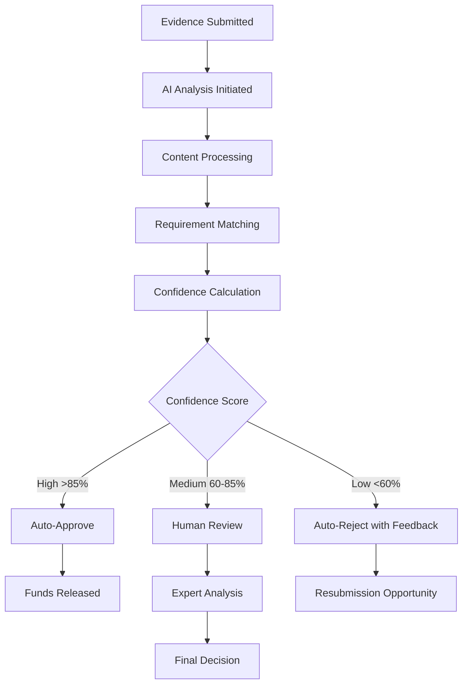

# Understanding Verification Results

Learn how to interpret AI verification results, understand confidence scores, and navigate the decision-making process on AetherLock Protocol. This guide covers all possible outcomes and your options for each scenario.

## Verification Process Overview

### How AI Verification Works

AetherLock's Proof of Task Verification (PoTv) uses advanced AI models to analyze your submitted evidence against the original project requirements. The process involves multiple layers of analysis:

<Steps>
<Step title="Evidence Analysis">
1. **Content Extraction**: AI analyzes images, videos, documents, and code
2. **Requirement Mapping**: Matches evidence to specific project criteria
3. **Quality Assessment**: Evaluates completeness and accuracy
4. **Cross-Validation**: Checks consistency across multiple evidence pieces
</Step>

<Step title="Confidence Scoring">
1. **Individual Scores**: Each requirement gets a confidence score (0-100%)
2. **Weighted Average**: Scores combined based on requirement importance
3. **Risk Assessment**: Identifies potential issues or ambiguities
4. **Final Decision**: Determines approval, rejection, or human review need
</Step>

<Step title="Result Generation">
1. **Decision Output**: Clear approve/reject/review recommendation
2. **Detailed Feedback**: Specific comments on each requirement
3. **Evidence Mapping**: Shows which evidence supports each decision
4. **Next Steps**: Provides actionable guidance for any issues
</Step>
</Steps>

### Verification Timeline

<Tabs>
<Tab title="Typical Processing Times">
**Standard Verification**: 2-10 minutes
- Simple projects with clear evidence
- Well-documented requirements
- High-quality submissions

**Extended Processing**: 10-30 minutes
- Complex projects with multiple components
- Large amounts of evidence to analyze
- Detailed technical requirements

**Human Review Required**: 2-24 hours
- Low AI confidence scores
- Ambiguous or conflicting evidence
- High-value escrows requiring extra scrutiny
</Tab>

<Tab title="Processing Stages">

</Tab>
</Tabs>

## Understanding Confidence Scores

### Score Ranges and Meanings

<Tabs>
<Tab title="High Confidence (85-100%)">
**Meaning**: AI is very confident requirements are met
**Typical Outcome**: Automatic approval
**Characteristics**:
- Clear, comprehensive evidence
- All requirements fully addressed
- High-quality documentation
- Consistent evidence across all criteria

**Example Feedback**:
```
✅ Confidence Score: 94%

Requirements Analysis:
• Responsive Design: 98% - Excellent mobile screenshots showing proper adaptation
• Payment Integration: 92% - Complete Stripe integration demo with successful transactions
• Performance: 89% - Lighthouse scores exceed minimum thresholds
• Documentation: 96% - Comprehensive setup and usage instructions provided

Decision: APPROVED - All requirements clearly met with high-quality evidence.
```
</Tab>

<Tab title="Medium Confidence (60-84%)">
**Meaning**: AI sees good evidence but has some concerns
**Typical Outcome**: Human review required
**Characteristics**:
- Most requirements clearly met
- Some ambiguous or incomplete evidence
- Minor gaps in documentation
- Quality variations across evidence

**Example Feedback**:
```
⚠️ Confidence Score: 73%

Requirements Analysis:
• Responsive Design: 85% - Good mobile screenshots, missing tablet view
• Payment Integration: 68% - Demo shows success case, error handling unclear
• Performance: 79% - Good Lighthouse scores, missing load testing results
• Documentation: 82% - Setup guide present, deployment instructions incomplete

Decision: HUMAN REVIEW - Generally good evidence with minor gaps requiring expert evaluation.
```
</Tab>

<Tab title="Low Confidence (0-59%)">
**Meaning**: AI cannot verify requirements are met
**Typical Outcome**: Rejection with detailed feedback
**Characteristics**:
- Missing evidence for key requirements
- Poor quality or unclear submissions
- Significant gaps in functionality
- Inconsistent or contradictory evidence

**Example Feedback**:
```
❌ Confidence Score: 42%

Requirements Analysis:
• Responsive Design: 35% - Screenshots show layout issues on mobile
• Payment Integration: 28% - No working demo provided, code incomplete
• Performance: 65% - Lighthouse scores below minimum requirements
• Documentation: 41% - Setup instructions missing, no deployment guide

Decision: REJECTED - Significant gaps in evidence and functionality. Resubmission required.
```
</Tab>
</Tabs>

### Detailed Score Breakdown

Each requirement receives individual analysis:

```typescript
interface RequirementScore {
  id: string;
  description: string;
  weight: number;          // Importance (1-10)
  confidence: number;      // AI confidence (0-100%)
  evidence: string[];      // Supporting evidence files
  issues: string[];        // Identified problems
  suggestions: string[];   // Improvement recommendations
}

// Example detailed breakdown
const verificationResult = {
  overallScore: 78,
  decision: "HUMAN_REVIEW",
  requirements: [
    {
      id: "responsive-design",
      description: "Website must be fully responsive across all device sizes",
      weight: 8,
      confidence: 85,
      evidence: ["mobile-screenshots.zip", "tablet-demo.mp4"],
      issues: ["Missing iPad Pro landscape view"],
      suggestions: ["Add screenshots for larger tablet sizes"]
    },
    {
      id: "payment-integration", 
      description: "Stripe payment processing with error handling",
      weight: 10,
      confidence: 68,
      evidence: ["payment-demo.mp4", "stripe-webhook-code.js"],
      issues: ["Error handling not demonstrated", "Webhook security unclear"],
      suggestions: ["Show failed payment scenarios", "Document webhook validation"]
    }
  ]
};
```

## Verification Outcomes

### Automatic Approval

<Card title="✅ Verification Approved" icon="check-circle">
  **Confidence Score**: 85-100%
  
  **What This Means**:
  - All requirements clearly met
  - High-quality evidence provided
  - AI confident in decision accuracy
  - Funds automatically released to freelancer
  
  **Timeline**: Immediate (within 5 minutes of submission)
</Card>

#### What Happens Next

<Steps>
<Step title="Immediate Actions">
1. **Funds Released**: Escrow funds transferred to freelancer wallet
2. **Notifications Sent**: Both parties receive approval confirmation
3. **Transaction Recorded**: Blockchain transaction for fund release
4. **Feedback Generated**: Detailed verification report available
</Step>

<Step title="Post-Approval">
1. **Rating Opportunity**: Both parties can rate the experience
2. **Evidence Archived**: Files stored for 1 year for reference
3. **Dispute Window**: 7-day period for any concerns (rare)
4. **Platform Fee**: 10% fee deducted from released funds
</Step>
</Steps>

#### Approval Notification Example

```json
{
  "status": "APPROVED",
  "confidence": 94,
  "message": "All project requirements have been successfully verified.",
  "fundsReleased": {
    "amount": "0.9 SOL",
    "recipient": "FreelancerWallet123...",
    "transactionId": "5KJp7...",
    "timestamp": "2024-01-15T14:30:00Z"
  },
  "breakdown": {
    "totalRequirements": 4,
    "fullyMet": 4,
    "partiallyMet": 0,
    "notMet": 0
  }
}
```

### Human Review Required

<Card title="⚠️ Human Review Initiated" icon="user-check">
  **Confidence Score**: 60-84%
  
  **What This Means**:
  - Evidence is generally good but has some gaps
  - AI needs human expert to make final decision
  - Most requirements appear to be met
  - Additional scrutiny required for edge cases
  
  **Timeline**: 2-24 hours for expert review
</Card>

#### Review Process

<Tabs>
<Tab title="Expert Analysis">
**Who Reviews**: Certified AetherLock verification experts
**Qualifications**: 
- Technical expertise in relevant domains
- Experience with project requirements
- Training in fair dispute resolution
- Regular performance monitoring

**Review Criteria**:
- Technical accuracy and completeness
- Requirement interpretation and fulfillment
- Evidence quality and relevance
- Industry best practices compliance
</Tab>

<Tab title="Review Timeline">
**Priority Levels**:
- **High Priority** (>$10,000 escrow): 2-6 hours
- **Standard Priority** ($1,000-$10,000): 6-12 hours  
- **Low Priority** (<$1,000): 12-24 hours

**Expedited Review**: Available for urgent cases with additional fee

**Status Updates**: Real-time notifications on review progress
</Tab>
</Tabs>

#### During Human Review

<Steps>
<Step title="Review Initiation">
1. Expert reviewer assigned based on project type
2. Complete evidence package provided to reviewer
3. Original requirements and clarifications included
4. AI analysis and concerns highlighted
</Step>

<Step title="Detailed Analysis">
1. **Evidence Examination**: Thorough review of all submitted materials
2. **Requirement Verification**: Point-by-point requirement checking
3. **Quality Assessment**: Professional evaluation of work quality
4. **Gap Analysis**: Identification of any missing elements
</Step>

<Step title="Decision Making">
1. **Scoring**: Detailed scoring for each requirement
2. **Justification**: Written explanation for decision
3. **Recommendations**: Suggestions for any improvements needed
4. **Final Verdict**: Approve, reject, or request additional evidence
</Step>
</Steps>

### Rejection with Feedback

<Card title="❌ Verification Rejected" icon="x-circle">
  **Confidence Score**: 0-59%
  
  **What This Means**:
  - Significant gaps in evidence or functionality
  - Requirements not adequately met
  - Quality issues that need addressing
  - Resubmission opportunity available
  
  **Timeline**: Immediate feedback with 7-day resubmission window
</Card>

#### Understanding Rejection Reasons

<Tabs>
<Tab title="Common Rejection Causes">
**Incomplete Evidence**:
- Missing files for key requirements
- Broken links or inaccessible demos
- Insufficient documentation

**Quality Issues**:
- Poor image/video quality
- Non-functional code or demos
- Significant bugs or errors

**Requirement Gaps**:
- Features not implemented as specified
- Missing functionality
- Incorrect interpretation of requirements

**Technical Problems**:
- Performance below specified thresholds
- Security vulnerabilities
- Compatibility issues
</Tab>

<Tab title="Detailed Feedback Format">
```json
{
  "status": "REJECTED",
  "confidence": 42,
  "message": "Several requirements not adequately met. Resubmission required.",
  "issues": [
    {
      "requirement": "Mobile Responsiveness",
      "severity": "HIGH",
      "description": "Layout breaks on mobile devices below 375px width",
      "evidence": ["mobile-screenshot-1.png", "mobile-screenshot-2.png"],
      "suggestion": "Implement proper CSS media queries for small screens"
    },
    {
      "requirement": "Payment Integration", 
      "severity": "CRITICAL",
      "description": "Stripe integration not functional - test payments failing",
      "evidence": ["payment-demo.mp4"],
      "suggestion": "Debug webhook configuration and test with Stripe test cards"
    }
  ],
  "resubmissionDeadline": "2024-01-22T23:59:59Z"
}
```
</Tab>
</Tabs>

## Resubmission Process

### When You Can Resubmit

<Steps>
<Step title="Automatic Resubmission Rights">
- **First Rejection**: Automatic 7-day resubmission window
- **Quality Issues**: Can resubmit after addressing feedback
- **Missing Evidence**: Can add supplementary materials
- **Technical Problems**: Can fix bugs and resubmit
</Step>

<Step title="Resubmission Limitations">
- **Maximum Attempts**: 3 resubmissions per escrow
- **Time Limits**: Must resubmit within deadline
- **Scope Changes**: Cannot change original requirements
- **Client Approval**: Major changes may require client consent
</Step>
</Steps>

### How to Resubmit

<Tabs>
<Tab title="Address Specific Issues">
**Review Feedback Carefully**:
1. Read each issue and suggestion
2. Prioritize critical and high-severity problems
3. Create action plan for addressing each point
4. Gather additional evidence as needed

**Fix and Improve**:
```markdown
# Resubmission Checklist

## Critical Issues (Must Fix)
- [ ] Fix Stripe payment integration
- [ ] Resolve mobile layout problems
- [ ] Add missing error handling

## High Priority Issues  
- [ ] Improve performance scores
- [ ] Add comprehensive documentation
- [ ] Include tablet responsiveness

## Enhancements
- [ ] Add additional test cases
- [ ] Improve code comments
- [ ] Include deployment guide
```
</Tab>

<Tab title="Supplementary Evidence">
**Add Missing Materials**:
- Additional screenshots or videos
- Fixed code files or demos
- Updated documentation
- Performance test results

**Improve Quality**:
- Higher resolution images
- Clearer video demonstrations
- More detailed explanations
- Better organized file structure

**Address Feedback**:
- Point-by-point response to issues
- Explanation of fixes implemented
- Additional context where needed
- Updated evidence mapping
</Tab>
</Tabs>

### Resubmission Best Practices

<Steps>
<Step title="Systematic Approach">
1. **Create Issue Tracker**: List all feedback points
2. **Prioritize Fixes**: Address critical issues first
3. **Test Thoroughly**: Verify all fixes work properly
4. **Document Changes**: Explain what was improved
5. **Quality Check**: Ensure new evidence meets standards
</Step>

<Step title="Communication">
1. **Update Client**: Inform about resubmission timeline
2. **Explain Changes**: Describe improvements made
3. **Set Expectations**: Provide realistic completion timeline
4. **Request Clarification**: Ask for clarification if feedback unclear
</Step>
</Steps>

## Dispute Resolution Process

### When to Dispute

<Tabs>
<Tab title="Valid Dispute Reasons">
**Technical Errors**:
- AI misunderstood evidence
- Incorrect requirement interpretation
- Technical analysis mistakes

**Process Issues**:
- Evidence not properly reviewed
- Bias in human review
- Procedural violations

**Requirement Disputes**:
- Ambiguous original requirements
- Scope creep during project
- Client changing expectations
</Tab>

<Tab title="Invalid Dispute Reasons">
**Quality Issues**:
- Legitimate quality concerns
- Missing functionality
- Poor implementation

**Deadline Issues**:
- Late submission
- Missed resubmission window
- Time management problems

**Scope Issues**:
- Work outside original requirements
- Additional features not requested
- Personal preferences vs requirements
</Tab>
</Tabs>

### Dispute Process

<Steps>
<Step title="Initial Dispute Filing">
1. **File Within 7 Days**: Submit dispute within deadline
2. **Provide Evidence**: Include supporting documentation
3. **State Grounds**: Clearly explain dispute basis
4. **Pay Dispute Fee**: Refundable if dispute successful
</Step>

<Step title="Dispute Review">
1. **Senior Reviewer Assignment**: Experienced expert assigned
2. **Complete Re-evaluation**: Fresh review of all evidence
3. **Both Parties Heard**: Client and freelancer input considered
4. **Independent Analysis**: Unbiased technical assessment
</Step>

<Step title="Resolution">
1. **Decision Rendered**: Clear ruling with explanation
2. **Funds Distributed**: Based on dispute outcome
3. **Fees Handled**: Dispute fees refunded if successful
4. **Case Closed**: Final decision with no further appeals
</Step>
</Steps>

### Dispute Outcomes

<Tabs>
<Tab title="Freelancer Wins">
**Full Victory**:
- Original rejection overturned
- Full payment released
- Dispute fee refunded
- Positive record maintained

**Partial Victory**:
- Partial payment released
- Some requirements deemed met
- Proportional fee refund
- Mixed record outcome
</Tab>

<Tab title="Client Wins">
**Rejection Upheld**:
- Original decision confirmed
- No payment released
- Dispute fee forfeited
- Resubmission still possible

**Partial Client Victory**:
- Some concerns validated
- Reduced payment amount
- Shared dispute costs
- Opportunity for resolution
</Tab>
</Tabs>

## Appeal Process

### Limited Appeal Rights

<Card title="⚖️ Appeal Process" icon="scale">
  **When Available**: Only for procedural violations or clear errors
  
  **Timeline**: 48 hours after dispute resolution
  
  **Requirements**: 
  - Evidence of process violation
  - Significant new evidence
  - Clear reviewer bias or error
  
  **Fee**: Higher appeal fee (refundable if successful)
</Card>

### Appeal Criteria

<Steps>
<Step title="Procedural Violations">
- Reviewer conflict of interest
- Evidence not properly considered
- Process timeline violations
- Bias or discrimination
</Step>

<Step title="Clear Technical Errors">
- Obvious misunderstanding of evidence
- Incorrect technical analysis
- Factual errors in decision
- Misapplication of requirements
</Step>

<Step title="New Evidence">
- Evidence unavailable during original review
- Technical discoveries post-review
- Client admissions or clarifications
- Third-party validation
</Step>
</Steps>

## Verification Statistics and Insights

### Platform Performance Metrics

<Tabs>
<Tab title="AI Accuracy">
**Overall Accuracy**: 94.2%
- High confidence decisions: 97.8% accuracy
- Medium confidence decisions: 89.1% accuracy  
- Human review agreement: 92.4%

**Processing Speed**:
- Average verification time: 4.2 minutes
- 95% completed within 10 minutes
- Human review average: 8.3 hours
</Tab>

<Tab title="Decision Distribution">
**Automatic Approvals**: 68%
- High-quality submissions
- Clear requirement fulfillment
- Comprehensive evidence

**Human Reviews**: 24%
- Borderline cases requiring expertise
- Complex technical requirements
- High-value escrows

**Automatic Rejections**: 8%
- Clear quality issues
- Missing critical evidence
- Significant requirement gaps
</Tab>
</Tabs>

### Success Rate Factors

<Steps>
<Step title="High Success Predictors">
**Evidence Quality**:
- High-resolution screenshots
- Clear video demonstrations
- Comprehensive documentation
- Well-organized file structure

**Requirement Coverage**:
- Point-by-point evidence mapping
- Multiple evidence types per requirement
- Clear explanations and context
- Proactive gap addressing
</Step>

<Step title="Common Failure Patterns">
**Evidence Issues**:
- Poor quality images/videos
- Missing or broken links
- Incomplete documentation
- Disorganized submissions

**Technical Problems**:
- Non-functional demos
- Performance issues
- Security vulnerabilities
- Compatibility problems
</Step>
</Steps>

## Tips for Successful Verification

### Pre-Submission Preparation

<Checklist>
- [ ] Review requirements thoroughly before starting work
- [ ] Document progress throughout development
- [ ] Test all functionality before submission
- [ ] Prepare comprehensive evidence package
- [ ] Organize files with clear naming conventions
- [ ] Include detailed explanations for each piece of evidence
- [ ] Test all links and demos for accessibility
- [ ] Create backup copies of all evidence
- [ ] Review submission against original requirements
- [ ] Get client feedback before final submission if possible
</Checklist>

### Evidence Quality Guidelines

<Steps>
<Step title="Visual Evidence">
**Screenshots**:
- Minimum 1920x1080 resolution
- Show complete interfaces
- Include multiple device sizes
- Annotate important features

**Videos**:
- Clear audio narration
- Smooth, professional recording
- Demonstrate key functionality
- Keep under 10 minutes per video
</Step>

<Step title="Technical Evidence">
**Code Quality**:
- Clean, well-commented code
- Follow industry best practices
- Include comprehensive documentation
- Provide setup and deployment instructions

**Performance**:
- Include performance test results
- Show optimization efforts
- Document any trade-offs made
- Provide before/after comparisons
</Step>
</Steps>

### Communication Best Practices

<Steps>
<Step title="With Clients">
1. **Set Clear Expectations**: Discuss verification process upfront
2. **Regular Updates**: Keep client informed of progress
3. **Clarify Requirements**: Ask questions early and often
4. **Document Changes**: Record any requirement modifications
5. **Pre-Submission Review**: Get client input before final submission
</Step>

<Step title="With AetherLock">
1. **Detailed Descriptions**: Provide context for all evidence
2. **Clear Organization**: Structure evidence logically
3. **Proactive Communication**: Address potential concerns upfront
4. **Professional Presentation**: Maintain high quality standards
5. **Responsive Support**: Respond quickly to any requests for clarification
</Step>
</Steps>

## Frequently Asked Questions

<AccordionGroup>
<Accordion title="How accurate is the AI verification system?">
AetherLock's AI verification system maintains a 94.2% accuracy rate across all decisions. High-confidence decisions (85%+ score) have a 97.8% accuracy rate, while medium-confidence decisions requiring human review have an 89.1% accuracy rate. The system is continuously improved based on feedback and outcomes.
</Accordion>

<Accordion title="Can I request human review even for approved decisions?">
While approved decisions are final, you can request a review within 7 days if you believe there was a technical error or if you have concerns about the decision. However, this is rare since approved decisions indicate high confidence that requirements were met.
</Accordion>

<Accordion title="What happens if I disagree with the human reviewer's decision?">
If you disagree with a human reviewer's decision, you can file a dispute within 7 days. The dispute will be handled by a senior reviewer who will conduct a fresh, independent analysis of all evidence. This is the final level of review before the appeal process.
</Accordion>

<Accordion title="How long do I have to resubmit after rejection?">
You have 7 days from the rejection notification to resubmit improved evidence. This deadline is firm and cannot be extended except in exceptional circumstances (such as platform technical issues). You can resubmit up to 3 times per escrow.
</Accordion>

<Accordion title="Can the client influence the verification decision?">
Clients cannot directly influence AI verification decisions, which are based solely on evidence and requirements. However, clients can provide input during human reviews and dispute processes. The original requirements document serves as the authoritative source for verification criteria.
</Accordion>

<Accordion title="What if my evidence contains proprietary or sensitive information?">
All evidence is handled with strict confidentiality and security measures. Evidence is encrypted during transmission and storage, and access is limited to authorized verification personnel. Evidence is automatically deleted after 1 year unless there are ongoing disputes.
</Accordion>

<Accordion title="Can I see the detailed AI analysis of my evidence?">
Yes, you receive a detailed breakdown showing how each piece of evidence was analyzed, which requirements it addresses, and the confidence score for each requirement. This helps you understand the decision and improve future submissions.
</Accordion>

<Accordion title="What happens if there are technical issues during verification?">
If technical issues prevent proper verification (such as IPFS access problems or corrupted files), the verification will be paused and you'll be notified. You'll have the opportunity to resubmit affected evidence without penalty. The verification timeline is extended accordingly.
</Accordion>
</AccordionGroup>

---

<Card title="Next Steps" icon="arrow-right">
  **After Understanding Your Results**:
  - If approved: [Learn about fund release and ratings](/guides/escrow-completion)
  - If rejected: [Prepare your resubmission](/guides/submitting-evidence)
  - If disputed: [File a dispute](/guides/dispute-resolution)
  - For questions: [Contact AetherLock support](/support)
</Card>
