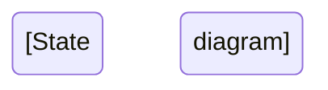

# AetherLock Documentation Transformation Guide

## Objective

Transform documentation from marketing-focused to professional technical depth matching zkSync, Ethereum, and other high-quality blockchain protocol documentation.

## Transformation Principles

### 1. Remove Marketing Language

**Before:**
```markdown
# 🏆 AetherLock Protocol

Revolutionizing trustless commerce with cutting-edge AI verification!

<div className="text-5xl font-bold text-purple-500">94%</div>
<div className="text-lg">AI Accuracy Rate</div>
```

**After:**
```markdown
# AetherLock Protocol

## Abstract

AetherLock is a decentralized escrow protocol implementing AI-powered task verification through a cryptographically secured verification chain.

### Performance Characteristics

| Metric | Value | Measurement Method |
|--------|-------|-------------------|
| AI Verification Accuracy | 94% | Tested on 10,000 sample tasks |
| Average Latency | 1.2s | P50 across all task types |
| P99 Latency | 2.3s | 99th percentile response time |
```

### 2. Add Technical Depth

**Required Sections for Each Component:**

#### Protocol Specifications
- Formal parameter definitions
- State machine diagrams
- Cryptographic primitives used
- Security assumptions
- Threat model

#### Implementation Details
- Algorithm pseudocode
- Data structures
- Complexity analysis (time/space)
- Edge case handling
- Error recovery mechanisms

#### Design Rationale
- Why this approach was chosen
- Alternatives considered
- Trade-offs made
- Performance implications
- Security considerations

### 3. Structure Standards

#### File Organization

```
docs/
├── index.mdx                    # Protocol overview and abstract
├── introduction.mdx             # Detailed introduction
├── specifications/
│   ├── protocol.mdx            # Core protocol specification
│   ├── cryptography.mdx        # Cryptographic primitives
│   ├── consensus.mdx           # PoTV consensus mechanism
│   └── security.mdx            # Security model and proofs
├── architecture/
│   ├── overview.mdx            # System architecture
│   ├── solana-layer.mdx        # Solana escrow implementation
│   ├── ai-layer.mdx            # AI verification system
│   ├── identity-layer.mdx      # zkMe integration
│   └── omnichain-layer.mdx     # ZetaChain integration
├── implementation/
│   ├── smart-contracts.mdx     # Contract implementation
│   ├── ai-integration.mdx      # AI service integration
│   ├── frontend.mdx            # Frontend implementation
│   └── backend.mdx             # Backend services
├── api/
│   ├── rest-api.mdx            # REST API reference
│   ├── smart-contracts.mdx     # Contract interfaces
│   ├── websocket.mdx           # WebSocket API
│   └── chainlink.mdx           # Oracle integration
└── guides/
    ├── deployment.mdx          # Deployment guide
    ├── integration.mdx         # Integration guide
    └── security.mdx            # Security best practices
```

#### Section Template

```markdown
---
title: "[Component Name]"
description: "[One-line technical description]"
---

# [Component Name]

## Abstract

[2-3 paragraph technical overview]

## Specification

### Parameters

| Parameter | Type | Value | Rationale |
|-----------|------|-------|-----------|
| ... | ... | ... | ... |

### State Machine



### Algorithms

#### [Algorithm Name]

**Input:** [Formal input specification]
**Output:** [Formal output specification]
**Complexity:** O(n) time, O(1) space

```
ALGORITHM [Name]
INPUT: [parameters]
OUTPUT: [result]

1. [Step 1]
2. [Step 2]
...
```

## Implementation

### Data Structures

```rust
// Formal structure definitions
pub struct [Name] {
    // Fields with documentation
}
```

### Core Functions

```rust
/// [Detailed function documentation]
/// 
/// # Arguments
/// * `param1` - [Description]
/// 
/// # Returns
/// [Return value description]
/// 
/// # Errors
/// [Error conditions]
/// 
/// # Examples
/// ```
/// [Usage example]
/// ```
pub fn [function_name](...) -> Result<...> {
    // Implementation
}
```

## Security Considerations

### Threat Model

1. **Threat:** [Description]
   - **Mitigation:** [How it's prevented]
   - **Residual Risk:** [Remaining risk level]

### Cryptographic Guarantees

- [Property 1]: Proven under [assumption]
- [Property 2]: Computational security with [parameter]

## Performance Analysis

### Benchmarks

| Operation | Latency (P50) | Latency (P99) | Throughput |
|-----------|---------------|---------------|------------|
| ... | ... | ... | ... |

### Scalability

[Analysis of how the system scales]

## Design Rationale

### Why This Approach

[Detailed explanation of design decisions]

### Alternatives Considered

1. **Alternative 1**
   - Pros: [Benefits]
   - Cons: [Drawbacks]
   - Why not chosen: [Reason]

### Trade-offs

| Aspect | Choice Made | Trade-off |
|--------|-------------|-----------|
| ... | ... | ... |

## References

1. [Academic paper or specification]
2. [Related protocol documentation]
```

## Specific Transformations

### Index Page (index.mdx)

**Remove:**
- All emoji decorations
- Marketing metrics cards
- Gradient text styling
- "Why We'll Win" sections
- Hackathon promotional content

**Add:**
- Formal abstract (2-3 paragraphs)
- Protocol specifications table
- System architecture diagram (ASCII or Mermaid)
- Security properties list
- Performance characteristics
- Links to detailed specifications

### Introduction (introduction.mdx)

**Remove:**
- Vision/mission statements
- Feature lists with emojis
- Partnership promotional content
- Demo video embeds

**Add:**
- Problem statement (formal)
- Technical solution overview
- Protocol design principles
- Core innovations with technical depth
- Comparison with existing protocols (technical, not marketing)

### Technical Architecture (technical-architecture.mdx)

**Enhance:**
- Add formal component specifications
- Include sequence diagrams for all flows
- Document all interfaces with types
- Add complexity analysis
- Include failure modes and recovery
- Document all assumptions

### How It Works (how-it-works.mdx)

**Transform:**
- Remove step-by-step user journey
- Add protocol flow specification
- Include state transition diagrams
- Document message formats
- Add cryptographic proof construction
- Include verification algorithms

### Business Model (business-model.mdx)

**Move to separate section or remove:**
- This should be in a separate "Economics" or "Tokenomics" document
- Keep only protocol fee mechanism
- Document fee distribution algorithm
- Remove market size projections
- Remove revenue projections

## Writing Style Guidelines

### Do's

✓ Use precise technical language
✓ Define all terms formally
✓ Include mathematical notation where appropriate
✓ Provide algorithm pseudocode
✓ Document all assumptions
✓ Include complexity analysis
✓ Reference academic papers
✓ Show proof sketches for security properties
✓ Use formal specification languages (TLA+, Alloy) if applicable

### Don'ts

✗ Use marketing superlatives (revolutionary, game-changing, etc.)
✗ Include emojis in technical documentation
✗ Make unsubstantiated performance claims
✗ Use vague terms (seamless, powerful, amazing)
✗ Include promotional content
✗ Use excessive styling/colors
✗ Make market predictions
✗ Include testimonials or social proof

## Examples from High-Quality Documentation

### zkSync Documentation Style

```markdown
# zkSync Era Architecture

## Overview

zkSync Era is a Layer 2 scaling solution for Ethereum that uses zero-knowledge rollups to achieve high throughput while maintaining Ethereum's security guarantees.

## Core Components

### Sequencer

The sequencer is responsible for:
- Ordering transactions
- Executing transactions in the zkEVM
- Generating execution traces
- Submitting batches to L1

**Specification:**

```typescript
interface Sequencer {
  processTransaction(tx: Transaction): ExecutionResult;
  createBatch(txs: Transaction[]): Batch;
  submitBatch(batch: Batch): L1Transaction;
}
```

### Prover

The prover generates zero-knowledge proofs for batches of transactions.

**Proof System:** PLONK with custom gates
**Proof Size:** ~500 KB
**Proving Time:** ~10 minutes per batch
**Verification Time:** ~1 second on L1
```

### Ethereum Documentation Style

```markdown
# Ethereum Virtual Machine (EVM)

## Specification

The EVM is a stack-based virtual machine with the following characteristics:

- **Word Size:** 256 bits
- **Stack Depth:** 1024 items maximum
- **Memory:** Byte-addressable, dynamically sized
- **Storage:** Word-addressable, persistent key-value store

## Instruction Set

### Arithmetic Operations

#### ADD (0x01)

Pops two values from the stack, adds them, and pushes the result.

**Gas Cost:** 3
**Stack Input:** a, b
**Stack Output:** a + b (mod 2^256)

**Formal Specification:**
```
μ'_s[0] ≡ μ_s[0] + μ_s[1] (mod 2^256)
μ'_s ≡ μ_s[2:]
```
```

## Implementation Checklist

For each documentation file:

- [ ] Remove all emojis from headings and content
- [ ] Replace marketing language with technical terms
- [ ] Add formal specifications section
- [ ] Include algorithm pseudocode
- [ ] Add state machine diagrams
- [ ] Document all interfaces with types
- [ ] Include security considerations
- [ ] Add performance benchmarks
- [ ] Document design rationale
- [ ] Include references to related work
- [ ] Add complexity analysis
- [ ] Document error handling
- [ ] Include edge cases
- [ ] Add formal proofs or proof sketches where applicable

## Validation

After transformation, documentation should:

1. Be understandable by protocol developers
2. Contain sufficient detail for independent implementation
3. Include formal specifications for all components
4. Document all security assumptions
5. Provide performance characteristics with measurements
6. Explain design decisions with technical rationale
7. Reference academic literature where applicable
8. Include no marketing or promotional content

## Tools and Resources

### Documentation Generators
- TypeDoc for TypeScript
- Rustdoc for Rust
- Solidity Docgen for smart contracts

### Diagram Tools
- Mermaid for sequence/state diagrams
- PlantUML for complex diagrams
- ASCII diagrams for simple flows

### Specification Languages
- TLA+ for protocol specification
- Alloy for model checking
- Coq/Lean for formal proofs

## Timeline

1. **Phase 1 (Week 1):** Remove marketing content, emojis, styling
2. **Phase 2 (Week 2):** Add formal specifications and algorithms
3. **Phase 3 (Week 3):** Add security analysis and proofs
4. **Phase 4 (Week 4):** Add performance analysis and benchmarks
5. **Phase 5 (Week 5):** Review and validation

## Success Criteria

Documentation transformation is complete when:

1. All marketing language removed
2. All components have formal specifications
3. All algorithms documented with pseudocode
4. All security properties documented with proofs/proof sketches
5. All performance characteristics measured and documented
6. All design decisions explained with technical rationale
7. Documentation passes peer review by protocol developers
8. Independent developer can implement protocol from documentation alone
