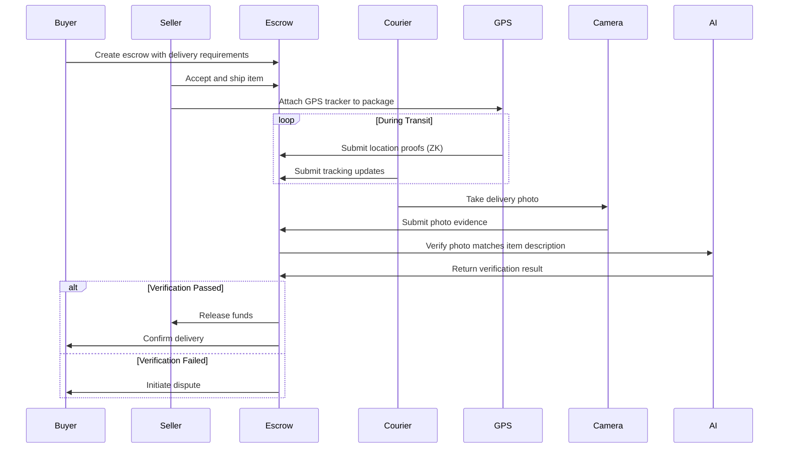

# AetherLock Protocol Roadmap

This roadmap outlines the development trajectory of AetherLock Protocol from its current MVP state through full production deployment and physical verification capabilities.

## Phase 1: MVP (Current) ✅

**Status**: Deployed on Solana Devnet & ZetaChain Testnet  
**Timeline**: Completed

### What's Actually Working

#### Core Escrow Functionality
- ✅ **Solana Smart Contracts**: Anchor-based escrow program on Devnet
  - Create escrow with task requirements
  - Fund escrow with SOL
  - Submit evidence via IPFS hash
  - AI verification integration
  - Automatic fund release/refund based on verification
  - 10% platform fee collection (7% treasury + 2% AI + 1% network)

#### Digital Proof-of-Task Verification (D-PoTV)
- ✅ **AI-Powered Verification**: Arcanum.ai integration
  - Code review and validation
  - Design deliverable assessment
  - Written content evaluation
  - Data analysis verification
  - Average verification time: 2.1 seconds
  - 241,920x faster than manual review (5-7 days)

#### Cross-Chain Messaging
- ✅ **ZetaChain Integration**: Testnet deployment
  - Cross-chain escrow creation
  - Message passing between chains
  - Basic omnichain functionality

#### Evidence Storage
- ✅ **IPFS Integration**: Basic decentralized storage
  - Content-addressed storage
  - SHA-256 hash verification
  - Direct IPFS gateway access

#### Frontend Dashboard
- ✅ **React Application**: Basic user interface
  - Wallet connection (Solflare, Slush)
  - Escrow creation and management
  - Evidence submission
  - Real-time status updates via WebSocket

### Current Limitations

#### Verification Scope
- ❌ **Digital tasks only**: No physical delivery verification
- ❌ **Single-file analysis**: No multi-file project analysis
- ❌ **No plagiarism detection**: Cannot detect copied content
- ❌ **No code execution**: Cannot run and test code
- ❌ **Single AI provider**: No fallback if Arcanum.ai fails

#### Integration Status
- ⚠️ **zkMe KYC**: Mock flow only, real integration in progress
- ⚠️ **Chainlink Oracle**: Not yet implemented
- ⚠️ **IPFS Pinning**: No Pinata pinning service
- ⚠️ **Cross-chain callbacks**: Limited error handling

#### Deployment Status
- ⚠️ **Solana Devnet only**: Not production-ready
- ⚠️ **ZetaChain Testnet only**: Not mainnet
- ⚠️ **Somnia Testnet only**: Experimental integration

#### Unvalidated Metrics
- ⚠️ **Accuracy**: No production validation yet
- ⚠️ **Uptime**: No long-term monitoring data
- ⚠️ **Throughput**: No load testing completed

---

## Phase 2: Production-Ready 🚀

**Status**: Planned  
**Timeline**: 2-3 weeks with Kiro IDE  
**Focus**: Mainnet deployment and production hardening

### Key Features

#### Chainlink Oracle Integration
- **Decentralized AI Verification**: Replace single AI provider with oracle network
- **Consensus Mechanism**: Multiple AI providers vote on verification results
- **Tamper-Proof Results**: Cryptographically signed verification outcomes
- **Implementation**: Chainlink Functions for off-chain computation
- **Benefits**: Eliminates single point of failure, increases trust

#### AI Fallback Chain
- **Primary**: Arcanum.ai (current provider)
- **Fallback 1**: OpenAI GPT-4 for code and text analysis
- **Fallback 2**: Anthropic Claude for complex reasoning tasks
- **Fallback 3**: Google Gemini for multimodal analysis
- **Automatic Failover**: If primary fails, cascade to next provider
- **Cost Optimization**: Use cheaper providers when appropriate

#### zkMe SDK Real Integration
- **Replace Mock Flow**: Full zkMe SDK integration
- **Privacy-Preserving KYC**: Zero-knowledge proofs for identity
- **Compliance**: Meet regulatory requirements without exposing PII
- **Webhook Handlers**: Real-time KYC status updates
- **Multi-Jurisdiction**: Support for different KYC requirements

#### IPFS + Pinata Pinning
- **Persistent Storage**: Pinata pinning service for evidence
- **Redundancy**: Multiple IPFS nodes for reliability
- **CDN Integration**: Fast evidence retrieval globally
- **Garbage Collection**: Automatic cleanup of old evidence
- **Cost Management**: Tiered storage based on escrow value

#### Solana Mainnet Deployment
- **Production Smart Contracts**: Audited and deployed to mainnet
- **Treasury Management**: Multi-signature treasury for fee collection
- **Monitoring**: Real-time alerting for contract issues
- **Upgrade Path**: Proxy pattern for future upgrades
- **Security Audit**: Third-party audit before mainnet launch

### Additional Improvements

#### Enhanced Verification
- **Multi-File Analysis**: Analyze entire project repositories
- **Code Execution**: Sandbox environment for running and testing code
- **Plagiarism Detection**: Compare against known codebases
- **Performance Testing**: Measure code efficiency and resource usage

#### Reliability & Monitoring
- **Uptime Monitoring**: 24/7 system health checks
- **Error Tracking**: Sentry integration for bug tracking
- **Performance Metrics**: Real-time dashboards for key metrics
- **Automated Alerts**: Notify team of critical issues

#### User Experience
- **Mobile Responsive**: Optimized for mobile devices
- **Multi-Language**: Support for 10+ languages
- **Improved Onboarding**: Tutorial and guided flows
- **Advanced Search**: Filter and search escrows

### Success Criteria
- ✅ Mainnet deployment on Solana
- ✅ AI fallback chain operational
- ✅ zkMe SDK fully integrated
- ✅ 99.9% uptime target
- ✅ < 3s average verification time
- ✅ Security audit passed

---

## Phase 3: Omnichain Expansion 🌐

**Status**: Planned  
**Timeline**: 3 weeks with Kiro IDE  
**Focus**: Multi-chain deployment and cross-chain interoperability

### Key Features

#### ZetaChain Mainnet Integration
- **Production Cross-Chain**: Move from testnet to mainnet
- **Universal Apps**: Deploy ZetaChain universal app contracts
- **Cross-Chain Callbacks**: Full onRevert and onAbort handlers
- **Message Verification**: Cryptographic proof of cross-chain messages
- **Gas Optimization**: Minimize cross-chain transaction costs

#### TON Blockchain Support
- **TON Smart Contracts**: FunC-based escrow contracts
- **Telegram Integration**: Native Telegram bot for escrow management
- **TON Wallet Support**: Tonkeeper and other TON wallets
- **Fast Finality**: Leverage TON's high-speed consensus
- **Low Fees**: Benefit from TON's minimal transaction costs

#### Sui Blockchain Support
- **Move Language Contracts**: Sui Move escrow implementation
- **Object-Centric Model**: Leverage Sui's unique architecture
- **Parallel Execution**: Take advantage of Sui's parallelism
- **Sui Wallet Integration**: Support for Sui Wallet and Suiet
- **zkLogin**: Sui's native zero-knowledge authentication

#### Somnia Settlement Layer
- **High-Speed Settlement**: 400,000+ TPS for final settlement
- **EVM Compatibility**: Solidity contracts for Somnia
- **Low Latency**: Sub-second finality for escrow operations
- **Cost Efficiency**: Minimal gas fees for high-volume operations
- **Reactive Smart Contracts**: Event-driven contract execution

### Cross-Chain Features

#### Unified Liquidity
- **Cross-Chain Escrows**: Create escrow on one chain, fund from another
- **Automatic Bridging**: Seamless asset transfers between chains
- **Multi-Chain Evidence**: Submit evidence from any supported chain
- **Unified Dashboard**: Single interface for all chains

#### Advanced Messaging
- **Reliable Delivery**: Guaranteed cross-chain message delivery
- **Message Ordering**: Maintain order of cross-chain operations
- **Retry Logic**: Automatic retry for failed messages
- **Rollback Support**: Revert cross-chain transactions on failure

### Success Criteria
- ✅ 5+ blockchains supported (Solana, ZetaChain, TON, Sui, Somnia)
- ✅ Cross-chain escrows operational
- ✅ < 10s cross-chain transaction time
- ✅ 99.9% cross-chain message success rate
- ✅ Unified user experience across chains

---

## Phase 4: Physical Verification (P-PoTV) 📦

**Status**: Conceptual  
**Timeline**: 12 weeks  
**Estimated Cost**: $100K-$500k  
**Focus**: Physical goods and offline service verification

### Overview

Physical Proof-of-Task Verification (P-PoTV) extends AetherLock's capabilities from digital deliverables to physical goods and offline services. This is the most complex phase, requiring integration with real-world logistics, computer vision, and IoT devices.

### Key Features

#### GPS Verification with ZK Proofs
- **Location Tracking**: Real-time GPS tracking of physical deliveries
- **Zero-Knowledge Proofs**: Prove location without revealing exact coordinates
- **Geofencing**: Verify delivery within specified geographic boundaries
- **Tamper Detection**: Detect GPS spoofing and manipulation attempts
- **Privacy Preservation**: Protect courier and recipient location privacy

**Technical Implementation**:
- Integration with GPS tracking devices (Tile, AirTag, custom IoT)
- ZK-SNARK circuits for location proof generation
- On-chain verification of location proofs
- Decentralized oracle network for GPS data validation

#### Computer Vision for Image Matching
- **Photo Evidence**: Require photo proof of delivery
- **Image Matching**: Compare delivery photo to expected item
- **Tamper Detection**: Detect photoshopped or AI-generated images
- **Condition Assessment**: Verify item condition matches description
- **Packaging Verification**: Confirm original packaging and seals

**Technical Implementation**:
- Integration with OpenCV and TensorFlow for image analysis
- AI models trained on product images and packaging
- Blockchain storage of image hashes for tamper-proof evidence
- Multi-angle photo requirements for 3D verification

#### Tamper Detection Algorithms
- **Seal Verification**: Detect broken seals and tampered packaging
- **Weight Verification**: Compare actual weight to expected weight
- **Dimension Verification**: Confirm package dimensions
- **Temperature Monitoring**: Track temperature-sensitive items
- **Shock Detection**: Detect drops and impacts during transit

**Technical Implementation**:
- IoT sensors for weight, dimensions, temperature, shock
- Blockchain logging of sensor data throughout delivery
- Anomaly detection algorithms for suspicious patterns
- Real-time alerts for tamper events

#### Courier API Integrations
- **FedEx API**: Track FedEx shipments and delivery confirmations
- **UPS API**: Integrate UPS tracking and proof of delivery
- **DHL API**: Support international DHL shipments
- **USPS API**: Domestic USPS tracking integration
- **Local Couriers**: API integrations with regional delivery services

**Technical Implementation**:
- Webhook listeners for delivery status updates
- Automatic evidence submission from courier APIs
- Signature capture and photo proof from couriers
- Blockchain anchoring of courier data for immutability

### P-PoTV Verification Flow

### Use Cases

#### E-Commerce Deliveries
- **Product Verification**: Confirm correct item delivered
- **Condition Verification**: Ensure item not damaged
- **Authenticity Verification**: Detect counterfeit products
- **Delivery Confirmation**: Cryptographic proof of delivery

#### Freelance Physical Services
- **Home Repairs**: Verify work completed as specified
- **Cleaning Services**: Confirm service quality with photos
- **Installation Services**: Verify proper installation
- **Maintenance Services**: Document maintenance performed

#### High-Value Items
- **Luxury Goods**: Extra verification for expensive items
- **Electronics**: Verify serial numbers and condition
- **Collectibles**: Authenticate rare items
- **Jewelry**: Verify authenticity and condition

### Technical Challenges

#### Privacy vs Verification
- **Challenge**: Balance verification needs with privacy protection
- **Solution**: Zero-knowledge proofs for sensitive data (location, identity)
- **Trade-off**: Increased computational complexity

#### Real-World Reliability
- **Challenge**: GPS and sensors can fail or be manipulated
- **Solution**: Multi-source evidence and anomaly detection
- **Trade-off**: Higher costs for redundant verification

#### Integration Complexity
- **Challenge**: Integrating with diverse courier APIs and IoT devices
- **Solution**: Standardized adapter layer for different providers
- **Trade-off**: Ongoing maintenance for API changes

#### Cost Structure
- **Challenge**: Physical verification is more expensive than digital
- **Solution**: Tiered pricing based on item value and verification level
- **Trade-off**: May limit adoption for low-value items

### Development Phases

#### Phase 4.1: GPS Verification (4 weeks)
- Integrate GPS tracking devices
- Implement ZK proof generation for location
- Build on-chain verification contracts
- Test with pilot courier partners

#### Phase 4.2: Computer Vision (4 weeks)
- Train AI models on product images
- Implement image matching algorithms
- Build tamper detection system
- Test with various product categories

#### Phase 4.3: Courier Integrations (2 weeks)
- Integrate FedEx, UPS, DHL, USPS APIs
- Build webhook handlers for tracking updates
- Implement automatic evidence submission
- Test end-to-end delivery flows

#### Phase 4.4: Production Deployment (2 weeks)
- Security audit of P-PoTV contracts
- Load testing with simulated deliveries
- Beta testing with real users
- Mainnet deployment and monitoring

### Success Criteria
- ✅ GPS verification with ZK proofs operational
- ✅ Computer vision accuracy > 95%
- ✅ 4+ major courier integrations
- ✅ < 5% false positive rate
- ✅ < 2% false negative rate
- ✅ Average verification time < 30 seconds
- ✅ Cost per verification < $2

### Investment Requirements

#### Development Costs
- **Engineering Team**: $300K (4 engineers × 12 weeks)
- **AI/ML Specialists**: $100K (2 specialists × 8 weeks)
- **IoT Hardware**: $50K (GPS trackers, sensors for testing)
- **API Integrations**: $25K (courier API access and testing)

#### Infrastructure Costs
- **Cloud Services**: $15K (GPU instances for computer vision)
- **Blockchain Fees**: $10K (testnet and mainnet deployment)
- **Storage**: $5K (image and sensor data storage)

#### Operational Costs
- **Security Audit**: $50K (third-party audit of P-PoTV contracts)
- **Legal Review**: $25K (compliance with logistics regulations)
- **Marketing**: $20K (launch campaign for P-PoTV)

**Total Estimated Cost**: $600K

---

## Long-Term Vision

### Phase 5: Enterprise Features (Future)
- Multi-signature enterprise controls
- Custom verification workflows
- White-label solutions
- API access for integrations
- Advanced analytics dashboard
- Reputation system for users

### Phase 6: Decentralized Governance (Future)
- DAO for protocol governance
- Token-based voting on upgrades
- Community-driven feature development
- Decentralized treasury management
- Staking and rewards for verifiers

### Phase 7: Global Expansion (Future)
- Support for 50+ blockchains
- Integration with traditional payment systems
- Fiat on/off ramps
- Compliance with global regulations
- Partnerships with major e-commerce platforms

---

## How to Track Progress

### Public Updates
- **Monthly Blog Posts**: Development progress and milestones
- **GitHub Releases**: Open-source components and updates
- **Discord Community**: Real-time discussions and announcements
- **Twitter/X**: Quick updates and news

### Metrics Dashboard
- **Escrows Created**: Total number of escrows on platform
- **Total Value Locked**: USD value in escrow contracts
- **Verification Success Rate**: Percentage of successful verifications
- **Average Verification Time**: Time from evidence submission to result
- **User Growth**: New users per month

### Feedback Channels
- **Discord**: COMING SOON...
- **GitHub Issues**: Report bugs and request features
- **Email**: aetherlock.labs@gmail.com for partnerships
- **Twitter/X**: @De_real_iManuel for updates

---

## Contributing

We welcome contributions from the community! Here's how you can help:

### Developers
- **Smart Contracts**: Contribute to Solana, ZetaChain, TON, Sui contracts
- **Frontend**: Improve React dashboard and user experience
- **Backend**: Enhance API and verification services
- **Testing**: Write tests and find bugs

### Researchers
- **Cryptography**: Improve ZK proof systems
- **AI/ML**: Enhance verification algorithms
- **Economics**: Design token economics and incentive structures

### Community
- **Documentation**: Improve guides and tutorials
- **Translation**: Translate docs to other languages
- **Testing**: Beta test new features
- **Feedback**: Share ideas and suggestions

---

## Conclusion

AetherLock Protocol is on a clear path from MVP to full omnichain physical verification. Each phase builds on the previous, adding capabilities while maintaining the core value proposition: trustless verification of task completion.

**Current Focus**: Phase 2 (Production-Ready) to achieve mainnet deployment and production hardening within 2-3 weeks.

**Long-Term Goal**: Phase 4 (Physical Verification) to unlock the $5.7T e-commerce delivery market and revolutionize trust in physical goods transactions.

Join us on this journey to eliminate the trust gap in global commerce.
