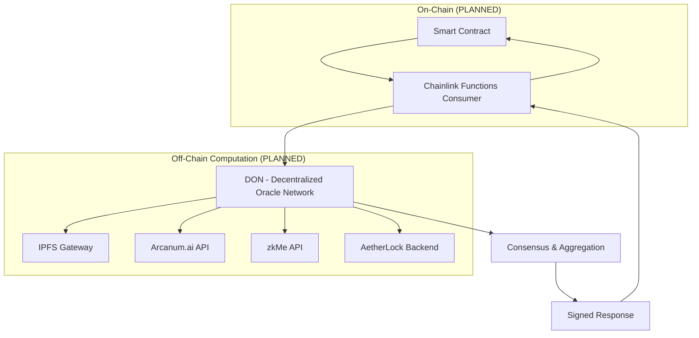

# Chainlink Functions Integration

> **⚠️ IMPORTANT: NOT YET IMPLEMENTED**
> 
> This document describes the **planned architecture** for Chainlink Functions integration. This functionality is **NOT currently implemented** in the AetherLock Protocol.
>
> **Current Implementation**: AI verification results are sent directly from Arcanum.ai to smart contracts without oracle intermediation.
>
> **Planned Timeline**: Chainlink Functions integration is planned for Phase 2 (Production-Ready) deployment.

## Overview

AetherLock plans to leverage Chainlink Functions to enable decentralized off-chain computation for AI verification, cross-chain data retrieval, and external API integrations. This will ensure that critical verification processes remain decentralized and tamper-proof while accessing external resources.

Chainlink Functions will allow AetherLock to:
- Execute AI verification logic on a Decentralized Oracle Network (DON)
- Fetch evidence from IPFS in a decentralized manner
- Integrate with external APIs (Arcanum.ai, zkMe) securely
- Provide cryptographic proofs of computation results

**Status**: CONCEPTUAL - This integration is in the planning phase.

## Planned Architecture

> **Status**: CONCEPTUAL DESIGN - Not yet implemented



## Planned Consumer Contract

> **Status**: NOT YET IMPLEMENTED - These are proposed contract designs

### Solana Implementation (PLANNED)

```rust
use anchor_lang::prelude::*;
use chainlink_solana as chainlink;

#[program]
pub mod aetherlock_oracle {
    use super::*;
    
    pub fn request_verification(
        ctx: Context<RequestVerification>,
        escrow_id: [u8; 32],
        evidence_hash: String,
        requirements_hash: String,
    ) -> Result<()> {
        let oracle_request = &mut ctx.accounts.oracle_request;
        oracle_request.escrow_id = escrow_id;
        oracle_request.evidence_hash = evidence_hash;
        oracle_request.requirements_hash = requirements_hash;
        oracle_request.status = RequestStatus::Pending;
        oracle_request.requested_at = Clock::get()?.unix_timestamp;
        
        // Emit event for Chainlink node to pick up
        emit!(VerificationRequested {
            escrow_id,
            request_id: oracle_request.key(),
            evidence_hash: oracle_request.evidence_hash.clone(),
            requirements_hash: oracle_request.requirements_hash.clone(),
        });
        
        Ok(())
    }
    
    pub fn fulfill_verification(
        ctx: Context<FulfillVerification>,
        confidence: u8,
        decision: VerificationDecision,
        reasoning: String,
        signature: [u8; 64],
    ) -> Result<()> {
        let oracle_request = &mut ctx.accounts.oracle_request;
        
        // Verify the oracle is authorized
        require!(
            ctx.accounts.oracle.key() == AUTHORIZED_ORACLE_PUBKEY,
            ErrorCode::UnauthorizedOracle
        );
        
        oracle_request.confidence = confidence;
        oracle_request.decision = decision;
        oracle_request.reasoning = reasoning;
        oracle_request.oracle_signature = signature;
        oracle_request.status = RequestStatus::Fulfilled;
        oracle_request.fulfilled_at = Clock::get()?.unix_timestamp;
        
        // Update the escrow with verification results
        let escrow = &mut ctx.accounts.escrow;
        escrow.verification_result = Some(VerificationResult {
            confidence,
            decision,
            reasoning: reasoning.clone(),
            ai_signature: signature,
            verified_at: Clock::get()?.unix_timestamp,
        });
        
        emit!(VerificationFulfilled {
            escrow_id: oracle_request.escrow_id,
            request_id: oracle_request.key(),
            confidence,
            decision,
            reasoning,
        });
        
        Ok(())
    }
}

#[derive(Accounts)]
pub struct RequestVerification<'info> {
    #[account(
        init,
        payer = user,
        space = OracleRequest::LEN,
        seeds = [b"oracle_request", escrow.key().as_ref()],
        bump
    )]
    pub oracle_request: Account<'info, OracleRequest>,
    
    #[account(mut)]
    pub escrow: Account<'info, Escrow>,
    
    #[account(mut)]
    pub user: Signer<'info>,
    
    pub system_program: Program<'info, System>,
}

#[derive(Accounts)]
pub struct FulfillVerification<'info> {
    #[account(
        mut,
        constraint = oracle_request.status == RequestStatus::Pending
    )]
    pub oracle_request: Account<'info, OracleRequest>,
    
    #[account(mut)]
    pub escrow: Account<'info, Escrow>,
    
    /// CHECK: Verified oracle address
    pub oracle: Signer<'info>,
}

#[account]
pub struct OracleRequest {
    pub escrow_id: [u8; 32],
    pub evidence_hash: String,
    pub requirements_hash: String,
    pub confidence: u8,
    pub decision: VerificationDecision,
    pub reasoning: String,
    pub oracle_signature: [u8; 64],
    pub status: RequestStatus,
    pub requested_at: i64,
    pub fulfilled_at: i64,
    pub bump: u8,
}

#[derive(AnchorSerialize, AnchorDeserialize, Clone, PartialEq, Eq)]
pub enum RequestStatus {
    Pending,
    Fulfilled,
    Failed,
}

#[event]
pub struct VerificationRequested {
    pub escrow_id: [u8; 32],
    pub request_id: Pubkey,
    pub evidence_hash: String,
    pub requirements_hash: String,
}

#[event]
pub struct VerificationFulfilled {
    pub escrow_id: [u8; 32],
    pub request_id: Pubkey,
    pub confidence: u8,
    pub decision: VerificationDecision,
    pub reasoning: String,
}
```

### EVM Implementation (PLANNED)

> **Status**: NOT YET IMPLEMENTED

```solidity
// SPDX-License-Identifier: MIT
pragma solidity ^0.8.19;

import {FunctionsClient} from "@chainlink/contracts/src/v0.8/functions/dev/v1_0_0/FunctionsClient.sol";
import {ConfirmedOwner} from "@chainlink/contracts/src/v0.8/shared/access/ConfirmedOwner.sol";
import {FunctionsRequest} from "@chainlink/contracts/src/v0.8/functions/dev/v1_0_0/libraries/FunctionsRequest.sol";

contract AetherLockOracle is FunctionsClient, ConfirmedOwner {
    using FunctionsRequest for FunctionsRequest.Request;
    
    struct VerificationRequest {
        bytes32 escrowId;
        string evidenceHash;
        string requirementsHash;
        address requester;
        uint256 timestamp;
        bool fulfilled;
    }
    
    struct VerificationResult {
        uint8 confidence;
        VerificationDecision decision;
        string reasoning;
        bytes signature;
        uint256 timestamp;
    }
    
    enum VerificationDecision {
        Approved,
        Rejected,
        RequiresReview
    }
    
    // Chainlink Functions configuration
    bytes32 public donId;
    uint64 public subscriptionId;
    uint32 public gasLimit = 300000;
    
    // Request tracking
    mapping(bytes32 => VerificationRequest) public requests;
    mapping(bytes32 => VerificationResult) public results;
    mapping(bytes32 => bytes32) public requestToEscrow; // requestId => escrowId
    
    // JavaScript source code for DON execution
    string public constant SOURCE_CODE = 
        "const escrowId = args[0];"
        "const evidenceHash = args[1];"
        "const requirementsHash = args[2];"
        ""
        "// Fetch evidence from IPFS"
        "const evidenceResponse = await Functions.makeHttpRequest({"
        "  url: `https://gateway.pinata.cloud/ipfs/${evidenceHash}`,"
        "  method: 'GET'"
        "});"
        ""
        "if (evidenceResponse.error) {"
        "  throw new Error('Failed to fetch evidence from IPFS');"
        "}"
        ""
        "// Fetch requirements from IPFS"
        "const requirementsResponse = await Functions.makeHttpRequest({"
        "  url: `https://gateway.pinata.cloud/ipfs/${requirementsHash}`,"
        "  method: 'GET'"
        "});"
        ""
        "if (requirementsResponse.error) {"
        "  throw new Error('Failed to fetch requirements from IPFS');"
        "}"
        ""
        "// Call AetherLock AI verification API"
        "const verificationResponse = await Functions.makeHttpRequest({"
        "  url: 'https://api.aetherlock.io/v1/ai/verify',"
        "  method: 'POST',"
        "  headers: {"
        "    'Content-Type': 'application/json',"
        "    'Authorization': `Bearer ${secrets.apiKey}`"
        "  },"
        "  data: {"
        "    escrowId: escrowId,"
        "    evidence: evidenceResponse.data,"
        "    requirements: requirementsResponse.data"
        "  }"
        "});"
        ""
        "if (verificationResponse.error) {"
        "  throw new Error('AI verification failed');"
        "}"
        ""
        "const result = verificationResponse.data;"
        ""
        "// Return encoded result"
        "return Functions.encodeUint256(result.confidence * 1000000 + (result.decision === 'approved' ? 1 : 0));";
    
    event VerificationRequested(
        bytes32 indexed requestId,
        bytes32 indexed escrowId,
        string evidenceHash,
        string requirementsHash
    );
    
    event VerificationFulfilled(
        bytes32 indexed requestId,
        bytes32 indexed escrowId,
        uint8 confidence,
        VerificationDecision decision,
        string reasoning
    );
    
    event VerificationFailed(
        bytes32 indexed requestId,
        bytes32 indexed escrowId,
        string error
    );
    
    constructor(
        address router,
        bytes32 _donId,
        uint64 _subscriptionId
    ) FunctionsClient(router) ConfirmedOwner(msg.sender) {
        donId = _donId;
        subscriptionId = _subscriptionId;
    }
    
    function requestVerification(
        bytes32 escrowId,
        string calldata evidenceHash,
        string calldata requirementsHash
    ) external returns (bytes32 requestId) {
        FunctionsRequest.Request memory req;
        req.initializeRequestForInlineJavaScript(SOURCE_CODE);
        
        // Set arguments
        string[] memory args = new string[](3);
        args[0] = bytes32ToString(escrowId);
        args[1] = evidenceHash;
        args[2] = requirementsHash;
        req.setArgs(args);
        
        // Set secrets (encrypted)
        req.addSecretsReference("aetherlock-secrets");
        
        // Send request
        requestId = _sendRequest(
            req.encodeCBOR(),
            subscriptionId,
            gasLimit,
            donId
        );
        
        // Store request details
        requests[requestId] = VerificationRequest({
            escrowId: escrowId,
            evidenceHash: evidenceHash,
            requirementsHash: requirementsHash,
            requester: msg.sender,
            timestamp: block.timestamp,
            fulfilled: false
        });
        
        requestToEscrow[requestId] = escrowId;
        
        emit VerificationRequested(requestId, escrowId, evidenceHash, requirementsHash);
        
        return requestId;
    }
    
    function fulfillRequest(
        bytes32 requestId,
        bytes memory response,
        bytes memory err
    ) internal override {
        VerificationRequest storage request = requests[requestId];
        require(request.timestamp > 0, "Request not found");
        require(!request.fulfilled, "Request already fulfilled");
        
        if (err.length > 0) {
            emit VerificationFailed(requestId, request.escrowId, string(err));
            return;
        }
        
        // Decode response
        uint256 encodedResult = abi.decode(response, (uint256));
        uint8 confidence = uint8(encodedResult / 1000000);
        VerificationDecision decision = (encodedResult % 1000000) == 1 
            ? VerificationDecision.Approved 
            : VerificationDecision.Rejected;
        
        // Store result
        results[request.escrowId] = VerificationResult({
            confidence: confidence,
            decision: decision,
            reasoning: "AI verification completed via Chainlink Functions",
            signature: "", // Signature would be generated by the DON
            timestamp: block.timestamp
        });
        
        request.fulfilled = true;
        
        emit VerificationFulfilled(
            requestId,
            request.escrowId,
            confidence,
            decision,
            "AI verification completed via Chainlink Functions"
        );
    }
    
    function getVerificationResult(bytes32 escrowId) 
        external 
        view 
        returns (VerificationResult memory) 
    {
        return results[escrowId];
    }
    
    function updateDonId(bytes32 newDonId) external onlyOwner {
        donId = newDonId;
    }
    
    function updateSubscriptionId(uint64 newSubscriptionId) external onlyOwner {
        subscriptionId = newSubscriptionId;
    }
    
    function updateGasLimit(uint32 newGasLimit) external onlyOwner {
        gasLimit = newGasLimit;
    }
    
    function bytes32ToString(bytes32 _bytes32) internal pure returns (string memory) {
        uint8 i = 0;
        while(i < 32 && _bytes32[i] != 0) {
            i++;
        }
        bytes memory bytesArray = new bytes(i);
        for (i = 0; i < 32 && _bytes32[i] != 0; i++) {
            bytesArray[i] = _bytes32[i];
        }
        return string(bytesArray);
    }
}
```

## Planned JavaScript Source Code for DON

> **Status**: CONCEPTUAL - Example code for future implementation

### Main Verification Function (PLANNED)

```javascript
// AetherLock AI Verification Function for Chainlink DON
// This code runs on the Decentralized Oracle Network

const escrowId = args[0];
const evidenceHash = args[1];
const requirementsHash = args[2];

console.log(`Starting verification for escrow: ${escrowId}`);

// Helper function to retry HTTP requests
async function retryRequest(requestConfig, maxRetries = 3) {
  for (let i = 0; i < maxRetries; i++) {
    try {
      const response = await Functions.makeHttpRequest(requestConfig);
      if (!response.error) {
        return response;
      }
      console.log(`Request failed, attempt ${i + 1}:`, response.error);
    } catch (error) {
      console.log(`Request error, attempt ${i + 1}:`, error);
    }
    
    if (i < maxRetries - 1) {
      await new Promise(resolve => setTimeout(resolve, 1000 * (i + 1))); // Exponential backoff
    }
  }
  throw new Error('Max retries exceeded');
}

// Fetch evidence from IPFS with multiple gateways
async function fetchFromIPFS(hash, description) {
  const gateways = [
    `https://gateway.pinata.cloud/ipfs/${hash}`,
    `https://ipfs.io/ipfs/${hash}`,
    `https://cloudflare-ipfs.com/ipfs/${hash}`,
    `https://gateway.ipfs.io/ipfs/${hash}`
  ];
  
  for (const gateway of gateways) {
    try {
      console.log(`Fetching ${description} from: ${gateway}`);
      const response = await retryRequest({
        url: gateway,
        method: 'GET',
        timeout: 10000
      });
      
      if (response.data) {
        console.log(`Successfully fetched ${description}`);
        return response.data;
      }
    } catch (error) {
      console.log(`Failed to fetch from ${gateway}:`, error);
    }
  }
  
  throw new Error(`Failed to fetch ${description} from all IPFS gateways`);
}

// Main execution
try {
  // Fetch evidence and requirements from IPFS
  const [evidence, requirements] = await Promise.all([
    fetchFromIPFS(evidenceHash, 'evidence'),
    fetchFromIPFS(requirementsHash, 'requirements')
  ]);
  
  console.log('Evidence and requirements fetched successfully');
  
  // Prepare verification request
  const verificationPayload = {
    escrowId: escrowId,
    evidence: evidence,
    requirements: requirements,
    timestamp: Date.now(),
    source: 'chainlink-functions'
  };
  
  // Call Arcanum.ai verification service
  console.log('Calling Arcanum.ai verification service...');
  const aiResponse = await retryRequest({
    url: 'https://api.arcanum.ai/v1/verify',
    method: 'POST',
    headers: {
      'Content-Type': 'application/json',
      'Authorization': `Bearer ${secrets.arcanumApiKey}`,
      'X-Chainlink-Request': 'true',
      'X-AetherLock-Escrow': escrowId
    },
    data: verificationPayload,
    timeout: 30000
  });
  
  if (aiResponse.error) {
    throw new Error(`AI service error: ${aiResponse.error}`);
  }
  
  const result = aiResponse.data;
  console.log('AI verification completed:', result);
  
  // Validate result structure
  if (!result.confidence || !result.decision) {
    throw new Error('Invalid AI response structure');
  }
  
  // Ensure confidence is within valid range (0-100)
  const confidence = Math.max(0, Math.min(100, Math.floor(result.confidence)));
  
  // Map decision to numeric value
  let decisionValue = 0;
  switch (result.decision.toLowerCase()) {
    case 'approved':
      decisionValue = 1;
      break;
    case 'rejected':
      decisionValue = 2;
      break;
    case 'requires_review':
      decisionValue = 3;
      break;
    default:
      decisionValue = 0;
  }
  
  // Encode result: confidence (0-100) * 1000000 + decision (0-3) * 1000 + criteria_count
  const criteriaCount = result.criteria ? result.criteria.length : 0;
  const encodedResult = confidence * 1000000 + decisionValue * 1000 + criteriaCount;
  
  console.log(`Verification complete. Confidence: ${confidence}, Decision: ${result.decision}, Encoded: ${encodedResult}`);
  
  // Return encoded result
  return Functions.encodeUint256(encodedResult);
  
} catch (error) {
  console.error('Verification failed:', error);
  throw new Error(`Verification failed: ${error.message}`);
}
```

### Advanced Verification with Multiple AI Providers (PLANNED)

> **Status**: NOT YET IMPLEMENTED - Multi-provider consensus is planned for future releases

```javascript
// Enhanced verification with fallback AI providers
const escrowId = args[0];
const evidenceHash = args[1];
const requirementsHash = args[2];

// AI Provider configurations (fallback chain)
const aiProviders = [
  {
    name: 'arcanum-ai',
    url: 'https://api.arcanum.ai/v1/verify',
    weight: 0.4
  },
  {
    name: 'openai',
    url: 'https://api.aetherlock.io/v1/ai/verify/openai',
    weight: 0.25
  },
  {
    name: 'claude',
    url: 'https://api.aetherlock.io/v1/ai/verify/claude',
    weight: 0.2
  },
  {
    name: 'gemini',
    url: 'https://api.aetherlock.io/v1/ai/verify/gemini',
    weight: 0.15
  }
];

async function callAIProvider(provider, payload) {
  try {
    const response = await Functions.makeHttpRequest({
      url: provider.url,
      method: 'POST',
      headers: {
        'Content-Type': 'application/json',
        'Authorization': `Bearer ${secrets.apiKey}`,
        'X-Provider': provider.name
      },
      data: payload,
      timeout: 25000
    });
    
    if (response.error) {
      throw new Error(`${provider.name} error: ${response.error}`);
    }
    
    return {
      provider: provider.name,
      result: response.data,
      weight: provider.weight
    };
  } catch (error) {
    console.log(`${provider.name} failed:`, error);
    return null;
  }
}

try {
  // Fetch evidence and requirements
  const [evidence, requirements] = await Promise.all([
    fetchFromIPFS(evidenceHash, 'evidence'),
    fetchFromIPFS(requirementsHash, 'requirements')
  ]);
  
  const verificationPayload = {
    escrowId: escrowId,
    evidence: evidence,
    requirements: requirements,
    timestamp: Date.now()
  };
  
  // Call all AI providers in parallel
  console.log('Calling multiple AI providers...');
  const providerPromises = aiProviders.map(provider => 
    callAIProvider(provider, verificationPayload)
  );
  
  const providerResults = await Promise.all(providerPromises);
  const validResults = providerResults.filter(result => result !== null);
  
  if (validResults.length === 0) {
    throw new Error('All AI providers failed');
  }
  
  console.log(`${validResults.length} providers responded successfully`);
  
  // Weighted consensus calculation
  let totalWeightedConfidence = 0;
  let totalWeight = 0;
  let approvedWeight = 0;
  let rejectedWeight = 0;
  
  validResults.forEach(result => {
    const confidence = result.result.confidence;
    const decision = result.result.decision.toLowerCase();
    const weight = result.weight;
    
    totalWeightedConfidence += confidence * weight;
    totalWeight += weight;
    
    if (decision === 'approved') {
      approvedWeight += weight;
    } else if (decision === 'rejected') {
      rejectedWeight += weight;
    }
  });
  
  // Calculate consensus
  const consensusConfidence = Math.floor(totalWeightedConfidence / totalWeight);
  let consensusDecision = 'requires_review';
  
  if (approvedWeight > rejectedWeight && approvedWeight > totalWeight * 0.5) {
    consensusDecision = 'approved';
  } else if (rejectedWeight > approvedWeight && rejectedWeight > totalWeight * 0.5) {
    consensusDecision = 'rejected';
  }
  
  console.log(`Consensus: ${consensusDecision} with ${consensusConfidence}% confidence`);
  
  // Encode result
  const decisionValue = consensusDecision === 'approved' ? 1 : 
                       consensusDecision === 'rejected' ? 2 : 3;
  const encodedResult = consensusConfidence * 1000000 + decisionValue * 1000 + validResults.length;
  
  return Functions.encodeUint256(encodedResult);
  
} catch (error) {
  console.error('Multi-provider verification failed:', error);
  throw new Error(`Verification failed: ${error.message}`);
}
```

## Planned DON Configuration

> **Status**: NOT YET IMPLEMENTED - Configuration examples for future deployment

### Subscription Management (PLANNED)

```typescript
import { ethers } from 'ethers';
import { SubscriptionManager } from '@chainlink/functions-toolkit';

class ChainlinkSubscriptionManager {
  private subscriptionManager: SubscriptionManager;
  private signer: ethers.Signer;
  
  constructor(signer: ethers.Signer, linkTokenAddress: string, functionsRouterAddress: string) {
    this.signer = signer;
    this.subscriptionManager = new SubscriptionManager({
      signer: signer,
      linkTokenAddress: linkTokenAddress,
      functionsRouterAddress: functionsRouterAddress
    });
  }
  
  async createSubscription(): Promise<number> {
    const subscriptionId = await this.subscriptionManager.createSubscription();
    console.log(`Created subscription: ${subscriptionId}`);
    return subscriptionId;
  }
  
  async fundSubscription(subscriptionId: number, amountInJuels: string): Promise<void> {
    await this.subscriptionManager.fundSubscription({
      subscriptionId: subscriptionId,
      amountInJuels: amountInJuels
    });
    console.log(`Funded subscription ${subscriptionId} with ${amountInJuels} JUELS`);
  }
  
  async addConsumer(subscriptionId: number, consumerAddress: string): Promise<void> {
    await this.subscriptionManager.addConsumer({
      subscriptionId: subscriptionId,
      consumerAddress: consumerAddress
    });
    console.log(`Added consumer ${consumerAddress} to subscription ${subscriptionId}`);
  }
  
  async getSubscriptionInfo(subscriptionId: number) {
    return await this.subscriptionManager.getSubscriptionInfo(subscriptionId);
  }
}

// Usage example
const provider = new ethers.JsonRpcProvider('https://polygon-mumbai.g.alchemy.com/v2/YOUR_KEY');
const wallet = new ethers.Wallet('YOUR_PRIVATE_KEY', provider);

const subscriptionManager = new ChainlinkSubscriptionManager(
  wallet,
  '0x326C977E6efc84E512bB9C30f76E30c160eD06FB', // LINK token on Mumbai
  '0x6E2dc0F9DB014aE19888F539E59285D2Ea04244C'  // Functions router on Mumbai
);

// Create and configure subscription
const subscriptionId = await subscriptionManager.createSubscription();
await subscriptionManager.fundSubscription(subscriptionId, ethers.parseEther('10')); // 10 LINK
await subscriptionManager.addConsumer(subscriptionId, 'YOUR_CONSUMER_CONTRACT_ADDRESS');
```

### Secrets Management (PLANNED)

> **Status**: NOT YET IMPLEMENTED

```typescript
import { SecretsManager } from '@chainlink/functions-toolkit';

class AetherLockSecretsManager {
  private secretsManager: SecretsManager;
  
  constructor(signer: ethers.Signer, functionsRouterAddress: string, donId: string) {
    this.secretsManager = new SecretsManager({
      signer: signer,
      functionsRouterAddress: functionsRouterAddress,
      donId: donId
    });
  }
  
  async uploadSecrets(): Promise<void> {
    const secrets = {
      arcanumApiKey: process.env.ARCANUM_API_KEY,
      openaiApiKey: process.env.OPENAI_API_KEY,
      claudeApiKey: process.env.ANTHROPIC_API_KEY,
      geminiApiKey: process.env.GEMINI_API_KEY
    };
    
    const encryptedSecretsUrls = await this.secretsManager.encryptSecretsUrls(secrets);
    
    console.log('Encrypted secrets uploaded:', encryptedSecretsUrls);
    return encryptedSecretsUrls;
  }
}
```

## Planned Integration Examples

> **Status**: CONCEPTUAL - Example code for future implementation

### Frontend Integration (PLANNED)

```typescript
import { ethers } from 'ethers';
import AetherLockOracleABI from './abis/AetherLockOracle.json';

class AetherLockOracleClient {
  private contract: ethers.Contract;
  private provider: ethers.Provider;
  
  constructor(contractAddress: string, provider: ethers.Provider, signer?: ethers.Signer) {
    this.provider = provider;
    this.contract = new ethers.Contract(
      contractAddress, 
      AetherLockOracleABI, 
      signer || provider
    );
  }
  
  async requestVerification(
    escrowId: string, 
    evidenceHash: string, 
    requirementsHash: string
  ): Promise<string> {
    const tx = await this.contract.requestVerification(
      ethers.encodeBytes32String(escrowId),
      evidenceHash,
      requirementsHash
    );
    
    const receipt = await tx.wait();
    
    // Extract request ID from events
    const event = receipt.logs.find(log => 
      log.topics[0] === ethers.id('VerificationRequested(bytes32,bytes32,string,string)')
    );
    
    if (event) {
      const requestId = event.topics[1];
      console.log(`Verification requested with ID: ${requestId}`);
      return requestId;
    }
    
    throw new Error('Failed to extract request ID');
  }
  
  async getVerificationResult(escrowId: string) {
    const result = await this.contract.getVerificationResult(
      ethers.encodeBytes32String(escrowId)
    );
    
    return {
      confidence: result.confidence,
      decision: ['Approved', 'Rejected', 'RequiresReview'][result.decision],
      reasoning: result.reasoning,
      signature: result.signature,
      timestamp: new Date(Number(result.timestamp) * 1000)
    };
  }
  
  async waitForVerification(escrowId: string, timeoutMs: number = 300000): Promise<any> {
    return new Promise((resolve, reject) => {
      const timeout = setTimeout(() => {
        this.contract.off('VerificationFulfilled', listener);
        reject(new Error('Verification timeout'));
      }, timeoutMs);
      
      const listener = (requestId: string, escrowIdEvent: string, confidence: number, decision: number, reasoning: string) => {
        if (escrowIdEvent === ethers.encodeBytes32String(escrowId)) {
          clearTimeout(timeout);
          this.contract.off('VerificationFulfilled', listener);
          
          resolve({
            requestId,
            confidence,
            decision: ['Approved', 'Rejected', 'RequiresReview'][decision],
            reasoning
          });
        }
      };
      
      this.contract.on('VerificationFulfilled', listener);
    });
  }
}

// Usage example
const provider = new ethers.JsonRpcProvider('https://polygon-mumbai.g.alchemy.com/v2/YOUR_KEY');
const signer = new ethers.Wallet('YOUR_PRIVATE_KEY', provider);
const oracleClient = new AetherLockOracleClient(
  'YOUR_ORACLE_CONTRACT_ADDRESS',
  provider,
  signer
);

// Request verification
const requestId = await oracleClient.requestVerification(
  'escrow_123',
  'QmEvidenceHash...',
  'QmRequirementsHash...'
);

// Wait for result
const result = await oracleClient.waitForVerification('escrow_123');
console.log('Verification result:', result);
```

### Backend Integration (PLANNED)

> **Status**: NOT YET IMPLEMENTED

```typescript
import { EventEmitter } from 'events';

class AetherLockOracleService extends EventEmitter {
  private oracleClient: AetherLockOracleClient;
  private activeRequests: Map<string, any> = new Map();
  
  constructor(oracleClient: AetherLockOracleClient) {
    super();
    this.oracleClient = oracleClient;
    this.setupEventListeners();
  }
  
  private setupEventListeners() {
    // Listen for verification requests
    this.oracleClient.contract.on('VerificationRequested', 
      (requestId, escrowId, evidenceHash, requirementsHash) => {
        console.log('New verification request:', { requestId, escrowId });
        
        this.activeRequests.set(requestId, {
          escrowId,
          evidenceHash,
          requirementsHash,
          startTime: Date.now()
        });
        
        this.emit('verificationRequested', {
          requestId,
          escrowId,
          evidenceHash,
          requirementsHash
        });
      }
    );
    
    // Listen for verification completions
    this.oracleClient.contract.on('VerificationFulfilled',
      (requestId, escrowId, confidence, decision, reasoning) => {
        console.log('Verification fulfilled:', { requestId, escrowId, confidence, decision });
        
        const request = this.activeRequests.get(requestId);
        if (request) {
          const duration = Date.now() - request.startTime;
          this.activeRequests.delete(requestId);
          
          this.emit('verificationCompleted', {
            requestId,
            escrowId,
            confidence,
            decision,
            reasoning,
            duration
          });
        }
      }
    );
    
    // Listen for verification failures
    this.oracleClient.contract.on('VerificationFailed',
      (requestId, escrowId, error) => {
        console.log('Verification failed:', { requestId, escrowId, error });
        
        this.activeRequests.delete(requestId);
        
        this.emit('verificationFailed', {
          requestId,
          escrowId,
          error
        });
      }
    );
  }
  
  async requestVerification(escrowId: string, evidenceHash: string, requirementsHash: string) {
    try {
      const requestId = await this.oracleClient.requestVerification(
        escrowId,
        evidenceHash,
        requirementsHash
      );
      
      return { success: true, requestId };
    } catch (error) {
      console.error('Failed to request verification:', error);
      return { success: false, error: error.message };
    }
  }
  
  getActiveRequests(): any[] {
    return Array.from(this.activeRequests.entries()).map(([requestId, request]) => ({
      requestId,
      ...request
    }));
  }
  
  async getVerificationHistory(escrowId: string) {
    // Query past events for this escrow
    const filter = this.oracleClient.contract.filters.VerificationFulfilled(null, escrowId);
    const events = await this.oracleClient.contract.queryFilter(filter);
    
    return events.map(event => ({
      requestId: event.args[0],
      escrowId: event.args[1],
      confidence: event.args[2],
      decision: ['Approved', 'Rejected', 'RequiresReview'][event.args[3]],
      reasoning: event.args[4],
      blockNumber: event.blockNumber,
      timestamp: event.blockHash
    }));
  }
}
```

## Monitoring and Analytics

### Request Tracking

```typescript
class OracleAnalytics {
  private db: any; // Your database connection
  
  async trackRequest(requestData: any) {
    await this.db.oracleRequests.create({
      requestId: requestData.requestId,
      escrowId: requestData.escrowId,
      evidenceHash: requestData.evidenceHash,
      requirementsHash: requestData.requirementsHash,
      status: 'pending',
      createdAt: new Date()
    });
  }
  
  async updateRequestStatus(requestId: string, status: string, result?: any) {
    await this.db.oracleRequests.update(
      { requestId },
      {
        status,
        result,
        completedAt: new Date()
      }
    );
  }
  
  async getAnalytics(timeframe: string = '24h') {
    const since = new Date(Date.now() - this.parseTimeframe(timeframe));
    
    const stats = await this.db.oracleRequests.aggregate([
      { $match: { createdAt: { $gte: since } } },
      {
        $group: {
          _id: null,
          totalRequests: { $sum: 1 },
          completedRequests: {
            $sum: { $cond: [{ $eq: ['$status', 'completed'] }, 1, 0] }
          },
          failedRequests: {
            $sum: { $cond: [{ $eq: ['$status', 'failed'] }, 1, 0] }
          },
          avgProcessingTime: {
            $avg: {
              $subtract: ['$completedAt', '$createdAt']
            }
          }
        }
      }
    ]);
    
    return stats[0] || {
      totalRequests: 0,
      completedRequests: 0,
      failedRequests: 0,
      avgProcessingTime: 0
    };
  }
  
  private parseTimeframe(timeframe: string): number {
    const unit = timeframe.slice(-1);
    const value = parseInt(timeframe.slice(0, -1));
    
    switch (unit) {
      case 'h': return value * 60 * 60 * 1000;
      case 'd': return value * 24 * 60 * 60 * 1000;
      case 'w': return value * 7 * 24 * 60 * 60 * 1000;
      default: return 24 * 60 * 60 * 1000; // Default to 24 hours
    }
  }
}
```

## Error Handling and Debugging

### Common Issues and Solutions

| Issue | Cause | Solution |
|-------|-------|----------|
| `Request timeout` | DON execution exceeds time limit | Optimize JavaScript code, reduce API calls |
| `IPFS fetch failed` | IPFS gateway unavailable | Use multiple gateway fallbacks |
| `AI service error` | API rate limiting or downtime | Implement retry logic with exponential backoff |
| `Invalid response format` | Malformed AI service response | Add response validation and error handling |
| `Insufficient LINK balance` | Subscription underfunded | Monitor and auto-fund subscriptions |
| `DON unavailable` | Network congestion or maintenance | Implement request queuing and retry |

### Debug Mode

```javascript
// Enhanced debugging for DON execution
const DEBUG = true;

function debugLog(message, data = null) {
  if (DEBUG) {
    console.log(`[DEBUG] ${new Date().toISOString()}: ${message}`);
    if (data) {
      console.log(JSON.stringify(data, null, 2));
    }
  }
}

// Use throughout the DON code
debugLog('Starting verification', { escrowId, evidenceHash, requirementsHash });
debugLog('Evidence fetched', { size: evidence.length, type: typeof evidence });
debugLog('AI response received', { confidence: result.confidence, decision: result.decision });
```

## Testing

### Local Testing Environment

```typescript
// Mock Chainlink Functions for local testing
class MockChainlinkFunctions {
  static async makeHttpRequest(config: any) {
    // Simulate HTTP requests for testing
    if (config.url.includes('ipfs')) {
      return {
        data: { 
          files: ['test-file.zip'],
          description: 'Test evidence'
        }
      };
    }
    
    if (config.url.includes('ai/verify')) {
      return {
        data: {
          confidence: 85,
          decision: 'approved',
          reasoning: 'Test verification passed',
          criteria: [
            { requirement: 'Test requirement', status: 'passed', confidence: 0.85 }
          ]
        }
      };
    }
    
    throw new Error('Unknown URL');
  }
  
  static encodeUint256(value: number) {
    return ethers.toBeHex(value, 32);
  }
}

// Test the DON code locally
async function testDONCode() {
  // Mock the global Functions object
  global.Functions = MockChainlinkFunctions;
  global.secrets = { apiKey: 'test-key' };
  global.args = ['test-escrow', 'QmTestEvidence', 'QmTestRequirements'];
  
  // Import and run the DON code
  const result = await eval(DON_SOURCE_CODE);
  console.log('DON test result:', result);
}
```

### Integration Tests

```typescript
describe('AetherLock Oracle Integration', () => {
  let oracle: AetherLockOracle;
  let mockProvider: MockProvider;
  
  beforeEach(async () => {
    mockProvider = new MockProvider();
    oracle = await deployContract(mockProvider.getWallets()[0], AetherLockOracleABI, [
      ROUTER_ADDRESS,
      DON_ID,
      SUBSCRIPTION_ID
    ]);
  });
  
  it('should request verification successfully', async () => {
    const escrowId = ethers.randomBytes(32);
    const evidenceHash = 'QmTestEvidence';
    const requirementsHash = 'QmTestRequirements';
    
    const tx = await oracle.requestVerification(escrowId, evidenceHash, requirementsHash);
    const receipt = await tx.wait();
    
    expect(receipt.status).to.equal(1);
    
    const event = receipt.logs.find(log => 
      log.topics[0] === ethers.id('VerificationRequested(bytes32,bytes32,string,string)')
    );
    
    expect(event).to.not.be.undefined;
  });
  
  it('should handle verification fulfillment', async () => {
    const escrowId = ethers.randomBytes(32);
    const requestId = ethers.randomBytes(32);
    
    // Mock fulfillment
    const encodedResult = 85 * 1000000 + 1 * 1000 + 3; // 85% confidence, approved, 3 criteria
    const response = ethers.AbiCoder.defaultAbiCoder().encode(['uint256'], [encodedResult]);
    
    await oracle.fulfillRequest(requestId, response, '0x');
    
    const result = await oracle.getVerificationResult(escrowId);
    expect(result.confidence).to.equal(85);
    expect(result.decision).to.equal(1); // Approved
  });
});
```

## Cost Optimization

### Gas Optimization

```solidity
// Optimized contract with gas-efficient patterns
contract OptimizedAetherLockOracle {
    // Pack structs to minimize storage slots
    struct PackedRequest {
        bytes32 escrowId;           // 32 bytes
        uint64 timestamp;           // 8 bytes
        uint8 confidence;           // 1 byte
        uint8 decision;             // 1 byte
        bool fulfilled;             // 1 byte
        // Total: 43 bytes (2 storage slots)
    }
    
    // Use mappings instead of arrays for gas efficiency
    mapping(bytes32 => PackedRequest) public packedRequests;
    
    // Batch operations to reduce transaction costs
    function batchRequestVerification(
        bytes32[] calldata escrowIds,
        string[] calldata evidenceHashes,
        string[] calldata requirementHashes
    ) external {
        require(escrowIds.length == evidenceHashes.length, "Array length mismatch");
        require(escrowIds.length == requirementHashes.length, "Array length mismatch");
        
        for (uint i = 0; i < escrowIds.length; i++) {
            _requestVerification(escrowIds[i], evidenceHashes[i], requirementHashes[i]);
        }
    }
}
```

### LINK Token Management

```typescript
class LinkTokenManager {
  private contract: ethers.Contract;
  private subscriptionId: number;
  private minBalance: bigint;
  
  constructor(contract: ethers.Contract, subscriptionId: number) {
    this.contract = contract;
    this.subscriptionId = subscriptionId;
    this.minBalance = ethers.parseEther('5'); // 5 LINK minimum
  }
  
  async monitorAndRefund() {
    const subscription = await this.contract.getSubscription(this.subscriptionId);
    const currentBalance = subscription.balance;
    
    if (currentBalance < this.minBalance) {
      const refundAmount = ethers.parseEther('20'); // Refund 20 LINK
      
      console.log(`Low balance detected: ${ethers.formatEther(currentBalance)} LINK`);
      console.log(`Refunding ${ethers.formatEther(refundAmount)} LINK`);
      
      await this.fundSubscription(refundAmount);
    }
  }
  
  async fundSubscription(amount: bigint) {
    const linkToken = new ethers.Contract(LINK_TOKEN_ADDRESS, LINK_ABI, this.signer);
    
    // Transfer LINK to subscription
    const tx = await linkToken.transferAndCall(
      FUNCTIONS_ROUTER_ADDRESS,
      amount,
      ethers.AbiCoder.defaultAbiCoder().encode(['uint64'], [this.subscriptionId])
    );
    
    await tx.wait();
    console.log(`Funded subscription ${this.subscriptionId} with ${ethers.formatEther(amount)} LINK`);
  }
}
```

## Arcanum.ai Integration Details

> **Current Status**: Direct integration without Chainlink oracle. Arcanum.ai is the primary AI provider.

### API Endpoints

**Production**: `https://api.arcanum.ai/v1/verify` (ACTIVE - Direct integration)
**Staging**: `https://staging-api.arcanum.ai/v1/verify` (ACTIVE)
**Testnet**: `https://testnet-api.arcanum.ai/v1/verify` (ACTIVE)

### Authentication

Arcanum.ai requires API key authentication:

```javascript
headers: {
  'Authorization': `Bearer ${secrets.arcanumApiKey}`,
  'X-AetherLock-Escrow': escrowId,
  'X-Chainlink-Request': 'true'
}
```

### Request Format

```json
{
  "escrowId": "escrow_abc123",
  "evidence": {
    "files": [...],
    "description": "Task completion evidence"
  },
  "requirements": {
    "criteria": [...],
    "deliverables": [...]
  },
  "timestamp": 1704902400000,
  "source": "chainlink-functions"
}
```

### Response Format

```json
{
  "confidence": 94,
  "decision": "approved",
  "reasoning": "All requirements met successfully",
  "criteria": [
    {
      "requirement": "Responsive design",
      "status": "passed",
      "confidence": 0.96,
      "evidence": "CSS media queries detected"
    }
  ],
  "signature": "ed25519_signature_hex",
  "requestId": "arcanum_req_123456",
  "processingTime": 2.3
}
```

### Error Codes

| Code | Description | Retry Strategy |
|------|-------------|----------------|
| `ARCANUM_TIMEOUT` | Request timeout (>30s) | Retry with exponential backoff |
| `ARCANUM_RATE_LIMIT` | Rate limit exceeded | Wait for retry-after header |
| `ARCANUM_INVALID_REQUEST` | Malformed request | Fix request format |
| `ARCANUM_EVIDENCE_TOO_LARGE` | Evidence exceeds size limit | Reduce evidence size |
| `ARCANUM_SERVICE_ERROR` | Internal service error | Fallback to next provider |

### Fallback Provider Configuration (PLANNED)

> **Status**: NOT YET IMPLEMENTED - Currently using Arcanum.ai only

When Arcanum.ai is unavailable, the DON will automatically fall back to alternative providers (PLANNED):

```javascript
const fallbackProviders = [
  { name: 'openai', url: 'https://api.aetherlock.io/v1/ai/verify/openai' },
  { name: 'claude', url: 'https://api.aetherlock.io/v1/ai/verify/claude' },
  { name: 'gemini', url: 'https://api.aetherlock.io/v1/ai/verify/gemini' }
];

async function verifyWithFallback(evidence, requirements) {
  try {
    return await callArcanum(evidence, requirements);
  } catch (error) {
    console.log('Arcanum.ai failed, trying fallback providers');
    for (const provider of fallbackProviders) {
      try {
        return await callProvider(provider, evidence, requirements);
      } catch (err) {
        console.log(`${provider.name} failed:`, err);
      }
    }
    throw new Error('All AI providers failed');
  }
}
```

## Current vs. Planned Implementation

### Current Implementation (MVP)
- ✅ Direct Arcanum.ai integration for AI verification
- ✅ AI results sent directly to smart contracts
- ✅ Basic verification flow without oracle intermediation

### Planned Implementation (Phase 2)
- ❌ Chainlink Functions integration for decentralized oracle network
- ❌ Multi-provider AI consensus (Arcanum.ai, OpenAI, Claude, Gemini)
- ❌ Decentralized IPFS evidence fetching through DON
- ❌ Cryptographic proof of computation results
- ❌ Enhanced security through oracle-based verification

**Timeline**: Chainlink Functions integration is planned for Phase 2 (Production-Ready) deployment, estimated 2-3 weeks with Kiro IDE assistance.

## Support and Resources

- **Chainlink Functions Documentation**: [https://docs.chain.link/chainlink-functions](https://docs.chain.link/chainlink-functions)
- **AetherLock Oracle Support**: [https://discord.gg/aetherlock-oracle](https://discord.gg/aetherlock-oracle)
- **DON Status Dashboard**: [https://functions.chain.link](https://functions.chain.link)
- **LINK Token Faucets**: Available on testnets for development
- **Arcanum.ai Documentation**: [https://docs.arcanum.ai](https://docs.arcanum.ai) (ACTIVE)
- **Arcanum.ai Status**: [https://status.arcanum.ai](https://status.arcanum.ai) (ACTIVE)
