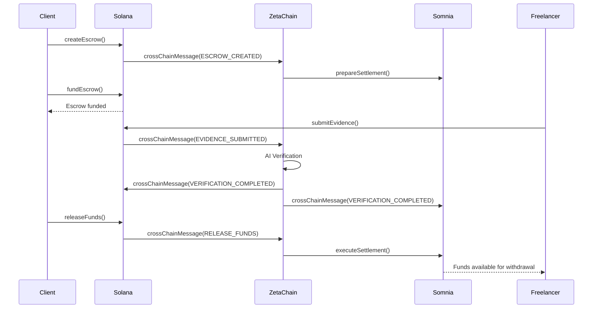

# Smart Contract API

## Overview

AetherLock operates across multiple blockchains with specialized smart contracts for each network. This documentation covers the public interfaces, account structures, and integration patterns for all deployed contracts.

## Implementation Status

> **Current Deployment**: DEVNET/TESTNET ONLY - Mainnet deployment pending

| Network | Status | Notes |
|---------|--------|-------|
| Solana | ✅ DEVNET | Core escrow functionality implemented |
| ZetaChain | ⚠️ TESTNET ONLY | Cross-chain messaging available on testnet |
| Somnia | ⚠️ TESTNET ONLY | Settlement layer on testnet |

## Contract Addresses

### Mainnet
> **Status**: NOT YET DEPLOYED - Mainnet contracts pending production deployment

- **Solana Program**: NOT YET DEPLOYED
- **ZetaChain Universal App**: NOT YET DEPLOYED
- **Somnia Settlement**: NOT YET DEPLOYED

### Testnet (ACTIVE)
- **Solana Devnet**: `AEtherLockDevnet1111111111111111111111111`
- **ZetaChain Athens**: `0x742d35Cc6634C0532925a3b8D4C9db96DfbB8E25`
- **Somnia Testnet**: `0x1234567890123456789012345678901234567891`

## Solana Anchor Program

### Program Structure

```rust
use anchor_lang::prelude::*;

declare_id!("AEtherLockProgram1111111111111111111111111");

#[program]
pub mod aetherlock {
    use super::*;
    
    // Program instructions documented below
}
```

### Account Structures

#### Escrow Account

```rust
#[account]
pub struct Escrow {
    /// Unique identifier for the escrow
    pub escrow_id: [u8; 32],
    /// Client's wallet address
    pub client: Pubkey,
    /// Freelancer's wallet address
    pub freelancer: Pubkey,
    /// Escrow amount in lamports
    pub amount: u64,
    /// Current status of the escrow
    pub status: EscrowStatus,
    /// IPFS hash of task requirements
    pub requirements_hash: String,
    /// IPFS hash of submitted evidence
    pub evidence_hash: Option<String>,
    /// AI verification result
    pub verification_result: Option<VerificationResult>,
    /// Deadline for task completion
    pub deadline: i64,
    /// Timestamp when escrow was created
    pub created_at: i64,
    /// Bump seed for PDA derivation
    pub bump: u8,
}

impl Escrow {
    pub const LEN: usize = 8 + // discriminator
        32 + // escrow_id
        32 + // client
        32 + // freelancer
        8 + // amount
        1 + // status
        4 + 64 + // requirements_hash (String)
        1 + 4 + 64 + // evidence_hash (Option<String>)
        1 + VerificationResult::LEN + // verification_result
        8 + // deadline
        8 + // created_at
        1; // bump
}
```

#### Escrow Status

```rust
#[derive(AnchorSerialize, AnchorDeserialize, Clone, PartialEq, Eq)]
pub enum EscrowStatus {
    Created,
    Funded,
    EvidenceSubmitted,
    Verified,
    Released,
    Disputed,
    Cancelled,
}
```

#### Verification Result

```rust
#[derive(AnchorSerialize, AnchorDeserialize, Clone)]
pub struct VerificationResult {
    /// AI confidence score (0-100)
    pub confidence: u8,
    /// Verification decision
    pub decision: VerificationDecision,
    /// AI reasoning text
    pub reasoning: String,
    /// Ed25519 signature from AI service
    pub ai_signature: [u8; 64],
    /// Timestamp of verification
    pub verified_at: i64,
}

impl VerificationResult {
    pub const LEN: usize = 1 + // confidence
        1 + // decision
        4 + 256 + // reasoning (String)
        64 + // ai_signature
        8; // verified_at
}

#[derive(AnchorSerialize, AnchorDeserialize, Clone, PartialEq, Eq)]
pub enum VerificationDecision {
    Approved,
    Rejected,
    RequiresReview,
}
```

### Program Instructions

#### create_escrow

Creates a new escrow contract between client and freelancer.

```rust
pub fn create_escrow(
    ctx: Context<CreateEscrow>,
    escrow_id: [u8; 32],
    freelancer: Pubkey,
    amount: u64,
    requirements_hash: String,
    deadline: i64,
) -> Result<()>
```

**Accounts:**
```rust
#[derive(Accounts)]
#[instruction(escrow_id: [u8; 32])]
pub struct CreateEscrow<'info> {
    #[account(
        init,
        payer = client,
        space = Escrow::LEN,
        seeds = [b"escrow", escrow_id.as_ref()],
        bump
    )]
    pub escrow: Account<'info, Escrow>,
    
    #[account(mut)]
    pub client: Signer<'info>,
    
    pub system_program: Program<'info, System>,
}
```

**Example Usage:**
```typescript
import { Program, AnchorProvider, web3 } from '@coral-xyz/anchor';
import { AetherLock } from './types/aetherlock';

const program = new Program<AetherLock>(idl, programId, provider);

const escrowId = web3.Keypair.generate().publicKey.toBytes();
const [escrowPda] = web3.PublicKey.findProgramAddressSync(
  [Buffer.from("escrow"), Buffer.from(escrowId)],
  program.programId
);

await program.methods
  .createEscrow(
    Array.from(escrowId),
    freelancerPublicKey,
    new BN(1000000000), // 1 SOL in lamports
    "QmRequirementsHash...",
    new BN(Date.now() + 7 * 24 * 60 * 60 * 1000) // 7 days from now
  )
  .accounts({
    escrow: escrowPda,
    client: clientKeypair.publicKey,
    systemProgram: web3.SystemProgram.programId,
  })
  .signers([clientKeypair])
  .rpc();
```

#### fund_escrow

Transfers funds from client to escrow account.

```rust
pub fn fund_escrow(ctx: Context<FundEscrow>) -> Result<()>
```

**Accounts:**
```rust
#[derive(Accounts)]
pub struct FundEscrow<'info> {
    #[account(
        mut,
        constraint = escrow.client == client.key(),
        constraint = escrow.status == EscrowStatus::Created
    )]
    pub escrow: Account<'info, Escrow>,
    
    #[account(mut)]
    pub client: Signer<'info>,
    
    /// CHECK: This is the escrow's token account
    #[account(mut)]
    pub escrow_vault: AccountInfo<'info>,
    
    pub system_program: Program<'info, System>,
}
```

**Example Usage:**
```typescript
await program.methods
  .fundEscrow()
  .accounts({
    escrow: escrowPda,
    client: clientKeypair.publicKey,
    escrowVault: escrowVaultPda,
    systemProgram: web3.SystemProgram.programId,
  })
  .signers([clientKeypair])
  .rpc();
```

#### submit_evidence

Allows freelancer to submit evidence of task completion.

```rust
pub fn submit_evidence(
    ctx: Context<SubmitEvidence>,
    evidence_hash: String,
) -> Result<()>
```

**Accounts:**
```rust
#[derive(Accounts)]
pub struct SubmitEvidence<'info> {
    #[account(
        mut,
        constraint = escrow.freelancer == freelancer.key(),
        constraint = escrow.status == EscrowStatus::Funded
    )]
    pub escrow: Account<'info, Escrow>,
    
    pub freelancer: Signer<'info>,
}
```

**Example Usage:**
```typescript
await program.methods
  .submitEvidence("QmEvidenceHash...")
  .accounts({
    escrow: escrowPda,
    freelancer: freelancerKeypair.publicKey,
  })
  .signers([freelancerKeypair])
  .rpc();
```

#### verify_completion

Updates escrow with AI verification results.

```rust
pub fn verify_completion(
    ctx: Context<VerifyCompletion>,
    confidence: u8,
    decision: VerificationDecision,
    reasoning: String,
    ai_signature: [u8; 64],
) -> Result<()>
```

**Accounts:**
```rust
#[derive(Accounts)]
pub struct VerifyCompletion<'info> {
    #[account(
        mut,
        constraint = escrow.status == EscrowStatus::EvidenceSubmitted
    )]
    pub escrow: Account<'info, Escrow>,
    
    /// CHECK: AI oracle authority
    pub ai_authority: Signer<'info>,
}
```

**Example Usage:**
```typescript
await program.methods
  .verifyCompletion(
    94, // confidence score
    { approved: {} }, // decision
    "All requirements met successfully",
    Array.from(aiSignature)
  )
  .accounts({
    escrow: escrowPda,
    aiAuthority: aiAuthorityKeypair.publicKey,
  })
  .signers([aiAuthorityKeypair])
  .rpc();
```

#### release_funds

Releases escrowed funds to freelancer upon successful verification.

```rust
pub fn release_funds(ctx: Context<ReleaseFunds>) -> Result<()>
```

**Accounts:**
```rust
#[derive(Accounts)]
pub struct ReleaseFunds<'info> {
    #[account(
        mut,
        constraint = escrow.status == EscrowStatus::Verified,
        close = client
    )]
    pub escrow: Account<'info, Escrow>,
    
    #[account(mut)]
    pub client: Signer<'info>,
    
    /// CHECK: Freelancer's account to receive funds
    #[account(mut)]
    pub freelancer: AccountInfo<'info>,
    
    /// CHECK: Treasury account for protocol fees
    #[account(mut)]
    pub treasury: AccountInfo<'info>,
    
    /// CHECK: Escrow vault holding the funds
    #[account(mut)]
    pub escrow_vault: AccountInfo<'info>,
    
    pub system_program: Program<'info, System>,
}
```

#### initiate_dispute

Allows client to dispute AI verification results (NOT YET IMPLEMENTED - Planned for production).

```rust
// PLANNED - Not yet implemented
pub fn initiate_dispute(
    ctx: Context<InitiateDispute>,
    reason: String,
) -> Result<()>
```

### Events

The program emits events for important state changes:

```rust
#[event]
pub struct EscrowCreated {
    pub escrow_id: [u8; 32],
    pub client: Pubkey,
    pub freelancer: Pubkey,
    pub amount: u64,
    pub deadline: i64,
}

#[event]
pub struct EscrowFunded {
    pub escrow_id: [u8; 32],
    pub amount: u64,
    pub funded_at: i64,
}

#[event]
pub struct EvidenceSubmitted {
    pub escrow_id: [u8; 32],
    pub evidence_hash: String,
    pub submitted_at: i64,
}

#[event]
pub struct VerificationCompleted {
    pub escrow_id: [u8; 32],
    pub decision: VerificationDecision,
    pub confidence: u8,
    pub verified_at: i64,
}

#[event]
pub struct FundsReleased {
    pub escrow_id: [u8; 32],
    pub freelancer: Pubkey,
    pub amount: u64,
    pub protocol_fee: u64,
    pub released_at: i64,
}

#[event]
pub struct DisputeInitiated {
    pub escrow_id: [u8; 32],
    pub reason: String,
    pub initiated_at: i64,
}
```

## ZetaChain Universal App

> **Implementation Status**: TESTNET ONLY - Cross-chain functionality available on ZetaChain Athens testnet. Mainnet deployment pending.

### Contract Interface

```solidity
// SPDX-License-Identifier: MIT
pragma solidity ^0.8.19;

import "@zetachain/protocol-contracts/contracts/zevm/SystemContract.sol";
import "@zetachain/protocol-contracts/contracts/zevm/interfaces/zContract.sol";

contract AetherLockUniversalApp is zContract {
    SystemContract public systemContract;
    
    struct CrossChainEscrow {
        bytes32 escrowId;
        address client;
        address freelancer;
        uint256 amount;
        uint256 sourceChainId;
        uint256 destinationChainId;
        EscrowStatus status;
        bytes32 requirementsHash;
        bytes32 evidenceHash;
        VerificationResult verification;
        uint256 deadline;
        uint256 createdAt;
    }
    
    enum EscrowStatus {
        Created,
        Funded,
        EvidenceSubmitted,
        Verified,
        Released,
        Disputed,
        Cancelled
    }
    
    struct VerificationResult {
        uint8 confidence;
        VerificationDecision decision;
        string reasoning;
        bytes aiSignature;
        uint256 verifiedAt;
    }
    
    enum VerificationDecision {
        Approved,
        Rejected,
        RequiresReview
    }
    
    mapping(bytes32 => CrossChainEscrow) public escrows;
    mapping(address => bytes32[]) public userEscrows;
    
    event CrossChainEscrowCreated(
        bytes32 indexed escrowId,
        address indexed client,
        address indexed freelancer,
        uint256 amount,
        uint256 sourceChainId,
        uint256 destinationChainId
    );
    
    event CrossChainMessage(
        bytes32 indexed escrowId,
        uint256 indexed chainId,
        bytes message
    );
    
    constructor(address systemContractAddress) {
        systemContract = SystemContract(systemContractAddress);
    }
    
    function onCall(
        MessageContext calldata context,
        address zrc20,
        uint256 amount,
        bytes calldata message
    ) external override {
        // Handle incoming cross-chain messages
        _processIncomingMessage(context, zrc20, amount, message);
    }
    
    function onRevert(RevertContext calldata revertContext) external override {
        // Handle failed cross-chain transactions
        // NOTE: Full revert handling not yet implemented
        _handleRevert(revertContext);
    }
    
    function createCrossChainEscrow(
        bytes32 escrowId,
        address freelancer,
        uint256 amount,
        uint256 destinationChainId,
        bytes32 requirementsHash,
        uint256 deadline
    ) external payable {
        require(escrows[escrowId].escrowId == bytes32(0), "Escrow already exists");
        
        CrossChainEscrow memory newEscrow = CrossChainEscrow({
            escrowId: escrowId,
            client: msg.sender,
            freelancer: freelancer,
            amount: amount,
            sourceChainId: block.chainid,
            destinationChainId: destinationChainId,
            status: EscrowStatus.Created,
            requirementsHash: requirementsHash,
            evidenceHash: bytes32(0),
            verification: VerificationResult(0, VerificationDecision.RequiresReview, "", "", 0),
            deadline: deadline,
            createdAt: block.timestamp
        });
        
        escrows[escrowId] = newEscrow;
        userEscrows[msg.sender].push(escrowId);
        userEscrows[freelancer].push(escrowId);
        
        emit CrossChainEscrowCreated(
            escrowId,
            msg.sender,
            freelancer,
            amount,
            block.chainid,
            destinationChainId
        );
        
        // Send message to destination chain
        _sendCrossChainMessage(destinationChainId, escrowId, "ESCROW_CREATED");
    }
    
    function submitCrossChainEvidence(
        bytes32 escrowId,
        bytes32 evidenceHash
    ) external {
        CrossChainEscrow storage escrow = escrows[escrowId];
        require(escrow.freelancer == msg.sender, "Only freelancer can submit evidence");
        require(escrow.status == EscrowStatus.Funded, "Escrow must be funded");
        
        escrow.evidenceHash = evidenceHash;
        escrow.status = EscrowStatus.EvidenceSubmitted;
        
        // Notify source chain about evidence submission
        _sendCrossChainMessage(escrow.sourceChainId, escrowId, "EVIDENCE_SUBMITTED");
    }
    
    function verifyCrossChainCompletion(
        bytes32 escrowId,
        uint8 confidence,
        VerificationDecision decision,
        string memory reasoning,
        bytes memory aiSignature
    ) external {
        // Only AI oracle can call this
        require(_isAuthorizedOracle(msg.sender), "Unauthorized oracle");
        
        CrossChainEscrow storage escrow = escrows[escrowId];
        require(escrow.status == EscrowStatus.EvidenceSubmitted, "Invalid status");
        
        escrow.verification = VerificationResult({
            confidence: confidence,
            decision: decision,
            reasoning: reasoning,
            aiSignature: aiSignature,
            verifiedAt: block.timestamp
        });
        
        escrow.status = EscrowStatus.Verified;
        
        // Notify both chains about verification
        _sendCrossChainMessage(escrow.sourceChainId, escrowId, "VERIFICATION_COMPLETED");
        _sendCrossChainMessage(escrow.destinationChainId, escrowId, "VERIFICATION_COMPLETED");
    }
    
    function releaseCrossChainFunds(bytes32 escrowId) external {
        CrossChainEscrow storage escrow = escrows[escrowId];
        require(escrow.client == msg.sender, "Only client can release funds");
        require(escrow.status == EscrowStatus.Verified, "Escrow not verified");
        require(escrow.verification.decision == VerificationDecision.Approved, "Not approved");
        
        escrow.status = EscrowStatus.Released;
        
        // Calculate fees (10% protocol fee)
        uint256 protocolFee = (escrow.amount * 10) / 100;
        uint256 freelancerAmount = escrow.amount - protocolFee;
        
        // Send cross-chain message to release funds on destination chain
        bytes memory releaseMessage = abi.encode(
            "RELEASE_FUNDS",
            escrow.freelancer,
            freelancerAmount,
            protocolFee
        );
        
        _sendCrossChainMessage(escrow.destinationChainId, escrowId, releaseMessage);
    }
    
    function _processIncomingMessage(
        MessageContext calldata context,
        address zrc20,
        uint256 amount,
        bytes calldata message
    ) internal {
        // Decode and process cross-chain messages
        (string memory messageType, bytes memory data) = abi.decode(message, (string, bytes));
        
        if (keccak256(bytes(messageType)) == keccak256("ESCROW_CREATED")) {
            _handleEscrowCreated(data);
        } else if (keccak256(bytes(messageType)) == keccak256("EVIDENCE_SUBMITTED")) {
            _handleEvidenceSubmitted(data);
        } else if (keccak256(bytes(messageType)) == keccak256("VERIFICATION_COMPLETED")) {
            _handleVerificationCompleted(data);
        } else if (keccak256(bytes(messageType)) == keccak256("RELEASE_FUNDS")) {
            _handleFundsRelease(data);
        }
    }
    
    function _sendCrossChainMessage(
        uint256 chainId,
        bytes32 escrowId,
        bytes memory message
    ) internal {
        // Implementation depends on ZetaChain's cross-chain messaging
        emit CrossChainMessage(escrowId, chainId, message);
    }
    
    function _isAuthorizedOracle(address oracle) internal view returns (bool) {
        // Check if the address is an authorized AI oracle
        return oracle == 0x742d35Cc6634C0532925a3b8D4C9db96DfbB8E24; // Example oracle address
    }
}
```

### Integration Example

```typescript
import { ethers } from 'ethers';
import { getAddress } from '@zetachain/protocol-contracts';

const provider = new ethers.JsonRpcProvider('https://zetachain-evm.blockpi.network/v1/rpc/public');
const contract = new ethers.Contract(contractAddress, abi, provider);

// Create cross-chain escrow
const tx = await contract.createCrossChainEscrow(
  escrowId,
  freelancerAddress,
  ethers.parseEther('1.0'),
  destinationChainId,
  requirementsHash,
  deadline,
  { value: ethers.parseEther('1.0') }
);

await tx.wait();
```

## Somnia Settlement Contract

> **Implementation Status**: TESTNET ONLY - Settlement functionality available on Somnia testnet. Mainnet deployment pending.

### Contract Interface

```solidity
// SPDX-License-Identifier: MIT
pragma solidity ^0.8.19;

import "@openzeppelin/contracts/security/ReentrancyGuard.sol";
import "@openzeppelin/contracts/access/Ownable.sol";

contract AetherLockSomnia is ReentrancyGuard, Ownable {
    struct Settlement {
        bytes32 escrowId;
        address freelancer;
        uint256 amount;
        uint256 protocolFee;
        bool settled;
        uint256 settledAt;
    }
    
    mapping(bytes32 => Settlement) public settlements;
    mapping(address => uint256) public balances;
    
    address public treasury;
    uint256 public constant PROTOCOL_FEE_RATE = 10; // 10%
    
    event SettlementCreated(
        bytes32 indexed escrowId,
        address indexed freelancer,
        uint256 amount,
        uint256 protocolFee
    );
    
    event SettlementExecuted(
        bytes32 indexed escrowId,
        address indexed freelancer,
        uint256 amount
    );
    
    event FundsWithdrawn(
        address indexed user,
        uint256 amount
    );
    
    constructor(address _treasury) {
        treasury = _treasury;
    }
    
    function createSettlement(
        bytes32 escrowId,
        address freelancer,
        uint256 amount
    ) external payable onlyOwner {
        require(settlements[escrowId].escrowId == bytes32(0), "Settlement exists");
        require(msg.value >= amount, "Insufficient funds");
        
        uint256 protocolFee = (amount * PROTOCOL_FEE_RATE) / 100;
        uint256 freelancerAmount = amount - protocolFee;
        
        settlements[escrowId] = Settlement({
            escrowId: escrowId,
            freelancer: freelancer,
            amount: freelancerAmount,
            protocolFee: protocolFee,
            settled: false,
            settledAt: 0
        });
        
        emit SettlementCreated(escrowId, freelancer, freelancerAmount, protocolFee);
    }
    
    function executeSettlement(bytes32 escrowId) external nonReentrant {
        Settlement storage settlement = settlements[escrowId];
        require(settlement.escrowId != bytes32(0), "Settlement not found");
        require(!settlement.settled, "Already settled");
        
        settlement.settled = true;
        settlement.settledAt = block.timestamp;
        
        // Add to freelancer's balance
        balances[settlement.freelancer] += settlement.amount;
        
        // Add protocol fee to treasury balance
        balances[treasury] += settlement.protocolFee;
        
        emit SettlementExecuted(escrowId, settlement.freelancer, settlement.amount);
    }
    
    function withdraw() external nonReentrant {
        uint256 amount = balances[msg.sender];
        require(amount > 0, "No balance to withdraw");
        
        balances[msg.sender] = 0;
        
        (bool success, ) = payable(msg.sender).call{value: amount}("");
        require(success, "Transfer failed");
        
        emit FundsWithdrawn(msg.sender, amount);
    }
    
    function getSettlement(bytes32 escrowId) external view returns (Settlement memory) {
        return settlements[escrowId];
    }
    
    function getUserBalance(address user) external view returns (uint256) {
        return balances[user];
    }
}
```

### Integration Example

```typescript
import { ethers } from 'ethers';

const provider = new ethers.JsonRpcProvider('https://somnia-testnet.rpc.url');
const contract = new ethers.Contract(contractAddress, abi, signer);

// Execute settlement
const tx = await contract.executeSettlement(escrowId);
await tx.wait();

// Withdraw funds
const withdrawTx = await contract.withdraw();
await withdrawTx.wait();
```

## Error Codes

### Solana Program Errors

```rust
#[error_code]
pub enum ErrorCode {
    #[msg("Escrow already exists")]
    EscrowAlreadyExists = 6000,
    
    #[msg("Invalid escrow status")]
    InvalidEscrowStatus,
    
    #[msg("Unauthorized access")]
    Unauthorized,
    
    #[msg("Deadline exceeded")]
    DeadlineExceeded,
    
    #[msg("Insufficient funds")]
    InsufficientFunds,
    
    #[msg("Invalid AI signature")]
    InvalidAISignature,
    
    #[msg("Evidence already submitted")]
    EvidenceAlreadySubmitted,
    
    #[msg("Verification failed")]
    VerificationFailed,
}
```

### EVM Contract Errors

```solidity
error EscrowAlreadyExists();
error EscrowNotFound();
error InvalidStatus();
error Unauthorized();
error DeadlineExceeded();
error InsufficientFunds();
error InvalidSignature();
error SettlementFailed();
error WithdrawalFailed();
```

## Integration Patterns

### Multi-Chain Escrow Flow



### Event Listening

```typescript
// Listen to Solana program events
const connection = new Connection('https://api.mainnet-beta.solana.com');
const programId = new PublicKey('AEtherLockProgram1111111111111111111111111');

connection.onLogs(programId, (logs) => {
  // Parse and handle program logs
  console.log('Program logs:', logs);
});

// Listen to EVM contract events
const contract = new ethers.Contract(contractAddress, abi, provider);

contract.on('CrossChainEscrowCreated', (escrowId, client, freelancer, amount) => {
  console.log('New cross-chain escrow:', { escrowId, client, freelancer, amount });
});

contract.on('SettlementExecuted', (escrowId, freelancer, amount) => {
  console.log('Settlement executed:', { escrowId, freelancer, amount });
});
```

## Testing

### Solana Program Testing

```typescript
import { Program, AnchorProvider, setProvider } from '@coral-xyz/anchor';
import { Keypair, PublicKey } from '@solana/web3.js';

describe('AetherLock Solana Program', () => {
  const provider = AnchorProvider.env();
  setProvider(provider);
  
  const program = anchor.workspace.Aetherlock as Program<Aetherlock>;
  
  it('Creates an escrow', async () => {
    const escrowId = Keypair.generate().publicKey.toBytes();
    const [escrowPda] = PublicKey.findProgramAddressSync(
      [Buffer.from('escrow'), Buffer.from(escrowId)],
      program.programId
    );
    
    await program.methods
      .createEscrow(
        Array.from(escrowId),
        freelancerKeypair.publicKey,
        new BN(1000000000),
        'QmRequirementsHash',
        new BN(Date.now() + 86400000)
      )
      .accounts({
        escrow: escrowPda,
        client: clientKeypair.publicKey,
        systemProgram: SystemProgram.programId,
      })
      .signers([clientKeypair])
      .rpc();
    
    const escrowAccount = await program.account.escrow.fetch(escrowPda);
    expect(escrowAccount.status).to.deep.equal({ created: {} });
  });
});
```

### EVM Contract Testing

```typescript
import { ethers } from 'hardhat';
import { expect } from 'chai';

describe('AetherLock Universal App', () => {
  let contract: any;
  let owner: any;
  let client: any;
  let freelancer: any;
  
  beforeEach(async () => {
    [owner, client, freelancer] = await ethers.getSigners();
    
    const AetherLockUniversalApp = await ethers.getContractFactory('AetherLockUniversalApp');
    contract = await AetherLockUniversalApp.deploy(systemContractAddress);
  });
  
  it('Creates a cross-chain escrow', async () => {
    const escrowId = ethers.randomBytes(32);
    const amount = ethers.parseEther('1.0');
    
    await expect(
      contract.connect(client).createCrossChainEscrow(
        escrowId,
        freelancer.address,
        amount,
        1, // destination chain ID
        ethers.randomBytes(32), // requirements hash
        Math.floor(Date.now() / 1000) + 86400, // deadline
        { value: amount }
      )
    ).to.emit(contract, 'CrossChainEscrowCreated');
    
    const escrow = await contract.escrows(escrowId);
    expect(escrow.client).to.equal(client.address);
    expect(escrow.freelancer).to.equal(freelancer.address);
    expect(escrow.amount).to.equal(amount);
  });
});
```

## AI Verification Integration

> **Implementation Status**: PARTIALLY IMPLEMENTED - Smart contracts currently receive AI verification results directly from Arcanum.ai. Chainlink oracle integration is planned for production.

Smart contracts receive AI verification results from Arcanum.ai. The verification result structure includes:

```rust
pub struct VerificationResult {
    /// AI confidence score (0-100)
    pub confidence: u8,
    /// Verification decision
    pub decision: VerificationDecision,
    /// AI reasoning text
    pub reasoning: String,
    /// Ed25519 signature from Arcanum.ai
    pub ai_signature: [u8; 64],
    /// Timestamp of verification
    pub verified_at: i64,
    /// AI provider used (arcanum-ai, openai, claude, gemini)
    pub provider: String,
}
```

### Arcanum.ai Signature Verification

> **Implementation Status**: NOT YET IMPLEMENTED - Ed25519 signature verification for AI results is planned for production.

The smart contract will verify that AI results are authentically signed by Arcanum.ai (PLANNED):

```rust
// PLANNED - Not yet implemented
pub fn verify_ai_signature(
    result: &VerificationResult,
    ai_public_key: &Pubkey,
) -> Result<bool> {
    let message = format!(
        "{}:{}:{}:{}",
        result.confidence,
        result.decision,
        result.reasoning,
        result.verified_at
    );
    
    let signature = Signature::from(result.ai_signature);
    signature.verify(ai_public_key.as_ref(), message.as_bytes())
}
```

## Support

For smart contract integration support:
- **Developer Discord**: [https://discord.gg/aetherlock-dev](https://discord.gg/aetherlock-dev)
- **Technical Documentation**: [https://docs.aetherlock.io/contracts](https://docs.aetherlock.io/contracts)
- **Contract Verification**: All contracts are verified on their respective block explorers
- **Audit Reports**: Available at [https://docs.aetherlock.io/security/audits](https://docs.aetherlock.io/security/audits)
- **Arcanum.ai Integration**: [https://docs.arcanum.ai/aetherlock](https://docs.arcanum.ai/aetherlock)
