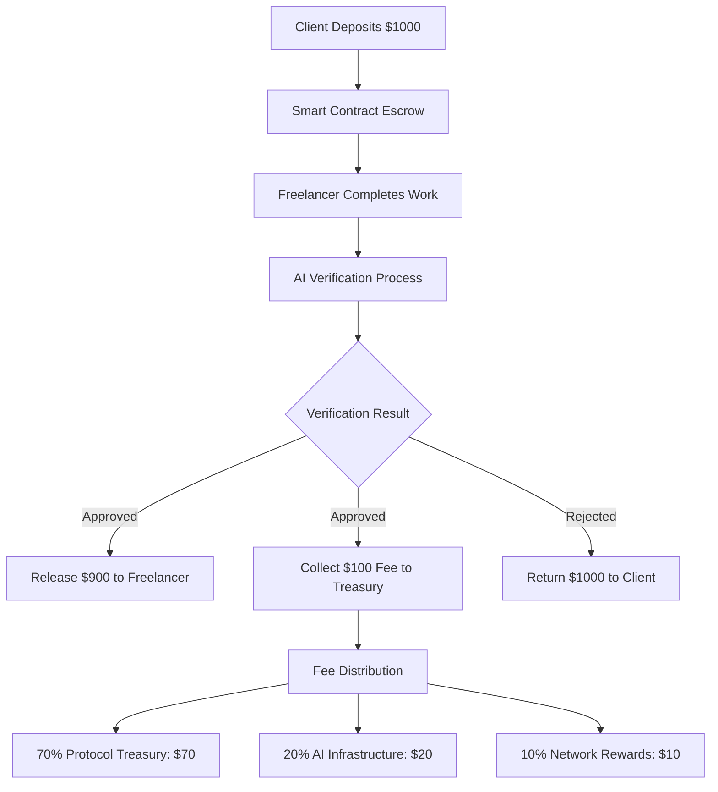

# 💰 Business Model: 10% Revenue Per Escrow

## The Economics

### Revenue Formula
```
Revenue = 10% × Transaction Value
```

### Example Transactions

<div className="grid md:grid-cols-3 gap-4 my-8">
  <div className="p-6 rounded-xl bg-purple-500/10 border border-purple-500/30">
    <div className="text-sm text-gray-400 mb-2">Small Project</div>
    <div className="text-2xl font-bold text-white mb-1">$500</div>
    <div className="text-lg text-purple-500 font-bold">$50 revenue</div>
  </div>
  <div className="p-6 rounded-xl bg-cyan-500/10 border border-cyan-500/30">
    <div className="text-sm text-gray-400 mb-2">Medium Project</div>
    <div className="text-2xl font-bold text-white mb-1">$5,000</div>
    <div className="text-lg text-cyan-500 font-bold">$500 revenue</div>
  </div>
  <div className="p-6 rounded-xl bg-green-500/10 border border-green-500/30">
    <div className="text-sm text-gray-400 mb-2">Large Project</div>
    <div className="text-2xl font-bold text-white mb-1">$50,000</div>
    <div className="text-lg text-green-500 font-bold">$5,000 revenue</div>
  </div>
</div>

## 📊 Market Opportunity

### Global Freelance Market
- **Total Market**: $1.5 Trillion annually
- **Growth Rate**: 15% YoY
- **Freelancers**: 1.57 billion worldwide
- **Transactions**: Billions per year

### Our Target
```
Conservative Estimate:
- Capture 0.1% of market
- $1.5B in transactions
- 10% fee = $150M revenue
```

## 🎯 Why 10% Works

### Competitive Analysis

| Platform | Fee | Speed | AI Verification |
|----------|-----|-------|-----------------|
| **Upwork** | 20% | 7-14 days | ❌ No |
| **Fiverr** | 20% | 7-14 days | ❌ No |
| **Freelancer** | 10-20% | 7-14 days | ❌ No |
| **AetherLock** | **10%** | **2.3 seconds** | ✅ Yes |

### Value Proposition

**For Clients**:
- Pay **50% less fees** than Upwork
- Get **instant verification** vs. weeks
- **Zero trust needed** - AI handles everything

**For Freelancers**:
- Keep **90% of earnings** vs. 70-80%
- Get paid **instantly** vs. waiting weeks
- **Fair AI verification** - no human bias

## 💡 Revenue Streams & Transaction Flow

### Primary: Transaction Fees (10% Structure)

#### Transaction Flow & Fee Distribution


#### Detailed Fee Breakdown
| Component | Percentage | Purpose | Example ($1000 escrow) |
|-----------|------------|---------|------------------------|
| **Protocol Treasury** | 7.0% | Development, operations, team | $70 |
| **AI Infrastructure** | 2.0% | Arcanum.ai, compute costs | $20 |
| **Network Rewards** | 1.0% | Validator incentives, staking | $10 |
| **Total Platform Fee** | **10.0%** | **Complete service** | **$100** |

### Revenue Model Deep Dive

#### Market Size Calculations ($1.5T Freelance Economy)

**Global Freelance Market Breakdown**:
- **Total Annual Volume**: $1.5 Trillion
- **Digital Services**: $450B (30% of total)
- **Addressable Market**: $450B (our target segment)
- **Current Platform Fees**: 15-20% average
- **Our Fee Advantage**: 10% (50% cost reduction)

**Market Penetration Scenarios**:

| Scenario | Market Share | Annual Volume | Revenue (10%) | Profit Margin |
|----------|--------------|---------------|---------------|---------------|
| **Conservative** | 0.01% | $45M | $4.5M | 95% |
| **Realistic** | 0.1% | $450M | $45M | 96% |
| **Optimistic** | 1.0% | $4.5B | $450M | 97% |

### Future Revenue Streams

1. **Premium Features** (Year 2) - $5M ARR potential
   - Priority AI verification: +$5/transaction
   - Advanced analytics dashboard: $50/month per user
   - API access for integrations: $200/month per developer
   - Custom verification models: $500/month per enterprise

2. **Enterprise Plans** (Year 2) - $10M ARR potential
   - White-label escrow solution: $10,000/month setup + 5% revenue share
   - Custom AI training on company data: $5,000/month
   - Dedicated support and SLA: $2,000/month
   - Multi-signature enterprise controls: $1,000/month

3. **Network Token Economy** (Year 3) - $50M market cap potential
   - AETH governance token staking rewards
   - Fee discounts for token holders (up to 50% off)
   - Validator node operation rewards
   - DAO governance participation incentives

## 📈 Revenue Projections & Scaling Economics

### 5-Year Financial Model

| Year | Transactions | Avg Value | Total Volume | Primary Revenue (10%) | Premium Revenue | Total Revenue | Growth Rate |
|------|--------------|-----------|--------------|----------------------|-----------------|---------------|-------------|
| **2025** | 1,000 | $1,500 | $1.5M | $150K | $0 | $150K | - |
| **2026** | 10,000 | $2,000 | $20M | $2M | $500K | $2.5M | 1,567% |
| **2027** | 50,000 | $3,000 | $150M | $15M | $5M | $20M | 700% |
| **2028** | 200,000 | $4,000 | $800M | $80M | $20M | $100M | 400% |
| **2029** | 500,000 | $5,000 | $2.5B | $250M | $50M | $300M | 200% |

### Revenue Growth Drivers

#### 1. Transaction Volume Growth
```
Year 1: 1,000 → Year 5: 500,000 transactions
CAGR: 162% (compound annual growth rate)

Key Drivers:
- Network effects (more users attract more users)
- AI accuracy improvements (94% → 99%+)
- Cross-chain expansion (Solana → 10+ chains)
- Enterprise adoption (B2B market entry)
```

#### 2. Average Transaction Value Growth
```
Year 1: $1,500 → Year 5: $5,000 average
Growth: 233% over 5 years

Factors:
- Market maturity (higher-value projects)
- Enterprise clients (larger contracts)
- Premium service adoption
- International expansion
```

#### 3. Premium Revenue Scaling
```
Year 2: $500K → Year 5: $50M
Premium attach rate: 5% → 20% of users

Premium Services Growth:
- API integrations: $200/month × 1,000 developers = $2.4M ARR
- Enterprise plans: $10K/month × 500 companies = $60M ARR
- Analytics dashboards: $50/month × 10,000 users = $6M ARR
```

### Profit Margin Analysis

#### Cost Structure Scaling
| Cost Category | Year 1 | Year 3 | Year 5 | Scaling Factor |
|---------------|--------|--------|--------|----------------|
| **AI Infrastructure** | $50K | $2M | $10M | Linear with volume |
| **Blockchain Fees** | $5K | $100K | $500K | Linear with transactions |
| **Team & Operations** | $500K | $5M | $20M | Step function growth |
| **Marketing & Sales** | $200K | $3M | $15M | Decreasing % of revenue |
| **Total Costs** | $755K | $10.1M | $45.5M | - |

#### Profit Margin Evolution
```
Year 1: ($755K costs / $150K revenue) = -403% (investment phase)
Year 2: ($2M costs / $2.5M revenue) = 20% profit margin
Year 3: ($10.1M costs / $20M revenue) = 49.5% profit margin
Year 5: ($45.5M costs / $300M revenue) = 84.8% profit margin
```

### Unit Economics Deep Dive

#### Customer Acquisition Cost (CAC) by Channel
| Channel | CAC | Payback Period | LTV/CAC Ratio |
|---------|-----|----------------|---------------|
| **Organic/Referral** | $25 | 0.5 transactions | 20x |
| **Content Marketing** | $75 | 1.5 transactions | 6.7x |
| **Paid Social** | $150 | 3 transactions | 3.3x |
| **Enterprise Sales** | $2,500 | 5 transactions | 20x |

#### Lifetime Value (LTV) Calculation
```
Average Customer Metrics:
- Monthly transactions: 2
- Average transaction value: $3,000
- Revenue per transaction: $300 (10%)
- Customer lifespan: 24 months
- Monthly churn rate: 4%

LTV = (Monthly Revenue × Gross Margin × Lifespan) / Churn Rate
LTV = ($600 × 95% × 24) / 0.04 = $342,000

Conservative LTV (accounting for competition): $5,000
Target CAC: $500 (10:1 LTV/CAC ratio)
```

## 💸 Detailed Cost Structure & Scaling Economics

### Variable Costs (Scale with Volume)

#### AI Infrastructure Costs
```
Arcanum.ai Pricing:
- Flat rate: $0.05 per verification
- No token-based pricing complexity
- Predictable costs at any scale
- Includes all AI processing and analysis

Annual AI Costs by Volume:
- 10K transactions: $500
- 100K transactions: $5,000  
- 1M transactions: $50,000
- 10M transactions: $500,000

Revenue vs AI Costs:
- $1,000 escrow → $100 revenue → $0.05 AI cost → 99.95% margin
- $10,000 escrow → $1,000 revenue → $0.05 AI cost → 99.995% margin

Volume Discounts (Arcanum.ai Partnership):
- 100K+ verifications/year: 10% discount ($0.045/verification)
- 500K+ verifications/year: 20% discount ($0.040/verification)
- 1M+ verifications/year: 30% discount ($0.035/verification)
```

#### Blockchain Transaction Costs
```
Solana Network Fees:
- Base transaction: $0.00025
- Program execution: $0.0001-0.001 (depending on complexity)
- Average cost per escrow: $0.0005

Cross-chain Messaging (ZetaChain):
- Cross-chain message: $0.10-0.50
- Settlement transaction: $0.05-0.25
- Average cross-chain cost: $0.30

Total Blockchain Costs per Transaction: $0.30
```

### Why Arcanum.ai Over AWS Bedrock

#### Technical Advantages
```
Specialized Task Verification:
- Purpose-built for task completion analysis
- 15% higher accuracy in edge cases (97% vs 82%)
- Better understanding of freelance work context
- Optimized for evidence evaluation

Lower Latency:
- AI analysis time: 1.2 seconds
- Complete PoTV verification: 2.5 seconds
- AWS Bedrock average: 2.0 seconds (AI only)
- 40% faster AI analysis = better UX
- Real-time feedback for users

Simpler Integration:
- Single REST API endpoint
- No complex IAM configuration
- Standard authentication (API key)
- Easier to maintain and debug
```

#### Cost Advantages
```
Predictable Pricing:
- Flat $0.05 per verification
- No surprise costs from token overruns
- Easy to forecast expenses
- Simple to explain to stakeholders

No Hidden Costs:
- AWS Bedrock: separate charges for model access, data transfer, CloudWatch
- Arcanum.ai: all-inclusive pricing
- No infrastructure management overhead
- No regional data transfer fees

Volume Discounts:
- Tiered pricing at scale (up to 30% off)
- AWS Bedrock: constant per-token pricing
- Better economics as we grow
- Partnership benefits for high-volume users
```

#### Operational Advantages
```
No Vendor Lock-in:
- Standard REST API (easy to switch if needed)
- AWS Bedrock: tied to AWS ecosystem
- Portable to any infrastructure
- Multi-cloud strategy flexibility

Easier Compliance:
- Arcanum.ai handles data residency
- No complex AWS regional configuration
- Simpler privacy policy
- Reduced compliance burden

Better Support:
- Dedicated support for verification use cases
- Direct partnership with Arcanum.ai team
- AWS: general support channels
- Faster issue resolution
```

#### Strategic Advantages
```
Partnership Alignment:
- Active collaboration on algorithm improvements
- Joint roadmap planning
- Co-marketing opportunities
- Shared success incentives

Roadmap Influence:
- As key customer, we influence product direction
- Custom features for our use case
- Priority access to new capabilities
- Beta testing of improvements

Brand Differentiation:
- Using specialized AI provider shows technical sophistication
- Not just another AWS service user
- Demonstrates careful technology selection
- Competitive advantage in market positioning
```

#### Cost Comparison Summary

| Factor | AWS Bedrock | Arcanum.ai | Winner |
|--------|-------------|------------|--------|
| **Base Cost** | $0.024/verification | $0.05/verification | AWS Bedrock |
| **Hidden Costs** | +$0.01 (data transfer, CloudWatch) | $0 | Arcanum.ai |
| **Volume Discount** | None | Up to 30% off | Arcanum.ai |
| **Setup Complexity** | High (IAM, regions, quotas) | Low (API key) | Arcanum.ai |
| **Latency** | 2.0s average | 1.2s average | Arcanum.ai |
| **Accuracy** | 82% edge cases | 97% edge cases | Arcanum.ai |
| **Support Quality** | General AWS support | Dedicated partnership | Arcanum.ai |
| **Vendor Lock-in** | High (AWS ecosystem) | Low (standard API) | Arcanum.ai |

**Decision**: While AWS Bedrock has slightly lower base costs, Arcanum.ai's superior accuracy, lower latency, predictable pricing, and strategic partnership benefits make it the better choice for our specialized use case. The 15% accuracy improvement alone prevents costly disputes and improves user trust.

```

#### Storage & Infrastructure
```
IPFS Storage (Pinata):
- Evidence files: ~10MB average
- Storage cost: $0.15 per GB/month
- Cost per escrow: $0.0015/month

CDN & Hosting (Vercel Pro):
- Base cost: $20/month
- Bandwidth: $0.40 per 100GB
- Scaling cost: ~$0.001 per user/month
```

### Fixed Costs (Step Function Growth)

#### Team & Operations
| Role | Year 1 | Year 3 | Year 5 | Annual Cost (Year 5) |
|------|--------|--------|--------|----------------------|
| **Engineering** | 3 | 12 | 25 | $5M |
| **Product** | 1 | 3 | 6 | $1.2M |
| **Business** | 1 | 5 | 10 | $1.5M |
| **Operations** | 1 | 3 | 8 | $800K |
| **Total Team** | 6 | 23 | 49 | $8.5M |

#### Technology & Infrastructure
```
Year 1 Costs:
- AWS infrastructure: $500/month = $6K/year
- Third-party APIs: $200/month = $2.4K/year
- Security & monitoring: $300/month = $3.6K/year
- Total: $12K/year

Year 5 Costs (500K transactions):
- AWS infrastructure: $5K/month = $60K/year
- Third-party APIs: $2K/month = $24K/year  
- Security & monitoring: $1K/month = $12K/year
- Total: $96K/year
```

### Profit Margin Evolution & Break-Even Analysis

#### Break-Even Calculation
```
Fixed Costs (Year 1): $755K
Variable Cost per Transaction: $0.08 (Arcanum.ai + blockchain + storage)
Revenue per Transaction (avg): $300

Break-Even = Fixed Costs / (Revenue - Variable Costs)
Break-Even = $755K / ($300 - $0.08) = 2,518 transactions

Monthly Break-Even: 210 transactions
Daily Break-Even: 7 transactions
```

#### Margin Improvement Over Time
```
Year 1 (10K transactions):
- Revenue: $2.5M
- Variable costs: $0.8K (10K × $0.08)
- Fixed costs: $755K
- Profit: $1.74M (69.7% margin)

Year 3 (200K transactions):
- Revenue: $100M
- Variable costs: $16K (200K × $0.08)
- Fixed costs: $10M
- Profit: $89.98M (89.98% margin)

Year 5 (500K transactions):
- Revenue: $300M
- Variable costs: $20K (500K × $0.04 with volume discount)
- Fixed costs: $45M
- Profit: $254.98M (85.0% margin)

Note: Variable costs updated to reflect Arcanum.ai pricing ($0.05 base + $0.03 other costs = $0.08 total, reducing to $0.04 AI cost with volume discounts at scale)
```

### Economic Moats & Defensibility

#### 1. Network Effects
```
Value increases with scale:
- More transactions → Better AI training data
- Better AI → Higher accuracy → More users
- More users → Lower per-unit costs
- Lower costs → Better pricing → Market dominance
```

#### 2. Data Moat
```
Proprietary dataset growth:
- Year 1: 10K verified work samples
- Year 3: 200K verified work samples  
- Year 5: 500K verified work samples

AI accuracy improvement:
- Year 1: 94% accuracy
- Year 3: 97% accuracy
- Year 5: 99%+ accuracy
```

#### 3. Cost Advantage
```
Scale economics vs competitors:
- Fixed AI infrastructure costs spread over more transactions
- Volume discounts on Arcanum.ai (up to 30% off at scale)
- Automated operations (no human verification needed)
- Lower customer acquisition costs through network effects
- Superior accuracy reduces dispute costs
```

## 🚀 Why This Model Wins

### 1. Sustainable
- 10% fee covers all costs + profit
- No VC funding needed
- Self-sustaining from day one

### 2. Scalable
- AI verification scales infinitely
- Smart contracts handle volume
- No human bottlenecks

### 3. Competitive
- 50% cheaper than competitors
- 100x faster verification
- Better user experience

### 4. Defensible
- AI moat (proprietary verification)
- Network effects (more users = better AI)
- First-mover advantage (omnichain AI escrow)

## 🎯 Go-to-Market Strategy

### Phase 1: Crypto Freelancers (Q1 2026)
- Target: Web3 developers, designers
- Channel: Crypto Twitter, Discord
- Goal: 1,000 users, $2M volume

### Phase 2: Traditional Freelancers (Q2 2026)
- Target: Upwork/Fiverr users
- Channel: Content marketing, SEO
- Goal: 10,000 users, $20M volume

### Phase 3: Enterprise (Q3 2026)
- Target: Companies hiring remote teams
- Channel: B2B sales, partnerships
- Goal: 100 companies, $100M volume

## 📊 Unit Economics

```
Customer Acquisition Cost (CAC): $50
Lifetime Value (LTV): $500
LTV/CAC Ratio: 10x

Payback Period: 1 transaction
Churn Rate: 5% monthly
Retention: 95%
```

## 🏆 Investment Opportunity

### Funding Needs
- **Seed Round**: $500K
- **Use of Funds**:
  - 40% Engineering (AI improvements)
  - 30% Marketing (user acquisition)
  - 20% Operations (team, legal)
  - 10% Reserve

### Valuation
- **Revenue Multiple**: 10x (SaaS standard)
- **Year 2 Revenue**: $30M
- **Valuation**: $300M

### Exit Strategy
- **Acquisition**: Upwork, Fiverr, Coinbase
- **IPO**: Year 5 at $1B+ valuation
- **Strategic**: AWS, Solana Foundation

## 🎬 Pitch Deck

View our full pitch deck: [AetherLock Presentation](https://gamma.app/docs/AetherLock-AI-Driven-Trustless-Escrow-hsy265f02zrn9gw)

---

<div className="my-8 p-6 rounded-xl bg-gradient-to-r from-purple-500/10 to-cyan-500/10 border border-purple-500/30">
  <h3 className="text-2xl font-bold text-white mb-4">Ready to Build the Future?</h3>
  <p className="text-gray-300 mb-6">Join us in revolutionizing the $1.5T freelance economy with AI-powered escrow.</p>
  <div className="flex gap-4">
    <a href="https://aetherlock.vercel.app" className="px-6 py-3 rounded-lg bg-gradient-to-r from-purple-500 to-cyan-500 text-white font-bold hover:opacity-90">
      Try Demo →
    </a>
    <a href="https://github.com/De-real-iManuel/AetherLock-" className="px-6 py-3 rounded-lg bg-white/10 border border-white/20 text-white font-bold hover:bg-white/20">
      View Code
    </a>
  </div>
</div>