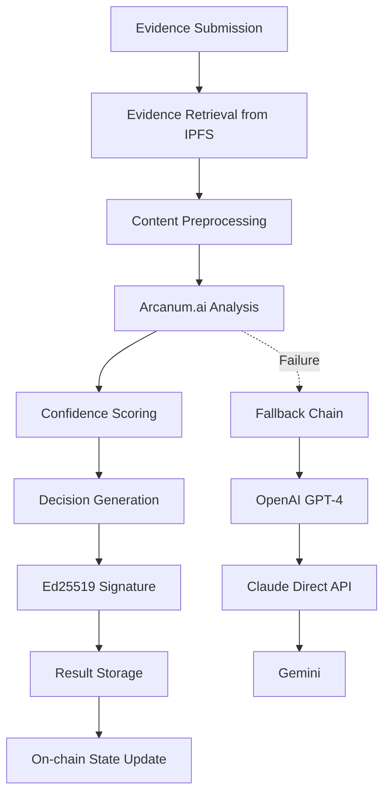

# AI Verification Layer

## Overview

The AI Verification Layer is the core intelligence component of AetherLock's Proof of Task Verification (PoTV) mechanism. It leverages Arcanum.ai's specialized task verification models to analyze task completion evidence and generate confidence-scored verification decisions. This layer ensures objective, consistent, and rapid evaluation of freelancer deliverables across diverse project types.

## Architecture

### AI Verification Pipeline



### Component Responsibilities

| Component | Responsibility | Technology |
|-----------|---------------|------------|
| Evidence Processor | File parsing, content extraction | TypeScript, Sharp, PDF-parse |
| Arcanum Client | AI model invocation, prompt management | Arcanum.ai SDK |
| Confidence Engine | Score calculation, threshold management | Custom algorithms |
| Signature Service | Result authentication, integrity verification | Ed25519, Noble-crypto |
| Fallback Manager | Provider switching, error recovery | Retry logic, Circuit breaker |

## Arcanum.ai Integration

### Configuration and Setup

```typescript
import axios, { AxiosInstance } from 'axios';

interface ArcanumConfig {
  endpoint: string;
  apiKey: string;
  modelId: string;
  maxTokens: number;
  temperature: number;
  timeout: number;
}

class AetherLockAIAgent {
  private arcanum: AxiosInstance;
  private config: ArcanumConfig;
  
  constructor() {
    this.config = {
      endpoint: process.env.ARCANUM_ENDPOINT || 'https://api.arcanum.ai/v1/analyze',
      apiKey: process.env.ARCANUM_API_KEY!,
      modelId: 'arcanum-pro',
      maxTokens: 4000,
      temperature: 0.1, // Low temperature for consistent analysis
      timeout: 30000
    };
    
    this.arcanum = axios.create({
      baseURL: this.config.endpoint,
      headers: {
        'Authorization': `Bearer ${this.config.apiKey}`,
        'Content-Type': 'application/json'
      },
      timeout: this.config.timeout
    });
  }
}
```

### Evidence Analysis Implementation

```typescript
interface VerificationRequest {
  escrowId: string;
  taskDescription: string;
  taskRequirements: string[];
  evidenceHashes: string[];
  deadline: number;
  submittedBy: string;
  taskType: 'development' | 'design' | 'writing' | 'marketing' | 'other';
  budget: number;
}

interface EvidenceFile {
  hash: string;
  type: 'text' | 'image' | 'document' | 'video' | 'url' | 'code';
  content: string | Buffer;
  metadata: {
    filename: string;
    size: number;
    mimeType: string;
    uploadedAt: number;
  };
}

interface VerificationResponse {
  escrowId: string;
  decision: 'approved' | 'rejected' | 'needs_review';
  confidenceScore: number; // 0-100
  reasoning: string;
  analysisHash: string;
  processedAt: number;
  suggestedImprovements?: string[];
  signature: string; // Ed25519 signature
}

class ArcanumVerificationEngine extends AetherLockAIAgent {
  
  async analyzeEvidence(request: VerificationRequest): Promise<VerificationResponse> {
    try {
      // Step 1: Retrieve and preprocess evidence
      const evidenceFiles = await this.retrieveEvidence(request.evidenceHashes);
      const processedEvidence = await this.preprocessEvidence(evidenceFiles);
      
      // Step 2: Build context-aware prompt
      const prompt = this.buildVerificationPrompt(request, processedEvidence);
      
      // Step 3: Invoke Arcanum.ai model
      const arcanumResponse = await this.invokeArcanum(prompt, request);
      
      // Step 4: Parse and validate response
      const analysis = this.parseArcanumResponse(arcanumResponse);
      
      // Step 5: Calculate confidence score
      const confidenceScore = this.calculateConfidenceScore(analysis, request);
      
      // Step 6: Generate final decision
      const decision = this.generateDecision(confidenceScore, analysis);
      
      // Step 7: Create verification response
      const response: VerificationResponse = {
        escrowId: request.escrowId,
        decision,
        confidenceScore,
        reasoning: analysis.reasoning,
        analysisHash: await this.storeAnalysis(analysis),
        processedAt: Date.now(),
        suggestedImprovements: analysis.improvements,
        signature: '' // Will be added in next step
      };
      
      // Step 8: Sign the response
      response.signature = await this.signVerificationResult(response);
      
      return response;
      
    } catch (error) {
      console.error('Arcanum.ai analysis failed:', error);
      return this.handleFallback(request);
    }
  }
  
  private async invokeArcanum(prompt: string, request: VerificationRequest): Promise<any> {
    const payload = {
      model: this.config.modelId,
      task_description: request.taskDescription,
      requirements: request.taskRequirements,
      evidence_summary: prompt,
      max_tokens: this.config.maxTokens,
      temperature: this.config.temperature
    };
    
    const response = await this.arcanum.post('/verify', payload);
    
    if (!response.data || !response.data.analysis) {
      throw new Error('Invalid response from Arcanum.ai');
    }
    
    return response.data.analysis;
  }
}
```

## Prompt Engineering Strategies

### Task-Specific Prompt Templates

```typescript
class PromptEngineering {
  
  buildVerificationPrompt(request: VerificationRequest, evidence: ProcessedEvidence[]): string {
    const basePrompt = this.getBasePrompt();
    const taskSpecificPrompt = this.getTaskSpecificPrompt(request.taskType);
    const evidenceContext = this.buildEvidenceContext(evidence);
    const evaluationCriteria = this.buildEvaluationCriteria(request);
    
    return `${basePrompt}

${taskSpecificPrompt}

## Task Details
**Description:** ${request.taskDescription}
**Type:** ${request.taskType}
**Budget:** $${request.budget}
**Deadline:** ${new Date(request.deadline).toISOString()}

## Requirements
${request.taskRequirements.map((req, i) => `${i + 1}. ${req}`).join('\n')}

## Evidence Submitted
${evidenceContext}

## Evaluation Criteria
${evaluationCriteria}

## Required Response Format
Respond with a JSON object containing:
{
  "decision": "approved" | "rejected" | "needs_review",
  "confidence": number (0-100),
  "reasoning": "detailed explanation",
  "requirements_met": [true/false for each requirement],
  "quality_score": number (0-100),
  "completeness_score": number (0-100),
  "improvements": ["suggestion 1", "suggestion 2"]
}`;
  }
  
  private getBasePrompt(): string {
    return `You are an expert freelance project evaluator for AetherLock, an AI-powered escrow platform. Your role is to objectively assess whether submitted work meets the specified requirements and quality standards.

## Core Principles
- Be objective and fair in your assessment
- Focus on deliverable quality and requirement fulfillment
- Consider the project budget and scope when evaluating
- Provide constructive feedback for improvements
- Maintain consistency across similar project types`;
  }
  
  private getTaskSpecificPrompt(taskType: string): string {
    const prompts = {
      development: `## Development Project Evaluation
- Assess code quality, functionality, and best practices
- Verify all specified features are implemented
- Check for proper documentation and testing
- Evaluate security considerations and performance`,
      
      design: `## Design Project Evaluation
- Evaluate visual appeal and brand alignment
- Assess usability and user experience principles
- Verify all design requirements are met
- Check for proper file formats and deliverables`,
      
      writing: `## Writing Project Evaluation
- Assess content quality, clarity, and engagement
- Verify adherence to style guidelines and tone
- Check for proper grammar, spelling, and structure
- Evaluate SEO optimization if applicable`,
      
      marketing: `## Marketing Project Evaluation
- Assess campaign effectiveness and target audience alignment
- Verify all marketing materials and channels are covered
- Check for brand consistency and messaging clarity
- Evaluate potential ROI and conversion optimization`
    };
    
    return prompts[taskType] || prompts.development;
  }
}
```

## Evidence Analysis Pipeline

### Content Preprocessing

```typescript
class EvidenceProcessor {
  
  async preprocessEvidence(files: EvidenceFile[]): Promise<ProcessedEvidence[]> {
    const processed: ProcessedEvidence[] = [];
    
    for (const file of files) {
      try {
        const processedFile = await this.processFile(file);
        processed.push(processedFile);
      } catch (error) {
        console.error(`Failed to process file ${file.hash}:`, error);
        // Continue with other files
      }
    }
    
    return processed;
  }
  
  private async processFile(file: EvidenceFile): Promise<ProcessedEvidence> {
    switch (file.type) {
      case 'text':
        return this.processTextFile(file);
      case 'image':
        return this.processImageFile(file);
      case 'document':
        return this.processDocumentFile(file);
      case 'code':
        return this.processCodeFile(file);
      case 'url':
        return this.processUrlFile(file);
      default:
        throw new Error(`Unsupported file type: ${file.type}`);
    }
  }
  
  private async processImageFile(file: EvidenceFile): Promise<ProcessedEvidence> {
    // Use AWS Rekognition or similar for image analysis
    const imageAnalysis = await this.analyzeImage(file.content as Buffer);
    
    return {
      hash: file.hash,
      type: file.type,
      extractedText: imageAnalysis.text,
      metadata: {
        ...file.metadata,
        dimensions: imageAnalysis.dimensions,
        objects: imageAnalysis.detectedObjects,
        text_confidence: imageAnalysis.textConfidence
      },
      summary: `Image containing: ${imageAnalysis.description}`
    };
  }
  
  private async processCodeFile(file: EvidenceFile): Promise<ProcessedEvidence> {
    const code = file.content.toString();
    const analysis = this.analyzeCode(code, file.metadata.filename);
    
    return {
      hash: file.hash,
      type: file.type,
      extractedText: code,
      metadata: {
        ...file.metadata,
        language: analysis.language,
        lines_of_code: analysis.loc,
        complexity: analysis.complexity,
        test_coverage: analysis.testCoverage
      },
      summary: `${analysis.language} code with ${analysis.loc} lines, complexity: ${analysis.complexity}`
    };
  }
}
```

## Confidence Scoring Algorithm

### Multi-Factor Confidence Calculation

```typescript
class ConfidenceEngine {
  
  calculateConfidenceScore(analysis: ArcanumAnalysis, request: VerificationRequest): number {
    const factors = {
      requirementsFulfillment: this.calculateRequirementScore(analysis.requirements_met),
      qualityScore: analysis.quality_score,
      completenessScore: analysis.completeness_score,
      evidenceQuality: this.calculateEvidenceQuality(request.evidenceHashes.length),
      taskComplexity: this.getTaskComplexityMultiplier(request.taskType, request.budget),
      timelinessScore: this.calculateTimelinessScore(request.deadline)
    };
    
    // Weighted average with different importance factors
    const weights = {
      requirementsFulfillment: 0.35,
      qualityScore: 0.25,
      completenessScore: 0.20,
      evidenceQuality: 0.10,
      taskComplexity: 0.05,
      timelinessScore: 0.05
    };
    
    let weightedScore = 0;
    for (const [factor, score] of Object.entries(factors)) {
      weightedScore += score * weights[factor];
    }
    
    // Apply confidence modifiers
    const modifiers = this.getConfidenceModifiers(analysis, request);
    const finalScore = Math.max(0, Math.min(100, weightedScore * modifiers.multiplier + modifiers.adjustment));
    
    return Math.round(finalScore);
  }
  
  private calculateRequirementScore(requirementsMet: boolean[]): number {
    const metCount = requirementsMet.filter(met => met).length;
    return (metCount / requirementsMet.length) * 100;
  }
  
  private getConfidenceModifiers(analysis: ArcanumAnalysis, request: VerificationRequest): {multiplier: number, adjustment: number} {
    let multiplier = 1.0;
    let adjustment = 0;
    
    // High-budget projects require higher standards
    if (request.budget > 5000) {
      multiplier *= 0.95; // Slightly more stringent
    }
    
    // Bonus for exceptional quality
    if (analysis.quality_score > 90 && analysis.completeness_score > 95) {
      adjustment += 5;
    }
    
    // Penalty for missing critical requirements
    const criticalRequirementsMissed = analysis.requirements_met.slice(0, 2).filter(met => !met).length;
    if (criticalRequirementsMissed > 0) {
      adjustment -= criticalRequirementsMissed * 10;
    }
    
    return { multiplier, adjustment };
  }
}
```

## Fallback Provider Chain

### Multi-Provider Resilience

```typescript
interface AIProvider {
  name: string;
  endpoint: string;
  apiKey: string;
  priority: number;
  rateLimit: number;
  timeout: number;
}

class FallbackManager {
  private providers: AIProvider[] = [
    {
      name: 'Arcanum.ai',
      endpoint: process.env.ARCANUM_ENDPOINT || 'https://api.arcanum.ai/v1/analyze',
      apiKey: process.env.ARCANUM_API_KEY!,
      priority: 1,
      rateLimit: 100,
      timeout: 30000
    },
    {
      name: 'OpenAI',
      endpoint: 'https://api.openai.com/v1/chat/completions',
      apiKey: process.env.OPENAI_API_KEY!,
      priority: 2,
      rateLimit: 50,
      timeout: 25000
    },
    {
      name: 'Claude',
      endpoint: 'https://api.anthropic.com/v1/messages',
      apiKey: process.env.ANTHROPIC_API_KEY!,
      priority: 3,
      rateLimit: 30,
      timeout: 20000
    },
    {
      name: 'Gemini',
      endpoint: 'https://generativelanguage.googleapis.com/v1/models',
      apiKey: process.env.GEMINI_API_KEY!,
      priority: 4,
      rateLimit: 20,
      timeout: 15000
    }
  ];
  
  async executeWithFallback(request: VerificationRequest): Promise<VerificationResponse> {
    const sortedProviders = this.providers.sort((a, b) => a.priority - b.priority);
    
    for (const provider of sortedProviders) {
      try {
        console.log(`Attempting verification with ${provider.name}`);
        
        const result = await this.executeWithProvider(provider, request);
        
        console.log(`✓ Verification successful with ${provider.name}`);
        return result;
        
      } catch (error) {
        console.error(`✗ ${provider.name} failed:`, error.message);
        
        // Log failure for monitoring
        await this.logProviderFailure(provider.name, error);
        
        // Continue to next provider
        continue;
      }
    }
    
    // All providers failed
    throw new Error('All AI providers failed - manual review required');
  }
  
  private async executeWithProvider(provider: AIProvider, request: VerificationRequest): Promise<VerificationResponse> {
    switch (provider.name) {
      case 'Arcanum.ai':
        return this.executeArcanum(provider, request);
      case 'OpenAI':
        return this.executeOpenAI(provider, request);
      case 'Claude':
        return this.executeClaude(provider, request);
      case 'Gemini':
        return this.executeGemini(provider, request);
      default:
        throw new Error(`Unknown provider: ${provider.name}`);
    }
  }
}
```

## Ed25519 Signature Generation

### Result Authentication

```typescript
import { ed25519 } from '@noble/curves/ed25519';
import { randomBytes } from 'crypto';

class SignatureService {
  private privateKey: Uint8Array;
  private publicKey: Uint8Array;
  
  constructor() {
    // In production, load from secure key management service
    const privateKeyHex = process.env.AI_AGENT_PRIVATE_KEY;
    if (!privateKeyHex) {
      throw new Error('AI_AGENT_PRIVATE_KEY environment variable required');
    }
    
    this.privateKey = Buffer.from(privateKeyHex, 'hex');
    this.publicKey = ed25519.getPublicKey(this.privateKey);
  }
  
  async signVerificationResult(response: Omit<VerificationResponse, 'signature'>): Promise<string> {
    // Create deterministic message to sign
    const message = this.createSignatureMessage(response);
    const messageBytes = new TextEncoder().encode(message);
    
    // Generate signature
    const signature = ed25519.sign(messageBytes, this.privateKey);
    
    // Return hex-encoded signature
    return Buffer.from(signature).toString('hex');
  }
  
  private createSignatureMessage(response: Omit<VerificationResponse, 'signature'>): string {
    // Create canonical representation for signing
    return JSON.stringify({
      escrowId: response.escrowId,
      decision: response.decision,
      confidenceScore: response.confidenceScore,
      analysisHash: response.analysisHash,
      processedAt: response.processedAt
    }, Object.keys(response).sort()); // Ensure deterministic key order
  }
  
  verifySignature(response: VerificationResponse): boolean {
    try {
      const message = this.createSignatureMessage(response);
      const messageBytes = new TextEncoder().encode(message);
      const signatureBytes = Buffer.from(response.signature, 'hex');
      
      return ed25519.verify(signatureBytes, messageBytes, this.publicKey);
    } catch (error) {
      console.error('Signature verification failed:', error);
      return false;
    }
  }
  
  getPublicKey(): string {
    return Buffer.from(this.publicKey).toString('hex');
  }
}
```

## Rate Limiting and Error Handling

### Production-Ready Resilience

```typescript
class RateLimiter {
  private requests: Map<string, number[]> = new Map();
  
  async checkRateLimit(provider: string, limit: number, windowMs: number = 60000): Promise<boolean> {
    const now = Date.now();
    const requests = this.requests.get(provider) || [];
    
    // Remove old requests outside the window
    const validRequests = requests.filter(time => now - time < windowMs);
    
    if (validRequests.length >= limit) {
      return false; // Rate limit exceeded
    }
    
    // Add current request
    validRequests.push(now);
    this.requests.set(provider, validRequests);
    
    return true;
  }
}

class ErrorHandler {
  
  async handleVerificationError(error: Error, request: VerificationRequest): Promise<VerificationResponse> {
    console.error('Verification error:', error);
    
    // Determine error type and appropriate response
    if (error.message.includes('rate limit')) {
      return this.createErrorResponse(request, 'needs_review', 0, 'Rate limit exceeded - manual review required');
    }
    
    if (error.message.includes('timeout')) {
      return this.createErrorResponse(request, 'needs_review', 0, 'Analysis timeout - manual review required');
    }
    
    if (error.message.includes('invalid evidence')) {
      return this.createErrorResponse(request, 'rejected', 0, 'Invalid or corrupted evidence files');
    }
    
    // Default error response
    return this.createErrorResponse(request, 'needs_review', 0, 'Technical error occurred - manual review required');
  }
  
  private createErrorResponse(
    request: VerificationRequest, 
    decision: 'approved' | 'rejected' | 'needs_review',
    confidence: number,
    reasoning: string
  ): VerificationResponse {
    return {
      escrowId: request.escrowId,
      decision,
      confidenceScore: confidence,
      reasoning,
      analysisHash: 'error-' + Date.now(),
      processedAt: Date.now(),
      signature: '' // Will be signed by error handler
    };
  }
}
```

## Performance Optimization

### Caching and Parallel Processing

```typescript
class PerformanceOptimizer {
  private cache = new Map<string, VerificationResponse>();
  private readonly CACHE_TTL = 24 * 60 * 60 * 1000; // 24 hours
  
  async optimizedAnalysis(request: VerificationRequest): Promise<VerificationResponse> {
    // Check cache first
    const cacheKey = this.generateCacheKey(request);
    const cached = this.cache.get(cacheKey);
    
    if (cached && this.isCacheValid(cached)) {
      console.log('✓ Returning cached analysis');
      return cached;
    }
    
    // Process evidence in parallel
    const evidencePromises = request.evidenceHashes.map(hash => 
      this.retrieveAndProcessEvidence(hash)
    );
    
    const evidenceFiles = await Promise.all(evidencePromises);
    
    // Run analysis
    const result = await this.runAnalysis(request, evidenceFiles);
    
    // Cache result
    this.cache.set(cacheKey, result);
    
    return result;
  }
  
  private generateCacheKey(request: VerificationRequest): string {
    return `${request.escrowId}-${request.evidenceHashes.join('-')}`;
  }
  
  private isCacheValid(cached: VerificationResponse): boolean {
    return Date.now() - cached.processedAt < this.CACHE_TTL;
  }
}
```

## Environment Variables

### Required Configuration

```bash
# Arcanum.ai Configuration (Primary AI Provider)
ARCANUM_ENDPOINT=https://api.arcanum.ai/v1/analyze
ARCANUM_API_KEY=your_arcanum_key

# AI Agent Signing Key
AI_AGENT_PRIVATE_KEY=your_ed25519_private_key_hex

# Fallback Providers
OPENAI_API_KEY=your_openai_key
ANTHROPIC_API_KEY=your_anthropic_key
GEMINI_API_KEY=your_gemini_key

# IPFS Configuration
IPFS_GATEWAY_URL=https://gateway.pinata.cloud/ipfs/
PINATA_JWT=your_pinata_jwt

# Performance Settings
AI_CACHE_TTL=86400000
MAX_CONCURRENT_ANALYSES=5
ANALYSIS_TIMEOUT=30000
```

## Monitoring and Metrics

### Observability Implementation

```typescript
class AIMetrics {
  
  async recordAnalysis(request: VerificationRequest, response: VerificationResponse, duration: number) {
    const metrics = {
      timestamp: Date.now(),
      escrowId: request.escrowId,
      taskType: request.taskType,
      decision: response.decision,
      confidenceScore: response.confidenceScore,
      processingTime: duration,
      evidenceCount: request.evidenceHashes.length,
      provider: 'arcanum' // or fallback provider used
    };
    
    // Send to monitoring service (CloudWatch, DataDog, etc.)
    await this.sendMetrics(metrics);
  }
  
  async generateDailyReport(): Promise<AIAnalyticsReport> {
    return {
      totalAnalyses: await this.getTotalAnalyses(),
      averageConfidence: await this.getAverageConfidence(),
      decisionBreakdown: await this.getDecisionBreakdown(),
      averageProcessingTime: await this.getAverageProcessingTime(),
      errorRate: await this.getErrorRate(),
      providerUsage: await this.getProviderUsage()
    };
  }
}
```

This comprehensive AI verification layer documentation provides developers with everything needed to understand, integrate, and maintain AetherLock's AI-powered verification system. The implementation covers Arcanum.ai integration, prompt engineering, confidence scoring, fallback mechanisms, and production-ready error handling.

## Complete Implementation Examples

### Main AI Verification Service

```typescript
import axios, { AxiosInstance } from 'axios';
import { S3Client, GetObjectCommand } from '@aws-sdk/client-s3';
import { createHash } from 'crypto';
import { ed25519 } from '@noble/curves/ed25519';
import sharp from 'sharp';
import * as pdfParse from 'pdf-parse';

interface CachedResult {
  result: VerificationResponse;
  timestamp: number;
  ttl: number;
}

interface ProcessedEvidence {
  hash: string;
  type: string;
  extractedText: string;
  metadata: any;
  summary: string;
}

interface ArcanumAnalysis {
  decision: 'approved' | 'rejected' | 'needs_review';
  confidence: number;
  reasoning: string;
  requirements_met: boolean[];
  quality_score: number;
  completeness_score: number;
  improvements: string[];
}

export class AetherLockAIVerificationService {
  private arcanum: AxiosInstance;
  private s3: S3Client;
  private signatureService: SignatureService;
  private rateLimiter: RateLimiter;
  private cache: Map<string, CachedResult> = new Map();
  private fallbackManager: FallbackManager;
  private evidenceProcessor: EvidenceProcessor;
  
  constructor() {
    this.arcanum = axios.create({
      baseURL: process.env.ARCANUM_ENDPOINT || 'https://api.arcanum.ai/v1/analyze',
      headers: {
        'Authorization': `Bearer ${process.env.ARCANUM_API_KEY}`,
        'Content-Type': 'application/json'
      },
      timeout: 30000
    });
    
    // S3 for evidence storage (separate from AI provider)
    this.s3 = new S3Client({
      region: process.env.AWS_REGION || 'us-east-1', // For S3 evidence storage, not AI verification
    });
    
    this.signatureService = new SignatureService();
    this.rateLimiter = new RateLimiter();
    this.fallbackManager = new FallbackManager();
    this.evidenceProcessor = new EvidenceProcessor();
  }
  
  /**
   * Main entry point for AI verification
   * Includes comprehensive error handling and retry logic
   */
  async verifyTaskCompletion(request: VerificationRequest): Promise<VerificationResponse> {
    const startTime = Date.now();
    let attempt = 0;
    const maxAttempts = 3;
    
    while (attempt < maxAttempts) {
      try {
        attempt++;
        console.log(`🔍 Starting verification attempt ${attempt} for escrow ${request.escrowId}`);
        
        // Step 1: Validate request
        this.validateRequest(request);
        
        // Step 2: Check cache
        const cacheKey = this.generateCacheKey(request);
        const cached = this.getCachedResult(cacheKey);
        if (cached) {
          console.log(`✓ Cache hit for escrow ${request.escrowId}`);
          return cached;
        }
        
        // Step 3: Check rate limits
        const canProceed = await this.rateLimiter.checkLimit('arcanum', 100, 60000);
        if (!canProceed) {
          console.log('⚠️ Rate limit exceeded, waiting...');
          await this.sleep(5000); // Wait 5 seconds
          continue;
        }
        
        // Step 4: Retrieve and process evidence
        console.log(`📁 Processing ${request.evidenceHashes.length} evidence files`);
        const evidenceFiles = await this.retrieveEvidence(request.evidenceHashes);
        const processedEvidence = await this.evidenceProcessor.preprocessEvidence(evidenceFiles);
        
        // Step 5: Build verification prompt
        const prompt = this.buildVerificationPrompt(request, processedEvidence);
        
        // Step 6: Execute AI analysis with timeout
        const analysisPromise = this.executeAnalysis(prompt, request);
        const timeoutPromise = this.createTimeoutPromise(30000); // 30 second timeout
        
        const analysis = await Promise.race([analysisPromise, timeoutPromise]);
        
        // Step 7: Calculate confidence and generate decision
        const confidenceScore = this.calculateConfidenceScore(analysis, request);
        const decision = this.generateDecision(confidenceScore, analysis);
        
        // Step 8: Create and sign response
        const response: VerificationResponse = {
          escrowId: request.escrowId,
          decision,
          confidenceScore,
          reasoning: analysis.reasoning,
          analysisHash: await this.storeAnalysis(analysis),
          processedAt: Date.now(),
          suggestedImprovements: analysis.improvements,
          signature: ''
        };
        
        response.signature = await this.signatureService.signVerificationResult(response);
        
        // Step 9: Cache successful result
        this.cacheResult(cacheKey, response);
        
        const duration = Date.now() - startTime;
        console.log(`✅ Verification completed in ${duration}ms for escrow ${request.escrowId}`);
        
        // Record metrics
        await this.recordMetrics(request, response, duration);
        
        return response;
        
      } catch (error) {
        console.error(`❌ Verification attempt ${attempt} failed:`, error.message);
        
        if (attempt === maxAttempts) {
          // All attempts failed, try fallback providers
          console.log('🔄 Attempting fallback providers...');
          return await this.fallbackManager.executeWithFallback(request);
        }
        
        // Exponential backoff for retries
        const backoffMs = Math.pow(2, attempt) * 1000;
        console.log(`⏳ Retrying in ${backoffMs}ms...`);
        await this.sleep(backoffMs);
      }
    }
    
    throw new Error('All verification attempts failed');
  }
  
  /**
   * Execute AI analysis with comprehensive error handling
   */
  private async executeAnalysis(prompt: string, request: VerificationRequest): Promise<ArcanumAnalysis> {
    try {
      const payload = {
        model: 'arcanum-pro',
        task_description: request.taskDescription,
        requirements: request.taskRequirements,
        evidence_summary: prompt,
        max_tokens: 4000,
        temperature: 0.1
      };
      
      console.log('🤖 Invoking Arcanum.ai...');
      const response = await this.arcanum.post('/verify', payload);
      
      if (!response.data) {
        throw new Error('Empty response from Arcanum.ai');
      }
      
      if (!response.data.analysis) {
        throw new Error('Invalid response format from Arcanum.ai');
      }
      
      return this.parseArcanumResponse(response.data.analysis);
      
    } catch (error) {
      if (error.response?.status === 429) {
        throw new Error('Arcanum.ai API throttled - rate limit exceeded');
      }
      
      if (error.response?.status === 400) {
        throw new Error('Invalid request to Arcanum.ai API');
      }
      
      if (error.response?.status === 503) {
        throw new Error('Arcanum.ai service temporarily unavailable');
      }
      
      throw new Error(`Arcanum.ai analysis failed: ${error.message}`);
    }
  }
  
  /**
   * Parse and validate Arcanum.ai response
   */
  private parseArcanumResponse(responseData: any): ArcanumAnalysis {
    try {
      // Arcanum.ai returns structured JSON directly
      const analysis = typeof responseData === 'string' ? JSON.parse(responseData) : responseData;
      
      // Validate required fields
      const requiredFields = ['decision', 'confidence', 'reasoning', 'requirements_met', 'quality_score', 'completeness_score'];
      for (const field of requiredFields) {
        if (!(field in analysis)) {
          throw new Error(`Missing required field: ${field}`);
        }
      }
      
      // Validate decision values
      if (!['approved', 'rejected', 'needs_review'].includes(analysis.decision)) {
        throw new Error(`Invalid decision value: ${analysis.decision}`);
      }
      
      // Validate confidence range
      if (analysis.confidence < 0 || analysis.confidence > 100) {
        throw new Error(`Invalid confidence score: ${analysis.confidence}`);
      }
      
      return analysis;
      
    } catch (error) {
      throw new Error(`Failed to parse Arcanum.ai response: ${error.message}`);
    }
  }
  
  /**
   * Retrieve evidence files from IPFS with retry logic
   */
  private async retrieveEvidence(hashes: string[]): Promise<EvidenceFile[]> {
    const evidenceFiles: EvidenceFile[] = [];
    const maxRetries = 3;
    
    for (const hash of hashes) {
      let attempt = 0;
      
      while (attempt < maxRetries) {
        try {
          attempt++;
          console.log(`📥 Retrieving evidence ${hash} (attempt ${attempt})`);
          
          const file = await this.retrieveSingleEvidence(hash);
          evidenceFiles.push(file);
          break;
          
        } catch (error) {
          console.error(`Failed to retrieve ${hash} (attempt ${attempt}):`, error.message);
          
          if (attempt === maxRetries) {
            console.warn(`⚠️ Skipping evidence ${hash} after ${maxRetries} failed attempts`);
            // Continue with other files rather than failing completely
          } else {
            await this.sleep(1000 * attempt); // Progressive backoff
          }
        }
      }
    }
    
    if (evidenceFiles.length === 0) {
      throw new Error('No evidence files could be retrieved');
    }
    
    return evidenceFiles;
  }
  
  /**
   * Retrieve single evidence file from IPFS
   */
  private async retrieveSingleEvidence(hash: string): Promise<EvidenceFile> {
    const ipfsUrl = `${process.env.IPFS_GATEWAY_URL}${hash}`;
    
    try {
      const response = await axios.get(ipfsUrl, {
        timeout: 15000, // 15 second timeout
        responseType: 'arraybuffer',
        headers: {
          'Authorization': `Bearer ${process.env.PINATA_JWT}`
        }
      });
      
      const contentType = response.headers['content-type'] || 'application/octet-stream';
      const content = Buffer.from(response.data);
      
      return {
        hash,
        type: this.determineFileType(contentType),
        content,
        metadata: {
          filename: this.extractFilename(response.headers) || hash,
          size: content.length,
          mimeType: contentType,
          uploadedAt: Date.now()
        }
      };
      
    } catch (error) {
      if (error.code === 'ECONNABORTED') {
        throw new Error(`Timeout retrieving evidence ${hash}`);
      }
      
      if (error.response?.status === 404) {
        throw new Error(`Evidence ${hash} not found on IPFS`);
      }
      
      throw new Error(`Failed to retrieve evidence ${hash}: ${error.message}`);
    }
  }
  
  /**
   * Determine file type from MIME type
   */
  private determineFileType(mimeType: string): string {
    if (mimeType.startsWith('text/')) return 'text';
    if (mimeType.startsWith('image/')) return 'image';
    if (mimeType.includes('pdf')) return 'document';
    if (mimeType.includes('video/')) return 'video';
    if (mimeType.includes('application/json') || mimeType.includes('javascript') || mimeType.includes('typescript')) return 'code';
    return 'document';
  }
  
  /**
   * Extract filename from response headers
   */
  private extractFilename(headers: any): string | null {
    const contentDisposition = headers['content-disposition'];
    if (contentDisposition) {
      const match = contentDisposition.match(/filename="?([^"]+)"?/);
      if (match) return match[1];
    }
    return null;
  }
  
  /**
   * Create timeout promise for race conditions
   */
  private createTimeoutPromise(ms: number): Promise<never> {
    return new Promise((_, reject) => {
      setTimeout(() => reject(new Error(`Operation timed out after ${ms}ms`)), ms);
    });
  }
  
  /**
   * Utility sleep function
   */
  private sleep(ms: number): Promise<void> {
    return new Promise(resolve => setTimeout(resolve, ms));
  }
  
  /**
   * Validate verification request
   */
  private validateRequest(request: VerificationRequest): void {
    if (!request.escrowId) {
      throw new Error('Missing escrowId in verification request');
    }
    
    if (!request.taskDescription || request.taskDescription.trim().length === 0) {
      throw new Error('Missing or empty taskDescription');
    }
    
    if (!request.evidenceHashes || request.evidenceHashes.length === 0) {
      throw new Error('No evidence hashes provided');
    }
    
    if (!request.taskRequirements || request.taskRequirements.length === 0) {
      throw new Error('No task requirements provided');
    }
    
    if (!request.submittedBy) {
      throw new Error('Missing submittedBy field');
    }
    
    if (request.budget <= 0) {
      throw new Error('Invalid budget amount');
    }
  }
  
  /**
   * Generate cache key for verification request
   */
  private generateCacheKey(request: VerificationRequest): string {
    const keyData = {
      escrowId: request.escrowId,
      evidenceHashes: request.evidenceHashes.sort(),
      taskDescription: request.taskDescription,
      requirements: request.taskRequirements
    };
    
    return createHash('sha256')
      .update(JSON.stringify(keyData))
      .digest('hex');
  }
  
  /**
   * Get cached result if valid
   */
  private getCachedResult(cacheKey: string): VerificationResponse | null {
    const cached = this.cache.get(cacheKey);
    
    if (!cached) return null;
    
    const now = Date.now();
    if (now - cached.timestamp > cached.ttl) {
      this.cache.delete(cacheKey);
      return null;
    }
    
    return cached.result;
  }
  
  /**
   * Cache verification result
   */
  private cacheResult(cacheKey: string, result: VerificationResponse): void {
    const ttl = parseInt(process.env.AI_CACHE_TTL || '86400000'); // 24 hours default
    
    this.cache.set(cacheKey, {
      result,
      timestamp: Date.now(),
      ttl
    });
    
    // Clean up old cache entries periodically
    if (this.cache.size > 1000) {
      this.cleanupCache();
    }
  }
  
  /**
   * Clean up expired cache entries
   */
  private cleanupCache(): void {
    const now = Date.now();
    
    for (const [key, cached] of this.cache.entries()) {
      if (now - cached.timestamp > cached.ttl) {
        this.cache.delete(key);
      }
    }
  }
  
  /**
   * Record metrics for monitoring
   */
  private async recordMetrics(request: VerificationRequest, response: VerificationResponse, duration: number): Promise<void> {
    try {
      const metrics = {
        timestamp: Date.now(),
        escrowId: request.escrowId,
        taskType: request.taskType,
        decision: response.decision,
        confidenceScore: response.confidenceScore,
        processingTime: duration,
        evidenceCount: request.evidenceHashes.length,
        provider: 'arcanum'
      };
      
      // In production, send to CloudWatch, DataDog, etc.
      console.log('📊 Metrics:', JSON.stringify(metrics, null, 2));
      
    } catch (error) {
      console.error('Failed to record metrics:', error);
      // Don't fail the main operation for metrics errors
    }
  }
}
```

### Enhanced Evidence Preprocessing

```typescript
export class EvidenceProcessor {
  
  /**
   * Preprocess all evidence files with parallel processing
   */
  async preprocessEvidence(files: EvidenceFile[]): Promise<ProcessedEvidence[]> {
    console.log(`🔄 Preprocessing ${files.length} evidence files`);
    
    const maxConcurrent = parseInt(process.env.MAX_CONCURRENT_PROCESSING || '3');
    const processed: ProcessedEvidence[] = [];
    
    // Process files in batches to avoid overwhelming the system
    for (let i = 0; i < files.length; i += maxConcurrent) {
      const batch = files.slice(i, i + maxConcurrent);
      
      const batchPromises = batch.map(async (file, index) => {
        try {
          console.log(`📄 Processing file ${i + index + 1}/${files.length}: ${file.metadata.filename}`);
          return await this.processFile(file);
        } catch (error) {
          console.error(`❌ Failed to process ${file.metadata.filename}:`, error.message);
          
          // Return error placeholder instead of failing completely
          return {
            hash: file.hash,
            type: file.type,
            extractedText: `[Error processing file: ${error.message}]`,
            metadata: file.metadata,
            summary: `Failed to process ${file.metadata.filename}`
          };
        }
      });
      
      const batchResults = await Promise.all(batchPromises);
      processed.push(...batchResults);
    }
    
    console.log(`✅ Preprocessing completed: ${processed.length} files processed`);
    return processed;
  }
  
  /**
   * Process individual file based on type
   */
  private async processFile(file: EvidenceFile): Promise<ProcessedEvidence> {
    const startTime = Date.now();
    
    try {
      let result: ProcessedEvidence;
      
      switch (file.type) {
        case 'text':
          result = await this.processTextFile(file);
          break;
        case 'image':
          result = await this.processImageFile(file);
          break;
        case 'document':
          result = await this.processDocumentFile(file);
          break;
        case 'code':
          result = await this.processCodeFile(file);
          break;
        case 'video':
          result = await this.processVideoFile(file);
          break;
        default:
          result = await this.processGenericFile(file);
      }
      
      const processingTime = Date.now() - startTime;
      console.log(`⚡ Processed ${file.metadata.filename} in ${processingTime}ms`);
      
      return result;
      
    } catch (error) {
      throw new Error(`Processing failed for ${file.metadata.filename}: ${error.message}`);
    }
  }
  
  /**
   * Process text files
   */
  private async processTextFile(file: EvidenceFile): Promise<ProcessedEvidence> {
    const text = file.content.toString('utf-8');
    
    // Basic text analysis
    const wordCount = text.split(/\s+/).length;
    const lineCount = text.split('\n').length;
    const charCount = text.length;
    
    return {
      hash: file.hash,
      type: file.type,
      extractedText: text,
      metadata: {
        ...file.metadata,
        wordCount,
        lineCount,
        charCount,
        encoding: 'utf-8'
      },
      summary: `Text file with ${wordCount} words, ${lineCount} lines`
    };
  }
  
  /**
   * Process image files with OCR and analysis
   */
  private async processImageFile(file: EvidenceFile): Promise<ProcessedEvidence> {
    try {
      // Get image metadata using Sharp
      const image = sharp(file.content);
      const metadata = await image.metadata();
      
      // Resize if too large (for processing efficiency)
      let processedBuffer = file.content;
      if (metadata.width && metadata.width > 2048) {
        processedBuffer = await image
          .resize(2048, null, { withoutEnlargement: true })
          .jpeg({ quality: 85 })
          .toBuffer();
      }
      
      // In production, use AWS Textract or similar OCR service
      const ocrText = await this.performOCR(processedBuffer);
      
      // Basic image analysis
      const analysis = {
        dimensions: `${metadata.width}x${metadata.height}`,
        format: metadata.format,
        hasAlpha: metadata.hasAlpha,
        colorSpace: metadata.space,
        fileSize: file.content.length
      };
      
      return {
        hash: file.hash,
        type: file.type,
        extractedText: ocrText,
        metadata: {
          ...file.metadata,
          ...analysis,
          ocrConfidence: 0.85 // Placeholder - would come from actual OCR service
        },
        summary: `${metadata.format?.toUpperCase()} image (${analysis.dimensions}) with ${ocrText.length} characters of text`
      };
      
    } catch (error) {
      throw new Error(`Image processing failed: ${error.message}`);
    }
  }
  
  /**
   * Process document files (PDF, DOC, etc.)
   */
  private async processDocumentFile(file: EvidenceFile): Promise<ProcessedEvidence> {
    try {
      let extractedText = '';
      let pageCount = 0;
      
      if (file.metadata.mimeType.includes('pdf')) {
        // Parse PDF
        const pdfData = await pdfParse(file.content);
        extractedText = pdfData.text;
        pageCount = pdfData.numpages;
      } else {
        // For other document types, you might use libraries like mammoth for DOCX
        extractedText = '[Document parsing not implemented for this format]';
      }
      
      const wordCount = extractedText.split(/\s+/).filter(word => word.length > 0).length;
      
      return {
        hash: file.hash,
        type: file.type,
        extractedText,
        metadata: {
          ...file.metadata,
          pageCount,
          wordCount,
          textLength: extractedText.length
        },
        summary: `Document with ${pageCount} pages, ${wordCount} words`
      };
      
    } catch (error) {
      throw new Error(`Document processing failed: ${error.message}`);
    }
  }
  
  /**
   * Process code files with syntax analysis
   */
  private async processCodeFile(file: EvidenceFile): Promise<ProcessedEvidence> {
    const code = file.content.toString('utf-8');
    
    // Detect programming language
    const language = this.detectLanguage(file.metadata.filename, code);
    
    // Basic code analysis
    const analysis = this.analyzeCode(code, language);
    
    return {
      hash: file.hash,
      type: file.type,
      extractedText: code,
      metadata: {
        ...file.metadata,
        language,
        linesOfCode: analysis.loc,
        complexity: analysis.complexity,
        functions: analysis.functions,
        classes: analysis.classes,
        comments: analysis.comments
      },
      summary: `${language} code with ${analysis.loc} lines, ${analysis.functions} functions, complexity: ${analysis.complexity}`
    };
  }
  
  /**
   * Process video files (extract metadata, thumbnails)
   */
  private async processVideoFile(file: EvidenceFile): Promise<ProcessedEvidence> {
    // For video processing, you'd typically use ffmpeg or similar
    // This is a simplified implementation
    
    return {
      hash: file.hash,
      type: file.type,
      extractedText: '[Video content - metadata extraction not implemented]',
      metadata: {
        ...file.metadata,
        duration: 0, // Would extract from video metadata
        resolution: 'unknown',
        codec: 'unknown'
      },
      summary: `Video file (${(file.metadata.size / 1024 / 1024).toFixed(2)} MB)`
    };
  }
  
  /**
   * Process generic/unknown file types
   */
  private async processGenericFile(file: EvidenceFile): Promise<ProcessedEvidence> {
    // Try to read as text, fallback to binary description
    let extractedText: string;
    
    try {
      extractedText = file.content.toString('utf-8');
      
      // Check if it's actually text (no null bytes, reasonable character distribution)
      if (extractedText.includes('\0') || extractedText.length === 0) {
        throw new Error('Binary file');
      }
      
    } catch {
      extractedText = `[Binary file: ${file.metadata.mimeType}, ${file.metadata.size} bytes]`;
    }
    
    return {
      hash: file.hash,
      type: 'generic',
      extractedText,
      metadata: file.metadata,
      summary: `Generic file: ${file.metadata.filename} (${file.metadata.mimeType})`
    };
  }
  
  /**
   * Perform OCR on image buffer (placeholder implementation)
   */
  private async performOCR(imageBuffer: Buffer): Promise<string> {
    // In production, integrate with AWS Textract, Google Vision API, or Tesseract
    // This is a placeholder implementation
    
    try {
      // Simulate OCR processing delay
      await new Promise(resolve => setTimeout(resolve, 100));
      
      // Return placeholder text - in production this would be actual OCR results
      return '[OCR text extraction would be performed here]';
      
    } catch (error) {
      console.warn('OCR processing failed:', error.message);
      return '[OCR failed - image content not readable]';
    }
  }
  
  /**
   * Detect programming language from filename and content
   */
  private detectLanguage(filename: string, code: string): string {
    const extension = filename.split('.').pop()?.toLowerCase();
    
    const languageMap: { [key: string]: string } = {
      'js': 'JavaScript',
      'ts': 'TypeScript',
      'jsx': 'React JSX',
      'tsx': 'React TSX',
      'py': 'Python',
      'rs': 'Rust',
      'go': 'Go',
      'java': 'Java',
      'cpp': 'C++',
      'c': 'C',
      'cs': 'C#',
      'php': 'PHP',
      'rb': 'Ruby',
      'swift': 'Swift',
      'kt': 'Kotlin',
      'sol': 'Solidity',
      'html': 'HTML',
      'css': 'CSS',
      'scss': 'SCSS',
      'json': 'JSON',
      'yaml': 'YAML',
      'yml': 'YAML',
      'md': 'Markdown',
      'sh': 'Shell',
      'sql': 'SQL'
    };
    
    if (extension && languageMap[extension]) {
      return languageMap[extension];
    }
    
    // Fallback: analyze content for language hints
    if (code.includes('function ') || code.includes('const ') || code.includes('let ')) {
      return 'JavaScript';
    }
    
    if (code.includes('def ') || code.includes('import ') && code.includes('from ')) {
      return 'Python';
    }
    
    if (code.includes('fn ') || code.includes('let mut ')) {
      return 'Rust';
    }
    
    return 'Unknown';
  }
  
  /**
   * Analyze code structure and complexity
   */
  private analyzeCode(code: string, language: string): any {
    const lines = code.split('\n');
    const nonEmptyLines = lines.filter(line => line.trim().length > 0);
    
    // Count functions (simplified)
    const functionPatterns = [
      /function\s+\w+/g,  // JavaScript functions
      /def\s+\w+/g,       // Python functions
      /fn\s+\w+/g,        // Rust functions
      /\w+\s*\(/g         // Generic function calls
    ];
    
    let functionCount = 0;
    for (const pattern of functionPatterns) {
      const matches = code.match(pattern);
      if (matches) {
        functionCount += matches.length;
        break; // Use first matching pattern
      }
    }
    
    // Count classes (simplified)
    const classMatches = code.match(/class\s+\w+/g);
    const classCount = classMatches ? classMatches.length : 0;
    
    // Count comments (simplified)
    const commentMatches = code.match(/(\/\/.*|\/\*[\s\S]*?\*\/|#.*)/g);
    const commentCount = commentMatches ? commentMatches.length : 0;
    
    // Calculate cyclomatic complexity (very simplified)
    const complexityKeywords = ['if', 'else', 'while', 'for', 'switch', 'case', 'catch', 'try'];
    let complexity = 1; // Base complexity
    
    for (const keyword of complexityKeywords) {
      const regex = new RegExp(`\\b${keyword}\\b`, 'g');
      const matches = code.match(regex);
      if (matches) {
        complexity += matches.length;
      }
    }
    
    return {
      loc: nonEmptyLines.length,
      functions: functionCount,
      classes: classCount,
      comments: commentCount,
      complexity: Math.min(complexity, 50) // Cap at 50 for sanity
    };
  }
}
```

### Advanced Rate Limiting Implementation

```typescript
interface RateLimitConfig {
  windowMs: number;
  maxRequests: number;
  burstLimit?: number;
  backoffMultiplier?: number;
}

export class RateLimiter {
  private requests: Map<string, number[]> = new Map();
  private backoffTimers: Map<string, number> = new Map();
  
  private configs: Map<string, RateLimitConfig> = new Map([
    ['arcanum', { windowMs: 60000, maxRequests: 100, burstLimit: 10, backoffMultiplier: 2 }],
    ['openai', { windowMs: 60000, maxRequests: 50, burstLimit: 5, backoffMultiplier: 1.5 }],
    ['anthropic', { windowMs: 60000, maxRequests: 30, burstLimit: 3, backoffMultiplier: 2 }],
    ['ipfs', { windowMs: 10000, maxRequests: 200, burstLimit: 50, backoffMultiplier: 1.2 }]
  ]);
  
  /**
   * Check if request is within rate limits
   */
  async checkLimit(provider: string, customLimit?: number, customWindow?: number): Promise<boolean> {
    const config = this.configs.get(provider) || { 
      windowMs: customWindow || 60000, 
      maxRequests: customLimit || 50,
      burstLimit: Math.floor((customLimit || 50) * 0.2),
      backoffMultiplier: 1.5
    };
    
    const now = Date.now();
    const requests = this.requests.get(provider) || [];
    
    // Check if we're in a backoff period
    const backoffUntil = this.backoffTimers.get(provider) || 0;
    if (now < backoffUntil) {
      console.log(`🚫 Provider ${provider} in backoff until ${new Date(backoffUntil).toISOString()}`);
      return false;
    }
    
    // Remove old requests outside the window
    const validRequests = requests.filter(time => now - time < config.windowMs);
    
    // Check burst limit (short-term)
    const recentRequests = validRequests.filter(time => now - time < 5000); // Last 5 seconds
    if (config.burstLimit && recentRequests.length >= config.burstLimit) {
      console.log(`⚡ Burst limit exceeded for ${provider}: ${recentRequests.length}/${config.burstLimit}`);
      this.setBackoff(provider, config.backoffMultiplier || 1.5);
      return false;
    }
    
    // Check overall rate limit
    if (validRequests.length >= config.maxRequests) {
      console.log(`📊 Rate limit exceeded for ${provider}: ${validRequests.length}/${config.maxRequests}`);
      this.setBackoff(provider, config.backoffMultiplier || 1.5);
      return false;
    }
    
    // Add current request
    validRequests.push(now);
    this.requests.set(provider, validRequests);
    
    console.log(`✅ Rate limit OK for ${provider}: ${validRequests.length}/${config.maxRequests}`);
    return true;
  }
  
  /**
   * Set exponential backoff for provider
   */
  private setBackoff(provider: string, multiplier: number): void {
    const currentBackoff = this.backoffTimers.get(provider) || Date.now();
    const backoffDuration = Math.min(
      (currentBackoff > Date.now() ? (currentBackoff - Date.now()) * multiplier : 1000 * multiplier),
      300000 // Max 5 minutes
    );
    
    const backoffUntil = Date.now() + backoffDuration;
    this.backoffTimers.set(provider, backoffUntil);
    
    console.log(`⏰ Setting backoff for ${provider}: ${backoffDuration}ms`);
  }
  
  /**
   * Reset rate limits for provider (for testing or manual override)
   */
  resetLimits(provider: string): void {
    this.requests.delete(provider);
    this.backoffTimers.delete(provider);
    console.log(`🔄 Reset rate limits for ${provider}`);
  }
  
  /**
   * Get current rate limit status
   */
  getStatus(provider: string): { requests: number; limit: number; backoffUntil: number | null } {
    const config = this.configs.get(provider);
    if (!config) return { requests: 0, limit: 0, backoffUntil: null };
    
    const now = Date.now();
    const requests = this.requests.get(provider) || [];
    const validRequests = requests.filter(time => now - time < config.windowMs);
    const backoffUntil = this.backoffTimers.get(provider) || null;
    
    return {
      requests: validRequests.length,
      limit: config.maxRequests,
      backoffUntil: backoffUntil && backoffUntil > now ? backoffUntil : null
    };
  }
  
  /**
   * Clean up old entries periodically
   */
  cleanup(): void {
    const now = Date.now();
    
    // Clean up old request records
    for (const [provider, requests] of this.requests.entries()) {
      const config = this.configs.get(provider);
      if (!config) continue;
      
      const validRequests = requests.filter(time => now - time < config.windowMs);
      if (validRequests.length !== requests.length) {
        this.requests.set(provider, validRequests);
      }
    }
    
    // Clean up expired backoffs
    for (const [provider, backoffUntil] of this.backoffTimers.entries()) {
      if (now >= backoffUntil) {
        this.backoffTimers.delete(provider);
      }
    }
  }
}
```

### Comprehensive Error Recovery System

```typescript
interface ErrorContext {
  operation: string;
  provider: string;
  attempt: number;
  maxAttempts: number;
  error: Error;
  request: VerificationRequest;
}

export class ErrorRecoverySystem {
  private errorCounts: Map<string, number> = new Map();
  private circuitBreakers: Map<string, { isOpen: boolean; openedAt: number; failures: number }> = new Map();
  
  /**
   * Handle errors with intelligent recovery strategies
   */
  async handleError(context: ErrorContext): Promise<{ shouldRetry: boolean; delay: number; fallback?: string }> {
    const errorKey = `${context.provider}-${context.operation}`;
    const errorCount = this.errorCounts.get(errorKey) || 0;
    this.errorCounts.set(errorKey, errorCount + 1);
    
    console.error(`❌ Error in ${context.operation} (${context.provider}), attempt ${context.attempt}:`, context.error.message);
    
    // Check circuit breaker
    const circuitBreaker = this.getCircuitBreaker(context.provider);
    if (circuitBreaker.isOpen) {
      const timeSinceOpen = Date.now() - circuitBreaker.openedAt;
      if (timeSinceOpen < 60000) { // 1 minute circuit breaker
        console.log(`🔌 Circuit breaker open for ${context.provider}, skipping retry`);
        return { shouldRetry: false, delay: 0, fallback: this.suggestFallback(context.provider) };
      } else {
        // Reset circuit breaker after timeout
        this.resetCircuitBreaker(context.provider);
      }
    }
    
    // Analyze error type and determine strategy
    const strategy = this.analyzeError(context.error);
    
    switch (strategy.type) {
      case 'retry':
        if (context.attempt < context.maxAttempts) {
          const delay = this.calculateBackoffDelay(context.attempt, strategy.baseDelay);
          console.log(`🔄 Will retry ${context.operation} in ${delay}ms`);
          return { shouldRetry: true, delay };
        }
        break;
        
      case 'fallback':
        console.log(`🔀 Switching to fallback for ${context.operation}`);
        return { shouldRetry: false, delay: 0, fallback: strategy.fallbackProvider };
        
      case 'circuit_break':
        this.openCircuitBreaker(context.provider);
        console.log(`🔌 Opening circuit breaker for ${context.provider}`);
        return { shouldRetry: false, delay: 0, fallback: this.suggestFallback(context.provider) };
        
      case 'abort':
        console.log(`🛑 Aborting ${context.operation} - unrecoverable error`);
        return { shouldRetry: false, delay: 0 };
    }
    
    return { shouldRetry: false, delay: 0 };
  }
  
  /**
   * Analyze error and determine recovery strategy
   */
  private analyzeError(error: Error): { type: string; baseDelay?: number; fallbackProvider?: string } {
    const message = error.message.toLowerCase();
    
    // Network/timeout errors - retry with backoff
    if (message.includes('timeout') || message.includes('econnaborted') || message.includes('network')) {
      return { type: 'retry', baseDelay: 2000 };
    }
    
    // Rate limiting - retry with longer delay
    if (message.includes('rate limit') || message.includes('throttl') || message.includes('429')) {
      return { type: 'retry', baseDelay: 5000 };
    }
    
    // Service unavailable - try fallback
    if (message.includes('service unavailable') || message.includes('503') || message.includes('502')) {
      return { type: 'fallback', fallbackProvider: 'openai' };
    }
    
    // Authentication errors - circuit break
    if (message.includes('unauthorized') || message.includes('401') || message.includes('403')) {
      return { type: 'circuit_break' };
    }
    
    // Invalid request - don't retry
    if (message.includes('validation') || message.includes('400') || message.includes('invalid')) {
      return { type: 'abort' };
    }
    
    // Unknown error - retry once
    return { type: 'retry', baseDelay: 1000 };
  }
  
  /**
   * Calculate exponential backoff delay with jitter
   */
  private calculateBackoffDelay(attempt: number, baseDelay: number): number {
    const exponentialDelay = baseDelay * Math.pow(2, attempt - 1);
    const jitter = Math.random() * 0.3 * exponentialDelay; // 30% jitter
    return Math.min(exponentialDelay + jitter, 30000); // Max 30 seconds
  }
  
  /**
   * Get or create circuit breaker for provider
   */
  private getCircuitBreaker(provider: string): { isOpen: boolean; openedAt: number; failures: number } {
    if (!this.circuitBreakers.has(provider)) {
      this.circuitBreakers.set(provider, { isOpen: false, openedAt: 0, failures: 0 });
    }
    return this.circuitBreakers.get(provider)!;
  }
  
  /**
   * Open circuit breaker for provider
   */
  private openCircuitBreaker(provider: string): void {
    const breaker = this.getCircuitBreaker(provider);
    breaker.isOpen = true;
    breaker.openedAt = Date.now();
    breaker.failures++;
  }
  
  /**
   * Reset circuit breaker for provider
   */
  private resetCircuitBreaker(provider: string): void {
    const breaker = this.getCircuitBreaker(provider);
    breaker.isOpen = false;
    breaker.openedAt = 0;
    breaker.failures = 0;
  }
  
  /**
   * Suggest fallback provider
   */
  private suggestFallback(currentProvider: string): string {
    const fallbackChain: { [key: string]: string } = {
      'arcanum': 'openai',
      'openai': 'anthropic',
      'anthropic': 'gemini',
      'arcanum': 'manual_review'
    };
    
    return fallbackChain[currentProvider] || 'manual_review';
  }
  
  /**
   * Reset error counts (for testing or maintenance)
   */
  resetErrorCounts(): void {
    this.errorCounts.clear();
    this.circuitBreakers.clear();
    console.log('🔄 Reset all error counts and circuit breakers');
  }
  
  /**
   * Get error statistics
   */
  getErrorStats(): { [key: string]: any } {
    const stats: { [key: string]: any } = {};
    
    for (const [key, count] of this.errorCounts.entries()) {
      stats[key] = { errorCount: count };
    }
    
    for (const [provider, breaker] of this.circuitBreakers.entries()) {
      if (!stats[provider]) stats[provider] = {};
      stats[provider].circuitBreaker = breaker;
    }
    
    return stats;
  }
}
```

This comprehensive implementation provides production-ready AI verification with robust error handling, retry logic, rate limiting, and evidence preprocessing capabilities. The code includes detailed logging, metrics collection, and fallback mechanisms to ensure reliable operation in production environments.


---

## Related Documentation

**Core Concepts:**
- [Proof-of-Task Verification (PoTV)](./potv-mechanism.mdx) - PoTV consensus mechanism
- [Strategic Partners](../partners.mdx) - Arcanum.ai partnership details

**API Reference:**
- [REST API](../api/rest-api.mdx) - Verification endpoints

**Implementation:**
- [Backend Setup](../implementation/backend-setup.mdx) - Deployment guide
- [Environment Variables](../implementation/environment-variables.mdx) - Configuration

**Requirements:**
- [AI-Powered Verification Requirements](../requirements/ai-powered-verification.mdx)

*See [CROSS-REFERENCES.md](../CROSS-REFERENCES.md) for complete documentation map.*
