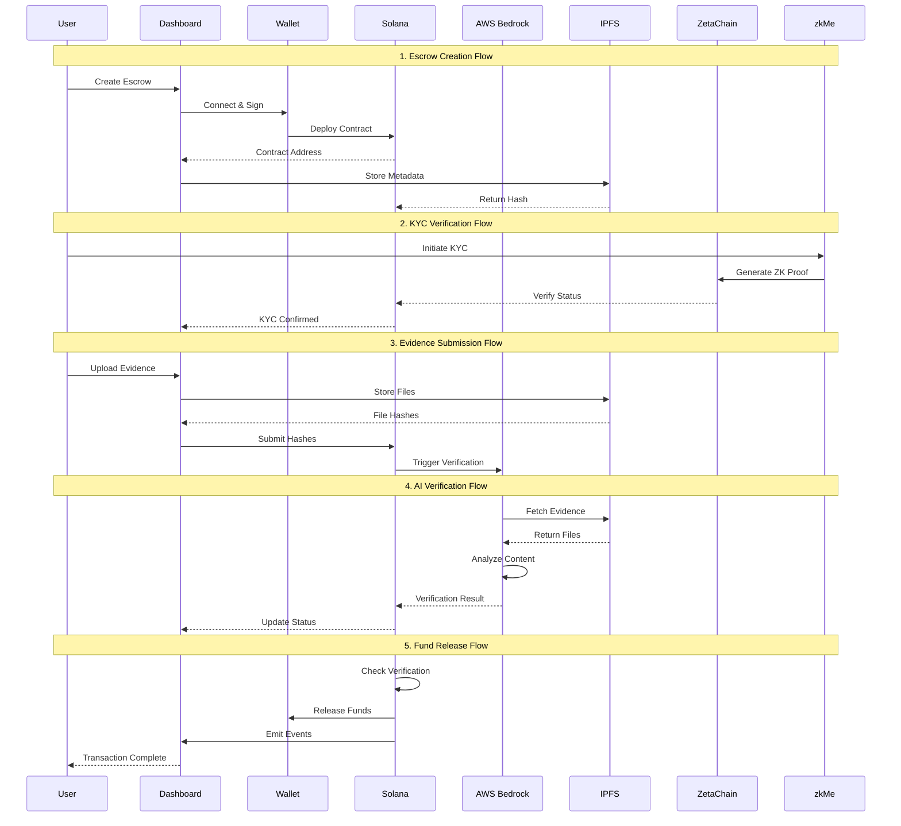

# Architecture

## Data Flow Diagram



## System Components

### Core Infrastructure
- **Solana Blockchain**: Smart contracts and fund management
- **AWS Bedrock**: AI-powered evidence verification
- **IPFS Network**: Decentralized file storage
- **ZetaChain**: Cross-chain KYC verification
- **zkMe Protocol**: Zero-knowledge identity proofs

### Data Flow Patterns

#### 1. Escrow Creation
```
User Input → Dashboard → Wallet Signature → Solana Contract → IPFS Metadata → On-Chain Hash
```

#### 2. KYC Verification
```
User Identity → zkMe SDK → ZK Proof → ZetaChain → Cross-Chain Message → Solana Verification
```

#### 3. Evidence Processing
```
File Upload → IPFS Storage → Hash Recording → AI Trigger → Bedrock Analysis → Confidence Score
```

#### 4. Decision Making
```
AI Analysis → Confidence Threshold → Auto-Approve/Review/Reject → Smart Contract Execution
```

## Technical Implementation

### Smart Contract Architecture
```rust
// Solana Program Structure
pub struct EscrowAccount {
    pub escrow_id: u64,
    pub payer: Pubkey,
    pub payee: Pubkey,
    pub amount: u64,
    pub status: EscrowStatus,
    pub evidence_hash: Option[String],
    pub verification_result: Option[VerificationResult],
}

// Key Functions
- initialize_escrow()
- deposit_funds()
- submit_evidence()
- process_verification()
- release_funds()
```

### AI Integration Flow
```typescript
// Verification Pipeline
interface VerificationRequest {
  escrowId: string;
  evidenceHashes: string[];
  taskRequirements: string[];
}

// AWS Bedrock Processing
1. Fetch evidence from IPFS
2. Analyze with Claude model
3. Generate confidence score
4. Return structured decision
5. Update smart contract
```

### Cross-Chain Integration
```solidity
// ZetaChain Universal Contract
contract AetherLockKYC {
  mapping(address => KYCCredential) credentials;
  
  function verifyKYC(bytes proof) external {
    // Verify zkMe proof
    // Store credential
    // Emit cross-chain message
  }
}
```

## Security & Privacy

### Data Protection
- **Evidence Encryption**: Files encrypted before IPFS storage
- **Zero-Knowledge Proofs**: Identity verification without data exposure
- **Access Control**: Time-limited evidence access tokens
- **Audit Trail**: All actions logged on-chain

### Smart Contract Security
- **Reentrancy Protection**: Checks-effects-interactions pattern
- **Access Control**: Multi-signature requirements
- **Formal Verification**: Mathematical proof of correctness
- **Emergency Pause**: Circuit breaker for critical issues

## Performance Metrics

### Transaction Throughput
- **Solana**: 65,000 TPS theoretical capacity
- **AI Processing**: Sub-30 second verification
- **IPFS Storage**: Distributed global network
- **Cross-Chain**: ZetaChain omnichain messaging

### Scalability Features
- **Parallel Processing**: Concurrent escrow handling
- **Caching Layer**: Redis for frequent data
- **Load Balancing**: Multi-region AWS deployment
- **State Compression**: Optimized on-chain storage

This architecture ensures high performance, security, and scalability while maintaining the decentralized and trustless nature of the AetherLock protocol.