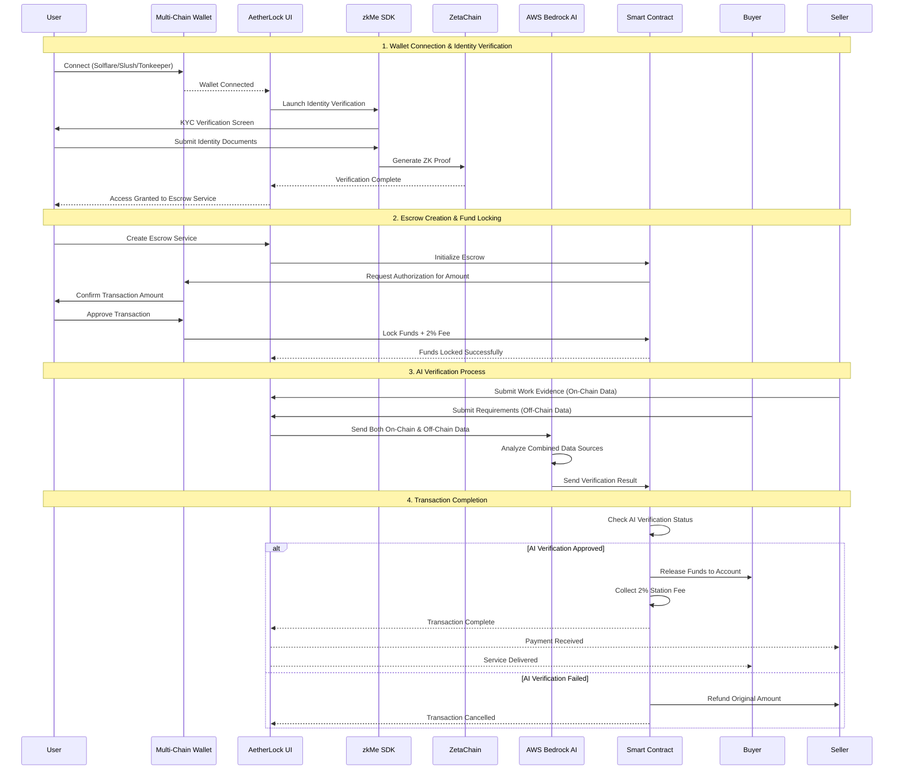

# Architecture

## AetherLock Data Flow



## Multi-Chain Wallet Integration

### Supported Wallets & Chains
```typescript
interface WalletConfig {
  solana: ['Solflare', 'Slush'];
  ton: ['Tonkeeper'];
  sui: ['Sui Wallet'];
  ethereum: ['MetaMask', 'WalletConnect'];
}

// Wallet Connection Flow
async function connectWallet(chain: string, walletType: string) {
  const wallet = await initializeWallet(chain, walletType);
  const address = await wallet.connect();
  
  // Trigger zkMe verification
  const kycResult = await launchZkMeVerification(address);
  
  if (kycResult.verified) {
    enableEscrowService(address);
  }
}
```

## ZetaChain Omnichain Architecture

### Cross-Chain Message Flow
```solidity
// ZetaChain Universal Contract
contract AetherLockOmnichain {
    struct CrossChainEscrow {
        uint256 sourceChain;
        address payer;
        address payee;
        uint256 amount;
        bool kycVerified;
        bool aiVerified;
    }
    
    function createOmnichainEscrow(
        uint256 destinationChain,
        address payee,
        uint256 amount
    ) external payable {
        require(isKYCVerified(msg.sender), "KYC required");
        
        // Lock funds on source chain
        lockFunds(msg.sender, amount + (amount * 2 / 100));
        
        // Send cross-chain message
        sendMessage(destinationChain, abi.encode(
            msg.sender, payee, amount, block.timestamp
        ));
    }
}
```

## AI Verification System

### On-Chain & Off-Chain Data Analysis
```typescript
interface VerificationData {
  onChainData: {
    transactionHashes: string[];
    contractStates: any[];
    blockchainEvents: Event[];
  };
  offChainData: {
    evidenceFiles: File[];
    communicationLogs: Message[];
    externalAPIs: APIResponse[];
  };
}

class AetherLockAI {
  async verifyTransaction(data: VerificationData): Promise<VerificationResult> {
    // Analyze on-chain data
    const onChainAnalysis = await this.analyzeOnChainData(data.onChainData);
    
    // Analyze off-chain data
    const offChainAnalysis = await this.analyzeOffChainData(data.offChainData);
    
    // Combined AI decision
    const combinedScore = this.calculateCombinedScore(
      onChainAnalysis, 
      offChainAnalysis
    );
    
    return {
      approved: combinedScore > 0.9,
      confidence: combinedScore,
      reasoning: this.generateReasoning(onChainAnalysis, offChainAnalysis)
    };
  }
}
```

## Smart Contract Fund Management

### Escrow & Fee Collection
```rust
// Solana Anchor Program
#[program]
pub mod aetherlock_escrow {
    pub fn create_escrow_with_fee(
        ctx: Context<CreateEscrow>,
        amount: u64,
        payee: Pubkey
    ) -> Result<()> {
        let escrow = &mut ctx.accounts.escrow_account;
        let fee = amount * 2 / 100; // 2% station fee
        let total_required = amount + fee;
        
        // Lock funds including fee
        escrow.locked_amount = amount;
        escrow.station_fee = fee;
        escrow.payer = ctx.accounts.payer.key();
        escrow.payee = payee;
        escrow.status = EscrowStatus::FundsLocked;
        
        Ok(())
    }
    
    pub fn release_funds_after_ai_verification(
        ctx: Context<ReleaseFunds>
    ) -> Result<()> {
        let escrow = &mut ctx.accounts.escrow_account;
        
        require!(escrow.ai_verified, EscrowError::AIVerificationRequired);
        
        // Transfer funds to buyer
        **ctx.accounts.buyer.lamports.borrow_mut() += escrow.locked_amount;
        
        // Collect station fee
        **ctx.accounts.treasury.lamports.borrow_mut() += escrow.station_fee;
        
        escrow.status = EscrowStatus::Completed;
        
        emit!(FundsReleased {
            escrow_id: escrow.id,
            buyer: escrow.payee,
            amount: escrow.locked_amount,
            fee_collected: escrow.station_fee
        });
        
        Ok(())
    }
}
```

## User Journey Flow

### Complete Transaction Process

1. **Multi-Chain Wallet Connection**
   - User connects Solflare (Solana), Tonkeeper (TON), or Sui Wallet
   - Wallet integration detects chain and initializes connection

2. **zkMe Identity Verification**
   - Verification screen pops up automatically
   - User completes KYC using zkMe SDK
   - Zero-knowledge proof generated and verified on ZetaChain

3. **Escrow Service Access**
   - UI enables escrow functionality after successful verification
   - User can create, manage, and participate in escrows

4. **Transaction Authorization**
   - AetherLock sends authorization request to wallet
   - User confirms transaction amount + 2% fee
   - Smart contract locks funds securely

5. **AI Verification Process**
   - AI analyzes both on-chain transaction data and off-chain evidence
   - Combined analysis generates confidence score
   - Automatic approval/rejection based on AI decision

6. **Fund Release & Fee Collection**
   - Smart contract releases funds to buyer's account
   - 2% station fee automatically collected
   - Transaction marked as complete

## Security & Compliance

### Multi-Layer Verification
- **Identity Layer**: zkMe zero-knowledge KYC
- **Transaction Layer**: Smart contract validation
- **Evidence Layer**: AI analysis of on/off-chain data
- **Cross-Chain Layer**: ZetaChain message verification

### Fee Structure
- **Station Fee**: 2% collected on every completed transaction
- **Gas Optimization**: Batched operations to minimize costs
- **Treasury Management**: Automated fee collection and distribution

This architecture ensures seamless multi-chain operation while maintaining security, privacy, and automated verification across all supported networks.