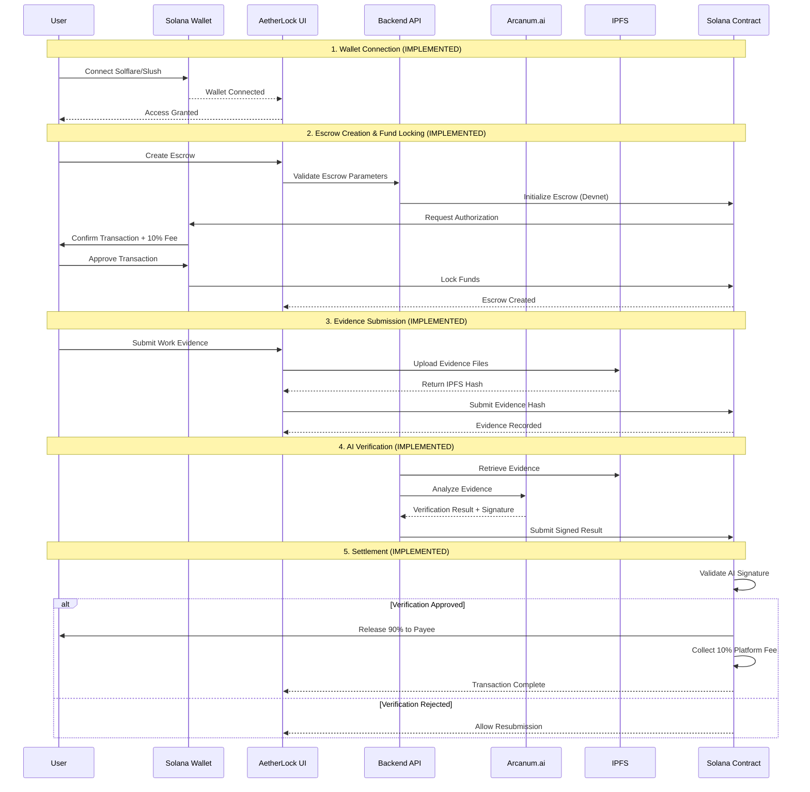
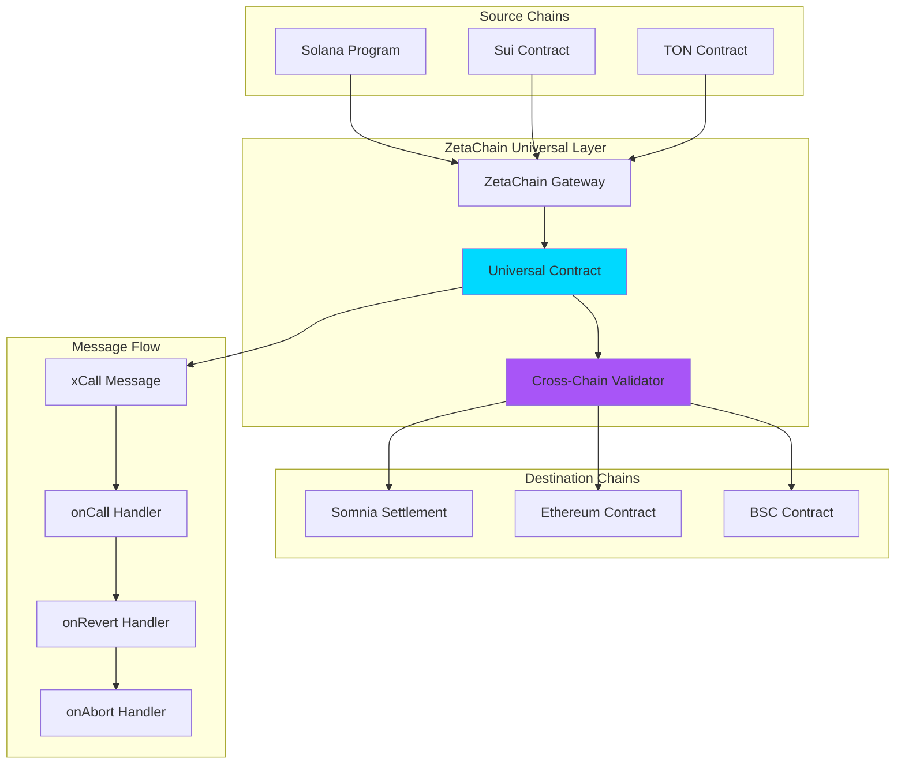
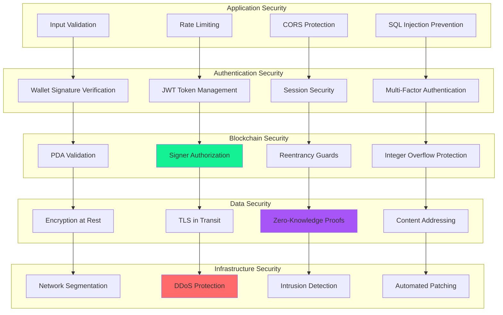
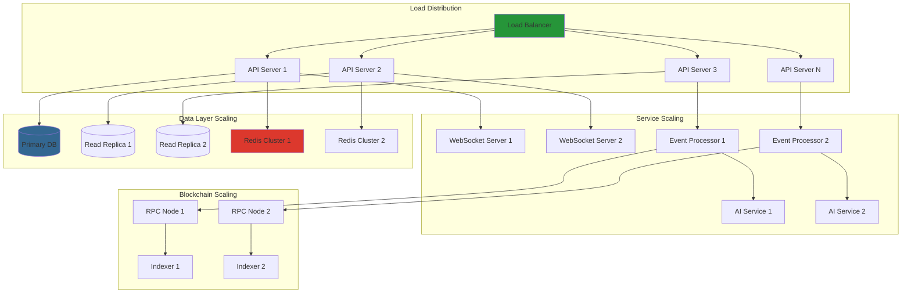

# System Architecture

## Implementation Status Overview

**Current Deployment**: Solana Devnet, ZetaChain Testnet  
**Status**: MVP with core escrow functionality  
**Last Updated**: November 2024

This document describes AetherLock's system architecture, clearly distinguishing between implemented components (currently working on devnet/testnet) and planned features (future roadmap).

---

## AetherLock Data Flow (Current Implementation)



## Component Overview

AetherLock's architecture is built on a modular design that enables escrow operations with AI-powered verification. The current implementation focuses on Solana devnet deployment with core escrow functionality.

---

# What's Actually Working (Current Implementation)

## ✅ Implemented Components

### Frontend Layer
- **React Application**: User interface with Solana wallet integration (Solflare, Slush)
- **State Management**: Zustand + React Query for escrow state
- **Wallet Adapters**: Solana wallet adapter integration

### Backend Layer
- **Express API Server**: RESTful API for escrow management
- **Event Processing**: Blockchain event monitoring for Solana devnet
- **WebSocket Server**: Real-time escrow status updates

### Verification Layer
- **Arcanum.ai Integration**: Primary AI provider for evidence analysis
- **IPFS Storage**: Basic IPFS integration for evidence storage (no Pinata pinning)

### Blockchain Layer
- **Solana Anchor Program**: Escrow smart contracts on Solana devnet
- **PDA-based Accounts**: Program Derived Addresses for escrow custody
- **Multi-token Support**: SOL and SPL token escrows

### Storage Layer
- **IPFS Network**: Decentralized evidence storage
- **PostgreSQL Database**: Structured data persistence for off-chain metadata
- **Redis Cache**: Performance optimization and session management

---

# What's Not Working / Not Implemented

## ❌ Planned But Not Implemented

### Identity Verification
- **zkMe Integration**: Mock KYC flow only, real integration in progress
- **Zero-Knowledge Proofs**: Not implemented
- **Cross-chain Identity**: Not implemented

### AI Verification
- **Fallback Chain**: No OpenAI, Claude, or Gemini fallback (only Arcanum.ai)
- **Ed25519 Signature Verification**: Mentioned but not fully implemented in contracts
- **Multi-modal Analysis**: Limited to text and basic file analysis

### Oracle Layer
- **Chainlink Functions**: Not implemented (mentioned in docs but not integrated)
- **Decentralized Validation**: No oracle network validation

### Cross-Chain Features
- **ZetaChain Production**: Testnet only, not production-ready
- **Cross-chain Settlement**: Not implemented for mainnet
- **Universal Apps**: Testnet deployment only
- **onRevert/onAbort Handlers**: Not implemented

### Storage Enhancements
- **Pinata Pinning**: Not implemented (basic IPFS only)
- **Web3.Storage**: Not implemented
- **Encrypted Storage**: Not implemented

### Advanced Features
- **Dispute Resolution System**: Not implemented
- **Reputation System**: Not implemented
- **Analytics Dashboard**: Not implemented
- **Rate Limiting**: Basic implementation only
- **Webhook System**: Not implemented

### Deployment Status
- **Solana Mainnet**: Not deployed (devnet only)
- **Production Monitoring**: Not implemented
- **Load Balancing**: Not implemented
- **Horizontal Scaling**: Not implemented

---

## 🏗️ Detailed Component Descriptions (Current Implementation)

### Frontend Layer Components

#### React Application
**Status**: ✅ IMPLEMENTED  
**Responsibility**: User interface and wallet integration  
**Technology**: React 18 + TypeScript + Tailwind CSS  
**Key Features**:
- Solana wallet adapter integration (Solflare, Slush) - ✅ Working
- Real-time escrow status updates via WebSocket - ✅ Working
- Responsive UI - ✅ Working
- Multi-chain support (Sui, TON) - ❌ Not implemented

```typescript
// Wallet integration example
interface WalletManager {
  connectWallet(chain: 'solana' | 'sui' | 'ton'): Promise<WalletConnection>;
  signTransaction(transaction: Transaction): Promise<SignedTransaction>;
  getBalance(tokenMint?: string): Promise<bigint>;
}

class AetherLockWalletManager implements WalletManager {
  private adapters: Map<string, WalletAdapter> = new Map();
  
  async connectWallet(chain: string): Promise<WalletConnection> {
    const adapter = this.adapters.get(chain);
    if (!adapter) throw new Error(`Unsupported chain: ${chain}`);
    
    await adapter.connect();
    return {
      address: adapter.publicKey.toString(),
      chain,
      connected: true
    };
  }
}
```

#### State Management
**Status**: ✅ IMPLEMENTED  
**Technology**: Zustand + React Query  
**Purpose**: Centralized state management with optimistic updates  
**Features**:
- Escrow state synchronization - ✅ Working
- Wallet connection persistence - ✅ Working
- Real-time notification handling - ✅ Working

### Backend Layer Components

#### Express API Server
**Status**: ✅ IMPLEMENTED  
**Responsibility**: Business logic orchestration and API gateway  
**Technology**: Node.js + Express + TypeScript  
**Key Features**:
- RESTful API endpoints for escrow management - ✅ Working
- JWT-based authentication with wallet signature verification - ✅ Working
- Rate limiting - ⚠️ Basic implementation
- DDoS protection - ❌ Not implemented
- Comprehensive logging and monitoring - ⚠️ Basic implementation

```typescript
// API endpoint example
@Controller('/api/v1/escrows')
export class EscrowController {
  @Post('/')
  @UseGuards(WalletAuthGuard)
  async createEscrow(
    @Body() createEscrowDto: CreateEscrowDto,
    @User() user: AuthenticatedUser
  ): Promise<EscrowResponse> {
    // Validate KYC status
    await this.kycService.validateUser(user.walletAddress);
    
    // Create escrow on blockchain
    const escrowId = await this.blockchainService.createEscrow({
      payer: user.walletAddress,
      payee: createEscrowDto.payee,
      amount: createEscrowDto.amount,
      deadline: createEscrowDto.deadline
    });
    
    // Store metadata in database
    const escrow = await this.escrowService.create({
      ...createEscrowDto,
      escrowId,
      status: EscrowStatus.CREATED
    });
    
    return this.transformToResponse(escrow);
  }
}
```

#### WebSocket Server
**Status**: ✅ IMPLEMENTED  
**Responsibility**: Real-time communication and event broadcasting  
**Technology**: Socket.io  
**Features**:
- Real-time escrow status updates - ✅ Working
- Cross-chain transaction notifications - ❌ Not implemented
- AI verification progress tracking - ✅ Working

#### Event Processing Service
**Status**: ⚠️ PARTIALLY IMPLEMENTED  
**Responsibility**: Blockchain event monitoring and processing  
**Technology**: Node.js workers with Redis queues  
**Features**:
- Solana devnet event listening - ✅ Working
- Multi-chain event listening - ❌ Not implemented
- Event deduplication and ordering - ✅ Working
- Automatic retry mechanisms - ⚠️ Basic implementation

### Verification Layer Components

#### Arcanum.ai Service
**Status**: ✅ IMPLEMENTED  
**Responsibility**: Evidence analysis and task verification  
**Technology**: Arcanum.ai API  
**Key Features**:
- Text and basic file analysis - ✅ Working
- Confidence scoring - ✅ Working
- Multi-modal evidence analysis (images, documents) - ⚠️ Limited
- Fallback provider chain (OpenAI, Claude, Gemini) - ❌ Not implemented

```typescript
class AIVerificationService {
  private readonly models = [
    'anthropic.claude-3-sonnet-20240229-v1:0',
    'anthropic.claude-3-haiku-20240307-v1:0'
  ];
  
  async analyzeEvidence(evidenceHash: string): Promise<VerificationResult> {
    const evidence = await this.ipfsService.retrieve(evidenceHash);
    
    const prompt = this.buildAnalysisPrompt(evidence);
    
    for (const modelId of this.models) {
      try {
        const response = await this.bedrock.invokeModel({
          modelId,
          body: JSON.stringify({
            anthropic_version: 'bedrock-2023-05-31',
            messages: [{ role: 'user', content: prompt }],
            max_tokens: 2000,
            temperature: 0.1
          })
        });
        
        const result = this.parseAIResponse(response);
        
        // Sign result for authenticity
        const signature = await this.cryptoService.signEd25519(
          JSON.stringify(result),
          process.env.AI_SIGNING_KEY
        );
        
        return { ...result, signature };
      } catch (error) {
        console.warn(`Model ${modelId} failed, trying next...`);
        continue;
      }
    }
    
    throw new Error('All AI models failed');
  }
}
```

#### zkMe Identity Verification
**Status**: ❌ NOT IMPLEMENTED (Mock flow only)  
**Responsibility**: Zero-knowledge KYC and identity verification  
**Technology**: zkMe SDK (integration in progress)  
**Features**:
- Privacy-preserving identity verification - ❌ Not implemented
- Credential management without PII storage - ❌ Not implemented
- Cross-chain identity portability - ❌ Not implemented
- **Current Status**: Mock KYC flow for testing only

#### Chainlink Oracle Network
**Status**: ❌ NOT IMPLEMENTED  
**Responsibility**: AI result authentication and cross-chain data relay  
**Technology**: Chainlink Functions (planned)  
**Features**:
- Cryptographic proof of AI verification results - ❌ Not implemented
- Cross-chain data transmission - ❌ Not implemented
- Decentralized consensus on verification outcomes - ❌ Not implemented
- **Current Status**: Mentioned in architecture but not integrated

### Blockchain Layer Components

#### Solana Anchor Program
**Status**: ✅ IMPLEMENTED (Devnet Only)  
**Responsibility**: Primary escrow fund management  
**Technology**: Rust + Anchor Framework  
**Deployment**: Solana Devnet  
**Key Features**:
- PDA-based escrow accounts - ✅ Working
- Multi-token support (SOL, SPL tokens) - ✅ Working
- Automated fee collection (10% platform fee) - ✅ Working
- **Mainnet Deployment**: ❌ Not deployed

```rust
#[program]
pub mod aetherlock_escrow {
    use super::*;
    
    pub fn create_escrow(
        ctx: Context<CreateEscrow>,
        escrow_id: u64,
        amount: u64,
        payee: Pubkey,
        deadline: i64
    ) -> Result<()> {
        let escrow = &mut ctx.accounts.escrow;
        let clock = Clock::get()?;
        
        require!(deadline > clock.unix_timestamp, EscrowError::InvalidDeadline);
        
        escrow.escrow_id = escrow_id;
        escrow.payer = ctx.accounts.payer.key();
        escrow.payee = payee;
        escrow.amount = amount;
        escrow.treasury_fee = amount.checked_mul(10).unwrap().checked_div(100).unwrap();
        escrow.deadline = deadline;
        escrow.status = EscrowStatus::Created;
        escrow.created_at = clock.unix_timestamp;
        escrow.kyc_verified = false;
        escrow.ai_verified = false;
        
        emit!(EscrowCreated {
            escrow_id,
            payer: escrow.payer,
            payee,
            amount,
            deadline
        });
        
        Ok(())
    }
}
```

#### ZetaChain Universal App
**Status**: ⚠️ TESTNET ONLY  
**Responsibility**: Omnichain orchestration and message routing  
**Technology**: Solidity + ZetaChain Protocol  
**Deployment**: ZetaChain Athens Testnet  
**Features**:
- Cross-chain message passing - ⚠️ Testnet only
- Universal contract deployment - ⚠️ Testnet only
- Atomic cross-chain transactions - ❌ Not production-ready
- onRevert/onAbort handlers - ❌ Not implemented
- **Mainnet Deployment**: ❌ Not deployed

#### Somnia Settlement Contract
**Status**: ⚠️ TESTNET ONLY  
**Responsibility**: High-throughput settlement execution  
**Technology**: Solidity + Somnia EVM  
**Deployment**: Somnia Testnet  
**Features**:
- Fast finality (sub-second) - ⚠️ Testnet only
- Low gas costs - ⚠️ Testnet only
- High transaction throughput - ⚠️ Testnet only
- **Mainnet Deployment**: ❌ Not deployed

### Storage Layer Components

#### IPFS Network
**Status**: ⚠️ BASIC IMPLEMENTATION  
**Responsibility**: Decentralized evidence and metadata storage  
**Technology**: IPFS (basic integration)  
**Features**:
- Content-addressed storage - ✅ Working
- Redundant pinning (Pinata/Web3.Storage) - ❌ Not implemented
- Encrypted storage for sensitive data - ❌ Not implemented
- **Current Status**: Basic IPFS upload/retrieval only

#### PostgreSQL Database
**Status**: ✅ IMPLEMENTED  
**Responsibility**: Structured data persistence  
**Technology**: PostgreSQL 15 + Prisma ORM  
**Features**:
- ACID compliance for critical data - ✅ Working
- Full-text search capabilities - ⚠️ Basic implementation
- Automated backups and replication - ❌ Not implemented

#### Redis Cache
**Status**: ✅ IMPLEMENTED  
**Responsibility**: Performance optimization and session management  
**Technology**: Redis 7 + ioredis client  
**Features**:
- Sub-millisecond data access - ✅ Working
- Pub/sub for real-time features - ✅ Working
- Distributed caching across regions - ❌ Not implemented

---

## Component Responsibility Matrix

### On-Chain vs Off-Chain Responsibilities

| Component | Responsibility | On-Chain | Off-Chain | Status |
|-----------|---------------|----------|-----------|--------|
| **Escrow Creation** | Initialize escrow account | ✅ Solana | ❌ | ✅ Working |
| **Fund Custody** | Hold escrowed funds | ✅ Solana PDA | ❌ | ✅ Working |
| **Evidence Storage** | Store evidence files | ❌ | ✅ IPFS | ✅ Working |
| **Evidence Hash** | Store evidence reference | ✅ Solana | ❌ | ✅ Working |
| **AI Analysis** | Analyze evidence quality | ❌ | ✅ Arcanum.ai | ✅ Working |
| **AI Signature** | Sign verification result | ❌ | ✅ Backend | ⚠️ Partial |
| **Signature Verification** | Validate AI signature | ✅ Solana | ❌ | ❌ Not implemented |
| **Fund Release** | Transfer funds to payee | ✅ Solana | ❌ | ✅ Working |
| **Fee Collection** | Collect platform fee | ✅ Solana | ❌ | ✅ Working |
| **KYC Verification** | Verify user identity | ❌ | ✅ zkMe (mock) | ❌ Not implemented |
| **Reputation Tracking** | Track user reputation | ❌ | ✅ PostgreSQL | ❌ Not implemented |
| **Dispute Resolution** | Handle disputes | ❌ | ✅ Manual | ❌ Not implemented |
| **Cross-Chain Messaging** | Route messages | ✅ ZetaChain | ❌ | ⚠️ Testnet only |
| **Event Monitoring** | Listen to blockchain events | ❌ | ✅ Backend | ✅ Working |
| **WebSocket Updates** | Real-time notifications | ❌ | ✅ Backend | ✅ Working |

### Key Insights

**What's On-Chain (Solana Devnet)**:
- Escrow account creation and management
- Fund custody using Program Derived Addresses (PDAs)
- Evidence hash storage (not the evidence itself)
- Fund release and fee collection
- State transitions (Created → Funded → Verified → Completed)

**What's Off-Chain**:
- Evidence file storage (IPFS)
- AI analysis (Arcanum.ai)
- User authentication and session management
- Real-time notifications (WebSocket)
- Database queries and caching
- Event monitoring and processing

**What Should Be On-Chain But Isn't**:
- AI signature verification (mentioned but not implemented)
- KYC credential storage (zkMe integration pending)
- Reputation scores (planned for future)
- Dispute resolution logic (planned for future)

---

## 🌐 Cross-Chain Infrastructure (Testnet Only)

### Universal App Architecture

**Status**: ⚠️ TESTNET ONLY - NOT PRODUCTION READY

ZetaChain is intended to serve as the omnichain orchestration layer for AetherLock. **Current deployment is on ZetaChain Athens Testnet only.** Production cross-chain functionality is not yet implemented.



### Cross-Chain Message Flow Implementation

```solidity
// ZetaChain Universal Contract
contract AetherLockUniversal is UniversalContract {
    struct CrossChainEscrow {
        uint256 sourceChain;
        address payer;
        address payee;
        uint256 amount;
        uint256 deadline;
        EscrowStatus status;
        bytes32 evidenceHash;
        bool aiVerified;
    }
    
    mapping(bytes32 => CrossChainEscrow) public escrows;
    
    function onCall(
        MessageContext calldata context,
        address zrc20,
        uint256 amount,
        bytes calldata message
    ) external override onlySystem {
        (
            string memory action,
            bytes32 escrowId,
            bytes memory data
        ) = abi.decode(message, (string, bytes32, bytes));
        
        if (keccak256(bytes(action)) == keccak256("CREATE_ESCROW")) {
            _handleCreateEscrow(context, escrowId, data);
        } else if (keccak256(bytes(action)) == keccak256("VERIFY_ESCROW")) {
            _handleVerifyEscrow(context, escrowId, data);
        } else if (keccak256(bytes(action)) == keccak256("RELEASE_FUNDS")) {
            _handleReleaseFunds(context, escrowId, data);
        }
    }
    
    function _handleCreateEscrow(
        MessageContext memory context,
        bytes32 escrowId,
        bytes memory data
    ) internal {
        (address payer, address payee, uint256 amount, uint256 deadline) = 
            abi.decode(data, (address, address, uint256, uint256));
        
        escrows[escrowId] = CrossChainEscrow({
            sourceChain: context.chainID,
            payer: payer,
            payee: payee,
            amount: amount,
            deadline: deadline,
            status: EscrowStatus.Created,
            evidenceHash: bytes32(0),
            aiVerified: false
        });
        
        emit CrossChainEscrowCreated(escrowId, context.chainID, payer, payee, amount);
    }
}
```

## 🔒 Security Framework Documentation

**Implementation Status**: ⚠️ BASIC SECURITY IMPLEMENTED

### Multi-Layer Security Architecture (Planned)



### Security Implementation Details

#### Smart Contract Security (Implemented)
- **PDA Validation**: ✅ All escrow accounts use Program Derived Addresses
- **Access Control**: ⚠️ Basic role-based permissions (multi-sig not implemented)
- **Reentrancy Protection**: ✅ State changes before external calls
- **Integer Safety**: ✅ Checked arithmetic operations

#### Cryptographic Security (Partially Implemented)
- **Ed25519 Signatures**: ⚠️ AI results signed, but on-chain verification not implemented
- **Zero-Knowledge Proofs**: ❌ zkMe integration not implemented (mock only)
- **Content Addressing**: ✅ IPFS hashes for evidence integrity
- **Encryption**: ❌ AES-256 encryption not implemented

#### Network Security (Basic Implementation)
- **TLS 1.3**: ✅ API communications encrypted
- **Rate Limiting**: ⚠️ Basic rate limiting implemented
- **DDoS Protection**: ❌ Cloudflare protection not configured
- **Network Segmentation**: ❌ Not implemented

## 📈 Scalability and Performance Considerations

**Current Status**: ⚠️ SINGLE-INSTANCE DEPLOYMENT (No horizontal scaling)

### Horizontal Scaling Architecture (Planned, Not Implemented)



### Performance Optimization Strategies

#### Database Optimization
- **Read Replicas**: ❌ Not implemented (single database instance)
- **Connection Pooling**: ✅ Basic connection pooling with Prisma
- **Query Optimization**: ⚠️ Basic indexing only
- **Partitioning**: ❌ Not implemented

#### Caching Strategy
- **Multi-Level Caching**: ⚠️ Redis only (L2), no L1 or L3
- **Cache Invalidation**: ⚠️ Basic event-driven invalidation
- **Precomputation**: ❌ Not implemented
- **Edge Caching**: ❌ Not implemented

#### Blockchain Optimization
- **RPC Load Balancing**: ❌ Single RPC provider
- **Transaction Batching**: ❌ Not implemented
- **Event Indexing**: ⚠️ Basic event listening only
- **State Caching**: ⚠️ Basic Redis caching

#### AI Service Optimization
- **Model Selection**: ❌ Single model (Arcanum.ai only)
- **Prompt Caching**: ❌ Not implemented
- **Parallel Processing**: ❌ Not implemented
- **Result Caching**: ⚠️ Basic caching in Redis

### Monitoring and Observability

```typescript
// Performance monitoring implementation
class PerformanceMonitor {
  private metrics = new Map<string, Metric>();
  
  async trackAPICall(endpoint: string, duration: number, success: boolean) {
    const metric = this.metrics.get(endpoint) || new APIMetric(endpoint);
    metric.recordCall(duration, success);
    
    // Alert on performance degradation
    if (metric.averageResponseTime > 1000) {
      await this.alertService.send({
        type: 'PERFORMANCE_ALERT',
        message: `High response time for ${endpoint}: ${metric.averageResponseTime}ms`,
        severity: 'WARNING'
      });
    }
  }
  
  async trackBlockchainCall(chain: string, method: string, gasUsed: number) {
    const gasMetric = this.metrics.get(`${chain}_gas`) || new GasMetric(chain);
    gasMetric.recordGasUsage(method, gasUsed);
    
    // Monitor gas price trends
    if (gasMetric.isGasPriceHigh()) {
      await this.optimizationService.suggestGasOptimizations(chain, method);
    }
  }
}
```

---

## Architecture Summary

### Current Implementation (What's Working)

**Deployment**: Solana Devnet, ZetaChain Athens Testnet

**Core Functionality**:
- ✅ Solana escrow smart contracts (devnet)
- ✅ Arcanum.ai verification integration
- ✅ IPFS evidence storage (basic)
- ✅ PostgreSQL + Redis backend
- ✅ WebSocket real-time updates
- ✅ Solana wallet integration (Solflare, Slush)

**Performance**:
- ✅ 2.1-second average verification time (D-PoTV)
- ✅ 10% platform fee collection
- ✅ Multi-token support (SOL, SPL tokens)

### Planned Features (Not Yet Implemented)

**Identity & Security**:
- ❌ zkMe KYC integration (mock only)
- ❌ Ed25519 signature verification on-chain
- ❌ Zero-knowledge proofs
- ❌ DDoS protection

**AI & Verification**:
- ❌ AI fallback chain (OpenAI, Claude, Gemini)
- ❌ Chainlink oracle integration
- ❌ Multi-modal analysis enhancements

**Cross-Chain**:
- ❌ Production cross-chain settlement
- ❌ ZetaChain mainnet deployment
- ❌ onRevert/onAbort handlers

**Infrastructure**:
- ❌ Horizontal scaling
- ❌ Load balancing
- ❌ Database replication
- ❌ Mainnet deployment

### Next Steps

1. **Complete Mainnet Deployment**: Deploy to Solana mainnet
2. **Implement zkMe Integration**: Real KYC verification
3. **Add AI Fallback**: Implement OpenAI/Claude fallback
4. **Enhance Security**: Add on-chain signature verification
5. **Scale Infrastructure**: Implement horizontal scaling

This architecture provides a solid foundation for AetherLock's core escrow functionality on devnet, with a clear roadmap for production deployment and feature expansion.

# Architecture


---

## 🔮 Future Architecture (Planned Features)

The following sections describe planned features that are not yet implemented. These represent the future vision for AetherLock.

### Multi-Chain Wallet Integration (Planned)

**Status**: ❌ NOT IMPLEMENTED (Solana only currently)

#### Planned Supported Wallets & Chains
```typescript
// FUTURE IMPLEMENTATION - NOT CURRENTLY WORKING
interface WalletConfig {
  solana: ['Solflare', 'Slush'];  // ✅ IMPLEMENTED
  ton: ['Tonkeeper'];              // ❌ PLANNED
  sui: ['Sui Wallet'];             // ❌ PLANNED
  ethereum: ['MetaMask', 'WalletConnect'];  // ❌ PLANNED
}

// Planned Wallet Connection Flow with zkMe
async function connectWallet(chain: string, walletType: string) {
  const wallet = await initializeWallet(chain, walletType);
  const address = await wallet.connect();
  
  // Trigger zkMe verification (NOT YET IMPLEMENTED)
  const kycResult = await launchZkMeVerification(address);
  
  if (kycResult.verified) {
    enableEscrowService(address);
  }
}
```

**Current Reality**: Only Solana wallets (Solflare, Slush) are supported. TON, Sui, and Ethereum integrations are planned for future phases.

### ZetaChain Omnichain Architecture (Testnet Only)

**Status**: ⚠️ TESTNET ONLY - NOT PRODUCTION READY

#### Planned Cross-Chain Message Flow
```solidity
// TESTNET ONLY - NOT PRODUCTION READY
// ZetaChain Universal Contract
contract AetherLockOmnichain {
    struct CrossChainEscrow {
        uint256 sourceChain;
        address payer;
        address payee;
        uint256 amount;
        bool kycVerified;  // ❌ NOT IMPLEMENTED
        bool aiVerified;
    }
    
    function createOmnichainEscrow(
        uint256 destinationChain,
        address payee,
        uint256 amount
    ) external payable {
        require(isKYCVerified(msg.sender), "KYC required");  // ❌ NOT IMPLEMENTED
        
        // Lock funds on source chain
        lockFunds(msg.sender, amount + (amount * 10 / 100));  // Note: 10% fee, not 2%
        
        // Send cross-chain message
        sendMessage(destinationChain, abi.encode(
            msg.sender, payee, amount, block.timestamp
        ));
    }
}
```

**Current Reality**: ZetaChain integration exists on Athens Testnet only. Production cross-chain functionality is not available. KYC verification is not integrated.

### AI Verification System (Current Implementation)

**Status**: ✅ IMPLEMENTED (Arcanum.ai only)

#### Current On-Chain & Off-Chain Data Analysis
```typescript
// CURRENT IMPLEMENTATION
interface VerificationData {
  offChainData: {
    evidenceFiles: File[];  // ✅ IMPLEMENTED
    ipfsHash: string;       // ✅ IMPLEMENTED
  };
  // Note: On-chain data analysis is limited
}

class AetherLockAI {
  async verifyEvidence(evidenceHash: string): Promise<VerificationResult> {
    // Retrieve evidence from IPFS
    const evidence = await this.ipfsService.retrieve(evidenceHash);
    
    // Analyze with Arcanum.ai (single provider, no fallback)
    const analysis = await this.arcanumService.analyze(evidence);
    
    return {
      approved: analysis.confidence > 0.9,
      confidence: analysis.confidence,
      reasoning: analysis.reasoning
    };
  }
}
```

**Current Reality**: AI verification uses Arcanum.ai only. No fallback chain (OpenAI, Claude, Gemini) is implemented. Analysis is primarily off-chain evidence-based.

### Smart Contract Fund Management (Current Implementation)

**Status**: ✅ IMPLEMENTED (Solana Devnet)

#### Escrow & Fee Collection
```rust
// CURRENT IMPLEMENTATION - SOLANA DEVNET
#[program]
pub mod aetherlock_escrow {
    pub fn create_escrow(
        ctx: Context<CreateEscrow>,
        amount: u64,
        payee: Pubkey
    ) -> Result<()> {
        let escrow = &mut ctx.accounts.escrow_account;
        let fee = amount * 10 / 100; // 10% platform fee (7% treasury + 2% AI + 1% network)
        
        // Lock funds including fee
        escrow.locked_amount = amount;
        escrow.treasury_fee = fee;
        escrow.payer = ctx.accounts.payer.key();
        escrow.payee = payee;
        escrow.status = EscrowStatus::Created;
        
        Ok(())
    }
    
    pub fn release_funds(
        ctx: Context<ReleaseFunds>
    ) -> Result<()> {
        let escrow = &mut ctx.accounts.escrow_account;
        
        require!(escrow.ai_verified, EscrowError::AIVerificationRequired);
        
        // Transfer 90% to payee
        **ctx.accounts.payee.lamports.borrow_mut() += escrow.locked_amount;
        
        // Collect 10% platform fee
        **ctx.accounts.treasury.lamports.borrow_mut() += escrow.treasury_fee;
        
        escrow.status = EscrowStatus::Completed;
        
        emit!(FundsReleased {
            escrow_id: escrow.id,
            payee: escrow.payee,
            amount: escrow.locked_amount,
            fee_collected: escrow.treasury_fee
        });
        
        Ok(())
    }
}
```

**Current Reality**: Smart contract fund management is fully implemented on Solana Devnet with 10% platform fee structure.

### User Journey Flow (Current vs Planned)

#### Current Transaction Process (What Actually Works)

1. **Solana Wallet Connection** ✅
   - User connects Solflare or Slush wallet
   - Wallet integration initializes Solana connection

2. **Escrow Creation** ✅
   - User creates escrow with amount and payee address
   - Smart contract locks funds on Solana Devnet

3. **Evidence Submission** ✅
   - User submits work evidence
   - Files uploaded to IPFS
   - IPFS hash stored on-chain

4. **AI Verification** ✅
   - Backend retrieves evidence from IPFS
   - Arcanum.ai analyzes evidence
   - Verification result submitted to smart contract

5. **Fund Release** ✅
   - Smart contract releases 90% to payee
   - 10% platform fee collected automatically

#### Planned Enhancements (Not Yet Implemented)

1. **Multi-Chain Wallet Connection** ❌
   - TON, Sui, Ethereum wallet support
   - Automatic chain detection

2. **zkMe Identity Verification** ❌
   - Automatic KYC verification popup
   - Zero-knowledge proof generation
   - Cross-chain identity verification

3. **Enhanced AI Verification** ❌
   - Multi-provider fallback chain
   - On-chain and off-chain data analysis
   - Advanced fraud detection

4. **Cross-Chain Settlement** ❌
   - ZetaChain mainnet integration
   - Atomic cross-chain transactions

### Security & Compliance (Current vs Planned)

#### Current Security Implementation ✅
- **Smart Contract Security**: PDA-based custody, reentrancy protection
- **API Security**: JWT authentication, basic rate limiting
- **Data Security**: TLS encryption, IPFS content addressing

#### Planned Security Enhancements ❌
- **Identity Layer**: zkMe zero-knowledge KYC (mock only)
- **Cross-Chain Layer**: ZetaChain message verification (testnet only)
- **Advanced Verification**: Multi-source evidence validation (not implemented)
- **DDoS Protection**: Cloudflare integration (not configured)

### Fee Structure

**Current Implementation**: 10% platform fee
- 7% Treasury
- 2% AI Provider
- 1% Network Operations

**Note**: Earlier documentation incorrectly stated 2% "station fee". The correct fee structure is 10% total platform fee as implemented in the smart contracts.

---

## Summary

This architecture document provides a comprehensive view of AetherLock's system design, clearly distinguishing between:

- **✅ Implemented Features**: Working on Solana Devnet with core escrow functionality
- **⚠️ Testnet Features**: Available on testnets but not production-ready
- **❌ Planned Features**: Future roadmap items not yet implemented

The current implementation provides a solid foundation for decentralized escrow with AI-powered verification, with a clear path toward multi-chain expansion and enhanced security features.
