# Architecture

## Simple Overview

AetherLock connects **Users** → **AI** → **Blockchain** → **Storage** for trustless escrows.

## System Architecture

```mermaid
flowchart TD
    User[👤 User] --> Dashboard[🎮 Cyberpunk Dashboard]
    Dashboard --> Wallet[💼 Wallet Connection]
    
    Wallet --> Solana[⚡ Solana Blockchain]
    Wallet --> ZetaChain[🔗 ZetaChain]
    
    Dashboard --> AI[🤖 AWS Bedrock AI]
    AI --> Verify[✅ Task Verification]
    AI --> Dispute[⚖️ Dispute Resolution]
    
    Solana --> Escrow[💰 Escrow Contract]
    ZetaChain --> KYC[🛡️ zkMe KYC]
    
    Verify --> IPFS[📁 IPFS Storage]
    Dispute --> IPFS
    Escrow --> IPFS
    
    IPFS --> Web3Storage[☁️ Web3.Storage]
    
    classDef user fill:#9333ea,stroke:#fff,stroke-width:2px,color:#fff
    classDef frontend fill:#06b6d4,stroke:#fff,stroke-width:2px,color:#fff
    classDef blockchain fill:#10b981,stroke:#fff,stroke-width:2px,color:#fff
    classDef ai fill:#f59e0b,stroke:#fff,stroke-width:2px,color:#fff
    classDef storage fill:#8b5cf6,stroke:#fff,stroke-width:2px,color:#fff
    
    class User,Dashboard user
    class Wallet,Verify,Dispute frontend
    class Solana,ZetaChain,Escrow,KYC blockchain
    class AI ai
    class IPFS,Web3Storage storage
```

## How It Works (Simple Steps)

### 1. Create Escrow 💰
- User opens cyberpunk dashboard
- Connects wallet (Phantom/Solflare)
- Creates escrow with task details
- Deposits funds to Solana contract

### 2. Complete KYC 🛡️
- User verifies identity with zkMe
- Zero-knowledge proof generated locally
- Verification stored on ZetaChain
- Privacy maintained throughout

### 3. Submit Work Evidence 📋
- Worker uploads proof files
- Files stored on IPFS (decentralized)
- Evidence hash recorded on blockchain
- AI analysis automatically triggered

### 4. AI Verification 🤖
- AWS Bedrock Claude analyzes evidence
- Compares work against requirements
- Generates confidence score (0-100%)
- Makes approval/rejection decision

### 5. Release Funds ✅
- High confidence (>90%): Auto-approve
- Medium confidence (50-90%): Human review
- Low confidence (<50%): Auto-reject
- Funds released to worker's wallet

### 6. Dispute Resolution ⚖️
- If disagreement occurs
- AI analyzes all evidence
- Human arbitrators review complex cases
- Final decision executed automatically

## Key Benefits

### For Users 👥
- **No Trust Required**: Smart contracts handle everything automatically
- **Privacy Protected**: zkMe keeps identity private with zero-knowledge proofs
- **Fast & Fair**: AI makes decisions in seconds, not days
- **Global Access**: Works across multiple blockchains

### For Developers 👨‍💻
- **AWS Integration**: Leverages enterprise-grade AI services
- **Multi-Chain Ready**: Solana now, Ethereum/Polygon later
- **Decentralized Storage**: IPFS ensures evidence is always available
- **Open Source**: Transparent and auditable code

### Security Features 🔒
- **Smart Contract Audits**: Code reviewed for vulnerabilities
- **AI Confidence Scoring**: Multiple validation layers
- **Encrypted Evidence**: Files protected before storage
- **Cross-Chain Verification**: Consistent security across networks

This simple yet powerful architecture makes trustless commerce accessible to everyone while maintaining enterprise-grade security and privacy.