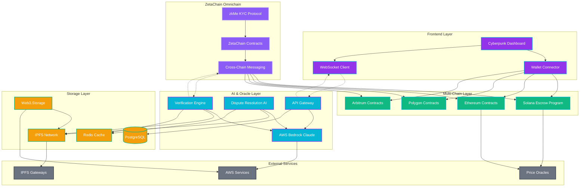

# Architecture

## System Architecture Diagram

## Component Interactions

### Escrow Creation Flow
1. **User Interface**: User initiates escrow creation through cyberpunk dashboard
2. **Wallet Integration**: Wallet connector handles transaction signing
3. **Smart Contract**: Escrow program creates PDA and locks funds
4. **Cross-Chain Sync**: ZetaChain propagates escrow state across chains
5. **Storage**: Escrow metadata stored on IPFS with hash recorded on-chain

### AI Verification Process
1. **Evidence Submission**: Files uploaded to IPFS via Web3.Storage
2. **Verification Trigger**: Smart contract emits verification request event
3. **AI Processing**: Bedrock Claude analyzes evidence and task requirements
4. **Decision Logic**: Verification engine processes AI output and confidence scores
5. **Result Storage**: Verification results cached and stored on-chain

### zkMe KYC Integration
1. **Identity Request**: User initiates KYC through zkMe SDK
2. **Proof Generation**: Zero-knowledge proofs generated client-side
3. **ZetaChain Verification**: Proofs verified on ZetaChain omnichain
4. **Cross-Chain Sync**: KYC status synchronized across all supported chains
5. **Compliance Check**: Escrow operations validate KYC requirements

### Dispute Resolution Workflow
1. **Dispute Detection**: AI monitors for verification failures and conflicts
2. **Evidence Analysis**: Bedrock processes all submitted evidence
3. **Multi-Tier Resolution**: Automated, AI-assisted, or human arbitration
4. **Decision Execution**: Resolution automatically executed on-chain
5. **Cross-Chain Update**: Dispute outcomes synchronized across chains

## Security Architecture

### Multi-Layer Security
- **Smart Contract Security**: Formal verification and audit processes
- **AI Security**: Input validation and output verification for AI systems
- **Privacy Protection**: Zero-knowledge proofs and encrypted storage
- **Access Control**: Role-based permissions and time-locked operations
- **Cross-Chain Security**: Verified messaging and state synchronization

### Threat Mitigation
- **Reentrancy Protection**: Checks-effects-interactions pattern
- **Oracle Manipulation**: Multiple price feed sources and validation
- **AI Manipulation**: Confidence thresholds and human oversight
- **Cross-Chain Attacks**: Message verification and replay protection
- **Privacy Breaches**: Client-side proof generation and encrypted storage

This architecture ensures scalability, security, and interoperability while maintaining the cyberpunk aesthetic and user experience that defines AetherLock Protocol.