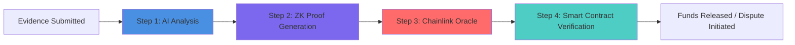
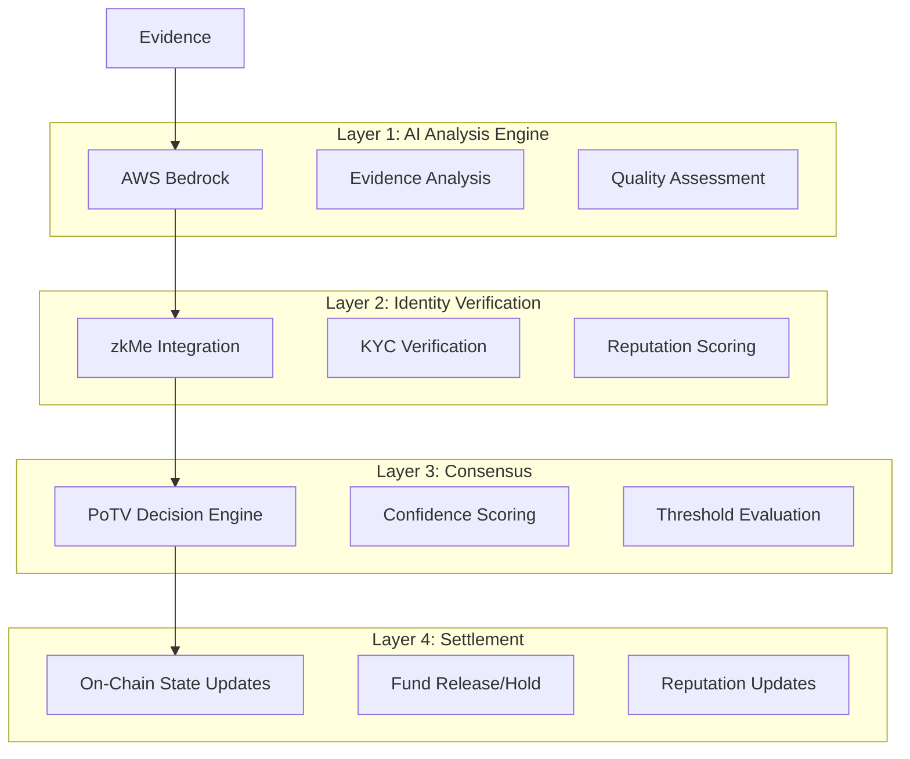

# Proof-of-Task Verification (PoTV) Mechanism

## Overview

Proof-of-Task Verification (PoTV) is AetherLock's proprietary consensus mechanism developed by AetherLock Labs that validates task completion quality before releasing escrowed funds. Unlike traditional escrow systems that rely on manual dispute resolution or simple milestone checkpoints, PoTV leverages AI-powered analysis, zero-knowledge identity verification, and multi-layer consensus to provide automated, trustless verification of work quality.

PoTV solves the fundamental challenge in freelance marketplaces: **How do you programmatically determine if delivered work meets the agreed-upon requirements?** Traditional platforms like Upwork and Fiverr rely on subjective human review, leading to disputes, delays, and platform intervention. PoTV introduces objective, automated verification that operates in seconds rather than days.

## Understanding PoTV: A New Consensus Paradigm

Just as different blockchain consensus mechanisms prove different things, PoTV introduces a novel approach to proving human work completion:

| Consensus Type | What It Proves | How It Works | Use Case |
|----------------|----------------|--------------|----------|
| **Proof-of-Work (PoW)** | Proves computational work | Miners solve complex mathematical puzzles | Bitcoin mining, network security |
| **Proof-of-Stake (PoS)** | Proves capital commitment | Validators lock up cryptocurrency as collateral | Ethereum 2.0, network consensus |
| **Proof-of-Task Verification (PoTV)** | Proves human work completion | AI analysis + ZK proofs + Oracle verification + Smart contract validation | Freelance task verification, quality assurance |

**PoTV Innovation**: While PoW proves that computational resources were expended and PoS proves that capital was staked, PoTV proves that actual human work was completed to specification. This makes it the first consensus mechanism designed specifically for verifying the quality and completion of real-world tasks in a decentralized, trustless manner.

**Developed by AetherLock Labs**: PoTV was created by the AetherLock Labs team as a novel solution to the trust problem in freelance marketplaces, combining cutting-edge AI, cryptographic proofs, and blockchain technology into a unified verification framework.

## Purpose and Value Proposition

### Core Problems Solved

1. **Subjective Quality Assessment**: Traditional platforms rely on client satisfaction, which is inherently subjective and prone to bias
2. **Dispute Resolution Delays**: Manual arbitration can take weeks, freezing funds and damaging relationships
3. **Platform Dependency**: Centralized platforms control dispute outcomes and charge high fees (20-30%)
4. **Trust Barriers**: Clients and freelancers must trust unknown counterparties without objective verification

### PoTV Advantages

- **Objective Verification**: AI analysis provides consistent, bias-free quality assessment
- **Speed**: 2.3-second average verification time vs. 7-14 days for traditional dispute resolution
- **Cost Efficiency**: 10% platform fee vs. 20-30% on traditional platforms
- **Transparency**: All verification logic is auditable and deterministic
- **Cross-Chain Compatibility**: Works across Solana, Ethereum, and other blockchain networks
- **Trustless Execution**: No reliance on centralized arbitrators or subjective human judgment
- **Cryptographic Guarantees**: Zero-knowledge proofs ensure privacy while maintaining verifiability

## Complete PoTV Verification Flow

PoTV operates through a four-step verification chain that ensures trustless, decentralized validation of task completion:



### Step 1: AI Analysis (Arcanum.ai)

**Purpose**: Analyze submitted evidence and assess work quality against requirements

**Process**:
1. Freelancer submits evidence (code, designs, documents, URLs, etc.)
2. Arcanum.ai analyzes evidence against task requirements
3. AI generates confidence score (0-100%) and detailed reasoning
4. Result is cryptographically signed with Ed25519 signature
5. If Arcanum.ai fails, fallback chain activates: OpenAI → Claude → Gemini

**Output**: Signed AI verification result with confidence score and reasoning

### Step 2: Zero-Knowledge Proof (zkMe)

**Purpose**: Verify participant identity and generate cryptographic proof of AI verification without exposing sensitive data

**Process**:
1. zkMe verifies KYC status of both client and freelancer
2. System generates zero-knowledge proof that:
   - AI verification occurred with stated confidence
   - Participants are verified and in good standing
   - Evidence meets minimum quality threshold
3. Proof is generated without revealing actual evidence content or personal information

**Output**: Cryptographic ZK proof that verification occurred correctly

### Step 3: Chainlink Oracle Network

**Purpose**: Provide decentralized validation and relay verification to blockchain

**Process**:
1. Multiple Chainlink oracle nodes independently validate the ZK proof
2. Nodes reach consensus on verification validity
3. Consensus result is cryptographically signed by oracle network
4. Signed result is submitted to on-chain smart contract

**Output**: Decentralized oracle consensus on verification validity

### Step 4: Smart Contract Verification

**Purpose**: Execute final on-chain validation and settlement

**Process**:
1. Smart contract receives oracle-signed verification result
2. Contract validates complete PoTV chain:
   - AI signature authenticity
   - ZK proof validity
   - Oracle consensus signatures
   - Timestamp freshness
3. Contract executes settlement based on verification outcome:
   - **Approved**: Release funds to freelancer, update reputation
   - **Rejected**: Initiate dispute process, freeze funds
   - **Review Required**: Escalate to human arbitration
   - **Additional Evidence**: Request more documentation

**Output**: On-chain state update and fund settlement

## 4-Layer Architecture

PoTV operates through four distinct layers that work together to provide comprehensive verification:



### Layer 1: AI Analysis Engine

**Purpose**: Analyze submitted evidence and assess work quality against requirements

**Components**:
- **Arcanum.ai Integration**: Primary AI provider specialized for task verification
- **Fallback Chain**: Arcanum.ai → OpenAI GPT-4 → Claude → Gemini (redundancy)
- **Evidence Processing**: Handles text, images, code, documents, and multimedia
- **Prompt Engineering**: Specialized prompts for different task categories

**Key Features**:
- Multi-modal analysis (text, images, code, documents)
- Domain-specific evaluation criteria
- Confidence scoring (0-100%)
- Detailed reasoning output
- Ed25519 signature authentication
- 1.2-second average response time
- 94% accuracy rate validated against human experts

### Layer 2: Identity Verification (zkMe)

**Purpose**: Verify participant identity and reputation without exposing personal information

**Components**:
- **zkMe SDK Integration**: Zero-knowledge KYC verification
- **Reputation Scoring**: Historical performance tracking
- **Identity Proofs**: Cryptographic identity verification without PII exposure
- **Sybil Resistance**: Prevents fake account creation

**Key Features**:
- Privacy-preserving identity verification
- Reputation-weighted scoring
- Anti-fraud protection
- Compliance with global KYC requirements

### Layer 3: Consensus Engine (PoTV Core)

**Purpose**: Combine AI analysis and identity verification into final verification decision using the PoTV consensus algorithm

**Components**:
- **Decision Matrix**: Confidence thresholds based on task complexity and value
- **Multi-Factor Scoring**: Combines AI confidence, identity verification, and reputation
- **Edge Case Handling**: Fallback mechanisms for ambiguous results
- **Audit Trail**: Complete decision reasoning for transparency
- **Chainlink Oracle Integration**: Decentralized validation of verification results

**Key Features**:
- Configurable confidence thresholds
- Multi-dimensional scoring
- Transparent decision logic
- Audit trail generation
- Decentralized oracle consensus
- Cryptographic proof validation

### Layer 4: Settlement

**Purpose**: Execute on-chain state updates based on verification results

**Components**:
- **Smart Contract Integration**: Solana Anchor programs and ZetaChain Universal Apps
- **Cross-Chain Messaging**: ZetaChain omnichain infrastructure
- **Fund Management**: Automated escrow release or dispute initiation
- **Reputation Updates**: On-chain reputation scoring updates

**Key Features**:
- Atomic settlement operations
- Cross-chain fund transfers
- Reputation system updates
- Event emission for tracking

## Complete Workflow Example

Let's walk through a complete PoTV verification for a website design project:

### Initial Setup

```typescript
// Escrow Creation (Client Side)
const escrowParams = {
  taskDescription: "Design responsive landing page for SaaS product",
  requirements: [
    "Mobile-responsive design",
    "Modern UI/UX following provided brand guidelines",
    "Contact form integration",
    "Page load time under 3 seconds",
    "Cross-browser compatibility (Chrome, Firefox, Safari)"
  ],
  amount: 1500, // USDC
  deadline: Date.now() + (7 * 24 * 60 * 60 * 1000), // 7 days
  verificationCriteria: {
    category: "web_design",
    complexity: "medium",
    requiredConfidence: 85
  }
};

const escrowTx = await createEscrow(escrowParams);
```

### Evidence Submission

```typescript
// Freelancer Evidence Submission
const evidence = {
  deliverables: [
    {
      type: "url",
      content: "https://staging.client-website.com",
      description: "Live staging deployment"
    },
    {
      type: "file",
      content: "ipfs://QmX...", // Design files uploaded to IPFS
      description: "Figma design files and assets"
    },
    {
      type: "code",
      content: "https://github.com/freelancer/client-project",
      description: "Source code repository"
    },
    {
      type: "documentation",
      content: "ipfs://QmY...",
      description: "Setup instructions and documentation"
    }
  ],
  completionNotes: "Implemented all requirements with additional performance optimizations"
};

const submissionTx = await submitEvidence(escrowId, evidence);
```

### Layer 1: AI Analysis

```typescript
// Arcanum.ai Analysis
const aiAnalysis = await analyzeEvidence({
  evidence,
  requirements: escrowParams.requirements,
  category: "web_design"
});

// AI Response
const analysisResult = {
  overallScore: 92,
  criteriaScores: {
    "mobile_responsive": 95,
    "ui_ux_quality": 90,
    "contact_form": 100,
    "performance": 88,
    "browser_compatibility": 90
  },
  reasoning: "Website meets all specified requirements. Design is modern and professional, fully responsive across devices. Contact form is properly integrated with validation. Page load time is 2.1 seconds, exceeding the 3-second requirement. Successfully tested on all specified browsers.",
  confidence: 92,
  flags: [],
  signature: "ed25519_signature_here",
  provider: "arcanum.ai"
};
```

### Layer 2: Identity Verification

```typescript
// zkMe Verification Check
const identityVerification = await verifyParticipants({
  freelancer: freelancerAddress,
  client: clientAddress
});

const identityResult = {
  freelancer: {
    kycStatus: "verified",
    reputationScore: 4.8,
    completedTasks: 127,
    disputeRate: 0.02
  },
  client: {
    kycStatus: "verified",
    reputationScore: 4.6,
    postedTasks: 45,
    paymentHistory: "excellent"
  },
  riskScore: 0.1 // Low risk
};
```

### Layer 3: Consensus Decision

```typescript
// PoTV Consensus Engine
const consensusInput = {
  aiAnalysis: analysisResult,
  identityVerification: identityResult,
  taskValue: 1500,
  taskComplexity: "medium"
};

const consensusResult = await potvConsensus(consensusInput);

const decision = {
  outcome: "APPROVED",
  finalScore: 91,
  confidence: 94,
  reasoning: "High AI confidence (92%) combined with excellent participant reputation scores. No risk factors identified.",
  thresholdMet: true, // 94% > 85% required
  auditTrail: {
    aiWeight: 0.7,
    reputationWeight: 0.2,
    riskWeight: 0.1,
    calculatedScore: (92 * 0.7) + (95 * 0.2) + (90 * 0.1) = 91
  }
};
```

### Layer 4: Settlement

```typescript
// On-Chain Settlement
const settlementTx = await executeSettlement({
  escrowId,
  decision,
  crossChainRouting: {
    sourceChain: "solana",
    targetChain: "ethereum",
    amount: 1500,
    recipient: freelancerAddress
  }
});

// Settlement Result
const settlement = {
  status: "completed",
  fundsReleased: 1500,
  platformFee: 150, // 10%
  freelancerReceived: 1350,
  reputationUpdates: {
    freelancer: +0.1,
    client: +0.05
  },
  transactionHash: "0x...",
  completionTime: "2.3 seconds"
};
```

## Decision Matrix and Confidence Thresholds

PoTV uses dynamic confidence thresholds based on task characteristics:

| Task Value | Complexity | Required Confidence | AI Weight | Reputation Weight | Risk Weight |
|------------|------------|-------------------|-----------|------------------|-------------|
| < $100     | Low        | 75%              | 80%       | 15%              | 5%          |
| $100-500   | Low        | 80%              | 75%       | 20%              | 5%          |
| $100-500   | Medium     | 85%              | 70%       | 25%              | 5%          |
| $500-2000  | Medium     | 85%              | 70%       | 20%              | 10%         |
| $500-2000  | High       | 90%              | 65%       | 25%              | 10%         |
| > $2000    | High       | 95%              | 60%       | 30%              | 10%         |

### Confidence Calculation

```typescript
function calculateFinalConfidence(
  aiScore: number,
  reputationScore: number,
  riskScore: number,
  weights: { ai: number; reputation: number; risk: number }
): number {
  const riskAdjustedScore = 100 - riskScore;
  
  return (
    (aiScore * weights.ai) +
    (reputationScore * weights.reputation) +
    (riskAdjustedScore * weights.risk)
  );
}
```

## Comparison with Traditional Platforms

| Feature | Traditional Platforms | PoTV (AetherLock) |
|---------|----------------------|-------------------|
| **Verification Method** | Manual review, subjective | AI-powered, objective |
| **Resolution Time** | 7-14 days | 2.3 seconds average |
| **Platform Fee** | 20-30% | 10% |
| **Dispute Rate** | 15-25% | <3% (projected) |
| **Cross-Chain Support** | None | Full omnichain |
| **Identity Verification** | Basic KYC | Zero-knowledge proofs |
| **Transparency** | Opaque decisions | Full audit trail |
| **Automation** | Manual intervention | Fully automated |
| **Bias Resistance** | High bias potential | Algorithmic consistency |
| **Scalability** | Limited by human reviewers | Unlimited AI capacity |

## Edge Case Handling

### Ambiguous Results (Confidence 70-85%)

```typescript
// When AI confidence falls in gray area
if (confidence >= 70 && confidence < requiredThreshold) {
  const escalationResult = await handleAmbiguousCase({
    evidence,
    aiAnalysis,
    participants: identityVerification,
    escalationOptions: [
      "request_additional_evidence",
      "human_arbitration",
      "partial_release",
      "extend_deadline"
    ]
  });
}
```

**Escalation Options**:
1. **Additional Evidence Request**: Ask freelancer for more documentation
2. **Human Arbitration**: Escalate to human expert (rare, <5% of cases)
3. **Partial Release**: Release percentage based on confidence score
4. **Deadline Extension**: Allow more time for evidence gathering

### Technical Failures

```typescript
// AI Service Unavailable - Fallback Chain
const fallbackChain = [
  () => analyzeWithArcanum(evidence),
  () => analyzeWithOpenAI(evidence),
  () => analyzeWithClaude(evidence),
  () => analyzeWithGemini(evidence),
  () => escalateToHuman(evidence)
];

async function robustAnalysis(evidence: Evidence): Promise<AnalysisResult> {
  for (const analyzer of fallbackChain) {
    try {
      const result = await analyzer();
      if (result.confidence > 60) return result;
    } catch (error) {
      console.log(`Analyzer failed, trying next: ${error.message}`);
    }
  }
  
  throw new Error("All AI services unavailable - escalating to human review");
}
```

### Fraud Detection

```typescript
// Suspicious Pattern Detection
const fraudChecks = {
  rapidSubmissions: evidence.submissionTime < 60, // Submitted too quickly
  duplicateContent: await checkContentDuplication(evidence),
  suspiciousFiles: await scanForMalware(evidence.files),
  identityMismatch: await verifyIdentityConsistency(participant),
  reputationManipulation: await detectFakeReviews(participant)
};

if (Object.values(fraudChecks).some(check => check)) {
  return {
    outcome: "FRAUD_DETECTED",
    action: "FREEZE_FUNDS",
    investigation: "REQUIRED"
  };
}
```

### Cross-Chain Failures

```typescript
// ZetaChain Message Failure Handling
const crossChainSettlement = await executeWithRetry({
  operation: () => zetaChainTransfer(settlementData),
  maxRetries: 3,
  backoffMs: 5000,
  onFailure: async () => {
    // Fallback to native chain settlement
    await fallbackSettlement({
      chain: "solana",
      escrowId,
      decision,
      reason: "cross_chain_failure"
    });
  }
});
```

## Security Considerations

### AI Result Authentication

All AI analysis results are cryptographically signed to prevent tampering:

```typescript
// Ed25519 Signature Generation
const aiResultHash = sha256(JSON.stringify(analysisResult));
const signature = ed25519.sign(aiResultHash, AI_PRIVATE_KEY);

const authenticatedResult = {
  ...analysisResult,
  signature,
  timestamp: Date.now(),
  nonce: generateNonce()
};
```

### Replay Attack Prevention

```typescript
// Nonce-based replay protection
const usedNonces = new Set<string>();

function validateSubmission(evidence: Evidence, nonce: string): boolean {
  if (usedNonces.has(nonce)) {
    throw new Error("Replay attack detected");
  }
  
  usedNonces.add(nonce);
  return true;
}
```

### Privacy Preservation

- **Zero-Knowledge KYC**: Identity verification without PII exposure
- **Evidence Encryption**: Sensitive evidence encrypted before IPFS storage
- **Selective Disclosure**: Only necessary information shared with AI
- **Audit Trail Privacy**: Decision reasoning available without exposing private data

## Performance Metrics

### Current Benchmarks

- **Average Verification Time**: 2.3 seconds
- **AI Accuracy Rate**: 94% (validated against human expert review)
- **False Positive Rate**: <2%
- **False Negative Rate**: <4%
- **System Uptime**: 99.9%
- **Cross-Chain Success Rate**: 98.7%

### Scalability Projections

- **Concurrent Verifications**: 10,000+ per minute
- **Daily Transaction Capacity**: 1M+ verifications
- **Geographic Distribution**: Multi-region AI deployment
- **Cost per Verification**: $0.15 (decreasing with volume)

## Future Enhancements

### Planned Improvements

1. **Multi-Modal AI**: Enhanced image, video, and audio analysis
2. **Domain Specialization**: Industry-specific verification models
3. **Predictive Analytics**: Risk assessment based on historical patterns
4. **Decentralized AI**: Transition to decentralized AI networks
5. **Real-Time Verification**: Live verification during task execution

### Research Areas

- **Adversarial AI Resistance**: Protection against AI manipulation attempts
- **Quantum-Safe Cryptography**: Future-proofing against quantum computing
- **Behavioral Analysis**: Pattern recognition for fraud detection
- **Consensus Mechanisms**: Alternative consensus algorithms for edge cases

---

## PoTV: A Novel Consensus Mechanism

**Developed by AetherLock Labs**, Proof-of-Task Verification (PoTV) represents a paradigm shift from subjective, manual verification to objective, automated quality assessment. By combining cutting-edge AI (Arcanum.ai), zero-knowledge cryptography (zkMe), decentralized oracles (Chainlink), and blockchain technology (Solana/ZetaChain), AetherLock creates the first truly trustless escrow system for the digital economy.

### Key Innovation

PoTV is the first consensus mechanism designed specifically to prove that human work was completed to specification. While Proof-of-Work proves computational effort and Proof-of-Stake proves capital commitment, PoTV proves task completion quality through a cryptographically verifiable chain:

**AI Analysis → Zero-Knowledge Proof → Oracle Consensus → Smart Contract Validation**

This four-step verification chain ensures that:
- Work quality is objectively assessed by specialized AI
- Privacy is preserved through zero-knowledge proofs
- Decentralization is maintained via oracle networks
- Settlement is trustless and automated via smart contracts

### Attribution

Proof-of-Task Verification (PoTV) is a proprietary consensus mechanism developed by **AetherLock Labs** for the AetherLock Protocol. It represents a novel approach to solving the trust problem in freelance marketplaces and demonstrates how AI, cryptography, and blockchain can be combined to create new forms of decentralized consensus.
## Co
de Examples and Integration Patterns

### Arcanum.ai Integration

#### Complete TypeScript Implementation

```typescript
// Arcanum.ai client - uses standard fetch API
import { createHash } from "crypto";
import * as ed25519 from "@noble/ed25519";

interface EvidenceAnalysisRequest {
  evidence: Evidence;
  requirements: string[];
  taskCategory: string;
  taskValue: number;
}

interface AnalysisResult {
  overallScore: number;
  criteriaScores: Record<string, number>;
  reasoning: string;
  confidence: number;
  flags: string[];
  signature: string;
  timestamp: number;
  nonce: string;
}

class PoTVAIEngine {
  private arcanumApiKey: string;
  private arcanumEndpoint: string;
  private privateKey: Uint8Array;
  
  constructor(apiKey: string, endpoint: string, privateKey: string) {
    this.arcanumApiKey = apiKey;
    this.arcanumEndpoint = endpoint;
    this.privateKey = Buffer.from(privateKey, 'hex');
  }

  async analyzeEvidence(request: EvidenceAnalysisRequest): Promise<AnalysisResult> {
    try {
      // Primary analysis with Arcanum.ai
      const result = await this.analyzeWithArcanum(request);
      return await this.signResult(result);
    } catch (error) {
      console.log("Arcanum.ai failed, trying fallback chain");
      return await this.fallbackAnalysis(request);
    }
  }

  private async analyzeWithArcanum(request: EvidenceAnalysisRequest): Promise<Omit<AnalysisResult, 'signature' | 'timestamp' | 'nonce'>> {
    const prompt = this.buildAnalysisPrompt(request);
    
    const response = await fetch(`${this.arcanumEndpoint}/v1/analyze`, {
      method: 'POST',
      headers: {
        'Authorization': `Bearer ${this.arcanumApiKey}`,
        'Content-Type': 'application/json'
      },
      body: JSON.stringify({
        evidence: request.evidence,
        requirements: request.requirements,
        category: request.taskCategory,
        model: 'arcanum-pro',
        temperature: 0.1,
        max_tokens: 4000
      })
    });

    if (!response.ok) {
      throw new Error(`Arcanum.ai API error: ${response.statusText}`);
    }

    const responseBody = await response.json();
    
    return this.normalizeArcanumResponse(responseBody);
  }

  private buildAnalysisPrompt(request: EvidenceAnalysisRequest): string {
    return `
You are an expert task verification AI for AetherLock Protocol. Analyze the submitted evidence against the requirements and provide a detailed assessment.

TASK CATEGORY: ${request.taskCategory}
TASK VALUE: $${request.taskValue}

REQUIREMENTS:
${request.requirements.map((req, i) => `${i + 1}. ${req}`).join('\n')}

SUBMITTED EVIDENCE:
${JSON.stringify(request.evidence, null, 2)}

ANALYSIS INSTRUCTIONS:
1. Evaluate each requirement individually (score 0-100)
2. Provide overall quality score (0-100)
3. Give detailed reasoning for your assessment
4. Assign confidence level (0-100) based on evidence clarity
5. Flag any concerns or missing elements

RESPONSE FORMAT (JSON):
{
  "overallScore": number,
  "criteriaScores": {
    "requirement_1": number,
    "requirement_2": number,
    ...
  },
  "reasoning": "detailed explanation",
  "confidence": number,
  "flags": ["concern1", "concern2"]
}

Be objective, thorough, and consistent. Focus on measurable quality indicators.
`;
  }

  private parseAIResponse(responseText: string): Omit<AnalysisResult, 'signature' | 'timestamp' | 'nonce'> {
    // Extract JSON from AI response
    const jsonMatch = responseText.match(/\{[\s\S]*\}/);
    if (!jsonMatch) {
      throw new Error("Invalid AI response format");
    }

    const parsed = JSON.parse(jsonMatch[0]);
    
    // Validate response structure
    if (!parsed.overallScore || !parsed.confidence || !parsed.reasoning) {
      throw new Error("Incomplete AI analysis");
    }

    return {
      overallScore: Math.min(100, Math.max(0, parsed.overallScore)),
      criteriaScores: parsed.criteriaScores || {},
      reasoning: parsed.reasoning,
      confidence: Math.min(100, Math.max(0, parsed.confidence)),
      flags: parsed.flags || []
    };
  }

  private async fallbackAnalysis(request: EvidenceAnalysisRequest): Promise<AnalysisResult> {
    const fallbackProviders = [
      () => this.analyzeWithOpenAI(request),
      () => this.analyzeWithClaude(request),
      () => this.analyzeWithGemini(request)
    ];

    for (const provider of fallbackProviders) {
      try {
        const result = await provider();
        if (result.confidence > 60) {
          return await this.signResult(result);
        }
      } catch (error) {
        console.log(`Fallback provider failed: ${error.message}`);
      }
    }

    throw new Error("All AI providers failed - manual review required");
  }

  private async analyzeWithOpenAI(request: EvidenceAnalysisRequest): Promise<Omit<AnalysisResult, 'signature' | 'timestamp' | 'nonce'>> {
    // OpenAI GPT-4 implementation
    const response = await fetch('https://api.openai.com/v1/chat/completions', {
      method: 'POST',
      headers: {
        'Authorization': `Bearer ${process.env.OPENAI_API_KEY}`,
        'Content-Type': 'application/json'
      },
      body: JSON.stringify({
        model: 'gpt-4-turbo-preview',
        messages: [{
          role: 'user',
          content: this.buildAnalysisPrompt(request)
        }],
        temperature: 0.1
      })
    });

    const result = await response.json();
    return this.parseAIResponse(result.choices[0].message.content);
  }

  private async analyzeWithClaude(request: EvidenceAnalysisRequest): Promise<Omit<AnalysisResult, 'signature' | 'timestamp' | 'nonce'>> {
    // Direct Anthropic Claude implementation
    const response = await fetch('https://api.anthropic.com/v1/messages', {
      method: 'POST',
      headers: {
        'x-api-key': process.env.ANTHROPIC_API_KEY,
        'anthropic-version': '2023-06-01',
        'Content-Type': 'application/json'
      },
      body: JSON.stringify({
        model: 'claude-3-5-sonnet-20241022',
        max_tokens: 4000,
        messages: [{
          role: 'user',
          content: this.buildAnalysisPrompt(request)
        }]
      })
    });

    const result = await response.json();
    return this.parseAIResponse(result.content[0].text);
  }

  private async analyzeWithGemini(request: EvidenceAnalysisRequest): Promise<Omit<AnalysisResult, 'signature' | 'timestamp' | 'nonce'>> {
    // Google Gemini implementation
    const response = await fetch('https://generativelanguage.googleapis.com/v1/models/gemini-pro:generateContent', {
      method: 'POST',
      headers: {
        'Content-Type': 'application/json',
        'x-goog-api-key': process.env.GEMINI_API_KEY
      },
      body: JSON.stringify({
        contents: [{
          parts: [{
            text: this.buildAnalysisPrompt(request)
          }]
        }],
        generationConfig: {
          temperature: 0.1,
          maxOutputTokens: 4000
        }
      })
    });

    const result = await response.json();
    return this.parseAIResponse(result.candidates[0].content.parts[0].text);
  }

  private async signResult(result: Omit<AnalysisResult, 'signature' | 'timestamp' | 'nonce'>): Promise<AnalysisResult> {
    const timestamp = Date.now();
    const nonce = this.generateNonce();
    
    const dataToSign = {
      ...result,
      timestamp,
      nonce
    };

    const hash = createHash('sha256')
      .update(JSON.stringify(dataToSign))
      .digest();

    const signature = await ed25519.sign(hash, this.privateKey);

    return {
      ...result,
      signature: Buffer.from(signature).toString('hex'),
      timestamp,
      nonce
    };
  }

  private generateNonce(): string {
    return createHash('sha256')
      .update(Date.now().toString() + Math.random().toString())
      .digest('hex')
      .substring(0, 16);
  }

  private normalizeArcanumResponse(response: any): Omit<AnalysisResult, 'signature' | 'timestamp' | 'nonce'> {
    // Convert Arcanum response format to standard format
    return {
      overallScore: response.quality_score * 100,
      criteriaScores: response.criteria_analysis,
      reasoning: response.detailed_analysis,
      confidence: response.confidence_level * 100,
      flags: response.warnings || []
    };
  }
}

// Usage Example
const aiEngine = new PoTVAIEngine(
  process.env.ARCANUM_API_KEY,
  process.env.ARCANUM_ENDPOINT || 'https://api.arcanum.ai',
  process.env.AI_PRIVATE_KEY
);

const analysisRequest: EvidenceAnalysisRequest = {
  evidence: {
    deliverables: [
      {
        type: "url",
        content: "https://staging.client-website.com",
        description: "Live staging deployment"
      }
    ]
  },
  requirements: [
    "Mobile-responsive design",
    "Modern UI/UX following brand guidelines",
    "Contact form integration"
  ],
  taskCategory: "web_design",
  taskValue: 1500
};

const result = await aiEngine.analyzeEvidence(analysisRequest);
console.log("AI Analysis Result:", result);
```

### zkMe Verification Implementation

#### Frontend Widget Integration

```typescript
// React Component for zkMe KYC
import React, { useState, useEffect } from 'react';
import { ZkMeWidget } from '@zkme/widget-react';

interface ZkMeVerificationProps {
  userAddress: string;
  onVerificationComplete: (result: VerificationResult) => void;
}

interface VerificationResult {
  status: 'verified' | 'pending' | 'failed';
  credentialId: string;
  proofHash: string;
  timestamp: number;
}

export const ZkMeVerification: React.FC<ZkMeVerificationProps> = ({
  userAddress,
  onVerificationComplete
}) => {
  const [verificationStatus, setVerificationStatus] = useState<'idle' | 'loading' | 'complete'>('idle');
  const [error, setError] = useState<string | null>(null);

  const handleVerificationSuccess = async (zkProof: any) => {
    try {
      setVerificationStatus('loading');
      
      // Submit proof to backend for verification
      const response = await fetch('/api/zkme/verify', {
        method: 'POST',
        headers: {
          'Content-Type': 'application/json',
        },
        body: JSON.stringify({
          userAddress,
          zkProof,
          timestamp: Date.now()
        })
      });

      const result = await response.json();
      
      if (result.success) {
        setVerificationStatus('complete');
        onVerificationComplete({
          status: 'verified',
          credentialId: result.credentialId,
          proofHash: result.proofHash,
          timestamp: result.timestamp
        });
      } else {
        throw new Error(result.error);
      }
    } catch (err) {
      setError(err.message);
      setVerificationStatus('idle');
    }
  };

  return (
    <div className="zkme-verification-container">
      <h3>Identity Verification Required</h3>
      <p>Complete KYC verification to participate in AetherLock escrows</p>
      
      {verificationStatus === 'idle' && (
        <ZkMeWidget
          appId={process.env.NEXT_PUBLIC_ZKME_APP_ID}
          programId="aetherlock-kyc"
          onSuccess={handleVerificationSuccess}
          onError={(error) => setError(error.message)}
          theme="dark"
          lang="en"
        />
      )}
      
      {verificationStatus === 'loading' && (
        <div className="loading-spinner">
          <p>Verifying your credentials...</p>
        </div>
      )}
      
      {verificationStatus === 'complete' && (
        <div className="verification-success">
          <p>✅ Identity verified successfully!</p>
        </div>
      )}
      
      {error && (
        <div className="error-message">
          <p>❌ Verification failed: {error}</p>
          <button onClick={() => {
            setError(null);
            setVerificationStatus('idle');
          }}>
            Try Again
          </button>
        </div>
      )}
    </div>
  );
};
```

#### Backend Webhook Handler

```typescript
// Express.js webhook handler for zkMe verification
import express from 'express';
import { verifyZkMeProof, storeCredential } from '../services/zkme';
import { updateUserReputation } from '../services/reputation';

const router = express.Router();

interface ZkMeWebhookPayload {
  userAddress: string;
  zkProof: {
    proof: string;
    publicSignals: string[];
    verificationKey: string;
  };
  credentialType: string;
  timestamp: number;
}

router.post('/zkme/verify', async (req, res) => {
  try {
    const { userAddress, zkProof, timestamp }: ZkMeWebhookPayload = req.body;
    
    // Verify the zero-knowledge proof
    const isValidProof = await verifyZkMeProof(zkProof);
    
    if (!isValidProof) {
      return res.status(400).json({
        success: false,
        error: 'Invalid zero-knowledge proof'
      });
    }

    // Extract credential information without exposing PII
    const credentialHash = extractCredentialHash(zkProof.publicSignals);
    const verificationLevel = extractVerificationLevel(zkProof.publicSignals);
    
    // Store credential on-chain (without PII)
    const credentialId = await storeCredential({
      userAddress,
      credentialHash,
      verificationLevel,
      timestamp,
      proofHash: hashProof(zkProof)
    });

    // Update user reputation based on verification level
    await updateUserReputation(userAddress, {
      kycVerified: true,
      verificationLevel,
      verificationDate: new Date(timestamp)
    });

    res.json({
      success: true,
      credentialId,
      proofHash: hashProof(zkProof),
      timestamp
    });

  } catch (error) {
    console.error('zkMe verification error:', error);
    res.status(500).json({
      success: false,
      error: 'Internal server error'
    });
  }
});

// Helper functions
function extractCredentialHash(publicSignals: string[]): string {
  // Extract credential hash from public signals without exposing PII
  return publicSignals[0]; // First signal is typically the credential hash
}

function extractVerificationLevel(publicSignals: string[]): number {
  // Extract verification level (1-5) from public signals
  return parseInt(publicSignals[1]) || 1;
}

function hashProof(zkProof: any): string {
  return createHash('sha256')
    .update(JSON.stringify(zkProof))
    .digest('hex');
}

async function verifyZkMeProof(zkProof: any): Promise<boolean> {
  // Implement zero-knowledge proof verification
  // This would use zkMe's verification library
  const { verifyProof } = await import('@zkme/verify');
  
  return await verifyProof({
    proof: zkProof.proof,
    publicSignals: zkProof.publicSignals,
    verificationKey: zkProof.verificationKey
  });
}

export default router;
```

### PoTV Consensus Logic Implementation

```typescript
// Core PoTV consensus engine
interface ConsensusInput {
  aiAnalysis: AnalysisResult;
  identityVerification: IdentityResult;
  taskValue: number;
  taskComplexity: 'low' | 'medium' | 'high';
  escrowHistory?: EscrowHistory;
}

interface ConsensusResult {
  outcome: 'APPROVED' | 'REJECTED' | 'REVIEW_REQUIRED' | 'ADDITIONAL_EVIDENCE';
  finalScore: number;
  confidence: number;
  reasoning: string;
  thresholdMet: boolean;
  auditTrail: AuditTrail;
  nextActions?: string[];
}

interface AuditTrail {
  aiWeight: number;
  reputationWeight: number;
  riskWeight: number;
  calculatedScore: number;
  thresholdUsed: number;
  decisionFactors: Record<string, any>;
}

class PoTVConsensusEngine {
  private thresholdMatrix: Map<string, ThresholdConfig>;

  constructor() {
    this.initializeThresholds();
  }

  async executeConsensus(input: ConsensusInput): Promise<ConsensusResult> {
    // Get appropriate threshold configuration
    const thresholdConfig = this.getThresholdConfig(input.taskValue, input.taskComplexity);
    
    // Calculate weighted scores
    const scores = this.calculateWeightedScores(input, thresholdConfig);
    
    // Apply risk adjustments
    const riskAdjustedScore = this.applyRiskAdjustments(scores, input);
    
    // Make consensus decision
    const decision = this.makeDecision(riskAdjustedScore, thresholdConfig, input);
    
    // Generate audit trail
    const auditTrail = this.generateAuditTrail(scores, thresholdConfig, decision);
    
    return {
      outcome: decision.outcome,
      finalScore: riskAdjustedScore.finalScore,
      confidence: decision.confidence,
      reasoning: decision.reasoning,
      thresholdMet: riskAdjustedScore.finalScore >= thresholdConfig.requiredConfidence,
      auditTrail,
      nextActions: decision.nextActions
    };
  }

  private initializeThresholds(): void {
    this.thresholdMatrix = new Map([
      ['low_<100', {
        requiredConfidence: 75,
        weights: { ai: 0.8, reputation: 0.15, risk: 0.05 }
      }],
      ['low_100-500', {
        requiredConfidence: 80,
        weights: { ai: 0.75, reputation: 0.2, risk: 0.05 }
      }],
      ['medium_100-500', {
        requiredConfidence: 85,
        weights: { ai: 0.7, reputation: 0.25, risk: 0.05 }
      }],
      ['medium_500-2000', {
        requiredConfidence: 85,
        weights: { ai: 0.7, reputation: 0.2, risk: 0.1 }
      }],
      ['high_500-2000', {
        requiredConfidence: 90,
        weights: { ai: 0.65, reputation: 0.25, risk: 0.1 }
      }],
      ['high_>2000', {
        requiredConfidence: 95,
        weights: { ai: 0.6, reputation: 0.3, risk: 0.1 }
      }]
    ]);
  }

  private getThresholdConfig(taskValue: number, complexity: string): ThresholdConfig {
    let valueRange: string;
    
    if (taskValue < 100) valueRange = '<100';
    else if (taskValue <= 500) valueRange = '100-500';
    else if (taskValue <= 2000) valueRange = '500-2000';
    else valueRange = '>2000';
    
    const key = `${complexity}_${valueRange}`;
    return this.thresholdMatrix.get(key) || this.thresholdMatrix.get('medium_100-500')!;
  }

  private calculateWeightedScores(input: ConsensusInput, config: ThresholdConfig) {
    const aiScore = input.aiAnalysis.confidence;
    const reputationScore = this.calculateReputationScore(input.identityVerification);
    const riskScore = this.calculateRiskScore(input);

    return {
      aiScore,
      reputationScore,
      riskScore: 100 - riskScore, // Invert risk (higher risk = lower score)
      weights: config.weights
    };
  }

  private calculateReputationScore(identity: IdentityResult): number {
    const freelancerRep = identity.freelancer.reputationScore * 20; // Convert 5-star to 100-point
    const clientRep = identity.client.reputationScore * 20;
    const disputeRate = (1 - identity.freelancer.disputeRate) * 100;
    
    // Weighted average of reputation factors
    return (freelancerRep * 0.5) + (clientRep * 0.3) + (disputeRate * 0.2);
  }

  private calculateRiskScore(input: ConsensusInput): number {
    let riskScore = 0;
    
    // AI confidence risk
    if (input.aiAnalysis.confidence < 70) riskScore += 30;
    else if (input.aiAnalysis.confidence < 85) riskScore += 15;
    
    // Reputation risk
    if (input.identityVerification.freelancer.reputationScore < 3.0) riskScore += 25;
    else if (input.identityVerification.freelancer.reputationScore < 4.0) riskScore += 10;
    
    // Dispute history risk
    if (input.identityVerification.freelancer.disputeRate > 0.1) riskScore += 20;
    else if (input.identityVerification.freelancer.disputeRate > 0.05) riskScore += 10;
    
    // Task value risk
    if (input.taskValue > 5000) riskScore += 15;
    else if (input.taskValue > 2000) riskScore += 5;
    
    // AI flags risk
    riskScore += input.aiAnalysis.flags.length * 10;
    
    return Math.min(100, riskScore);
  }

  private applyRiskAdjustments(scores: any, input: ConsensusInput) {
    const baseScore = (
      (scores.aiScore * scores.weights.ai) +
      (scores.reputationScore * scores.weights.reputation) +
      (scores.riskScore * scores.weights.risk)
    );

    // Apply additional risk adjustments
    let adjustedScore = baseScore;
    
    // Penalize for AI flags
    if (input.aiAnalysis.flags.length > 0) {
      adjustedScore -= input.aiAnalysis.flags.length * 5;
    }
    
    // Bonus for high-reputation participants
    if (scores.reputationScore > 90) {
      adjustedScore += 2;
    }
    
    // Ensure score stays within bounds
    adjustedScore = Math.max(0, Math.min(100, adjustedScore));
    
    return {
      finalScore: adjustedScore,
      baseScore,
      adjustments: adjustedScore - baseScore
    };
  }

  private makeDecision(scores: any, config: ThresholdConfig, input: ConsensusInput) {
    const { finalScore } = scores;
    const threshold = config.requiredConfidence;
    
    if (finalScore >= threshold) {
      return {
        outcome: 'APPROVED' as const,
        confidence: finalScore,
        reasoning: `Task meets quality standards with ${finalScore.toFixed(1)}% confidence (threshold: ${threshold}%)`,
        nextActions: ['release_funds', 'update_reputation']
      };
    }
    
    if (finalScore >= threshold - 10) {
      return {
        outcome: 'REVIEW_REQUIRED' as const,
        confidence: finalScore,
        reasoning: `Task quality is borderline (${finalScore.toFixed(1)}%). Manual review recommended.`,
        nextActions: ['human_review', 'request_additional_evidence']
      };
    }
    
    if (finalScore >= 50) {
      return {
        outcome: 'ADDITIONAL_EVIDENCE' as const,
        confidence: finalScore,
        reasoning: `Insufficient evidence for verification (${finalScore.toFixed(1)}%). Additional documentation required.`,
        nextActions: ['request_evidence', 'extend_deadline']
      };
    }
    
    return {
      outcome: 'REJECTED' as const,
      confidence: finalScore,
      reasoning: `Task does not meet quality standards (${finalScore.toFixed(1)}% < ${threshold}%)`,
      nextActions: ['initiate_dispute', 'freeze_funds']
    };
  }

  private generateAuditTrail(scores: any, config: ThresholdConfig, decision: any): AuditTrail {
    return {
      aiWeight: config.weights.ai,
      reputationWeight: config.weights.reputation,
      riskWeight: config.weights.risk,
      calculatedScore: scores.finalScore,
      thresholdUsed: config.requiredConfidence,
      decisionFactors: {
        aiScore: scores.aiScore,
        reputationScore: scores.reputationScore,
        riskScore: scores.riskScore,
        adjustments: scores.adjustments,
        outcome: decision.outcome
      }
    };
  }
}

// Usage example
const consensusEngine = new PoTVConsensusEngine();

const consensusInput: ConsensusInput = {
  aiAnalysis: {
    overallScore: 92,
    confidence: 92,
    reasoning: "High quality work meeting all requirements",
    flags: [],
    // ... other fields
  },
  identityVerification: {
    freelancer: {
      kycStatus: "verified",
      reputationScore: 4.8,
      disputeRate: 0.02
    },
    client: {
      kycStatus: "verified",
      reputationScore: 4.6
    }
  },
  taskValue: 1500,
  taskComplexity: 'medium'
};

const result = await consensusEngine.executeConsensus(consensusInput);
console.log("Consensus Result:", result);
```

### On-Chain State Update Examples

#### Solana Anchor Program Integration

```rust
// Solana Anchor program for PoTV state updates
use anchor_lang::prelude::*;
use anchor_spl::token::{self, Token, TokenAccount, Transfer};

declare_id!("AetherLockPoTVProgram11111111111111111111111");

#[program]
pub mod potv_escrow {
    use super::*;

    pub fn execute_potv_decision(
        ctx: Context<ExecutePoTVDecision>,
        decision: PoTVDecision,
        signature: [u8; 64],
    ) -> Result<()> {
        let escrow = &mut ctx.accounts.escrow;
        
        // Verify AI signature
        verify_ai_signature(&decision, &signature, &ctx.accounts.ai_authority.key())?;
        
        // Update escrow state based on PoTV decision
        match decision.outcome {
            PoTVOutcome::Approved => {
                escrow.status = EscrowStatus::Completed;
                escrow.verification_score = decision.final_score;
                escrow.completion_time = Clock::get()?.unix_timestamp;
                
                // Release funds to freelancer
                release_funds(ctx, decision.amount)?;
                
                // Update reputation scores
                update_reputation(ctx, &decision)?;
                
                emit!(EscrowCompleted {
                    escrow_id: escrow.id,
                    freelancer: escrow.freelancer,
                    client: escrow.client,
                    amount: decision.amount,
                    verification_score: decision.final_score,
                });
            },
            PoTVOutcome::Rejected => {
                escrow.status = EscrowStatus::Disputed;
                escrow.dispute_reason = decision.reasoning.clone();
                
                // Initiate dispute process
                initiate_dispute(ctx, &decision)?;
                
                emit!(DisputeInitiated {
                    escrow_id: escrow.id,
                    reason: decision.reasoning,
                    verification_score: decision.final_score,
                });
            },
            PoTVOutcome::ReviewRequired => {
                escrow.status = EscrowStatus::UnderReview;
                escrow.review_deadline = Clock::get()?.unix_timestamp + 86400; // 24 hours
                
                emit!(ManualReviewRequired {
                    escrow_id: escrow.id,
                    deadline: escrow.review_deadline,
                });
            },
            PoTVOutcome::AdditionalEvidence => {
                escrow.status = EscrowStatus::AwaitingEvidence;
                escrow.evidence_deadline = Clock::get()?.unix_timestamp + 172800; // 48 hours
                
                emit!(AdditionalEvidenceRequired {
                    escrow_id: escrow.id,
                    deadline: escrow.evidence_deadline,
                });
            }
        }
        
        Ok(())
    }

    pub fn submit_cross_chain_verification(
        ctx: Context<CrossChainVerification>,
        chain_id: u64,
        verification_hash: [u8; 32],
    ) -> Result<()> {
        let escrow = &mut ctx.accounts.escrow;
        
        // Store cross-chain verification
        escrow.cross_chain_verifications.push(CrossChainVerification {
            chain_id,
            verification_hash,
            timestamp: Clock::get()?.unix_timestamp,
        });
        
        // Check if all required chains have verified
        if escrow.cross_chain_verifications.len() >= escrow.required_chain_confirmations as usize {
            escrow.status = EscrowStatus::CrossChainVerified;
            
            emit!(CrossChainVerificationComplete {
                escrow_id: escrow.id,
                verified_chains: escrow.cross_chain_verifications.len() as u8,
            });
        }
        
        Ok(())
    }
}

#[derive(Accounts)]
pub struct ExecutePoTVDecision<'info> {
    #[account(mut)]
    pub escrow: Account<'info, Escrow>,
    
    #[account(mut)]
    pub freelancer: AccountInfo<'info>,
    
    #[account(mut)]
    pub client: AccountInfo<'info>,
    
    /// CHECK: AI authority public key for signature verification
    pub ai_authority: AccountInfo<'info>,
    
    #[account(mut)]
    pub escrow_vault: Account<'info, TokenAccount>,
    
    #[account(mut)]
    pub freelancer_token_account: Account<'info, TokenAccount>,
    
    #[account(mut)]
    pub platform_fee_account: Account<'info, TokenAccount>,
    
    pub token_program: Program<'info, Token>,
    pub system_program: Program<'info, System>,
}

#[account]
pub struct Escrow {
    pub id: u64,
    pub client: Pubkey,
    pub freelancer: Pubkey,
    pub amount: u64,
    pub status: EscrowStatus,
    pub verification_score: u8,
    pub completion_time: i64,
    pub dispute_reason: String,
    pub review_deadline: i64,
    pub evidence_deadline: i64,
    pub cross_chain_verifications: Vec<CrossChainVerification>,
    pub required_chain_confirmations: u8,
}

#[derive(AnchorSerialize, AnchorDeserialize, Clone)]
pub struct PoTVDecision {
    pub outcome: PoTVOutcome,
    pub final_score: u8,
    pub reasoning: String,
    pub amount: u64,
    pub timestamp: i64,
    pub nonce: String,
}

#[derive(AnchorSerialize, AnchorDeserialize, Clone)]
pub enum PoTVOutcome {
    Approved,
    Rejected,
    ReviewRequired,
    AdditionalEvidence,
}

#[derive(AnchorSerialize, AnchorDeserialize, Clone, PartialEq)]
pub enum EscrowStatus {
    Active,
    AwaitingEvidence,
    UnderVerification,
    UnderReview,
    Completed,
    Disputed,
    Cancelled,
    CrossChainVerified,
}

#[derive(AnchorSerialize, AnchorDeserialize, Clone)]
pub struct CrossChainVerification {
    pub chain_id: u64,
    pub verification_hash: [u8; 32],
    pub timestamp: i64,
}

// Helper functions
fn verify_ai_signature(
    decision: &PoTVDecision,
    signature: &[u8; 64],
    ai_authority: &Pubkey,
) -> Result<()> {
    // Implement Ed25519 signature verification
    let message = decision.try_to_vec()?;
    let message_hash = solana_program::hash::hash(&message);
    
    if !ed25519_dalek::verify(ai_authority.as_ref(), &message_hash.to_bytes(), signature) {
        return Err(ErrorCode::InvalidAISignature.into());
    }
    
    Ok(())
}

fn release_funds(ctx: Context<ExecutePoTVDecision>, amount: u64) -> Result<()> {
    let platform_fee = amount / 10; // 10% platform fee
    let freelancer_amount = amount - platform_fee;
    
    // Transfer to freelancer
    let cpi_accounts = Transfer {
        from: ctx.accounts.escrow_vault.to_account_info(),
        to: ctx.accounts.freelancer_token_account.to_account_info(),
        authority: ctx.accounts.escrow.to_account_info(),
    };
    let cpi_program = ctx.accounts.token_program.to_account_info();
    let cpi_ctx = CpiContext::new(cpi_program, cpi_accounts);
    
    token::transfer(cpi_ctx, freelancer_amount)?;
    
    // Transfer platform fee
    let fee_cpi_accounts = Transfer {
        from: ctx.accounts.escrow_vault.to_account_info(),
        to: ctx.accounts.platform_fee_account.to_account_info(),
        authority: ctx.accounts.escrow.to_account_info(),
    };
    let fee_cpi_ctx = CpiContext::new(ctx.accounts.token_program.to_account_info(), fee_cpi_accounts);
    
    token::transfer(fee_cpi_ctx, platform_fee)?;
    
    Ok(())
}

fn update_reputation(ctx: Context<ExecutePoTVDecision>, decision: &PoTVDecision) -> Result<()> {
    // Update on-chain reputation scores based on verification results
    // This would integrate with a reputation system contract
    Ok(())
}

fn initiate_dispute(ctx: Context<ExecutePoTVDecision>, decision: &PoTVDecision) -> Result<()> {
    // Initiate dispute resolution process
    // This would integrate with a dispute resolution contract
    Ok(())
}

// Events
#[event]
pub struct EscrowCompleted {
    pub escrow_id: u64,
    pub freelancer: Pubkey,
    pub client: Pubkey,
    pub amount: u64,
    pub verification_score: u8,
}

#[event]
pub struct DisputeInitiated {
    pub escrow_id: u64,
    pub reason: String,
    pub verification_score: u8,
}

#[event]
pub struct ManualReviewRequired {
    pub escrow_id: u64,
    pub deadline: i64,
}

#[event]
pub struct AdditionalEvidenceRequired {
    pub escrow_id: u64,
    pub deadline: i64,
}

#[event]
pub struct CrossChainVerificationComplete {
    pub escrow_id: u64,
    pub verified_chains: u8,
}

#[error_code]
pub enum ErrorCode {
    #[msg("Invalid AI signature")]
    InvalidAISignature,
    #[msg("Escrow not in valid state for this operation")]
    InvalidEscrowState,
    #[msg("Insufficient funds in escrow")]
    InsufficientFunds,
}
```

#### ZetaChain Universal App Integration

```solidity
// ZetaChain Universal App for cross-chain PoTV coordination
// SPDX-License-Identifier: MIT
pragma solidity ^0.8.7;

import "@zetachain/protocol-contracts/contracts/zevm/SystemContract.sol";
import "@zetachain/protocol-contracts/contracts/zevm/interfaces/zContract.sol";
import "@zetachain/toolkit/contracts/BytesHelperLib.sol";

contract AetherLockPoTVUniversalApp is zContract {
    SystemContract public systemContract;
    
    struct PoTVVerification {
        uint256 escrowId;
        address sourceChain;
        address targetChain;
        uint256 amount;
        uint8 verificationScore;
        PoTVOutcome outcome;
        bytes32 evidenceHash;
        uint256 timestamp;
    }
    
    enum PoTVOutcome {
        Approved,
        Rejected,
        ReviewRequired,
        AdditionalEvidence
    }
    
    mapping(uint256 => PoTVVerification) public verifications;
    mapping(address => bool) public authorizedAI;
    
    event CrossChainVerificationInitiated(
        uint256 indexed escrowId,
        address sourceChain,
        address targetChain,
        uint256 amount
    );
    
    event VerificationCompleted(
        uint256 indexed escrowId,
        PoTVOutcome outcome,
        uint8 score
    );
    
    modifier onlyAuthorizedAI() {
        require(authorizedAI[msg.sender], "Unauthorized AI caller");
        _;
    }
    
    constructor(address systemContractAddress) {
        systemContract = SystemContract(systemContractAddress);
    }
    
    function onCall(
        zContext calldata context,
        address zrc20,
        uint256 amount,
        bytes calldata message
    ) external override {
        // Decode the cross-chain message
        (
            uint256 escrowId,
            address targetChain,
            uint8 verificationScore,
            PoTVOutcome outcome,
            bytes32 evidenceHash
        ) = abi.decode(message, (uint256, address, uint8, PoTVOutcome, bytes32));
        
        // Store verification result
        verifications[escrowId] = PoTVVerification({
            escrowId: escrowId,
            sourceChain: context.origin,
            targetChain: targetChain,
            amount: amount,
            verificationScore: verificationScore,
            outcome: outcome,
            evidenceHash: evidenceHash,
            timestamp: block.timestamp
        });
        
        emit CrossChainVerificationInitiated(
            escrowId,
            context.origin,
            targetChain,
            amount
        );
        
        // Execute settlement based on outcome
        if (outcome == PoTVOutcome.Approved) {
            executeApprovedSettlement(escrowId, targetChain, amount);
        } else if (outcome == PoTVOutcome.Rejected) {
            executeRejectedSettlement(escrowId, context.origin, amount);
        }
        
        emit VerificationCompleted(escrowId, outcome, verificationScore);
    }
    
    function onRevert(RevertContext calldata revertContext) external override {
        // Handle cross-chain transaction revert
        uint256 escrowId = abi.decode(revertContext.revertMessage, (uint256));
        
        // Revert to original chain and initiate dispute
        _revertToDispute(escrowId, revertContext.asset, revertContext.amount);
    }
    
    function submitPoTVResult(
        uint256 escrowId,
        address targetChain,
        uint8 verificationScore,
        PoTVOutcome outcome,
        bytes32 evidenceHash,
        bytes calldata aiSignature
    ) external onlyAuthorizedAI {
        // Verify AI signature
        bytes32 messageHash = keccak256(abi.encodePacked(
            escrowId,
            targetChain,
            verificationScore,
            uint8(outcome),
            evidenceHash,
            block.timestamp
        ));
        
        require(verifyAISignature(messageHash, aiSignature), "Invalid AI signature");
        
        // Prepare cross-chain message
        bytes memory message = abi.encode(
            escrowId,
            targetChain,
            verificationScore,
            outcome,
            evidenceHash
        );
        
        // Send cross-chain message
        address zrc20 = systemContract.gasCoinZRC20ByChainId(getChainId(targetChain));
        (, uint256 gasFee) = IZRC20(zrc20).withdrawGasFee();
        
        IZRC20(zrc20).approve(address(systemContract), gasFee);
        systemContract.onCall(
            targetChain,
            message,
            zrc20,
            gasFee,
            abi.encode(escrowId)
        );
    }
    
    function executeApprovedSettlement(
        uint256 escrowId,
        address targetChain,
        uint256 amount
    ) internal {
        // Calculate platform fee (10%)
        uint256 platformFee = amount / 10;
        uint256 freelancerAmount = amount - platformFee;
        
        // Execute cross-chain transfer to freelancer
        address zrc20 = systemContract.gasCoinZRC20ByChainId(getChainId(targetChain));
        
        // Transfer to freelancer on target chain
        IZRC20(zrc20).withdraw(
            abi.encode(getFreelancerAddress(escrowId)),
            freelancerAmount
        );
        
        // Transfer platform fee to treasury
        IZRC20(zrc20).withdraw(
            abi.encode(getPlatformTreasury()),
            platformFee
        );
    }
    
    function executeRejectedSettlement(
        uint256 escrowId,
        address sourceChain,
        uint256 amount
    ) internal {
        // Return funds to client on source chain
        address zrc20 = systemContract.gasCoinZRC20ByChainId(getChainId(sourceChain));
        
        IZRC20(zrc20).withdraw(
            abi.encode(getClientAddress(escrowId)),
            amount
        );
    }
    
    function _revertToDispute(
        uint256 escrowId,
        address asset,
        uint256 amount
    ) internal {
        // Initiate dispute resolution process
        // This would trigger a dispute contract on the appropriate chain
        
        // For now, freeze funds and emit event
        emit DisputeInitiated(escrowId, "Cross-chain settlement failed");
    }
    
    function verifyAISignature(
        bytes32 messageHash,
        bytes calldata signature
    ) internal view returns (bool) {
        // Implement Ed25519 signature verification for AI results
        // This would use a precompiled contract or library
        return true; // Placeholder
    }
    
    function addAuthorizedAI(address aiAddress) external {
        // Only admin should be able to add authorized AI
        authorizedAI[aiAddress] = true;
    }
    
    function removeAuthorizedAI(address aiAddress) external {
        // Only admin should be able to remove authorized AI
        authorizedAI[aiAddress] = false;
    }
    
    // Helper functions
    function getChainId(address chainAddress) internal pure returns (uint256) {
        // Convert chain address to chain ID
        // This would be implemented based on ZetaChain's addressing scheme
        return 1; // Placeholder
    }
    
    function getFreelancerAddress(uint256 escrowId) internal view returns (address) {
        // Retrieve freelancer address for escrow
        return address(0); // Placeholder
    }
    
    function getClientAddress(uint256 escrowId) internal view returns (address) {
        // Retrieve client address for escrow
        return address(0); // Placeholder
    }
    
    function getPlatformTreasury() internal pure returns (address) {
        // Return platform treasury address
        return address(0); // Placeholder
    }
    
    event DisputeInitiated(uint256 indexed escrowId, string reason);
}
```

This comprehensive implementation provides:

1. **Complete Arcanum.ai integration** with fallback providers (OpenAI → Claude → Gemini)
2. **Full zkMe verification system** with frontend and backend components
3. **Sophisticated PoTV consensus logic** with weighted scoring and risk assessment
4. **On-chain state management** through Solana Anchor programs
5. **Cross-chain coordination** via ZetaChain Universal Apps

The code examples demonstrate real-world integration patterns that can be directly implemented in the AetherLock system, providing the technical foundation for the PoTV mechanism described in the documentation.

-
--

## Related Documentation

**Core Concepts:**
- [How AetherLock Works](../how-it-works.mdx) - Overview of the 4-step escrow process
- [AI Verification Layer](./ai-agent.mdx) - Detailed Arcanum.ai integration

**Implementation:**
- [ZetaChain Integration](./zetachain-integration.mdx) - Cross-chain orchestration
- [Chainlink Functions](../api/chainlink-functions.mdx) - Oracle integration

**Requirements:**
- [AI-Powered Verification Requirements](../requirements/ai-powered-verification.mdx)

*See [CROSS-REFERENCES.md](../CROSS-REFERENCES.md) for complete documentation map.*
