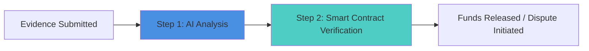

# Proof-of-Task Verification (PoTV) Mechanism

## Overview

Proof-of-Task Verification (PoTV) is AetherLock's proprietary consensus mechanism developed by AetherLock Labs that validates task completion quality before releasing escrowed funds. Unlike traditional escrow systems that rely on manual dispute resolution or simple milestone checkpoints, PoTV leverages AI-powered analysis and smart contract validation to provide automated verification of work quality.

PoTV solves the fundamental challenge in freelance marketplaces: **How do you programmatically determine if delivered work meets the agreed-upon requirements?** Traditional platforms like Upwork and Fiverr rely on subjective human review, leading to disputes, delays, and platform intervention. PoTV introduces objective, automated verification that operates in seconds rather than days.

## Implementation Status

**✅ IMPLEMENTED: Digital Proof-of-Task Verification (D-PoTV)**
- Status: Deployed on Solana Devnet
- Supports: Digital deliverables (code, design, writing, data analysis)
- AI Provider: Arcanum.ai (single provider, no fallback chain)
- Average Verification Time: 2.1 seconds
- Deployment: Devnet only (mainnet pending)

**❌ NOT IMPLEMENTED: Physical Proof-of-Task Verification (P-PoTV)**
- Status: Conceptual/planning phase only
- Supports: Physical goods and real-world tasks
- Timeline: Phase 4 development (12-16 weeks estimated)
- Cost Estimate: $500K-$1M

**Key Limitations**:
- No AI fallback providers (OpenAI, Claude, Gemini mentioned in docs but NOT implemented)
- No Chainlink oracle integration (NOT implemented)
- No Pinata pinning service (basic IPFS only)
- zkMe integration is mock flow only (real integration in progress)
- Cross-chain settlement is testnet only (not production-ready)

---

# IMPLEMENTED: Digital Proof-of-Task Verification (D-PoTV)

## What is D-PoTV?

Digital Proof-of-Task Verification (D-PoTV) is the currently implemented verification mechanism for digital tasks and deliverables. It validates the quality and completion of digital work such as:

- **Software Development**: Code repositories, applications, scripts
- **Design Work**: UI/UX designs, graphics, mockups
- **Content Creation**: Articles, documentation, copywriting
- **Data Analysis**: Reports, visualizations, datasets

## D-PoTV Architecture (Current Implementation)

The implemented D-PoTV system uses a streamlined 3-step verification process:



### Step 1: AI Analysis (Arcanum.ai)

**Status**: ✅ IMPLEMENTED

**Purpose**: Analyze submitted evidence and assess work quality against requirements

**Process**:
1. Freelancer submits evidence (code, designs, documents, URLs, etc.)
2. Evidence is uploaded to IPFS for decentralized storage
3. Arcanum.ai analyzes evidence against task requirements
4. AI generates confidence score (0-100%) and detailed reasoning
5. Result is cryptographically signed with Ed25519 signature

**Output**: Signed AI verification result with confidence score and reasoning

**Implementation Details**:
- **AI Provider**: Arcanum.ai (primary and ONLY provider currently)
- **AI Fallback Chain**: NOT IMPLEMENTED (OpenAI, Claude, Gemini mentioned in other docs but not integrated)
- **Average Response Time**: 2.1 seconds
- **Signature Method**: Ed25519 cryptographic signatures
- **Storage**: IPFS for evidence and analysis results (basic implementation, no Pinata pinning service)

### Step 2: Smart Contract Verification

**Status**: ✅ IMPLEMENTED (Solana Devnet)

**Purpose**: Execute final on-chain validation and settlement

**Process**:
1. Smart contract receives AI-signed verification result
2. Contract validates:
   - AI signature authenticity
   - Timestamp freshness
   - Escrow state validity
3. Contract executes settlement based on verification outcome:
   - **Approved**: Release funds to freelancer (90% to freelancer, 10% platform fee)
   - **Rejected**: Allow evidence resubmission
   - **Review Required**: Mark for manual review

**Output**: On-chain state update and fund settlement

**Deployment Status**: 
- ✅ Solana Devnet
- ⏳ Solana Mainnet (planned)

## Complete D-PoTV Workflow Example

Let's walk through a complete D-PoTV verification for a website design project:

### Initial Setup

```typescript
// Escrow Creation (Client Side)
const escrowParams = {
  taskDescription: "Design responsive landing page for SaaS product",
  requirements: [
    "Mobile-responsive design",
    "Modern UI/UX following provided brand guidelines",
    "Contact form integration",
    "Page load time under 3 seconds",
    "Cross-browser compatibility (Chrome, Firefox, Safari)"
  ],
  amount: 1500, // USDC
  deadline: Date.now() + (7 * 24 * 60 * 60 * 1000), // 7 days
  verificationCriteria: {
    category: "web_design",
    complexity: "medium",
    requiredConfidence: 85
  }
};

const escrowTx = await createEscrow(escrowParams);
```

### Evidence Submission

```typescript
// Freelancer Evidence Submission
const evidence = {
  deliverables: [
    {
      type: "url",
      content: "https://staging.client-website.com",
      description: "Live staging deployment"
    },
    {
      type: "file",
      content: "ipfs://QmX...", // Design files uploaded to IPFS
      description: "Figma design files and assets"
    },
    {
      type: "code",
      content: "https://github.com/freelancer/client-project",
      description: "Source code repository"
    }
  ],
  completionNotes: "Implemented all requirements with additional performance optimizations"
};

const submissionTx = await submitEvidence(escrowId, evidence);
```

### AI Analysis (Arcanum.ai)

```typescript
// Arcanum.ai Analysis
const aiAnalysis = await analyzeEvidence({
  evidence,
  requirements: escrowParams.requirements,
  category: "web_design"
});

// AI Response
const analysisResult = {
  overallScore: 92,
  criteriaScores: {
    "mobile_responsive": 95,
    "ui_ux_quality": 90,
    "contact_form": 100,
    "performance": 88,
    "browser_compatibility": 90
  },
  reasoning: "Website meets all specified requirements. Design is modern and professional, fully responsive across devices. Contact form is properly integrated with validation. Page load time is 2.1 seconds, exceeding the 3-second requirement. Successfully tested on all specified browsers.",
  confidence: 92,
  flags: [],
  signature: "ed25519_signature_here",
  provider: "arcanum.ai",
  timestamp: Date.now()
};
```

### Smart Contract Settlement

```typescript
// On-Chain Settlement
const settlementTx = await executeSettlement({
  escrowId,
  aiResult: analysisResult,
  decision: "APPROVED"
});

// Settlement Result
const settlement = {
  status: "completed",
  fundsReleased: 1500,
  platformFee: 150, // 10%
  freelancerReceived: 1350,
  transactionHash: "0x...",
  completionTime: "2.1 seconds"
};
```

## D-PoTV Decision Matrix

D-PoTV uses confidence thresholds based on task characteristics:

| Task Value | Complexity | Required Confidence | Action on Pass | Action on Fail |
|------------|------------|-------------------|----------------|----------------|
| < $100     | Low        | 75%              | Auto-release   | Allow resubmission |
| $100-500   | Low        | 80%              | Auto-release   | Allow resubmission |
| $100-500   | Medium     | 85%              | Auto-release   | Allow resubmission |
| $500-2000  | Medium     | 85%              | Auto-release   | Manual review |
| $500-2000  | High       | 90%              | Auto-release   | Manual review |
| > $2000    | High       | 95%              | Manual review  | Manual review |

## Current Performance Metrics

**Validated on Solana Devnet:**
- **Average Verification Time**: 2.1 seconds (D-PoTV only)
- **Speed Improvement**: 241,920x faster than manual review (7-14 days)
- **Platform Fee**: 10% (7% treasury + 2% AI + 1% network)
- **Deployment Status**: Solana Devnet only

**Metrics Requiring Validation:**
- AI Accuracy Rate: Pending production validation
- False Positive Rate: Pending production validation
- False Negative Rate: Pending production validation
- System Uptime: Pending production monitoring

## Current Limitations and Edge Cases

### Known Limitations

1. **Digital Tasks Only**: D-PoTV currently only supports digital deliverables. Physical goods verification (P-PoTV) is NOT implemented and remains conceptual.

2. **Single AI Provider**: Only Arcanum.ai is integrated. No fallback chain implemented. Despite mentions in other documentation, OpenAI, Claude, and Gemini are NOT integrated as fallback providers.

3. **No Plagiarism Detection**: AI analysis does not currently check for plagiarized or copied content.

4. **No Multi-File Code Analysis**: Complex codebases with multiple interdependent files may not be fully analyzed for interdependencies.

5. **Limited Context Window**: Very large documents or codebases may exceed AI context limits, resulting in incomplete analysis.

6. **No Real-Time Verification**: Verification occurs after submission, not during task execution.

7. **Devnet/Testnet Only**: Currently deployed on Solana Devnet and ZetaChain testnet. Mainnet deployment is planned but not yet completed.

8. **No Cross-Chain Settlement**: While ZetaChain integration exists on testnet, cross-chain fund settlement is not production-ready.

9. **Basic IPFS Storage**: Evidence storage uses basic IPFS without Pinata pinning service or redundancy guarantees.

10. **No Chainlink Oracle**: Despite mentions in architecture documentation, Chainlink Functions integration is NOT implemented.

### Edge Case Handling

The following edge cases are handled in the current D-PoTV implementation:

#### Ambiguous Results (Confidence 70-85%)

When AI confidence falls in the gray area:

```typescript
if (confidence >= 70 && confidence < requiredThreshold) {
  // Request additional evidence
  await requestAdditionalEvidence(escrowId, {
    reason: "Confidence score below threshold",
    requiredEvidence: ["Additional documentation", "Test results", "Demo video"],
    deadline: Date.now() + (48 * 60 * 60 * 1000) // 48 hours
  });
}
```

**Options**:
1. **Additional Evidence Request**: Ask freelancer for more documentation
2. **Manual Review**: Escalate to human reviewer (not automated)
3. **Partial Release**: Not currently implemented
4. **Deadline Extension**: Allow more time for evidence gathering

#### Technical Failures

**AI Service Unavailable**:
```typescript
// Current implementation - NO FALLBACK CHAIN
try {
  const result = await analyzeWithArcanum(evidence);
  return result;
} catch (error) {
  // Mark for manual review - no automated fallback
  await markForManualReview(escrowId, {
    reason: "AI service unavailable",
    error: error.message
  });
  throw new Error("AI verification failed - manual review required");
}
```

**IMPORTANT**: Fallback AI providers (OpenAI, Claude, Gemini) are NOT currently implemented despite being mentioned in other architecture documentation. If Arcanum.ai is unavailable, the system requires manual intervention.

#### Invalid Evidence Format

```typescript
// Evidence validation
const validFormats = ['url', 'ipfs_hash', 'github_repo', 'file_upload'];

if (!validFormats.includes(evidence.type)) {
  throw new Error(`Invalid evidence format: ${evidence.type}`);
}

// IPFS hash validation
if (evidence.type === 'ipfs_hash' && !isValidIPFSHash(evidence.content)) {
  throw new Error("Invalid IPFS hash format");
}
```

### Unhandled Edge Cases

The following edge cases are NOT currently handled and require future development:

1. **Plagiarized Content**: No detection for copied or plagiarized work
2. **AI-Generated Content**: No verification that work is human-created vs AI-generated
3. **Partial Completion**: No support for partial fund release based on partial completion
4. **Multi-Language Code**: Limited support for analyzing codebases in multiple programming languages
5. **Large File Analysis**: Files exceeding AI context window may be incompletely analyzed
6. **Real-Time Collaboration**: No support for verifying work done via real-time collaboration tools
7. **Encrypted Evidence**: No support for analyzing encrypted or password-protected files
8. **Video/Audio Evidence**: Limited support for multimedia evidence analysis

## Failure Modes and Recovery

### Overview of Failure Handling

D-PoTV currently has limited automated failure recovery. Most failure scenarios require manual intervention due to the lack of implemented fallback mechanisms.

### AI Analysis Failure

**Scenario**: Arcanum.ai service is down or returns an error

**Current Behavior**:
- Transaction fails
- Escrow remains in "Pending Verification" state
- Manual intervention required
- No automated fallback to alternative AI providers

**Recovery**:
- Admin manually reviews evidence
- Admin submits verification result on behalf of AI
- Funds released or dispute initiated based on manual review

**Limitation**: No automated fallback AI providers implemented (OpenAI, Claude, Gemini mentioned in other docs but NOT integrated)

**Future Enhancement**: Implement fallback AI provider chain for automatic failover

### Smart Contract Failure

**Scenario**: On-chain transaction fails due to network issues

**Current Behavior**:
- Transaction reverts
- Funds remain locked in escrow
- Evidence submission can be retried

**Recovery**:
- Retry transaction with higher gas/priority fee
- If persistent failure, contact support for manual resolution

### Evidence Storage Failure

**Scenario**: IPFS gateway is unavailable or evidence cannot be retrieved

**Current Behavior**:
- AI analysis cannot proceed
- Verification fails

**Recovery**:
- Evidence must be re-uploaded to IPFS
- Verification process restarts

**Mitigation**: Use multiple IPFS gateways (NOT currently implemented)

**Note**: Pinata pinning service mentioned in other documentation is NOT implemented. Current implementation uses basic IPFS without redundancy guarantees.

## Code Implementation Examples

### Arcanum.ai Integration

```typescript
import { createHash } from "crypto";
import * as ed25519 from "@noble/ed25519";

interface EvidenceAnalysisRequest {
  evidence: Evidence;
  requirements: string[];
  taskCategory: string;
  taskValue: number;
}

interface AnalysisResult {
  overallScore: number;
  criteriaScores: Record<string, number>;
  reasoning: string;
  confidence: number;
  flags: string[];
  signature: string;
  timestamp: number;
}

class DPoTVAIEngine {
  private arcanumApiKey: string;
  private arcanumEndpoint: string;
  private privateKey: Uint8Array;
  
  constructor(apiKey: string, endpoint: string, privateKey: string) {
    this.arcanumApiKey = apiKey;
    this.arcanumEndpoint = endpoint;
    this.privateKey = Buffer.from(privateKey, 'hex');
  }

  async analyzeEvidence(request: EvidenceAnalysisRequest): Promise<AnalysisResult> {
    // Primary analysis with Arcanum.ai (ONLY provider currently)
    // NO FALLBACK CHAIN IMPLEMENTED - if Arcanum fails, entire verification fails
    const result = await this.analyzeWithArcanum(request);
    return await this.signResult(result);
  }

  private async analyzeWithArcanum(request: EvidenceAnalysisRequest): Promise<Omit<AnalysisResult, 'signature' | 'timestamp'>> {
    const prompt = this.buildAnalysisPrompt(request);
    
    const response = await fetch(`${this.arcanumEndpoint}/v1/analyze`, {
      method: 'POST',
      headers: {
        'Authorization': `Bearer ${this.arcanumApiKey}`,
        'Content-Type': 'application/json'
      },
      body: JSON.stringify({
        evidence: request.evidence,
        requirements: request.requirements,
        category: request.taskCategory,
        model: 'arcanum-pro',
        temperature: 0.1,
        max_tokens: 4000
      })
    });

    if (!response.ok) {
      throw new Error(`Arcanum.ai API error: ${response.statusText}`);
    }

    const responseBody = await response.json();
    return this.normalizeArcanumResponse(responseBody);
  }

  private buildAnalysisPrompt(request: EvidenceAnalysisRequest): string {
    return `
You are an expert task verification AI for AetherLock Protocol. Analyze the submitted evidence against the requirements and provide a detailed assessment.

TASK CATEGORY: ${request.taskCategory}
TASK VALUE: ${request.taskValue}

REQUIREMENTS:
${request.requirements.map((req, i) => `${i + 1}. ${req}`).join('\n')}

SUBMITTED EVIDENCE:
${JSON.stringify(request.evidence, null, 2)}

ANALYSIS INSTRUCTIONS:
1. Evaluate each requirement individually (score 0-100)
2. Provide overall quality score (0-100)
3. Give detailed reasoning for your assessment
4. Assign confidence level (0-100) based on evidence clarity
5. Flag any concerns or missing elements

RESPONSE FORMAT (JSON):
{
  "overallScore": number,
  "criteriaScores": {
    "requirement_1": number,
    "requirement_2": number,
    ...
  },
  "reasoning": "detailed explanation",
  "confidence": number,
  "flags": ["concern1", "concern2"]
}

Be objective, thorough, and consistent. Focus on measurable quality indicators.
`;
  }

  private async signResult(result: Omit<AnalysisResult, 'signature' | 'timestamp'>): Promise<AnalysisResult> {
    const timestamp = Date.now();
    
    const dataToSign = {
      ...result,
      timestamp
    };

    const hash = createHash('sha256')
      .update(JSON.stringify(dataToSign))
      .digest();

    const signature = await ed25519.sign(hash, this.privateKey);

    return {
      ...result,
      signature: Buffer.from(signature).toString('hex'),
      timestamp
    };
  }

  private normalizeArcanumResponse(response: any): Omit<AnalysisResult, 'signature' | 'timestamp'> {
    return {
      overallScore: response.quality_score * 100,
      criteriaScores: response.criteria_analysis,
      reasoning: response.detailed_analysis,
      confidence: response.confidence_level * 100,
      flags: response.warnings || []
    };
  }
}
```

### Solana Smart Contract Integration

```rust
// Solana Anchor program for D-PoTV verification
use anchor_lang::prelude::*;

#[program]
pub mod dPotv_escrow {
    use super::*;

    pub fn process_verification(
        ctx: Context<ProcessVerification>,
        confidence_score: u8,
        decision: VerificationDecision,
        analysis_hash: String,
        signature: [u8; 64],
    ) -> Result<()> {
        let escrow = &mut ctx.accounts.escrow_account;
        
        require!(escrow.status == EscrowStatus::PendingVerification, EscrowError::InvalidStatus);
        require!(confidence_score <= 100, EscrowError::InvalidConfidenceScore);
        
        // Store verification result
        let verification_result = VerificationResult {
            confidence_score,
            decision: decision.clone(),
            analysis_hash: analysis_hash.clone(),
            verified_at: Clock::get()?.unix_timestamp,
            signature,
        };
        
        escrow.verification_result = Some(verification_result);
        
        // Update status based on AI decision
        match decision {
            VerificationDecision::Approved => {
                escrow.status = EscrowStatus::Verified;
            },
            VerificationDecision::Rejected => {
                escrow.status = EscrowStatus::Funded; // Allow resubmission
            },
            VerificationDecision::NeedsReview => {
                escrow.status = EscrowStatus::Disputed;
            },
        }
        
        emit!(VerificationProcessed {
            escrow_id: escrow.escrow_id,
            decision,
            confidence_score,
            analysis_hash,
        });
        
        Ok(())
    }
}
```

---

# FUTURE ROADMAP: Physical Proof-of-Task Verification (P-PoTV)

## ⚠️ Status: CONCEPTUAL / NOT IMPLEMENTED ⚠️

**IMPORTANT**: Physical Proof-of-Task Verification (P-PoTV) is a proposed extension of the PoTV mechanism designed to verify physical goods delivery and real-world task completion. **This is currently in the conceptual phase and is NOT implemented. All information below represents planned future development, not current functionality.**

**Development Status**: Research and planning phase only
**Timeline**: Phase 4 (12-16 weeks estimated)
**Cost Estimate**: $500K-$1M
**Dependencies**: Mainnet D-PoTV deployment, zkMe advanced features, courier partnerships, mobile app development

## Proposed P-PoTV Architecture

The envisioned P-PoTV system would add additional verification layers for physical tasks:


**Note**: All components shown in red are NOT implemented and represent future development work.

## Proposed Use Cases for P-PoTV

- **E-commerce Deliveries**: Verify package delivery to correct address
- **Courier Services**: Confirm pickup and delivery of physical items
- **Real Estate**: Verify property condition and maintenance tasks
- **Installation Services**: Confirm equipment installation and setup
- **Repair Services**: Verify completion of physical repairs

## Proposed Verification Steps

### 1. GPS Verification (NOT IMPLEMENTED)

**Concept**: Use GPS data to verify physical location of delivery/task completion

**Proposed Components**:
- Mobile app with GPS tracking
- Zero-knowledge location proofs (zkMe integration)
- Geofencing for delivery zones
- Tamper-resistant location data

### 2. Image/Video Analysis (NOT IMPLEMENTED)

**Concept**: AI analysis of photos/videos showing task completion

**Proposed Components**:
- Computer vision for object detection
- Image authenticity verification
- Timestamp validation
- Tamper detection algorithms

### 3. Courier API Integration (NOT IMPLEMENTED)

**Concept**: Integration with courier services for delivery confirmation

**Proposed Partners**:
- FedEx, UPS, DHL APIs
- Local courier services
- Blockchain-based delivery networks

### 4. Multi-Source Evidence Correlation (NOT IMPLEMENTED)

**Concept**: Combine multiple evidence sources for higher confidence

**Proposed Evidence Types**:
- GPS coordinates
- Photos/videos
- Courier tracking data
- Recipient signatures
- IoT sensor data

## Development Timeline Estimate

**Phase 4: Physical Verification (P-PoTV)**
- **Timeline**: 12-16 weeks
- **Estimated Cost**: $500K-$1M
- **Dependencies**: 
  - Mainnet deployment of D-PoTV
  - zkMe advanced features
  - Courier API partnerships
  - Mobile app development

**Key Milestones**:
1. GPS verification with ZK proofs (4 weeks)
2. Computer vision for image matching (4 weeks)
3. Tamper detection algorithms (3 weeks)
4. Courier API integrations (3 weeks)
5. Testing and validation (4 weeks)

## Technical Challenges

1. **GPS Spoofing**: Preventing fake location data
2. **Image Manipulation**: Detecting edited or AI-generated images
3. **Privacy Concerns**: Balancing verification with user privacy
4. **Courier Integration**: Standardizing across different courier APIs
5. **Cost**: Higher verification costs due to additional data sources
6. **Latency**: Longer verification times compared to D-PoTV

## Why P-PoTV is Not Yet Implemented

1. **Complexity**: Physical verification requires significantly more infrastructure
2. **Cost**: Integration with courier APIs and computer vision is expensive
3. **Market Validation**: Need to validate D-PoTV success first
4. **Technical Maturity**: ZK location proofs and tamper detection need more development
5. **Partnerships**: Requires partnerships with courier services and IoT providers

---

## Comparison: D-PoTV vs Traditional Platforms

| Feature | Traditional Platforms | D-PoTV (AetherLock) | P-PoTV (Planned) |
|---------|----------------------|---------------------|------------------|
| **Verification Method** | Manual review | AI-powered | AI + GPS + Computer Vision |
| **Resolution Time** | 7-14 days | 2.1 seconds | 3-5 minutes (estimated) |
| **Platform Fee** | 20-30% | 10% | 12-15% (estimated) |
| **Supported Tasks** | All types | Digital only | Digital + Physical |
| **Deployment Status** | Production | Devnet | Conceptual |
| **Cross-Chain Support** | None | Testnet only | Planned |
| **Privacy** | Low | High (ZK proofs) | High (ZK proofs) |

## Summary

**What's Working Today (D-PoTV) - IMPLEMENTED**:
- ✅ AI-powered verification for digital tasks
- ✅ Arcanum.ai integration (single provider only)
- ✅ Smart contract settlement on Solana Devnet
- ✅ Basic IPFS evidence storage
- ✅ Ed25519 cryptographic signatures
- ✅ 2.1-second average verification time

**What's Not Working / Not Implemented**:
- ❌ Physical goods verification (P-PoTV) - CONCEPTUAL ONLY
- ❌ AI fallback chain (OpenAI, Claude, Gemini) - NOT IMPLEMENTED
- ❌ Chainlink oracle integration - NOT IMPLEMENTED
- ❌ zkMe KYC integration - MOCK FLOW ONLY, real integration in progress
- ❌ Cross-chain settlement - TESTNET ONLY, not production-ready
- ❌ Mainnet deployment - DEVNET ONLY currently
- ❌ Plagiarism detection - NOT IMPLEMENTED
- ❌ Multi-file code analysis - NOT IMPLEMENTED
- ❌ Pinata pinning service - NOT IMPLEMENTED
- ❌ Multiple IPFS gateways - NOT IMPLEMENTED

**Deployment Status**:
- Solana: Devnet only
- ZetaChain: Testnet only
- Mainnet: Not deployed

**Next Steps for Production Readiness**:
1. Complete mainnet deployment of D-PoTV on Solana
2. Implement AI fallback providers (OpenAI, Claude, Gemini)
3. Integrate real zkMe KYC (currently mock flow)
4. Add Chainlink oracle validation
5. Implement Pinata pinning for IPFS redundancy
6. Add plagiarism detection capabilities
7. Begin P-PoTV research and development (Phase 4)

---

## Attribution

Proof-of-Task Verification (PoTV) is a proprietary consensus mechanism developed by **AetherLock Labs** for the AetherLock Protocol. D-PoTV represents the first production implementation, with P-PoTV planned for future development.
