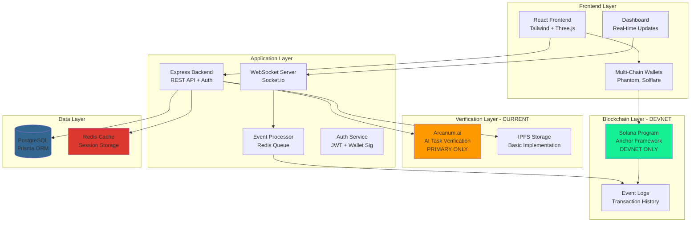
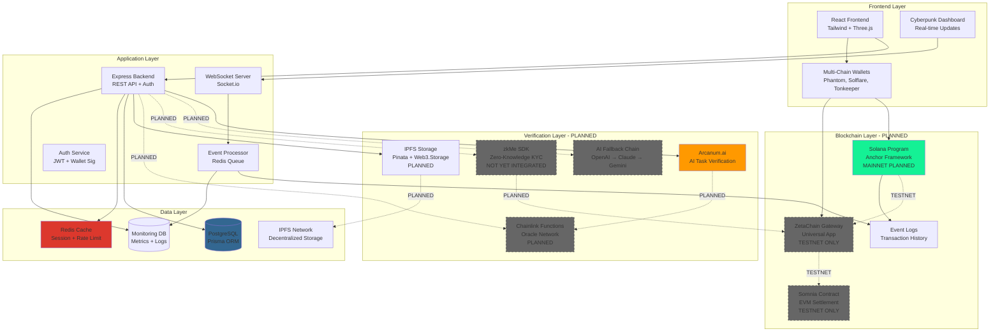
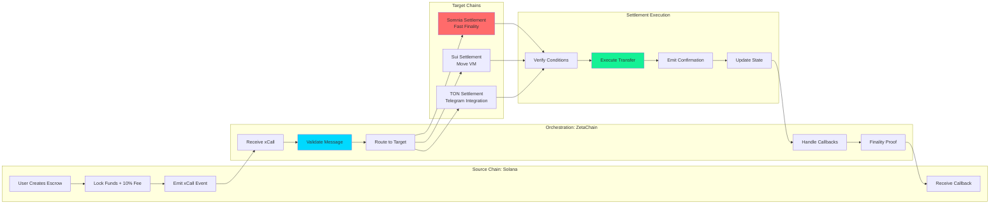
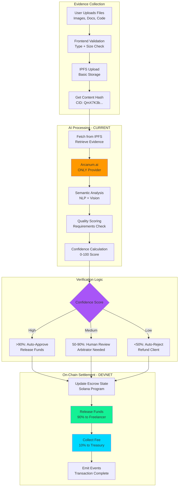
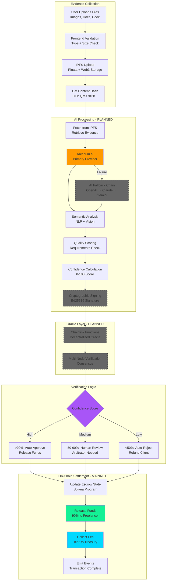
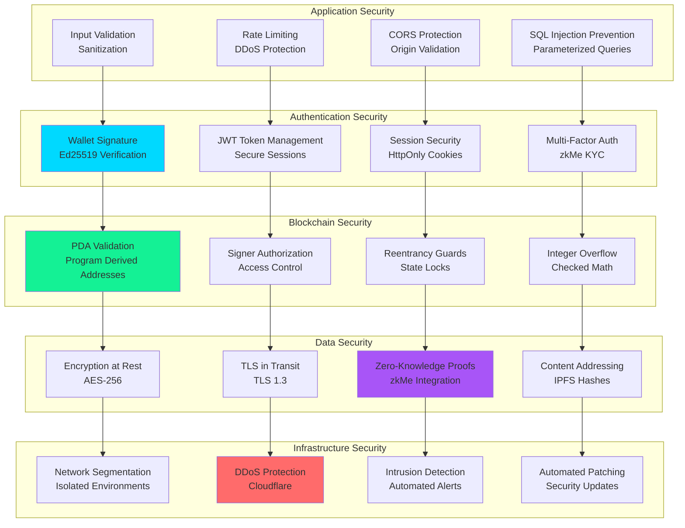
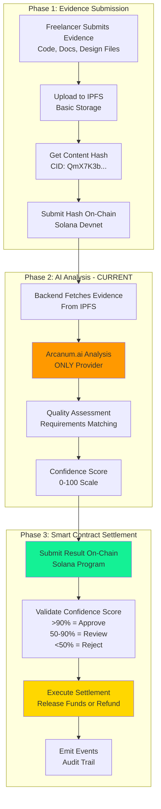
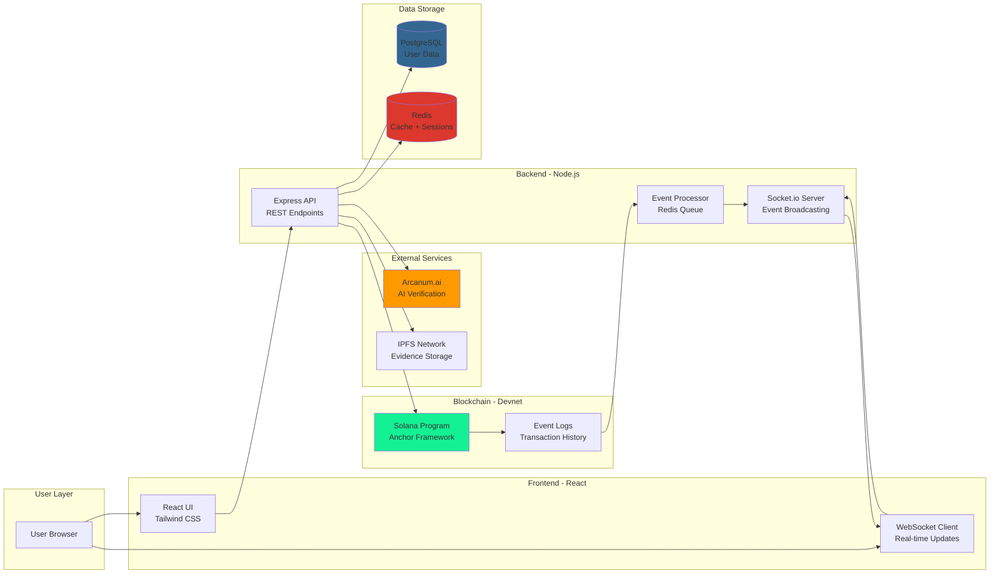
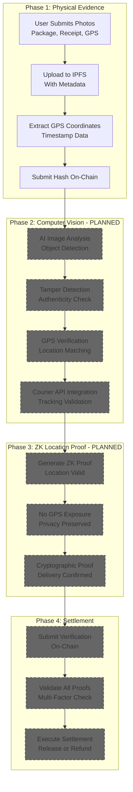
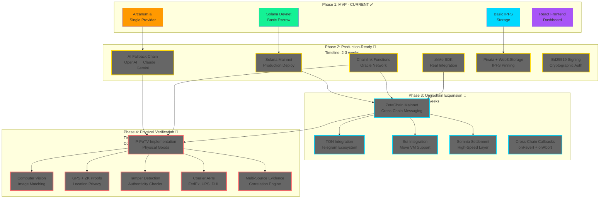

# Architecture Diagrams

This file contains all system architecture diagrams for AetherLock Protocol.

## Current Implementation Architecture (Devnet)

**Status:** ✅ Deployed on Solana Devnet  
**Last Updated:** November 2025

This diagram shows the actual implemented components currently running on devnet.

**Current Limitations:**
- No Chainlink oracle integration (planned)
- No zkMe SDK integration (mock flow only)
- No AI fallback chain (Arcanum.ai only)
- No Pinata pinning service (basic IPFS)
- No ZetaChain integration (testnet only)
- No cross-chain settlement (planned)

---

## Planned Architecture (Future State)

**Status:** 🔄 In Development  
**Timeline:** 2-3 weeks with Kiro IDE

This diagram shows the complete vision with all planned components.

## System Architecture Diagram (All Components - PLANNED)

**Planned Components:**
- Chainlink Functions for oracle verification
- zkMe SDK for real KYC integration
- AI fallback chain (OpenAI → Claude → Gemini)
- Pinata/Web3.Storage for IPFS pinning
- ZetaChain mainnet for cross-chain messaging
- Somnia mainnet for high-speed settlement
- TON and Sui blockchain support

## Cross-Chain Message Flow Diagram

## AI Verification Pipeline - Current Implementation (Devnet)

**Status:** ✅ Deployed on Solana Devnet  
**Average Time:** 2.1 seconds

This diagram shows the actual AI verification pipeline currently implemented.

**Current Implementation:**
- ✅ Basic IPFS storage (no Pinata/Web3.Storage)
- ✅ Arcanum.ai verification (no fallback chain)
- ✅ Confidence scoring (0-100)
- ✅ Smart contract settlement on Solana Devnet

**Not Yet Implemented:**
- ❌ Pinata/Web3.Storage pinning service
- ❌ AI fallback chain (OpenAI, Claude, Gemini)
- ❌ Chainlink oracle integration
- ❌ Cryptographic signing of AI results

---

## AI Verification Pipeline - Planned Architecture

**Status:** 🔄 Future Roadmap  
**Timeline:** 2-3 weeks with Kiro IDE

This diagram shows the planned AI verification pipeline with all future components.

**Planned Components:**
- Pinata/Web3.Storage for IPFS pinning
- AI fallback chain (OpenAI → Claude → Gemini)
- Chainlink Functions for oracle verification
- Ed25519 cryptographic signing
- Multi-node consensus
- Solana mainnet deployment

## Security Layers Diagram

## Current D-PoTV Flow (Digital Tasks Only - IMPLEMENTED)

**Status:** ✅ Deployed on Solana Devnet  
**Average Time:** 2.1 seconds

This diagram shows the actual implemented D-PoTV flow for digital task verification.

**Current Implementation:**
- ✅ IPFS evidence storage (basic)
- ✅ Arcanum.ai verification (primary only)
- ✅ Confidence scoring (0-100)
- ✅ Smart contract settlement
- ✅ Event emission

**Not Yet Implemented:**
- ❌ Chainlink oracle integration
- ❌ AI fallback chain
- ❌ Zero-knowledge proofs
- ❌ Cryptographic signing of AI results
- ❌ Multi-node consensus

---

## Data Flow - Current Implementation (Devnet)

**Status:** ✅ Deployed on Solana Devnet

This diagram shows how data flows through the actual implemented system.

**Data Flow Steps:**
1. User submits evidence through React UI
2. Frontend uploads to IPFS, gets content hash
3. API calls Arcanum.ai for verification
4. API submits result to Solana program
5. Solana emits events to event logs
6. Event processor picks up events from Redis queue
7. WebSocket server broadcasts updates to connected clients
8. User receives real-time notification

---

## Planned P-PoTV Flow (Physical Goods - FUTURE ROADMAP)

**Status:** 🔄 Conceptual Design  
**Timeline:** 12 weeks development  
**Estimated Cost:** $500K-$1M

This diagram shows the planned P-PoTV flow for physical goods verification.

**P-PoTV Requirements (Not Yet Built):**
- Computer vision for image matching
- GPS verification with ZK proofs
- Tamper detection algorithms
- Courier API integrations (FedEx, UPS, DHL)
- Multi-source evidence correlation
- Physical authenticity checks

---

## Complete Planned Architecture with Timeline

**Status:** 🔄 Development Roadmap  
**Total Timeline:** 17+ weeks

This diagram shows the complete vision with all planned components organized by development phase.

**Development Phases:**

**Phase 1: MVP (Current) ✅**
- Solana Devnet deployment
- Arcanum.ai integration
- Basic IPFS storage
- React dashboard
- D-PoTV for digital tasks only

**Phase 2: Production-Ready (2-3 weeks) 🔄**
- Solana mainnet deployment
- AI fallback chain (OpenAI → Claude → Gemini)
- Chainlink Functions oracle integration
- zkMe SDK real integration (not mock)
- Pinata + Web3.Storage IPFS pinning
- Ed25519 cryptographic signing

**Phase 3: Omnichain Expansion (3 weeks) 🔄**
- ZetaChain mainnet integration
- TON blockchain support
- Sui blockchain support
- Somnia settlement layer
- Cross-chain message callbacks (onRevert, onAbort)

**Phase 4: Physical Verification (12 weeks, $500K-$1M) 🔄**
- P-PoTV implementation
- Computer vision for image matching
- GPS verification with ZK proofs
- Tamper detection algorithms
- Courier API integrations (FedEx, UPS, DHL)
- Multi-source evidence correlation
