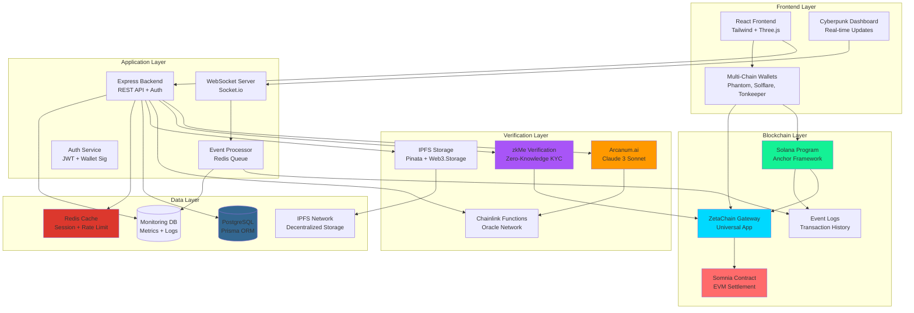
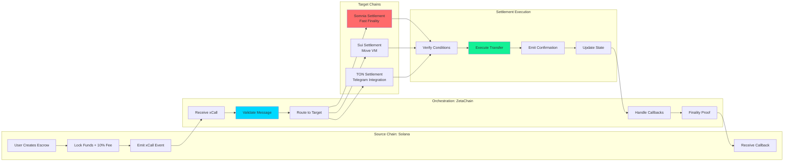
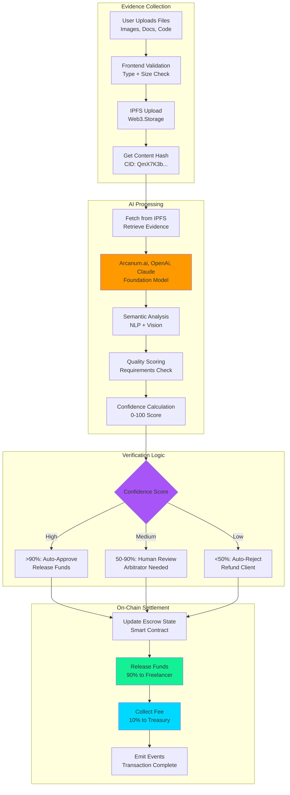
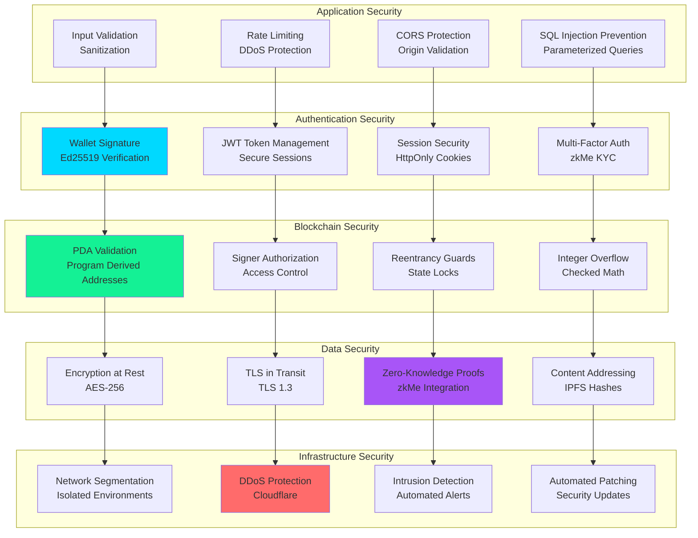

# Architecture Diagrams

This file contains all system architecture diagrams for AetherLock Protocol.

## System Architecture Diagram (All Components)

## Cross-Chain Message Flow Diagram

## AI Verification Pipeline Diagram

## Security Layers Diagram

