# Sequence Diagrams

This file contains all sequence diagrams for AetherLock Protocol workflows.

## Complete Escrow Flow - Current Implementation (Devnet)

**Status:** ✅ Deployed on Solana Devnet  
**Average Time:** 2.1 seconds

This diagram shows the actual implemented escrow flow without unimplemented components.


**Current Implementation:**
- ✅ Solana Devnet escrow
- ✅ Basic IPFS storage
- ✅ Arcanum.ai verification (single provider)
- ✅ Direct backend submission to blockchain
- ✅ Automatic fund settlement

**Not Yet Implemented:**
- ❌ ZetaChain cross-chain messaging
- ❌ Chainlink oracle network
- ❌ Ed25519 cryptographic signing
- ❌ AI fallback chain
- ❌ Pinata IPFS pinning

---

## Complete Escrow Flow - Planned Architecture

**Status:** 🔄 Future Roadmap  
**Timeline:** 2-3 weeks with Kiro IDE

This diagram shows the planned escrow flow with all future components.

```mermaid
sequenceDiagram
    participant Client
    participant Frontend
    participant Wallet
    participant Solana as Solana Program<br/>(MAINNET)
    participant ZetaChain
    participant Freelancer
    participant IPFS
    participant AI as Arcanum.ai
    participant Oracle as Chainlink Oracle
    participant Treasury
    
    Note over Client,Treasury: Phase 1: Escrow Creation
    Client->>Frontend: Create Escrow Request
    Frontend->>Wallet: Request Wallet Connection
    Wallet-->>Frontend: Wallet Connected
    
    Frontend->>Solana: Create Escrow Transaction
    Note right of Solana: Lock $1,100<br/>($1,000 + $100 fee)
    Solana->>Solana: Initialize Escrow Account
    Solana->>ZetaChain: Emit xCall Event (PLANNED)
    ZetaChain-->>Solana: Confirmation
    Solana-->>Frontend: Escrow Created
    Frontend-->>Client: Escrow ID: #12345
    
    Note over Client,Treasury: Phase 2: Work Execution
    Freelancer->>Frontend: Accept Escrow
    Freelancer->>Freelancer: Complete Work
    
    Note over Client,Treasury: Phase 3: Evidence Submission
    Freelancer->>Frontend: Submit Evidence
    Frontend->>IPFS: Upload Evidence Files
    Note right of IPFS: Pinata + Web3.Storage<br/>PLANNED
    IPFS-->>Frontend: Content Hash (CID)
    Frontend->>Solana: Submit Evidence Hash
    Solana->>Solana: Update Escrow State
    Solana-->>Frontend: Evidence Recorded
    
    Note over Client,Treasury: Phase 4: AI Verification (PLANNED)
    Solana->>Oracle: Request Verification (PLANNED)
    Oracle->>IPFS: Fetch Evidence
    IPFS-->>Oracle: Evidence Files
    Oracle->>AI: Analyze Evidence
    Note right of AI: Fallback chain:<br/>OpenAI → Claude → Gemini
    AI->>AI: Semantic Analysis<br/>Quality Scoring
    AI-->>Oracle: Verification Result<br/>Confidence: 94%
    Oracle->>Oracle: Sign Result (Ed25519) (PLANNED)
    Oracle->>ZetaChain: Submit Verification (PLANNED)
    ZetaChain->>Solana: Update Verification Status
    
    Note over Client,Treasury: Phase 5: Fund Settlement
    Solana->>Solana: Check Verification<br/>Status: APPROVED
    Solana->>Freelancer: Transfer $1,000 (90%)
    Solana->>Treasury: Transfer $100 (10%)
    Solana->>ZetaChain: Emit Settlement Event (PLANNED)
    ZetaChain-->>Frontend: Settlement Complete
    Frontend-->>Freelancer: Payment Received
    Frontend-->>Client: Task Completed
    
    Note over Client,Treasury: Total Time: ~2.5 seconds (estimated)
```



**Planned Components:**
- Solana mainnet deployment
- ZetaChain cross-chain messaging
- Chainlink oracle network
- Ed25519 cryptographic signing
- AI fallback chain (OpenAI → Claude → Gemini)
- Pinata + Web3.Storage IPFS pinning


## KYC Verification Flow - Current Implementation (Mock)

**Status:** 🔄 Mock Flow - Real Integration In Progress  
**Partner:** zkMe

This diagram shows the current mock KYC flow. Real zkMe SDK integration is in progress.

```mermaid
sequenceDiagram
    participant User
    participant Frontend
    participant Backend
    participant Solana as Solana Program<br/>(DEVNET)
    
    Note over User,Solana: Phase 1: Initiate KYC (MOCK)
    User->>Frontend: Request KYC Verification
    Frontend->>Backend: Mock KYC Request
    Note right of Backend: Mock flow for testing<br/>No real zkMe SDK yet
    Backend->>Backend: Generate Mock Credential
    Backend-->>Frontend: Mock Verification Success
    
    Note over User,Solana: Phase 2: Link to Wallet
    Frontend->>Solana: Link Mock Credential to Wallet
    Solana->>Solana: Update User Account<br/>KYC Status: VERIFIED (MOCK)
    Solana-->>Frontend: Verification Complete
    Frontend-->>User: ✅ KYC Verified (Mock)
    
    Note over User,Solana: User can now create/accept escrows
```



**Current Implementation:**
- ✅ Mock KYC flow for testing
- ✅ Wallet linking on Solana Devnet
- ✅ Basic user account management

**Not Yet Implemented:**
- ❌ Real zkMe SDK integration
- ❌ Document submission
- ❌ Zero-knowledge proof generation
- ❌ ZetaChain credential storage
- ❌ Real identity verification

---

## KYC Verification Flow - Planned Architecture

**Status:** 🔄 Partner Integration In Progress  
**Partner:** zkMe  
**Timeline:** 2-3 weeks

This diagram shows the planned KYC flow with real zkMe SDK integration.

```mermaid
sequenceDiagram
    participant User
    participant Frontend
    participant zkMe as zkMe SDK<br/>(PLANNED)
    participant Backend
    participant ZetaChain<br/>(PLANNED)
    participant Solana as Solana Program
    
    Note over User,Solana: Phase 1: Initiate KYC
    User->>Frontend: Request KYC Verification
    Frontend->>zkMe: Initialize Session (PLANNED)
    zkMe-->>Frontend: Session ID + Widget URL
    Frontend-->>User: Display zkMe Widget
    
    Note over User,Solana: Phase 2: Document Submission
    User->>zkMe: Submit Identity Documents (PLANNED)
    Note right of zkMe: - Passport/ID<br/>- Selfie<br/>- Proof of Address
    zkMe->>zkMe: Validate Documents
    zkMe->>zkMe: Generate Zero-Knowledge Proof
    Note right of zkMe: No PII stored<br/>Only cryptographic proof
    
    Note over User,Solana: Phase 3: Proof Verification
    zkMe-->>Frontend: ZK Proof + Credential Hash (PLANNED)
    Frontend->>Backend: Submit Proof for Verification
    Backend->>Backend: Verify ZK Proof
    Backend->>ZetaChain: Store Credential Hash (PLANNED)
    Note right of ZetaChain: On-chain storage<br/>without PII
    ZetaChain-->>Backend: Credential ID
    
    Note over User,Solana: Phase 4: Link to Wallet
    Backend->>Solana: Link Credential to Wallet
    Solana->>Solana: Update User Account<br/>KYC Status: VERIFIED
    Solana-->>Backend: Verification Complete
    Backend-->>Frontend: Success Response
    Frontend-->>User: ✅ KYC Verified
    
    Note over User,Solana: User can now create/accept escrows
```

**Planned Components:**
- Real zkMe SDK integration
- Document submission and validation
- Zero-knowledge proof generation
- ZetaChain credential storage
- Privacy-preserving identity verification


## Cross-Chain Settlement Flow - Testnet Only

**Status:** 🔄 Testnet Only - Mainnet Planned  
**Timeline:** 3 weeks for mainnet deployment

This diagram shows the cross-chain settlement flow currently available on testnet only.


**Current Implementation (Testnet):**
- ✅ ZetaChain testnet integration
- ✅ Somnia testnet integration
- ✅ Basic cross-chain messaging
- ✅ Simple callback handling

**Not Yet Implemented:**
- ❌ Mainnet deployment (Solana, ZetaChain, Somnia)
- ❌ onRevert callback handler
- ❌ onAbort callback handler
- ❌ TON blockchain support
- ❌ Sui blockchain support
- ❌ Production-grade error handling


## Dispute Resolution Flow - Planned Feature

**Status:** 🔄 Future Roadmap  
**Timeline:** Phase 2 (2-3 weeks)

This diagram shows the planned dispute resolution system. Currently, disputes require manual intervention.


**Current Implementation:**
- ✅ Basic escrow state management
- ✅ Manual dispute handling via admin

**Not Yet Implemented:**
- ❌ Automated dispute initiation
- ❌ Arbitrator assignment system
- ❌ Dispute dashboard
- ❌ Evidence re-analysis
- ❌ Partial payment resolution
- ❌ Arbitrator signature verification
- ❌ Reputation system for arbitrators


## Proof-of-Task Verification (PoTV) - Current Implementation (D-PoTV)

**Status:** ✅ Deployed on Solana Devnet  
**Average Time:** 2.1 seconds

This diagram shows the actual implemented D-PoTV flow for digital task verification.


**Current Implementation:**
- ✅ Basic IPFS evidence storage
- ✅ Arcanum.ai verification (single provider)
- ✅ Confidence scoring (0-100)
- ✅ Smart contract settlement on Solana Devnet
- ✅ Automatic fund release based on confidence

**Not Yet Implemented:**
- ❌ Chainlink oracle network
- ❌ AI fallback chain (OpenAI, Claude, Gemini)
- ❌ Cryptographic signing (Ed25519)
- ❌ Zero-knowledge proofs (zkMe SDK)
- ❌ Multi-node consensus
- ❌ ZetaChain cross-chain messaging

---

## Proof-of-Task Verification (PoTV) - Planned Architecture

**Status:** 🔄 Future Roadmap  
**Timeline:** 2-3 weeks for Phase 2, 12 weeks for P-PoTV

This diagram shows the planned complete PoTV flow with all security components.

```mermaid
sequenceDiagram
    participant Freelancer
    participant IPFS
    participant Oracle as Chainlink Oracle<br/>(PLANNED)
    participant AI as Arcanum.ai
    participant Fallback as Fallback Providers<br/>(OpenAI/Claude/Gemini)<br/>(PLANNED)
    participant zkMe as zkMe SDK<br/>(PLANNED)
    participant ZetaChain<br/>(PLANNED)
    participant Solana as Solana Program
    participant Client
    
    Note over Freelancer,Client: Phase 1: Evidence Submission & Storage
    Freelancer->>IPFS: Upload Evidence Files
    Note right of IPFS: Pinata + Web3.Storage<br/>PLANNED
    IPFS-->>Freelancer: Content Hash (CID)
    Freelancer->>Solana: Submit Evidence Hash
    Solana->>Solana: Update Escrow State<br/>Status: EVIDENCE_SUBMITTED
    Solana-->>Freelancer: Evidence Recorded
    
    Note over Freelancer,Client: Phase 2: AI Analysis (PoTV Component 1) - PLANNED
    Solana->>Oracle: Trigger Verification Request (PLANNED)
    Oracle->>IPFS: Fetch Evidence by CID
    IPFS-->>Oracle: Evidence Files
    
    Oracle->>AI: Analyze Evidence<br/>POST /v1/analyze
    Note right of AI: Primary provider:<br/>Arcanum.ai
    
    alt Arcanum.ai Success
        AI->>AI: Semantic Analysis<br/>Quality Scoring<br/>Requirements Matching
        AI-->>Oracle: Verification Result<br/>Confidence: 94%
    else Arcanum.ai Failure (PLANNED)
        AI-->>Oracle: Error Response
        Oracle->>Fallback: Retry with OpenAI (PLANNED)
        Note right of Fallback: Fallback chain:<br/>OpenAI → Claude → Gemini
        Fallback-->>Oracle: Verification Result<br/>Confidence: 91%
    end
    
    Oracle->>Oracle: Sign Result (PLANNED)<br/>Ed25519 + Timestamp
    Note right of Oracle: Cryptographic signature<br/>prevents tampering
    
    Note over Freelancer,Client: Phase 3: Zero-Knowledge Proof (PoTV Component 2) - PLANNED
    Oracle->>zkMe: Generate ZK Proof (PLANNED)
    Note right of zkMe: Proof includes:<br/>- Verification occurred<br/>- Confidence ≥ threshold<br/>- Timestamp valid<br/><br/>Does NOT reveal:<br/>- Evidence content<br/>- AI model details<br/>- Analysis reasoning
    zkMe->>zkMe: Create Cryptographic Proof
    zkMe-->>Oracle: ZK Proof Generated
    
    Note over Freelancer,Client: Phase 4: Oracle Consensus (PoTV Component 3) - PLANNED
    Oracle->>Oracle: Validate ZK Proof
    Note right of Oracle: Multiple oracle nodes<br/>independently verify
    Oracle->>Oracle: Reach Consensus<br/>Majority Agreement
    Oracle->>ZetaChain: Submit Verification (PLANNED)<br/>with ZK Proof
    Note right of ZetaChain: Cross-chain message<br/>with proof payload
    
    Note over Freelancer,Client: Phase 5: On-Chain Validation (PoTV Component 4)
    ZetaChain->>Solana: Update Verification Status (PLANNED)
    Solana->>Solana: Validate PoTV Chain (PLANNED)<br/>1. AI signature valid?<br/>2. ZK proof correct?<br/>3. Oracle consensus?<br/>4. Timestamp fresh?
    
    alt All Validations Pass
        Solana->>Solana: Mark as APPROVED
        Solana->>Freelancer: Release Funds (90%)
        Solana->>Solana: Collect Fee (10%)
        Solana-->>Client: Task Completed
        Solana-->>Freelancer: Payment Received
    else Validation Fails
        Solana->>Solana: Mark as DISPUTED
        Solana-->>Client: Manual Review Required
        Solana-->>Freelancer: Funds Held Pending Review
    end
    
    Note over Freelancer,Client: PoTV Complete: Cryptographic proof of human work quality
    Note over Freelancer,Client: Total Time: ~2.5 seconds (estimated)
```

**Planned PoTV Security Properties:**

1. **AI Result Integrity**: Cryptographic signatures prevent tampering with verification results
2. **Privacy Preservation**: Zero-knowledge proofs verify without exposing evidence content
3. **Decentralization**: Multiple oracle nodes prevent single point of failure
4. **Immutability**: On-chain validation creates permanent audit trail
5. **Fallback Resilience**: Provider chain ensures high availability (Arcanum.ai → OpenAI → Claude → Gemini)

