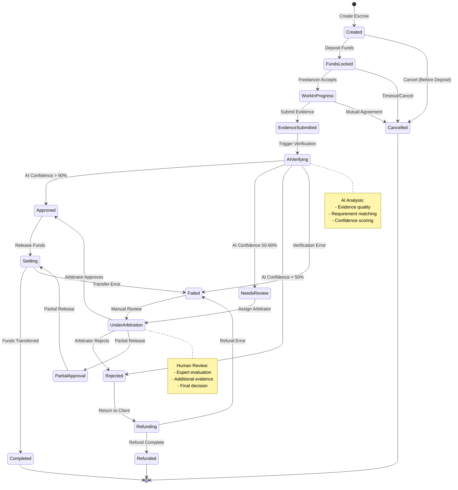
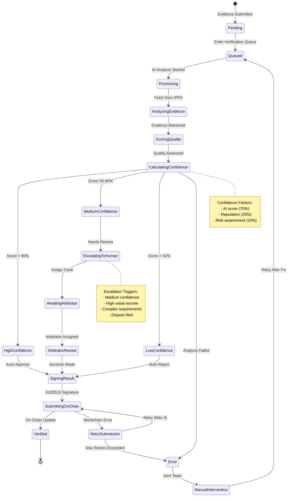
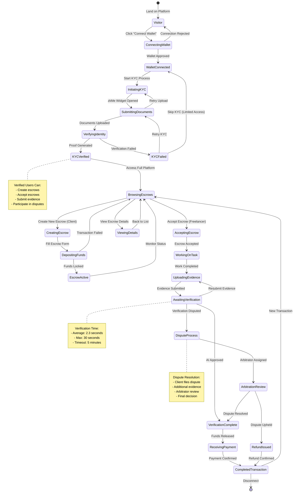
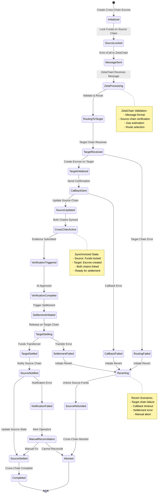

# State Diagrams

This file contains all state machine diagrams for AetherLock Protocol.

## Escrow State Machine

## Verification State Transitions

## User Journey States

## Cross-Chain Escrow State Machine

