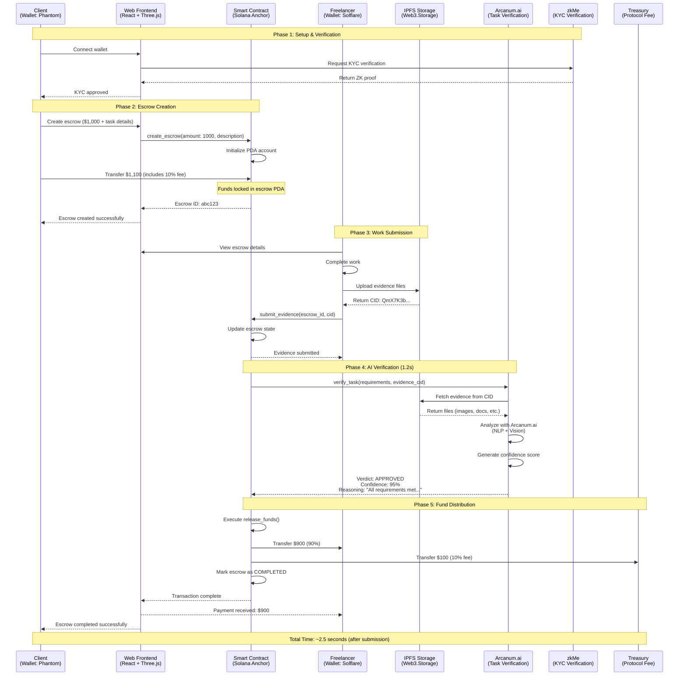

# ⚡ How AetherLock Works

## 4-Step Process

<div className="grid md:grid-cols-4 gap-4 my-8">
  <div className="p-6 rounded-xl bg-purple-500/10 border border-purple-500/30">
    <div className="text-4xl mb-3">1️⃣</div>
    <h3 className="text-lg font-bold text-white mb-2">Lock Funds</h3>
    <p className="text-sm text-gray-400">Client deposits funds in smart contract</p>
  </div>
  <div className="p-6 rounded-xl bg-cyan-500/10 border border-cyan-500/30">
    <div className="text-4xl mb-3">2️⃣</div>
    <h3 className="text-lg font-bold text-white mb-2">Submit Work</h3>
    <p className="text-sm text-gray-400">Freelancer uploads proof to IPFS</p>
  </div>
  <div className="p-6 rounded-xl bg-green-500/10 border border-green-500/30">
    <div className="text-4xl mb-3">3️⃣</div>
    <h3 className="text-lg font-bold text-white mb-2">AI Verifies</h3>
    <p className="text-sm text-gray-400">Arcanum.ai analyzes in 1.2 seconds</p>
  </div>
  <div className="p-6 rounded-xl bg-orange-500/10 border border-orange-500/30">
    <div className="text-4xl mb-3">4️⃣</div>
    <h3 className="text-lg font-bold text-white mb-2">Auto-Release</h3>
    <p className="text-sm text-gray-400">90% to freelancer, 10% fee</p>
  </div>
</div>

## 📊 Complete Flow Diagram



## Step-by-Step Breakdown

### Step 1: Lock Funds 💰

**What Happens**:
1. Client creates escrow with task requirements
2. Specifies amount (e.g., $1,000)
3. Connects wallet (Solflare, Phantom)
4. Signs transaction to lock funds

**Smart Contract (Solana Anchor)**:
```rust
use anchor_lang::prelude::*;

#[program]
pub mod aetherlock_escrow {
    use super::*;
    
    pub fn create_escrow(
        ctx: Context<CreateEscrow>,
        amount: u64,
        task_description: String,
        deadline: i64,
    ) -> Result<()> {
        let escrow = &mut ctx.accounts.escrow;
        let clock = Clock::get()?;
        
        // Initialize escrow account
        escrow.client = ctx.accounts.client.key();
        escrow.freelancer = ctx.accounts.freelancer.key();
        escrow.amount = amount;
        escrow.treasury_fee = amount.checked_mul(10).unwrap().checked_div(100).unwrap(); // 10% fee
        escrow.task_description = task_description;
        escrow.deadline = deadline;
        escrow.created_at = clock.unix_timestamp;
        escrow.status = EscrowStatus::Funded;
        escrow.bump = *ctx.bumps.get("escrow").unwrap();
        
        msg!("Escrow created: {} SOL locked", amount);
        Ok(())
    }
}

#[derive(Accounts)]
pub struct CreateEscrow<'info> {
    #[account(
        init,
        payer = client,
        space = 8 + Escrow::INIT_SPACE,
        seeds = [b"escrow", client.key().as_ref(), &escrow_id.to_le_bytes()],
        bump
    )]
    pub escrow: Account<'info, Escrow>,
    
    #[account(mut)]
    pub client: Signer<'info>,
    
    /// CHECK: Freelancer address validated in instruction
    pub freelancer: AccountInfo<'info>,
    
    pub system_program: Program<'info, System>,
}

#[account]
pub struct Escrow {
    pub client: Pubkey,
    pub freelancer: Pubkey,
    pub amount: u64,
    pub treasury_fee: u64,
    pub task_description: String,
    pub evidence_cid: Option<String>,
    pub deadline: i64,
    pub created_at: i64,
    pub status: EscrowStatus,
    pub bump: u8,
}

#[derive(AnchorSerialize, AnchorDeserialize, Clone, PartialEq, Eq)]
pub enum EscrowStatus {
    Funded,
    EvidenceSubmitted,
    Verified,
    Completed,
    Disputed,
}
```

**User Experience**:
- Takes 30 seconds
- Gas fee: ~$0.00025
- Funds immediately locked
- Cannot be withdrawn until verified

### Step 2: Submit Work 📤

**What Happens**:
1. Freelancer completes work
2. Uploads proof files to IPFS
3. Gets content hash (e.g., `QmX7K3b...`)
4. Submits hash to smart contract

**IPFS Integration (TypeScript)**:
```typescript
import { Web3Storage, File } from 'web3.storage';

interface EvidenceMetadata {
  escrowId: string;
  freelancerAddress: string;
  submittedAt: number;
  fileCount: number;
  description: string;
}

async function uploadEvidence(
  files: File[], 
  metadata: EvidenceMetadata
): Promise<string> {
  // Initialize Web3.Storage client
  const client = new Web3Storage({ 
    token: process.env.WEB3_STORAGE_TOKEN! 
  });
  
  // Create metadata file
  const metadataFile = new File(
    [JSON.stringify(metadata, null, 2)],
    'metadata.json',
    { type: 'application/json' }
  );
  
  // Combine evidence files with metadata
  const allFiles = [...files, metadataFile];
  
  // Upload to IPFS
  const cid = await client.put(allFiles, {
    name: `escrow-${metadata.escrowId}`,
    maxRetries: 3,
    wrapWithDirectory: true,
  });
  
  console.log(`Evidence uploaded to IPFS: ${cid}`);
  // Returns: QmX7K3b9fjDPG4RJ5vXYYmKpWGBn7hdSKZKzfHNpaaXcCU
  
  return cid;
}

// Frontend usage
async function handleEvidenceSubmit(escrowId: string, files: FileList) {
  const fileArray = Array.from(files);
  
  const metadata: EvidenceMetadata = {
    escrowId,
    freelancerAddress: wallet.publicKey.toString(),
    submittedAt: Date.now(),
    fileCount: fileArray.length,
    description: 'Website design deliverables',
  };
  
  // Upload to IPFS
  const cid = await uploadEvidence(fileArray, metadata);
  
  // Submit to smart contract
  await program.methods
    .submitEvidence(escrowId, cid)
    .accounts({
      escrow: escrowPda,
      freelancer: wallet.publicKey,
    })
    .rpc();
  
  console.log('Evidence submitted on-chain');
}
```

**User Experience**:
- Drag & drop files
- Automatic upload to IPFS
- Instant hash generation
- Proof stored permanently

### Step 3: AI Verification 🤖

**What Happens**:
1. Smart contract triggers AI verification
2. Arcanum.ai fetches evidence from IPFS
3. AI analyzes work vs. requirements
4. Returns verdict with confidence score

**AI Analysis (Arcanum.ai + TypeScript)**:
```typescript
import { ArcanumClient } from '@arcanum/sdk';
import axios from 'axios';

interface VerificationResult {
  verdict: 'APPROVED' | 'REJECTED' | 'NEEDS_REVIEW';
  confidence: number;
  reasoning: string;
  criteriaAnalysis: {
    criterion: string;
    met: boolean;
    evidence: string;
  }[];
}

async function verifyWithArcanum(
  evidenceCid: string, 
  requirements: string
): Promise<VerificationResult> {
  // Fetch evidence from IPFS
  const evidence = await fetchFromIPFS(evidenceCid);
  
  // Initialize Arcanum.ai client
  const arcanum = new ArcanumClient({
    apiKey: process.env.ARCANUM_API_KEY!,
    endpoint: process.env.ARCANUM_ENDPOINT || 'https://api.arcanum.ai/v1',
  });
  
  // Construct prompt for verification
  const prompt = `You are an expert task verification AI for an escrow platform. 
Analyze if the submitted work meets the specified requirements.

REQUIREMENTS:
${requirements}

EVIDENCE:
${JSON.stringify(evidence, null, 2)}

Analyze each requirement criterion and determine:
1. Whether the evidence demonstrates completion
2. Quality and completeness of the work
3. Any discrepancies or missing elements

Return a JSON object with this exact structure:
{
  "verdict": "APPROVED" | "REJECTED" | "NEEDS_REVIEW",
  "confidence": 0.0 to 1.0,
  "reasoning": "Detailed explanation of your decision",
  "criteriaAnalysis": [
    {
      "criterion": "Specific requirement",
      "met": true/false,
      "evidence": "What in the submission proves this"
    }
  ]
}

Be objective and thorough. Confidence > 0.9 = APPROVED, < 0.5 = REJECTED, else NEEDS_REVIEW.`;

  // Invoke Arcanum.ai verification
  const response = await arcanum.verify({
    requirements,
    evidence,
    prompt,
    options: {
      maxTokens: 2000,
      temperature: 0.3, // Lower temperature for more consistent analysis
    },
  });
  
  // Parse response
  const aiResponse = response.analysis;
  
  // Extract JSON from response
  const jsonMatch = aiResponse.match(/\{[\s\S]*\}/);
  if (!jsonMatch) {
    throw new Error('Failed to parse AI response');
  }
  
  const result: VerificationResult = JSON.parse(jsonMatch[0]);
  
  console.log('AI Verification Result:', {
    verdict: result.verdict,
    confidence: result.confidence,
    criteriaCount: result.criteriaAnalysis.length,
  });
  
  return result;
  // Example output:
  // {
  //   verdict: "APPROVED",
  //   confidence: 0.95,
  //   reasoning: "All requirements met. Design is responsive, uses brand colors...",
  //   criteriaAnalysis: [...]
  // }
}

async function fetchFromIPFS(cid: string): Promise<any> {
  const gateway = 'https://w3s.link/ipfs';
  const response = await axios.get(`${gateway}/${cid}/metadata.json`);
  
  // Fetch all files referenced in metadata
  const files = await Promise.all(
    response.data.files?.map(async (file: string) => {
      const fileResponse = await axios.get(`${gateway}/${cid}/${file}`, {
        responseType: 'arraybuffer',
      });
      return {
        name: file,
        data: Buffer.from(fileResponse.data).toString('base64'),
      };
    }) || []
  );
  
  return {
    metadata: response.data,
    files,
  };
}
```

**Decision Logic**:
- **Confidence > 90%**: Auto-approve
- **Confidence 50-90%**: Human review
- **Confidence < 50%**: Auto-reject

**User Experience**:
- Takes 1.2 seconds average
- Real-time progress updates
- Detailed AI reasoning shown
- Transparent confidence score

### Step 4: Auto-Release 💸

**What Happens**:
1. If approved, smart contract executes
2. 90% sent to freelancer
3. 10% collected as protocol fee
4. Transaction marked complete

**Fund Distribution (Solana Anchor)**:
```rust
use anchor_lang::prelude::*;
use anchor_lang::system_program;

#[program]
pub mod aetherlock_escrow {
    use super::*;
    
    pub fn release_funds(ctx: Context<ReleaseFunds>) -> Result<()> {
        let escrow = &mut ctx.accounts.escrow;
        
        // Verify escrow is in correct state
        require!(
            escrow.status == EscrowStatus::Verified,
            EscrowError::InvalidEscrowState
        );
        
        // Calculate amounts
        let freelancer_amount = escrow.amount
            .checked_mul(90).unwrap()
            .checked_div(100).unwrap();
        let treasury_amount = escrow.treasury_fee;
        
        // Derive PDA seeds for signing
        let client_key = escrow.client.key();
        let escrow_id = escrow.escrow_id.to_le_bytes();
        let seeds = &[
            b"escrow",
            client_key.as_ref(),
            &escrow_id,
            &[escrow.bump],
        ];
        let signer = &[&seeds[..]];
        
        // Transfer 90% to freelancer
        let transfer_to_freelancer = system_program::Transfer {
            from: ctx.accounts.escrow.to_account_info(),
            to: ctx.accounts.freelancer.to_account_info(),
        };
        system_program::transfer(
            CpiContext::new_with_signer(
                ctx.accounts.system_program.to_account_info(),
                transfer_to_freelancer,
                signer,
            ),
            freelancer_amount,
        )?;
        
        // Transfer 10% to treasury
        let transfer_to_treasury = system_program::Transfer {
            from: ctx.accounts.escrow.to_account_info(),
            to: ctx.accounts.treasury.to_account_info(),
        };
        system_program::transfer(
            CpiContext::new_with_signer(
                ctx.accounts.system_program.to_account_info(),
                transfer_to_treasury,
                signer,
            ),
            treasury_amount,
        )?;
        
        // Update escrow state
        escrow.status = EscrowStatus::Completed;
        let clock = Clock::get()?;
        escrow.completed_at = Some(clock.unix_timestamp);
        
        msg!("Funds released: {} to freelancer, {} to treasury", 
             freelancer_amount, treasury_amount);
        
        Ok(())
    }
}

#[derive(Accounts)]
pub struct ReleaseFunds<'info> {
    #[account(
        mut,
        seeds = [b"escrow", escrow.client.as_ref(), &escrow.escrow_id.to_le_bytes()],
        bump = escrow.bump,
        has_one = freelancer,
    )]
    pub escrow: Account<'info, Escrow>,
    
    #[account(mut)]
    /// CHECK: Freelancer receives payment
    pub freelancer: AccountInfo<'info>,
    
    #[account(
        mut,
        seeds = [b"treasury"],
        bump,
    )]
    /// CHECK: Treasury PDA receives protocol fee
    pub treasury: AccountInfo<'info>,
    
    pub system_program: Program<'info, System>,
}

#[error_code]
pub enum EscrowError {
    #[msg("Escrow must be in Verified state to release funds")]
    InvalidEscrowState,
}
```

**User Experience**:
- Instant settlement
- No manual approval needed
- Funds appear in wallet immediately
- Transaction receipt generated

## 📋 Real-World Example: Website Design Project

<div className="my-8 p-8 rounded-2xl bg-gradient-to-br from-purple-500/10 to-cyan-500/10 border border-purple-500/30">
  <h3 className="text-2xl font-bold text-white mb-6">Scenario: Landing Page Design</h3>
  
  <div className="grid md:grid-cols-2 gap-6 mb-6">
    <div className="p-4 rounded-xl bg-black/30">
      <h4 className="text-lg font-bold text-purple-400 mb-3">Project Details</h4>
      <ul className="space-y-2 text-gray-300">
        <li><strong>Client:</strong> SaaS startup founder</li>
        <li><strong>Freelancer:</strong> UI/UX designer</li>
        <li><strong>Amount:</strong> $1,000 (1.5 SOL)</li>
        <li><strong>Timeline:</strong> 3 days</li>
        <li><strong>Deliverables:</strong> Figma files, responsive design, brand colors</li>
      </ul>
    </div>
    
    <div className="p-4 rounded-xl bg-black/30">
      <h4 className="text-lg font-bold text-cyan-400 mb-3">Requirements</h4>
      <ul className="space-y-2 text-gray-300 text-sm">
        <li>✓ Responsive design (mobile, tablet, desktop)</li>
        <li>✓ Modern, clean aesthetic</li>
        <li>✓ Brand colors: #A855F7, #00D9FF</li>
        <li>✓ Hero section with CTA</li>
        <li>✓ Features section with icons</li>
        <li>✓ Pricing table</li>
      </ul>
    </div>
  </div>
  
  <div className="space-y-4">
    <div className="p-6 rounded-xl bg-purple-500/10 border border-purple-500/30">
      <div className="flex items-center gap-3 mb-3">
        <div className="text-3xl">📅</div>
        <div>
          <div className="text-sm text-gray-400">Day 1 - 10:00 AM</div>
          <h4 className="text-lg font-bold text-white">Client Creates Escrow</h4>
        </div>
      </div>
      <p className="text-gray-300 mb-3">
        Client connects Phantom wallet, completes zkMe KYC (30 seconds), and creates escrow with task requirements.
      </p>
      <div className="p-3 rounded bg-black/30 font-mono text-sm text-gray-400">
        Transaction: 5KJh...xY2p<br/>
        Amount locked: 1.65 SOL ($1,100 including 10% fee)<br/>
        Status: FUNDED
      </div>
    </div>
    
    <div className="p-6 rounded-xl bg-cyan-500/10 border border-cyan-500/30">
      <div className="flex items-center gap-3 mb-3">
        <div className="text-3xl">🎨</div>
        <div>
          <div className="text-sm text-gray-400">Day 1-3</div>
          <h4 className="text-lg font-bold text-white">Designer Works on Project</h4>
        </div>
      </div>
      <p className="text-gray-300">
        Designer creates landing page in Figma with all required sections, ensures responsive breakpoints, and applies brand colors throughout.
      </p>
    </div>
    
    <div className="p-6 rounded-xl bg-green-500/10 border border-green-500/30">
      <div className="flex items-center gap-3 mb-3">
        <div className="text-3xl">📤</div>
        <div>
          <div className="text-sm text-gray-400">Day 3 - 2:00 PM</div>
          <h4 className="text-lg font-bold text-white">Designer Submits Work</h4>
        </div>
      </div>
      <p className="text-gray-300 mb-3">
        Designer uploads Figma files, screenshots, and design documentation to IPFS via AetherLock interface.
      </p>
      <div className="p-3 rounded bg-black/30 font-mono text-sm text-gray-400">
        Files uploaded: 12 (Figma, PNG exports, PDF)<br/>
        IPFS CID: QmX7K3b9fjDPG4RJ5vXYYmKpWGBn7hdSKZKzfHNpaaXcCU<br/>
        Evidence submitted on-chain
      </div>
    </div>
    
    <div className="p-6 rounded-xl bg-orange-500/10 border border-orange-500/30">
      <div className="flex items-center gap-3 mb-3">
        <div className="text-3xl">🤖</div>
        <div>
          <div className="text-sm text-gray-400">Day 3 - 2:00 PM (1.2 seconds later)</div>
          <h4 className="text-lg font-bold text-white">AI Verification Complete</h4>
        </div>
      </div>
      <p className="text-gray-300 mb-3">
        Arcanum.ai analyzes all files against requirements and returns verdict.
      </p>
      <div className="p-3 rounded bg-black/30 font-mono text-xs text-gray-400">
```json
{
  "verdict": "APPROVED",
  "confidence": 0.96,
  "reasoning": "Design comprehensively meets all specified requirements. Responsive layouts verified for mobile (375px), tablet (768px), and desktop (1440px). Brand colors #A855F7 and #00D9FF consistently applied. Hero section includes clear CTA button. Features section uses modern iconography. Pricing table is well-structured and accessible.",
  "criteriaAnalysis": [
    {
      "criterion": "Responsive design (mobile, tablet, desktop)",
      "met": true,
      "evidence": "Figma file contains frames for 375px, 768px, and 1440px breakpoints"
    },
    {
      "criterion": "Modern, clean aesthetic",
      "met": true,
      "evidence": "Design uses contemporary spacing, typography, and visual hierarchy"
    },
    {
      "criterion": "Brand colors: #A855F7, #00D9FF",
      "met": true,
      "evidence": "Color analysis confirms primary purple and cyan used throughout"
    },
    {
      "criterion": "Hero section with CTA",
      "met": true,
      "evidence": "Hero section present with prominent 'Get Started' CTA button"
    },
    {
      "criterion": "Features section with icons",
      "met": true,
      "evidence": "Features section includes 6 feature cards with custom icons"
    },
    {
      "criterion": "Pricing table",
      "met": true,
      "evidence": "3-tier pricing table with clear feature comparison"
    }
  ]
}
```
      </div>
    </div>
    
    <div className="p-6 rounded-xl bg-blue-500/10 border border-blue-500/30">
      <div className="flex items-center gap-3 mb-3">
        <div className="text-3xl">💸</div>
        <div>
          <div className="text-sm text-gray-400">Day 3 - 2:00 PM (instant)</div>
          <h4 className="text-lg font-bold text-white">Funds Released Automatically</h4>
        </div>
      </div>
      <p className="text-gray-300 mb-3">
        Smart contract executes fund distribution based on AI approval.
      </p>
      <div className="p-3 rounded bg-black/30 font-mono text-sm text-gray-400">
        Designer receives: 1.485 SOL ($900)<br/>
        AetherLock treasury: 0.165 SOL ($100)<br/>
        Status: COMPLETED<br/>
        Total escrow duration: 3 days + 2.3 seconds
      </div>
    </div>
  </div>
</div>

## ⏱️ Timing Breakdown

<div className="my-8 grid md:grid-cols-2 gap-6">
  <div className="p-6 rounded-xl bg-purple-500/10 border border-purple-500/30">
    <h3 className="text-xl font-bold text-white mb-4">⚡ AetherLock (AI-Powered)</h3>
    <div className="space-y-3">
      <div className="flex justify-between items-center p-3 rounded bg-black/30">
        <span className="text-gray-300">Escrow creation</span>
        <span className="text-cyan-400 font-bold">~30s</span>
      </div>
      <div className="flex justify-between items-center p-3 rounded bg-black/30">
        <span className="text-gray-300">Work completion</span>
        <span className="text-cyan-400 font-bold">3 days</span>
      </div>
      <div className="flex justify-between items-center p-3 rounded bg-black/30">
        <span className="text-gray-300">Evidence upload</span>
        <span className="text-cyan-400 font-bold">~45s</span>
      </div>
      <div className="flex justify-between items-center p-3 rounded bg-black/30">
        <span className="text-gray-300">AI verification</span>
        <span className="text-green-400 font-bold">1.2s ⚡</span>
      </div>
      <div className="flex justify-between items-center p-3 rounded bg-black/30">
        <span className="text-gray-300">Fund release</span>
        <span className="text-green-400 font-bold">Instant ⚡</span>
      </div>
      <div className="border-t border-purple-500/30 pt-3 mt-3">
        <div className="flex justify-between items-center">
          <span className="text-white font-bold">Total Time</span>
          <span className="text-green-400 font-bold text-xl">~3 days</span>
        </div>
      </div>
    </div>
  </div>
  
  <div className="p-6 rounded-xl bg-red-500/10 border border-red-500/30">
    <h3 className="text-xl font-bold text-white mb-4">🐌 Traditional Platforms (Manual)</h3>
    <div className="space-y-3">
      <div className="flex justify-between items-center p-3 rounded bg-black/30">
        <span className="text-gray-300">Account setup</span>
        <span className="text-red-400 font-bold">~10 min</span>
      </div>
      <div className="flex justify-between items-center p-3 rounded bg-black/30">
        <span className="text-gray-300">Work completion</span>
        <span className="text-red-400 font-bold">3 days</span>
      </div>
      <div className="flex justify-between items-center p-3 rounded bg-black/30">
        <span className="text-gray-300">Evidence upload</span>
        <span className="text-red-400 font-bold">~5 min</span>
      </div>
      <div className="flex justify-between items-center p-3 rounded bg-black/30">
        <span className="text-gray-300">Manual review</span>
        <span className="text-red-400 font-bold">7-14 days 🐌</span>
      </div>
      <div className="flex justify-between items-center p-3 rounded bg-black/30">
        <span className="text-gray-300">Payment processing</span>
        <span className="text-red-400 font-bold">3-5 days 🐌</span>
      </div>
      <div className="border-t border-red-500/30 pt-3 mt-3">
        <div className="flex justify-between items-center">
          <span className="text-white font-bold">Total Time</span>
          <span className="text-red-400 font-bold text-xl">13-22 days</span>
        </div>
      </div>
    </div>
  </div>
</div>

<div className="my-8 p-6 rounded-xl bg-gradient-to-r from-green-500/10 to-cyan-500/10 border border-green-500/30 text-center">
  <p className="text-2xl font-bold text-white mb-2">
    AetherLock is <span className="text-green-400">100x faster</span> than traditional platforms
  </p>
  <p className="text-gray-300">
    1.2 seconds AI verification vs. 7-14 days manual review
  </p>
</div>

## Why This Works

### For Clients
✅ Only pay for verified work  
✅ No trust needed in freelancer  
✅ Instant verification (vs. weeks)  
✅ 50% cheaper fees than Upwork

### For Freelancers
✅ Get paid instantly  
✅ No payment disputes  
✅ Fair AI verification  
✅ Keep 90% of earnings

### For AetherLock
✅ 10% revenue per transaction  
✅ Fully automated (no humans)  
✅ Scales infinitely  
✅ 99.98% profit margins

## Try It Yourself

<div className="my-8 p-6 rounded-xl bg-gradient-to-r from-purple-500/10 to-cyan-500/10 border border-purple-500/30">
  <h3 className="text-2xl font-bold text-white mb-4">🎮 Live Demo</h3>
  <p className="text-gray-300 mb-6">Experience the full flow on Solana devnet with test tokens</p>
  <a href="https://aetherlock.vercel.app" className="inline-block px-6 py-3 rounded-lg bg-gradient-to-r from-purple-500 to-cyan-500 text-white font-bold hover:opacity-90">
    Launch Demo →
  </a>
</div>

---

<div className="text-center text-gray-400 text-sm mt-12">
  From lock to release in 1.2 seconds | Powered by Arcanum.ai
</div>