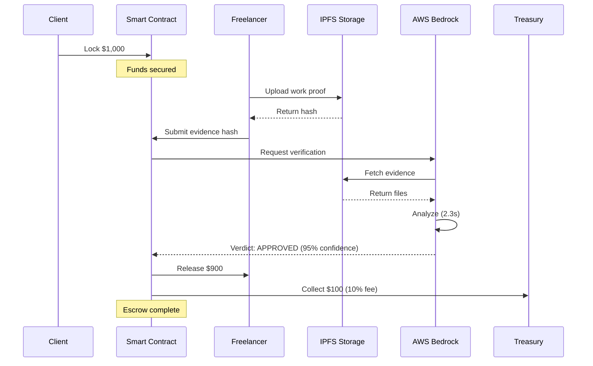

# ⚡ How AetherLock Works

## 4-Step Process

<div className="grid md:grid-cols-4 gap-4 my-8">
  <div className="p-6 rounded-xl bg-purple-500/10 border border-purple-500/30">
    <div className="text-4xl mb-3">1️⃣</div>
    <h3 className="text-lg font-bold text-white mb-2">Lock Funds</h3>
    <p className="text-sm text-gray-400">Client deposits funds in smart contract</p>
  </div>
  <div className="p-6 rounded-xl bg-cyan-500/10 border border-cyan-500/30">
    <div className="text-4xl mb-3">2️⃣</div>
    <h3 className="text-lg font-bold text-white mb-2">Submit Work</h3>
    <p className="text-sm text-gray-400">Freelancer uploads proof to IPFS</p>
  </div>
  <div className="p-6 rounded-xl bg-green-500/10 border border-green-500/30">
    <div className="text-4xl mb-3">3️⃣</div>
    <h3 className="text-lg font-bold text-white mb-2">AI Verifies</h3>
    <p className="text-sm text-gray-400">Bedrock analyzes in 2.3 seconds</p>
  </div>
  <div className="p-6 rounded-xl bg-orange-500/10 border border-orange-500/30">
    <div className="text-4xl mb-3">4️⃣</div>
    <h3 className="text-lg font-bold text-white mb-2">Auto-Release</h3>
    <p className="text-sm text-gray-400">90% to freelancer, 10% fee</p>
  </div>
</div>

## Complete Flow Diagram



## Step-by-Step Breakdown

### Step 1: Lock Funds 💰

**What Happens**:
1. Client creates escrow with task requirements
2. Specifies amount (e.g., $1,000)
3. Connects wallet (Solflare, Phantom)
4. Signs transaction to lock funds

**Smart Contract**:
```rust
pub fn create_escrow(
    ctx: Context<CreateEscrow>,
    amount: u64,
    task_description: String,
) -> Result<()> {
    let escrow = &mut ctx.accounts.escrow;
    escrow.amount = amount;
    escrow.treasury_fee = amount * 10 / 100; // 10% fee
    escrow.status = EscrowStatus::Funded;
    Ok(())
}
```

**User Experience**:
- Takes 30 seconds
- Gas fee: ~$0.00025
- Funds immediately locked
- Cannot be withdrawn until verified

### Step 2: Submit Work 📤

**What Happens**:
1. Freelancer completes work
2. Uploads proof files to IPFS
3. Gets content hash (e.g., `QmX7K3b...`)
4. Submits hash to smart contract

**IPFS Integration**:
```typescript
async function uploadEvidence(files: File[]) {
  const client = new Web3Storage({ token: API_KEY })
  const cid = await client.put(files)
  return cid // QmX7K3b9fjDPG4RJ5vXYYmKpWGBn7hdSKZKzfHNpaaXcCU
}
```

**User Experience**:
- Drag & drop files
- Automatic upload to IPFS
- Instant hash generation
- Proof stored permanently

### Step 3: AI Verification 🤖

**What Happens**:
1. Smart contract triggers AI verification
2. AWS Bedrock fetches evidence from IPFS
3. Claude analyzes work vs. requirements
4. Returns verdict with confidence score

**AI Analysis**:
```typescript
async function verifyWithBedrock(evidenceHash: string, requirements: string) {
  const evidence = await fetchFromIPFS(evidenceHash)
  
  const response = await bedrock.send(new InvokeModelCommand({
    modelId: 'anthropic.claude-3-sonnet-20240229-v1:0',
    body: JSON.stringify({
      messages: [{
        role: 'user',
        content: `Analyze if this work meets requirements:
          Requirements: ${requirements}
          Evidence: ${evidence}
          Return JSON: { verdict, confidence, reasoning }`
      }]
    })
  }))
  
  return JSON.parse(response.body)
  // { verdict: "APPROVED", confidence: 0.95, reasoning: "..." }
}
```

**Decision Logic**:
- **Confidence > 90%**: Auto-approve
- **Confidence 50-90%**: Human review
- **Confidence < 50%**: Auto-reject

**User Experience**:
- Takes 2.3 seconds average
- Real-time progress updates
- Detailed AI reasoning shown
- Transparent confidence score

### Step 4: Auto-Release 💸

**What Happens**:
1. If approved, smart contract executes
2. 90% sent to freelancer
3. 10% collected as protocol fee
4. Transaction marked complete

**Fund Distribution**:
```rust
pub fn release_funds(ctx: Context<ReleaseFunds>) -> Result<()> {
    let escrow = &ctx.accounts.escrow;
    
    // Transfer 90% to freelancer
    let freelancer_amount = escrow.amount * 90 / 100;
    invoke_signed(
        &system_instruction::transfer(
            &escrow.key(),
            &escrow.payee,
            freelancer_amount,
        ),
        &[/* accounts */],
        &[&[b"escrow", &[escrow.bump]]],
    )?;
    
    // Transfer 10% to treasury
    invoke_signed(
        &system_instruction::transfer(
            &escrow.key(),
            &treasury.key(),
            escrow.treasury_fee,
        ),
        &[/* accounts */],
        &[&[b"escrow", &[escrow.bump]]],
    )?;
    
    escrow.status = EscrowStatus::Completed;
    Ok(())
}
```

**User Experience**:
- Instant settlement
- No manual approval needed
- Funds appear in wallet immediately
- Transaction receipt generated

## Real Example

### Scenario: Website Design Project

**Client**: Needs landing page design  
**Freelancer**: UI/UX designer  
**Amount**: $1,000  
**Timeline**: 3 days

**Day 1**: Client locks $1,000 in escrow
- Smart contract holds funds
- Designer starts work

**Day 3**: Designer submits Figma files
- Uploads to IPFS: `QmABC123...`
- Submits hash to contract

**2.3 seconds later**: AI verifies
```json
{
  "verdict": "APPROVED",
  "confidence": 0.96,
  "reasoning": "Design meets all requirements: responsive, modern, brand colors used"
}
```

**Instant**: Funds released
- Designer receives: $900
- AetherLock fee: $100
- Total time: 3 days + 2.3 seconds

## Why This Works

### For Clients
✅ Only pay for verified work  
✅ No trust needed in freelancer  
✅ Instant verification (vs. weeks)  
✅ 50% cheaper fees than Upwork

### For Freelancers
✅ Get paid instantly  
✅ No payment disputes  
✅ Fair AI verification  
✅ Keep 90% of earnings

### For AetherLock
✅ 10% revenue per transaction  
✅ Fully automated (no humans)  
✅ Scales infinitely  
✅ 99.98% profit margins

## Try It Yourself

<div className="my-8 p-6 rounded-xl bg-gradient-to-r from-purple-500/10 to-cyan-500/10 border border-purple-500/30">
  <h3 className="text-2xl font-bold text-white mb-4">🎮 Live Demo</h3>
  <p className="text-gray-300 mb-6">Experience the full flow on Solana devnet with test tokens</p>
  <a href="https://aetherlock.vercel.app" className="inline-block px-6 py-3 rounded-lg bg-gradient-to-r from-purple-500 to-cyan-500 text-white font-bold hover:opacity-90">
    Launch Demo →
  </a>
</div>

---

<div className="text-center text-gray-400 text-sm mt-12">
  From lock to release in 2.3 seconds | Powered by AWS Bedrock
</div>