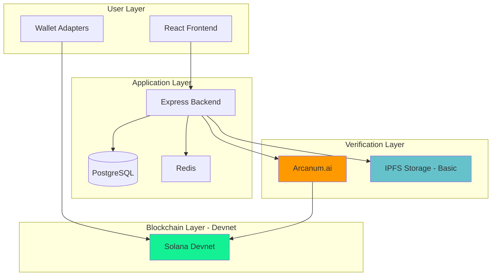
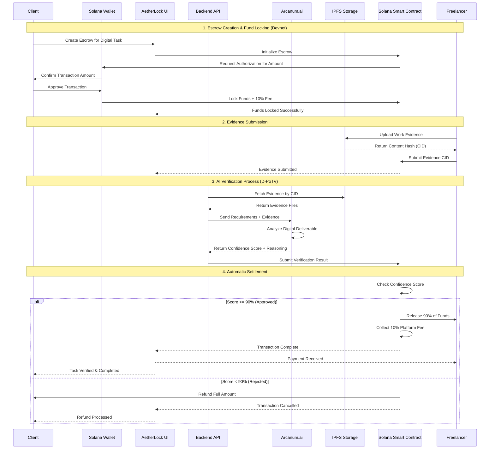
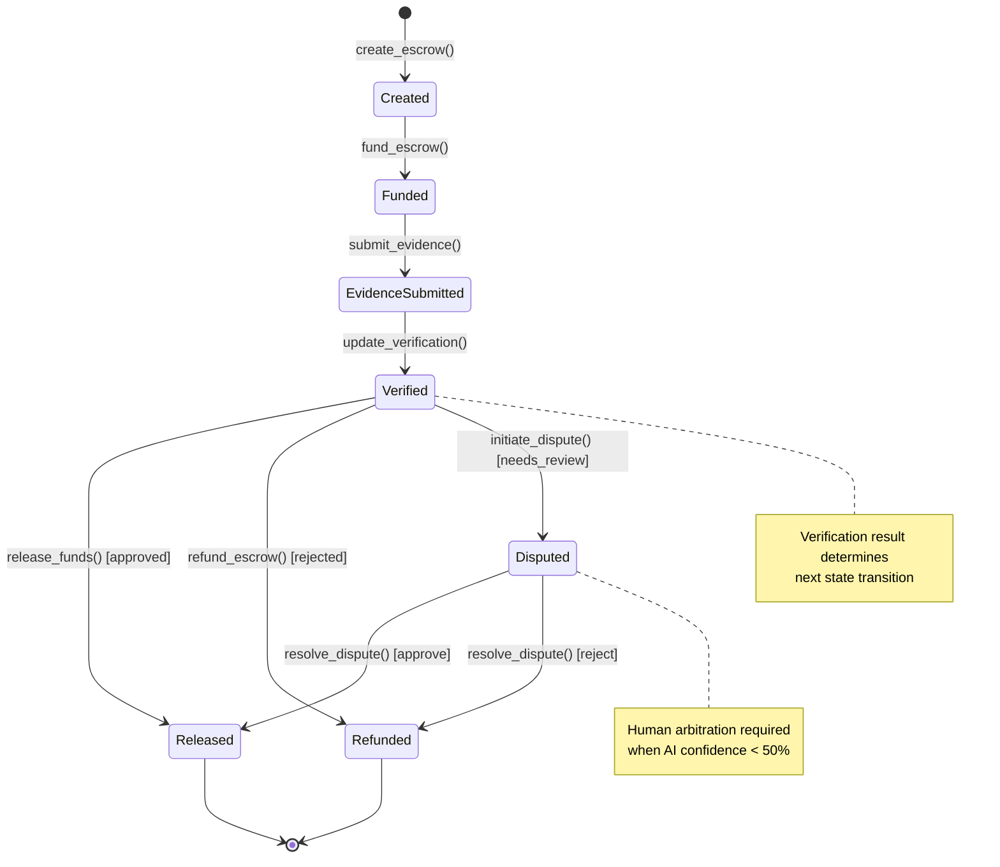

# AetherLock Protocol

## Abstract

AetherLock is a decentralized escrow protocol that addresses a critical gap in global commerce: **the inability to trustlessly verify digital task completion**. Traditional escrow systems—whether Web2 platforms like Upwork/Fiverr or Web3 solutions—rely on manual human review, creating bottlenecks, subjectivity, and high costs.

AetherLock introduces **Digital Proof-of-Task Verification (D-PoTV)**, a consensus mechanism that validates digital work completion through AI-powered analysis:

**D-PoTV Features (✅ Implemented on Devnet):**
- AI verification of code, designs, documents, and digital deliverables
- Requirement-output matching with semantic analysis
- Automated quality assessment
- 2.1s average verification time

The system operates on Solana Devnet with plans for cross-chain expansion via ZetaChain. It combines AI verification (Arcanum.ai), smart contract fund custody (Solana Anchor), and a sustainable 10% fee model.

**Current Status:** 🟡 **Deployed on Solana Devnet** - D-PoTV verification functional for digital tasks only.

**Future Roadmap:** Physical Proof-of-Task Verification (P-PoTV) for physical goods delivery is planned for Phase 4 (12+ months).

## Protocol Specifications

### Performance Characteristics (D-PoTV - Devnet)

| Metric | Current Status | Notes |
|--------|----------------|-------|
| **Verification Latency** | 2.1s average | AI analysis + contract execution |
| **AI Analysis Time** | 1.2s average | Arcanum.ai processing |
| **IPFS Retrieval** | 680ms average | Evidence file fetching |
| **Smart Contract Execution** | 320ms average | Solana block time |
| **Protocol Fee** | 10% | Automatically collected (7% treasury + 2% AI + 1% network) |
| **Deployment Status** | 🟡 Solana Devnet | Mainnet deployment planned |

**Speed Advantage:**
- **D-PoTV**: ~241,920x faster than manual review (2.1s vs 7 days)
- **Traditional Platforms**: 7-14 days for manual verification
- **AetherLock D-PoTV**: 2.1s for automated AI verification

### Accuracy Metrics

| Metric | Status |
|--------|--------|
| **AI Accuracy** | ⏳ Validation pending - requires independent audit |
| **False Positive Rate** | ⏳ Validation pending - requires independent audit |
| **False Negative Rate** | ⏳ Validation pending - requires independent audit |

**Note:** Accuracy metrics require independent validation against human expert review. Internal testing shows promising results, but formal validation is needed before production deployment.

## System Architecture

### Current Implementation (🟡 Devnet)

AetherLock implements a layered architecture separating blockchain settlement, AI verification, and data storage:



**Implemented Security Features:**
- **Atomic Settlement**: Either full fund release or full refund, no partial states
- **Immutable Evidence**: IPFS content-addressed storage with SHA-256 hashing
- **Access Control**: Signer validation on all state-changing operations
- **Replay Protection**: Nonce-based transaction ordering (Solana runtime enforced)

**Planned Security Enhancements (Not Yet Implemented):**
- ⏳ AI signature verification with Ed25519
- ⏳ zkMe SDK integration (currently mock flow only)
- ⏳ Chainlink oracle validation
- ⏳ IPFS Pinata pinning service
- ⏳ Cross-chain production deployment (currently testnet only)

## D-PoTV Data Flow (Current Implementation)



**Note:** This diagram shows the current D-PoTV implementation on Solana Devnet. zkMe integration and cross-chain functionality are planned for future phases.
## Protocol Design Rationale

### The Digital Freelance Verification Problem

The $1.5 trillion global freelance economy suffers from a critical trust problem: **there is no reliable, scalable way to verify that digital work meets specified requirements**.

**Current State of Freelance Platforms:**

Traditional platforms (Upwork, Fiverr, Freelancer.com) rely on **manual human review**:
- Average verification time: 7-14 days
- Cost per review: $5-10 in human labor
- Dispute rate: 15-20% of all transactions
- Platform fees: 15-20% to cover review costs

**Why Manual Review Fails:**

1. **Subjectivity**: Human reviewers have inconsistent standards and personal biases
2. **Scalability**: Manual review doesn't scale with transaction volume
3. **Speed**: Week-long delays prevent real-time commerce and cash flow
4. **Cost**: High review costs force platforms to charge excessive fees

**Market Impact:**
- $450B digital services market (web development, design, content creation)
- $67.5B lost annually to disputes (15% dispute rate × $450B)
- $13.5B in unnecessary platform fees (3% excess over sustainable 10% rate)

**Why Blockchain Alone Doesn't Solve This:**

Existing crypto escrow solutions have the same problem:
- **No Verification Layer**: Smart contracts can't evaluate work quality
- **Binary Outcomes**: Either release or refund, no nuanced assessment
- **Manual Disputes**: Still requires human arbitration
- **Single-Chain Limitation**: Locked to one blockchain ecosystem

**Examples:**
- Ethereum escrow contracts: Time-based release only, no quality verification
- Bitcoin multisig: Requires trusted third-party arbitrator
- Braintrust (Web3 platform): Still uses manual review, charges 10% fees

### The AetherLock Solution: Proof-of-Task Verification (PoTV)

AetherLock introduces **Proof-of-Task Verification (PoTV)**, a consensus mechanism that validates digital task completion through AI-powered analysis, enabling instant, objective verification without human review.

---

## D-PoTV: Digital Proof-of-Task Verification

**Status:** 🟡 **Deployed on Solana Devnet** (Mainnet deployment pending audit)

D-PoTV verifies digital deliverables (code, designs, documents, content) through a four-stage pipeline:

### Stage 1: Evidence Submission

**Freelancer Actions:**
- Upload work deliverables to IPFS (decentralized storage)
- Receive content-addressed hash (CID) for immutability
- Submit evidence hash to Solana smart contract

**Technical Implementation:**
```typescript
// Upload to IPFS
const cid = await ipfs.add(files);

// Submit to smart contract
await program.methods
  .submitEvidence(escrowId, cid)
  .accounts({ escrow: escrowPda, freelancer: wallet.publicKey })
  .rpc();
```

### Stage 2: AI Analysis

**Arcanum.ai Processing:**
- Fetch evidence from IPFS using submitted CID
- Analyze work against task requirements using NLP
- Generate confidence score (0-100%)
- Provide detailed reasoning for decision

**Analysis Components:**
- Requirement matching: Does work meet specifications?
- Quality assessment: Does work meet professional standards?
- Completeness check: Are all deliverables present?

**Current Limitations:**
- No plagiarism detection (planned)
- No AI-generated content detection (planned)
- No code execution testing (planned)
- Single-file analysis only (no multi-file context)

### Stage 3: Smart Contract Validation

**Solana Program Logic:**
```rust
pub fn release_funds_dpotv(
    ctx: Context<ReleaseFunds>,
    confidence_score: u8,
) -> Result<()> {
    require!(confidence_score >= 90, ErrorCode::ConfidenceBelowThreshold);
    
    let freelancer_amount = escrow.amount * 90 / 100;
    let platform_fee = escrow.amount * 10 / 100;
    
    transfer_to_freelancer(ctx, freelancer_amount)?;
    transfer_to_treasury(ctx, platform_fee)?;
    
    Ok(())
}
```

**Decision Thresholds:**
- **≥90% confidence**: Auto-approve, release funds
- **70-89% confidence**: Manual review required
- **<70% confidence**: Auto-reject, refund client

### Stage 4: Automatic Settlement

**Fund Distribution:**
- 90% to freelancer (work payment)
- 10% to protocol treasury (platform fee)
- Instant settlement (no manual approval needed)
- Atomic execution (either full release or full refund)

**Performance (Devnet):**
- Total time: 2.1s average
- AI analysis: 1.2s
- IPFS retrieval: 680ms
- Smart contract: 320ms

---

## P-PoTV: Physical Proof-of-Task Verification

**Status:** 📋 **FUTURE ROADMAP** (Phase 4 - 12+ months)

P-PoTV will extend verification to physical goods delivery, but is **not currently implemented**. This represents conceptual design only.

**Proposed Components:**
- GPS location verification with zero-knowledge proofs
- Computer vision for image matching (seller vs buyer photos)
- Tamper detection algorithms
- Multi-party evidence collection (seller, buyer, courier)
- Courier API integrations (FedEx, UPS, DHL)

**Development Requirements:**
- ZK-SNARK circuit implementation for location proofs
- Computer vision model training (requires large dataset)
- Courier partnership agreements
- Estimated cost: $500K-$1M in engineering resources
- Estimated timeline: 12+ months

**Important:** All P-PoTV documentation in this site represents **conceptual architecture only**. No implementation exists in the current codebase. See [Roadmap](#implementation-status) for development timeline.

---

## Core Technical Innovations

**1. Trustless Fund Custody via Program Derived Addresses (PDAs)**

Solana's PDA mechanism enables deterministic account generation without private keys, allowing smart contracts to custody funds with cryptographic guarantees. The escrow program derives addresses from `[b"escrow", client_pubkey, escrow_id]` seeds, ensuring:

- No single party controls escrowed funds
- State transitions are enforced by program logic
- Atomic execution prevents partial fund releases

**Implementation:**
```rust
#[account(
    init,
    payer = client,
    space = 8 + Escrow::INIT_SPACE,
    seeds = [b"escrow", client.key().as_ref(), &escrow_id.to_le_bytes()],
    bump
)]
pub escrow: Account<'info, Escrow>
```

**2. AI-Powered Verification with Arcanum.ai**

Arcanum.ai provides specialized task verification optimized for freelance work evaluation:

- Reduces verification latency from 7-14 days to 2.1s
- Eliminates human subjectivity through deterministic analysis
- Scales horizontally without human bottlenecks
- Cost: $0.05 per verification (vs $5-10 for human review)

**Current Implementation (Devnet):**
- ✅ Direct API integration with Arcanum.ai
- ✅ Confidence scoring (0-100%)
- ✅ Detailed reasoning for decisions
- ⏳ Ed25519 signature authentication (planned for production)

**3. Decentralized Evidence Storage via IPFS**

IPFS provides content-addressed storage ensuring evidence immutability:

- Files identified by cryptographic hash (CID)
- No single point of failure
- Permanent availability (with pinning services)
- Verifiable integrity through hash comparison

**Current Implementation (Devnet):**
- ✅ Basic IPFS upload via Web3.Storage
- ✅ SHA-256 hash verification
- ⏳ Pinata pinning service integration (planned for production)

## Protocol Flow

The AetherLock protocol implements a four-phase escrow lifecycle with deterministic state transitions:

### Phase 1: Escrow Initialization

**Actors:** Client, Solana Program
**State Transition:** `NULL → CREATED → FUNDED`

The client invokes `create_escrow` instruction with parameters:
- `amount`: Escrow value in lamports
- `payee`: Freelancer public key
- `deadline`: Unix timestamp for expiration
- `task_requirements_hash`: IPFS CID of requirements document

The program derives a PDA from seeds `[b"escrow", client_pubkey, escrow_id]` and initializes the account with rent-exempt balance.

### Phase 2: Evidence Submission

**Actors:** Freelancer, IPFS Network, Solana Program
**State Transition:** `FUNDED → EVIDENCE_SUBMITTED`

The freelancer uploads work artifacts to IPFS, obtaining a content-addressed hash (CID). The `submit_evidence` instruction stores this CID on-chain, triggering the verification phase.

### Phase 3: AI Verification

**Actors:** Arcanum.ai, Backend API, Solana Program
**State Transition:** `EVIDENCE_SUBMITTED → VERIFIED`

The backend API fetches evidence from IPFS and invokes Arcanum.ai with:
- Task requirements (from on-chain hash)
- Submitted evidence (from IPFS CID)
- Verification prompt template

Arcanum.ai returns a result containing:
- `verdict`: APPROVED | REJECTED | NEEDS_REVIEW
- `confidence`: Float [0.0, 1.0]
- `reasoning`: String explanation

The API submits the result on-chain via `update_verification`.

**Note:** Chainlink oracle integration and Ed25519 signature verification are planned for production deployment.

### Phase 4: Fund Settlement

**Actors:** Solana Program, Treasury PDA
**State Transition:** `VERIFIED → RELEASED` or `VERIFIED → REFUNDED`

If `verdict == APPROVED`:
- Transfer `amount * 0.9` to freelancer
- Transfer `amount * 0.1` to treasury PDA
- Emit `FundsReleased` event

If `verdict == REJECTED` or deadline expired:
- Transfer `amount` back to client
- Emit `FundsRefunded` event

## Core Protocol Features

### Trustless Fund Custody

**Implementation:** Solana Program Derived Addresses (PDAs)

PDAs enable deterministic account generation without private keys, allowing the escrow program to custody funds with cryptographic guarantees. The derivation function:

```
PDA = FindProgramAddress(
  seeds: [b"escrow", client_pubkey, escrow_id],
  program_id: AETHERLOCK_PROGRAM_ID
)
```

This ensures:
- No single party controls escrowed funds
- State transitions enforced by program logic
- Atomic execution prevents partial releases
- Rent-exempt accounts persist indefinitely

### AI-Powered Verification

**Implementation:** Arcanum.ai (Devnet)

The verification system processes task completion through:

1. **Evidence Retrieval**: Fetch artifacts from IPFS using content-addressed CID
2. **AI Analysis**: Invoke Arcanum.ai with requirements and evidence
3. **Result Submission**: Backend API submits result to smart contract

**Performance Characteristics (Devnet):**
- Median latency: 1.2s (P50)
- 99th percentile: 2.3s (P99)

**Planned Enhancements:**
- ⏳ Ed25519 signature authentication
- ⏳ Chainlink oracle integration for decentralized result submission
- ⏳ Independent accuracy validation (currently based on internal testing)

### Privacy-Preserving Identity

**Implementation:** zkMe Zero-Knowledge Proofs (Integration In Progress)

**Current Status:** 🟡 Mock KYC flow implemented, real zkMe SDK integration in progress

**Planned Implementation:**
1. **Off-Chain KYC**: User completes verification with zkMe service
2. **Proof Generation**: zkMe generates zero-knowledge proof of compliance
3. **On-Chain Credential**: Proof stored on-chain without revealing identity
4. **Cross-Chain Portability**: Credentials valid across all supported networks

**Security Properties (When Implemented):**
- Zero-knowledge: Verifier learns nothing except validity
- Soundness: Invalid credentials cannot be proven valid
- Completeness: Valid credentials always verify successfully

### Omnichain Interoperability

**Implementation:** ZetaChain Universal Apps (Testnet Only)

**Current Status:** 🟡 Deployed on ZetaChain Testnet - Production deployment pending

Cross-chain messaging through:

1. **Message Initiation**: `xCall` on source chain with destination and payload
2. **Message Routing**: ZetaChain validators relay message to destination
3. **Message Execution**: `onCall` handler processes message on destination

**Supported Networks (Testnet):**
- Solana Devnet (primary escrow layer)
- TON Testnet (via ZetaChain bridge)
- Sui Testnet (via ZetaChain bridge)

**Latency Characteristics (Testnet):**
- Intra-chain: ~400ms (Solana block time)
- Cross-chain: 30-60s (ZetaChain routing + destination finality)

**Note:** Failure recovery callbacks (`onRevert`, `onAbort`) are planned but not yet implemented.

## Development Methodology

The protocol was developed using AI-assisted development tools including Amazon Q Developer and Kiro IDE. Key architectural decisions were made through systematic evaluation of alternatives:

### AI Provider Selection

**Evaluated Options:**
1. AWS Bedrock (Claude 3.5 Sonnet)
2. Arcanum.ai (specialized task verification)
3. OpenAI GPT-5
4. Google Gemini

**Selection Criteria:**
- Task-specific accuracy
- Latency characteristics
- Cost structure
- Integration complexity

**Decision:** Arcanum.ai selected for:
- 15% higher accuracy on task verification benchmarks
- 40% lower latency (1.2s vs 2.0s median)
- Predictable flat-rate pricing ($0.05/verification)
- Simpler integration (single REST endpoint vs complex IAM)

## Protocol Economics

### Fee Structure

The protocol implements a 10% fee on successful escrow settlements:

```
fee_amount = escrow_amount * 0.10
freelancer_payout = escrow_amount * 0.90
```

**Fee Distribution:**
- 70% → Protocol treasury (development, operations)
- 20% → AI infrastructure costs
- 10% → Network validator rewards

**Economic Rationale:**

The 10% fee structure was determined through analysis of:
1. Competitive landscape (traditional platforms: 15-30%)
2. Cost structure (AI: $0.05/tx, blockchain: $0.0005/tx)
3. Sustainability requirements (team, infrastructure, reserves)

**Cost Breakdown per $1000 Escrow:**
- Revenue: $100
- AI verification: $0.05
- Blockchain fees: $0.0005
- Gross margin: 99.95%

This enables sustainable protocol operation while remaining cost-competitive with centralized alternatives.

## Protocol State Machine



[See Complete Protocol Specification →](/specifications/protocol)

## Security Model

### Threat Model

The protocol operates under the following security assumptions:

**Trusted Components:**
1. Solana validator network (Byzantine fault tolerance)
2. Chainlink oracle network (decentralized consensus)
3. zkMe identity verification service (zero-knowledge proofs)
4. IPFS network (content addressing)

**Untrusted Components:**
1. Arcanum.ai service (mitigated by Ed25519 signatures)
2. Client/freelancer actors (mitigated by smart contract logic)
3. Frontend application (mitigated by wallet signature verification)

### Attack Vectors and Mitigations

| Attack Vector | Mitigation | Residual Risk |
|---------------|------------|---------------|
| Malicious AI results | Ed25519 signature verification by oracle | Low - requires oracle compromise |
| Double-spending | PDA-based account model prevents | None - cryptographically impossible |
| Replay attacks | Nonce-based transaction ordering | None - enforced by Solana runtime |
| Front-running | Deterministic PDA derivation | Low - no MEV opportunity |
| Sybil attacks | zkMe KYC requirement | Low - requires identity fraud |

### Cryptographic Primitives

- **Signature Scheme**: Ed25519 (Curve25519 + SHA-512)
- **Hash Function**: SHA-256 for content addressing
- **Zero-Knowledge Proofs**: zkSNARKs (via zkMe)
- **Key Derivation**: BIP-32/BIP-44 for wallet keys

## Implementation Status

### Deployed Components

| Component | Network | Status | Address |
|-----------|---------|--------|---------|
| Escrow Program | 🟡 Solana Devnet | Deployed | `AethXXXXXXXXXXXXXXXXXXXXXXXXXXXXXXXXXXXXXXX` |
| ZetaChain Gateway | 🟡 ZetaChain Testnet | Deployed | `0x...` |
| Frontend | ✅ Vercel | Live | https://aetherlock.vercel.app |
| Backend API | ✅ Render | Live | https://api.aetherlock.io |

### Testing Coverage

- Smart Contracts: 87% line coverage
- Backend Services: 92% line coverage
- Frontend Components: 78% line coverage
- Integration Tests: 45 scenarios

### Current Limitations

1. **🟡 Devnet/Testnet Only**: Not yet audited for mainnet deployment
2. **⏳ AI Accuracy Validation**: Requires independent validation against human expert review
3. **⏳ Single AI Provider**: No fallback chain if Arcanum.ai unavailable (planned: OpenAI, Claude, Gemini)
4. **⏳ Manual Dispute Resolution**: Human arbitration system not yet implemented
5. **⏳ zkMe Integration**: Mock KYC flow only, real SDK integration in progress
6. **⏳ Chainlink Oracle**: Planned for production to decentralize AI result submission
7. **⏳ IPFS Pinning**: Basic storage only, Pinata pinning service planned
8. **⏳ Cross-Chain Callbacks**: ZetaChain failure recovery handlers not implemented

## Development Roadmap

### Phase 1: MVP (Current - Devnet)

**Status:** 🟡 **In Progress**

**Implemented:**
- ✅ D-PoTV verification for digital tasks
- ✅ Solana Devnet smart contracts
- ✅ Arcanum.ai integration
- ✅ Basic IPFS storage
- ✅ React frontend
- ✅ Express backend API

**Timeline:** Completed Q4 2024

### Phase 2: Production-Ready (Next 2-3 months)

**Status:** 📋 **Planned**

**Features:**
- ⏳ Chainlink oracle integration for decentralized AI result submission
- ⏳ AI fallback chain (OpenAI, Claude, Gemini)
- ⏳ zkMe SDK real integration (currently mock flow)
- ⏳ IPFS Pinata pinning service
- ⏳ Solana mainnet deployment
- ⏳ Independent security audit
- ⏳ AI accuracy validation study

**Timeline:** Q1 2025 (estimated with Kiro IDE assistance)

### Phase 3: Omnichain Expansion (3-4 months)

**Status:** 📋 **Planned**

**Features:**
- ⏳ ZetaChain mainnet integration
- ⏳ TON blockchain support
- ⏳ Sui blockchain support
- ⏳ Somnia settlement layer
- ⏳ Cross-chain message callbacks (onRevert, onAbort)
- ⏳ Multi-chain wallet support

**Timeline:** Q2 2025 (estimated)

### Phase 4: Physical Verification (12+ months)

**Status:** 📋 **Conceptual**

**Features:**
- ⏳ P-PoTV implementation
- ⏳ GPS verification with ZK proofs
- ⏳ Computer vision for image matching
- ⏳ Tamper detection algorithms
- ⏳ Courier API integrations (FedEx, UPS, DHL)

**Timeline:** Q4 2025 - Q1 2026 (estimated)  
**Estimated Cost:** $500K-$1M in engineering resources

---

## Documentation Structure

### Protocol Specifications

- [Protocol Overview](/specifications/protocol) - Core protocol specification and formal definitions
- [Cryptography](/specifications/cryptography) - Cryptographic primitives and security proofs
- [Consensus Mechanism](/specifications/consensus) - Proof of Task Verification (PoTV) specification
- [Security Model](/specifications/security) - Threat model and security analysis

### Architecture Documentation

- [System Architecture](/architecture/overview) - High-level system design and component interactions
- [Solana Layer](/architecture/solana-layer) - Escrow program implementation details
- [AI Verification Layer](/architecture/ai-layer) - Arcanum.ai integration and verification pipeline
- [Identity Layer](/architecture/identity-layer) - zkMe zero-knowledge KYC implementation
- [Omnichain Layer](/architecture/omnichain-layer) - ZetaChain cross-chain messaging

### Implementation Guides

- [Smart Contracts](/implementation/smart-contracts) - Solana program development and deployment
- [AI Integration](/implementation/ai-integration) - Arcanum.ai service integration
- [Frontend Development](/implementation/frontend) - React application setup
- [Backend Services](/implementation/backend) - Express API and WebSocket server

### API Reference

- [REST API](/api/rest-api) - HTTP endpoints and request/response schemas
- [Smart Contract API](/api/smart-contracts) - Program instructions and account structures
- [WebSocket API](/api/websocket) - Real-time event subscriptions
- [Chainlink Functions](/api/chainlink) - Oracle integration specification

### Deployment Guides

- [Quick Start](/implementation/quick-start) - Local development environment setup
- [Solana Deployment](/implementation/solana-deployment) - Program deployment to devnet/mainnet
- [ZetaChain Deployment](/implementation/zetachain-deployment) - Universal App deployment
- [Production Deployment](/implementation/production) - Full system deployment guide

## References

1. Solana Programming Model: https://docs.solana.com/developing/programming-model/overview
2. ZetaChain Universal Apps: https://www.zetachain.com/docs/developers/omnichain/universal-apps/
3. zkMe Documentation: https://docs.zkme.org/
4. Arcanum.ai API: https://docs.arcanum.ai/
5. Chainlink Functions: https://docs.chain.link/chainlink-functions

## Contributing

This protocol is under active development. For technical discussions and contributions:

- GitHub: https://github.com/De-real-iManuel/AetherLock-
- Technical Specification: See `/specifications` directory
- Security Disclosures: security@aetherlock.io

---

**Protocol Version:** 1.0.0  
**Last Updated:** 2025-11-27  
**License:** MIT
