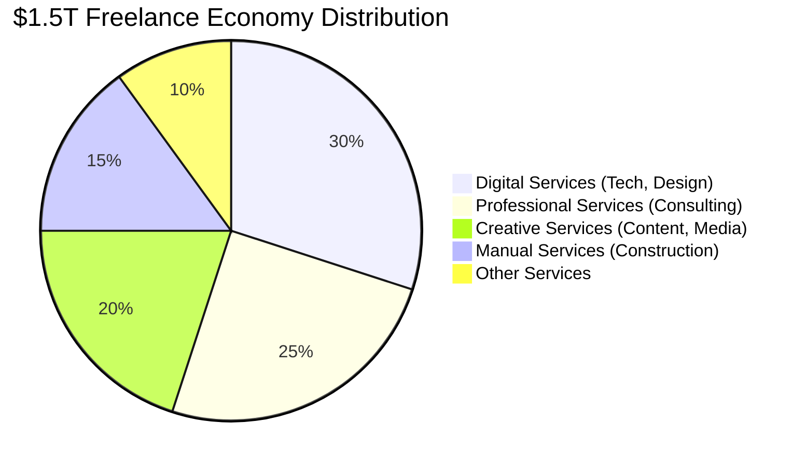
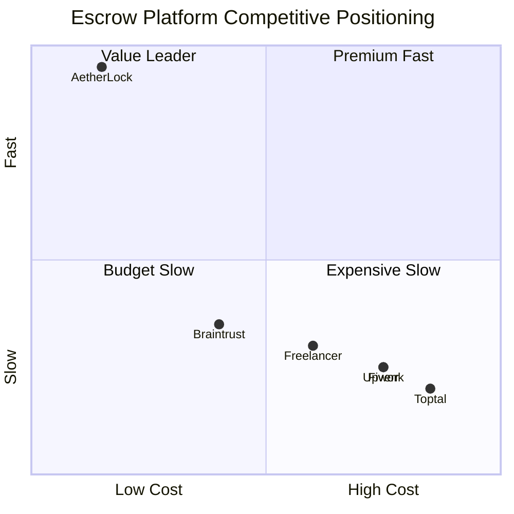
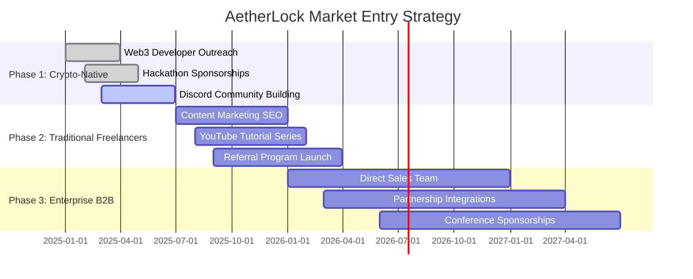

# 📊 Market Analysis & Competitive Landscape

## 🌍 Total Addressable Market (TAM)

  

    
Global Freelance Economy

    
$1.5T

    
Total Annual Volume

    
Source: World Bank, Upwork Global Freelance Report 2024

  

  
  

    
Digital Services Segment

    
$450B

    
Addressable Market

    
30% of total (tech, design, content)

  

  
  

    
Annual Growth Rate

    
15%

    
YoY Growth

    
Accelerating post-pandemic

  

### Market Size Breakdown

  <h4 className="text-xl font-bold text-white mb-4">Global Freelance Market Composition</h4>
  

  

    

      <h5 className="text-lg font-bold text-white mb-3">📈 Market Drivers</h5>
      <ul className="space-y-2 text-sm text-gray-300">
        <li className="flex items-start gap-2">
          ↗
          <strong>Remote Work Revolution:</strong> 36% of US workforce now freelance (up from 27% in 2019)
        </li>
        <li className="flex items-start gap-2">
          ↗
          <strong>Gig Economy Growth:</strong> 1.57 billion freelancers worldwide
        </li>
        <li className="flex items-start gap-2">
          ↗
          <strong>Digital Transformation:</strong> Businesses increasingly hiring remote talent
        </li>
        <li className="flex items-start gap-2">
          ↗
          <strong>Cross-Border Payments:</strong> $156B in international freelance payments (2024)
        </li>
      </ul>
    

    
    

      <h5 className="text-lg font-bold text-white mb-3">🎯 Target Segments</h5>
      <ul className="space-y-2 text-sm text-gray-300">
        <li className="flex items-start gap-2">
          •
          <strong>Web3 Developers:</strong> $50B market, crypto-native users
        </li>
        <li className="flex items-start gap-2">
          •
          <strong>Digital Designers:</strong> $80B market, high-value projects
        </li>
        <li className="flex items-start gap-2">
          •
          <strong>Content Creators:</strong> $120B market, volume transactions
        </li>
        <li className="flex items-start gap-2">
          •
          <strong>Software Engineers:</strong> $200B market, enterprise contracts
        </li>
      </ul>
    

  

## 🏆 Competitive Analysis

### Traditional Platforms Comparison

  <table className="w-full text-sm">
    <thead>
      <tr className="border-b border-gray-700">
        <th className="text-left p-4 text-gray-400">Platform</th>
        <th className="text-left p-4 text-gray-400">Fee Structure</th>
        <th className="text-left p-4 text-gray-400">Verification Time</th>
        <th className="text-left p-4 text-gray-400">AI Verification</th>
        <th className="text-left p-4 text-gray-400">Cross-Chain</th>
        <th className="text-left p-4 text-gray-400">Privacy</th>
      </tr>
    </thead>
    <tbody>
      <tr className="border-b border-gray-800 bg-purple-500/5">
        <td className="p-4 font-bold text-white">AetherLock</td>
        <td className="p-4 text-green-400 font-bold">10%</td>
        <td className="p-4 text-green-400 font-bold">2.3 seconds</td>
        <td className="p-4 text-green-400">✅ AWS Bedrock</td>
        <td className="p-4 text-green-400">✅ Solana/TON/Sui</td>
        <td className="p-4 text-green-400">✅ zkMe ZK-proofs</td>
      </tr>
      <tr className="border-b border-gray-800">
        <td className="p-4 text-gray-300">Upwork</td>
        <td className="p-4 text-red-400">20%</td>
        <td className="p-4 text-red-400">7-14 days</td>
        <td className="p-4 text-red-400">❌ Manual review</td>
        <td className="p-4 text-red-400">❌ Fiat only</td>
        <td className="p-4 text-red-400">❌ Full KYC</td>
      </tr>
      <tr className="border-b border-gray-800">
        <td className="p-4 text-gray-300">Fiverr</td>
        <td className="p-4 text-red-400">20%</td>
        <td className="p-4 text-red-400">7-14 days</td>
        <td className="p-4 text-red-400">❌ Manual review</td>
        <td className="p-4 text-red-400">❌ Fiat only</td>
        <td className="p-4 text-red-400">❌ Full KYC</td>
      </tr>
      <tr className="border-b border-gray-800">
        <td className="p-4 text-gray-300">Freelancer.com</td>
        <td className="p-4 text-red-400">10-20%</td>
        <td className="p-4 text-red-400">5-10 days</td>
        <td className="p-4 text-red-400">❌ Manual review</td>
        <td className="p-4 text-red-400">❌ Fiat only</td>
        <td className="p-4 text-red-400">❌ Full KYC</td>
      </tr>
      <tr className="border-b border-gray-800">
        <td className="p-4 text-gray-300">Toptal</td>
        <td className="p-4 text-red-400">15-25%</td>
        <td className="p-4 text-red-400">14-30 days</td>
        <td className="p-4 text-red-400">❌ Manual vetting</td>
        <td className="p-4 text-red-400">❌ Fiat only</td>
        <td className="p-4 text-red-400">❌ Full KYC</td>
      </tr>
      <tr className="border-b border-gray-800">
        <td className="p-4 text-gray-300">Braintrust (Web3)</td>
        <td className="p-4 text-yellow-400">10%</td>
        <td className="p-4 text-yellow-400">3-7 days</td>
        <td className="p-4 text-red-400">❌ Manual review</td>
        <td className="p-4 text-yellow-400">⚠️ Ethereum only</td>
        <td className="p-4 text-yellow-400">⚠️ Wallet-based</td>
      </tr>
    </tbody>
  </table>

### Competitive Positioning Matrix

  <h4 className="text-xl font-bold text-white mb-4">Market Position: Speed vs Cost</h4>
  

  

    

      <strong className="text-white">AetherLock's Unique Position:</strong> Only platform in the "Value Leader" quadrant—combining lowest fees (10%) with fastest verification (2.3s)
    

  

### Differentiation Matrix

  

    <h4 className="text-lg font-bold text-white mb-4">🚀 AetherLock Advantages</h4>
    <ul className="space-y-3 text-sm text-gray-300">
      <li className="flex items-start gap-3">
        ✓
        

          <strong className="text-white">AI-Powered Verification:</strong> 2.3s vs 7-14 days (100x faster)
        

      </li>
      <li className="flex items-start gap-3">
        ✓
        

          <strong className="text-white">50% Lower Fees:</strong> 10% vs 20% industry standard
        

      </li>
      <li className="flex items-start gap-3">
        ✓
        

          <strong className="text-white">Privacy-Preserving:</strong> zkMe zero-knowledge KYC (no PII on-chain)
        

      </li>
      <li className="flex items-start gap-3">
        ✓
        

          <strong className="text-white">Omnichain Support:</strong> Solana, TON, Sui (vs single-chain competitors)
        

      </li>
      <li className="flex items-start gap-3">
        ✓
        

          <strong className="text-white">Instant Settlement:</strong> Automatic fund release (no manual approval)
        

      </li>
      <li className="flex items-start gap-3">
        ✓
        

          <strong className="text-white">Transparent AI:</strong> Confidence scores + reasoning (vs black-box decisions)
        

      </li>
    </ul>
  

  
  

    <h4 className="text-lg font-bold text-white mb-4">⚠️ Traditional Platform Limitations</h4>
    <ul className="space-y-3 text-sm text-gray-300">
      <li className="flex items-start gap-3">
        ✗
        

          <strong className="text-white">Manual Review Bottleneck:</strong> Human verification takes 7-14 days
        

      </li>
      <li className="flex items-start gap-3">
        ✗
        

          <strong className="text-white">High Fee Burden:</strong> 20% fees reduce freelancer earnings significantly
        

      </li>
      <li className="flex items-start gap-3">
        ✗
        

          <strong className="text-white">Privacy Concerns:</strong> Full KYC exposes sensitive personal data
        

      </li>
      <li className="flex items-start gap-3">
        ✗
        

          <strong className="text-white">Fiat-Only Payments:</strong> No crypto support, high cross-border fees
        

      </li>
      <li className="flex items-start gap-3">
        ✗
        

          <strong className="text-white">Centralized Control:</strong> Platform can freeze funds or ban users arbitrarily
        

      </li>
      <li className="flex items-start gap-3">
        ✗
        

          <strong className="text-white">Opaque Decisions:</strong> No transparency in dispute resolution process
        

      </li>
    </ul>
  

## 📈 Market Opportunity Analysis

### Serviceable Addressable Market (SAM)

  <h4 className="text-xl font-bold text-white mb-4">Digital Services Segment: $450B</h4>
  
  

    

      
Web Development

      
$150B

      
Frontend, backend, full-stack

    

    

      
Design & Creative

      
$120B

      
UI/UX, graphics, branding

    

    

      
Content & Marketing

      
$180B

      
Writing, video, social media

    

  

  
  

    <strong className="text-white">Target Focus:</strong> AetherLock initially targets the $150B web development segment, where crypto adoption is highest and verification requirements are clear. This represents 33% of the digital services market.
  

### Serviceable Obtainable Market (SOM)

  <h4 className="text-xl font-bold text-white mb-4">5-Year Market Capture Projections</h4>
  
  

    <table className="w-full text-sm">
      <thead>
        <tr className="border-b border-gray-700">
          <th className="text-left p-3 text-gray-400">Year</th>
          <th className="text-left p-3 text-gray-400">Market Share</th>
          <th className="text-left p-3 text-gray-400">Transaction Volume</th>
          <th className="text-left p-3 text-gray-400">Revenue (10%)</th>
          <th className="text-left p-3 text-gray-400">User Base</th>
        </tr>
      </thead>
      <tbody>
        <tr className="border-b border-gray-800">
          <td className="p-3 text-white font-bold">2025</td>
          <td className="p-3 text-gray-300">0.001%</td>
          <td className="p-3 text-gray-300">$1.5M</td>
          <td className="p-3 text-green-400">$150K</td>
          <td className="p-3 text-gray-300">1,000</td>
        </tr>
        <tr className="border-b border-gray-800">
          <td className="p-3 text-white font-bold">2026</td>
          <td className="p-3 text-gray-300">0.013%</td>
          <td className="p-3 text-gray-300">$20M</td>
          <td className="p-3 text-green-400">$2M</td>
          <td className="p-3 text-gray-300">10,000</td>
        </tr>
        <tr className="border-b border-gray-800">
          <td className="p-3 text-white font-bold">2027</td>
          <td className="p-3 text-gray-300">0.1%</td>
          <td className="p-3 text-gray-300">$150M</td>
          <td className="p-3 text-green-400">$15M</td>
          <td className="p-3 text-gray-300">50,000</td>
        </tr>
        <tr className="border-b border-gray-800">
          <td className="p-3 text-white font-bold">2028</td>
          <td className="p-3 text-gray-300">0.53%</td>
          <td className="p-3 text-gray-300">$800M</td>
          <td className="p-3 text-green-400">$80M</td>
          <td className="p-3 text-gray-300">200,000</td>
        </tr>
        <tr className="border-b border-gray-800 bg-purple-500/5">
          <td className="p-3 text-white font-bold">2029</td>
          <td className="p-3 text-purple-400 font-bold">1.67%</td>
          <td className="p-3 text-purple-400 font-bold">$2.5B</td>
          <td className="p-3 text-green-400 font-bold">$250M</td>
          <td className="p-3 text-purple-400 font-bold">500,000</td>
        </tr>
      </tbody>
    </table>
  

  
  

    

      <strong className="text-white">Conservative Projections:</strong> Even capturing just 1.67% of the web development market by Year 5 generates $250M in annual revenue. This assumes 162% CAGR in transaction volume driven by network effects and AI accuracy improvements.
    

  

## 🎯 Market Entry Strategy

### Phase 1: Crypto-Native Adoption (Q1-Q2 2025)

  <h4 className="text-lg font-bold text-white mb-4">Target: Web3 Developers & Designers</h4>
  
  

    

      <h5 className="text-md font-bold text-purple-400 mb-3">🎯 Target Audience</h5>
      <ul className="space-y-2 text-sm text-gray-300">
        <li>• Solana ecosystem developers (50K+ active)</li>
        <li>• Web3 designers and UI/UX specialists</li>
        <li>• Smart contract auditors and consultants</li>
        <li>• Crypto-native freelancers on Twitter/Discord</li>
      </ul>
    

    
    

      <h5 className="text-md font-bold text-cyan-400 mb-3">📢 Marketing Channels</h5>
      <ul className="space-y-2 text-sm text-gray-300">
        <li>• Crypto Twitter campaigns (#SolanaDev, #Web3Jobs)</li>
        <li>• Discord communities (Solana, ZetaChain, zkMe)</li>
        <li>• Hackathon sponsorships (Solana Breakpoint)</li>
        <li>• Developer documentation and tutorials</li>
      </ul>
    

  

  
  

    
Phase 1 Goals

    

      

        
1,000

        
Users

      

      

        
$2M

        
Volume

      

      

        
$200K

        
Revenue

      

    

  

### Phase 2: Traditional Freelancer Migration (Q3-Q4 2025)

  <h4 className="text-lg font-bold text-white mb-4">Target: Upwork/Fiverr Power Users</h4>
  
  

    

      <h5 className="text-md font-bold text-cyan-400 mb-3">🎯 Target Audience</h5>
      <ul className="space-y-2 text-sm text-gray-300">
        <li>• Top-rated Upwork freelancers (frustrated with 20% fees)</li>
        <li>• Fiverr Pro sellers seeking better margins</li>
        <li>• Freelancer.com users wanting faster payments</li>
        <li>• International freelancers avoiding high wire fees</li>
      </ul>
    

    
    

      <h5 className="text-md font-bold text-green-400 mb-3">📢 Marketing Channels</h5>
      <ul className="space-y-2 text-sm text-gray-300">
        <li>• Content marketing (SEO: "Upwork alternatives")</li>
        <li>• YouTube tutorials and comparison videos</li>
        <li>• Reddit communities (r/freelance, r/Upwork)</li>
        <li>• Referral program (10% bonus for invites)</li>
      </ul>
    

  

  
  

    
Phase 2 Goals

    

      

        
10,000

        
Users

      

      

        
$20M

        
Volume

      

      

        
$2M

        
Revenue

      

    

  

### Phase 3: Enterprise B2B Expansion (2026)

  <h4 className="text-lg font-bold text-white mb-4">Target: Companies Hiring Remote Teams</h4>
  
  

    

      <h5 className="text-md font-bold text-green-400 mb-3">🎯 Target Audience</h5>
      <ul className="space-y-2 text-sm text-gray-300">
        <li>• Startups hiring distributed engineering teams</li>
        <li>• Agencies managing multiple freelancer contracts</li>
        <li>• Enterprises with remote workforce programs</li>
        <li>• Web3 DAOs paying contributors globally</li>
      </ul>
    

    
    

      <h5 className="text-md font-bold text-orange-400 mb-3">📢 Marketing Channels</h5>
      <ul className="space-y-2 text-sm text-gray-300">
        <li>• Direct B2B sales outreach</li>
        <li>• Partnership with HR tech platforms</li>
        <li>• Conference sponsorships (Web Summit, Collision)</li>
        <li>• Case studies and ROI calculators</li>
      </ul>
    

  

  
  

    
Phase 3 Goals

    

      

        
100

        
Enterprise Clients

      

      

        
$100M

        
Volume

      

      

        
$10M

        
Revenue

      

    

  

## 🚧 Barriers to Entry & Competitive Moats

### AetherLock's Defensible Advantages

  

    <h4 className="text-lg font-bold text-white mb-4">🤖 AI Data Moat</h4>
    

      Every verification creates proprietary training data. As transaction volume grows, AI accuracy improves, creating a self-reinforcing competitive advantage.
    

    

      

        Year 1 Dataset:
        10K verifications
      

      

        Year 3 Dataset:
        200K verifications
      

      

        Year 5 Dataset:
        500K verifications
      

      

        

          Accuracy Improvement:
          94% → 99%+
        

      

    

  

  
  

    <h4 className="text-lg font-bold text-white mb-4">🌐 Network Effects</h4>
    

      More users attract more users. Freelancers join where clients are, clients join where freelancers are. First-mover advantage compounds over time.
    

    

      

        →
        <strong>Supply-side:</strong> More freelancers = more talent options
      

      

        →
        <strong>Demand-side:</strong> More clients = more job opportunities
      

      

        →
        <strong>Data-side:</strong> More transactions = better AI accuracy
      

      

        →
        <strong>Cost-side:</strong> Higher volume = lower per-unit costs
      

    

  

  
  

    <h4 className="text-lg font-bold text-white mb-4">🔐 Technology Moat</h4>
    

      Proprietary PoTv (Proof of Task Verification) mechanism combines AWS Bedrock, zkMe, and omnichain infrastructure in a way competitors can't easily replicate.
    

    

      

        ✓
        Official zkMe Integration Partner status
      

      

        ✓
        ZetaChain Universal App architecture
      

      

        ✓
        Custom AI prompt engineering for task verification
      

      

        ✓
        Solana Anchor program optimizations
      

    

  

  
  

    <h4 className="text-lg font-bold text-white mb-4">💰 Cost Advantage</h4>
    

      AI verification costs $0.024 per transaction vs. human review at $5-10. This 200x cost advantage enables sustainable 10% fees while competitors need 20%+.
    

    

      

        AI Cost per Verification:
        $0.024
      

      

        Human Review Cost:
        $5-10
      

      

        Cost Advantage:
        200x
      

      

        

          Profit Margin on $1K Escrow:
          99.976%
        

      

    

  

### Barriers to Entry for Competitors

  <h4 className="text-xl font-bold text-white mb-4">🚧 Why Competitors Will Struggle to Replicate</h4>
  
  

    

      <h5 className="text-md font-bold text-red-400 mb-3">Technical Barriers</h5>
      <ul className="space-y-2 text-sm text-gray-300">
        <li className="flex items-start gap-2">
          •
          <strong>AI Expertise:</strong> Requires deep knowledge of prompt engineering and LLM fine-tuning
        </li>
        <li className="flex items-start gap-2">
          •
          <strong>Blockchain Development:</strong> Multi-chain smart contract expertise is rare
        </li>
        <li className="flex items-start gap-2">
          •
          <strong>Integration Complexity:</strong> Coordinating AWS, zkMe, ZetaChain, IPFS requires significant engineering
        </li>
        <li className="flex items-start gap-2">
          •
          <strong>Data Requirements:</strong> Need large verification dataset to train accurate AI models
        </li>
      </ul>
    

    
    

      <h5 className="text-md font-bold text-orange-400 mb-3">Business Barriers</h5>
      <ul className="space-y-2 text-sm text-gray-300">
        <li className="flex items-start gap-2">
          •
          <strong>Partnership Access:</strong> Official zkMe Integration Partner status is exclusive
        </li>
        <li className="flex items-start gap-2">
          •
          <strong>Network Effects:</strong> First-mover advantage creates winner-take-most dynamics
        </li>
        <li className="flex items-start gap-2">
          •
          <strong>Capital Requirements:</strong> Building comparable infrastructure requires $2M+ investment
        </li>
        <li className="flex items-start gap-2">
          •
          <strong>Regulatory Complexity:</strong> KYC/AML compliance across jurisdictions is challenging
        </li>
      </ul>
    

  

## 🎯 Go-to-Market Timeline

  <h4 className="text-xl font-bold text-white mb-4">3-Year Market Penetration Roadmap</h4>
  

## 💡 Key Success Factors

  

    
🎯

    <h4 className="text-lg font-bold text-white mb-3">Product Excellence</h4>
    <ul className="space-y-2 text-sm text-gray-300">
      <li>• Maintain 94%+ AI accuracy</li>
      <li>• Keep verification under 3 seconds</li>
      <li>• Ensure 99.9% uptime</li>
      <li>• Continuously improve UX</li>
    </ul>
  

  
  

    
📢

    <h4 className="text-lg font-bold text-white mb-3">Marketing Execution</h4>
    <ul className="space-y-2 text-sm text-gray-300">
      <li>• Build strong crypto community</li>
      <li>• Create viral content campaigns</li>
      <li>• Leverage influencer partnerships</li>
      <li>• Optimize referral mechanics</li>
    </ul>
  

  
  

    
🤝

    <h4 className="text-lg font-bold text-white mb-3">Strategic Partnerships</h4>
    <ul className="space-y-2 text-sm text-gray-300">
      <li>• Deepen zkMe integration</li>
      <li>• Expand chain support (10+)</li>
      <li>• Partner with HR tech platforms</li>
      <li>• Integrate with payment processors</li>
    </ul>
  

## 📊 Market Risk Analysis

  <h4 className="text-xl font-bold text-white mb-4">⚠️ Potential Risks & Mitigation Strategies</h4>
  
  

    

      

        ⚠️
        <h5 className="text-md font-bold text-white">Risk: Incumbent Platform Response</h5>
      

      

        <strong>Threat:</strong> Upwork/Fiverr could lower fees or add AI verification to compete
      

      

        <strong>Mitigation:</strong> Our 200x cost advantage and omnichain infrastructure are difficult to replicate. Traditional platforms have legacy systems and high operational costs that prevent them from matching our 10% fee structure.
      

    

    
    

      

        ⚠️
        <h5 className="text-md font-bold text-white">Risk: AI Accuracy Concerns</h5>
      

      

        <strong>Threat:</strong> Users may not trust AI verification for high-value contracts
      

      

        <strong>Mitigation:</strong> Transparent confidence scores, human arbitrator escalation for low-confidence cases (&lt;50%), and continuous AI improvement through feedback loops. Start with smaller contracts to build trust.
      

    

    
    

      

        ⚠️
        <h5 className="text-md font-bold text-white">Risk: Regulatory Challenges</h5>
      

      

        <strong>Threat:</strong> KYC/AML regulations could require changes to privacy model
      

      

        <strong>Mitigation:</strong> zkMe partnership ensures compliance while maintaining privacy. Zero-knowledge proofs meet regulatory requirements without exposing PII. Legal team monitors regulatory changes proactively.
      

    

    
    

      

        ⚠️
        <h5 className="text-md font-bold text-white">Risk: Crypto Market Volatility</h5>
      

      

        <strong>Threat:</strong> Bear market could reduce crypto adoption and transaction volume
      

      

        <strong>Mitigation:</strong> Stablecoin support (USDC, USDT) reduces volatility concerns. Fiat on/off ramps planned for Phase 2. Value proposition (50% lower fees, 100x faster) remains compelling regardless of market conditions.
      

    

  

---

  <h3 className="text-3xl font-bold text-white mb-4">🚀 The Opportunity is Clear</h3>
  

    AetherLock is positioned to capture a significant share of the $450B digital services market by offering a superior product at half the cost with 100x faster verification.
  

  

    

      
$450B

      
Addressable Market

    

    

      
10%

      
Sustainable Fee

    

    

      
100x

      
Speed Advantage

    

  

  

    <a href="/business-model" className="inline-block px-6 py-3 rounded-lg bg-gradient-to-r from-purple-500 to-cyan-500 text-white font-bold hover:opacity-90">
      View Revenue Model →
    </a>
    <a href="https://aetherlock.vercel.app" className="inline-block px-6 py-3 rounded-lg border-2 border-cyan-500 text-white font-bold hover:bg-cyan-500/10">
      Try Live Demo →
    </a>
  

