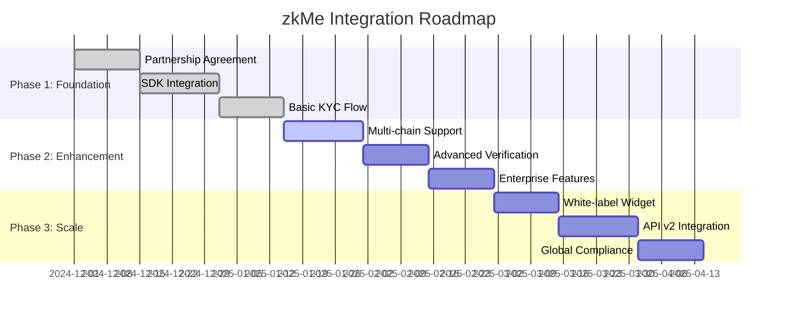
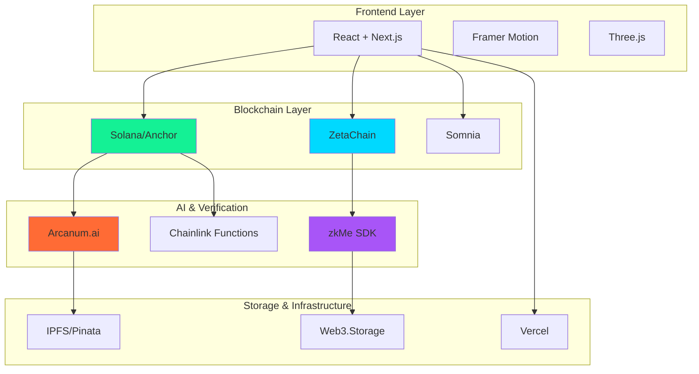
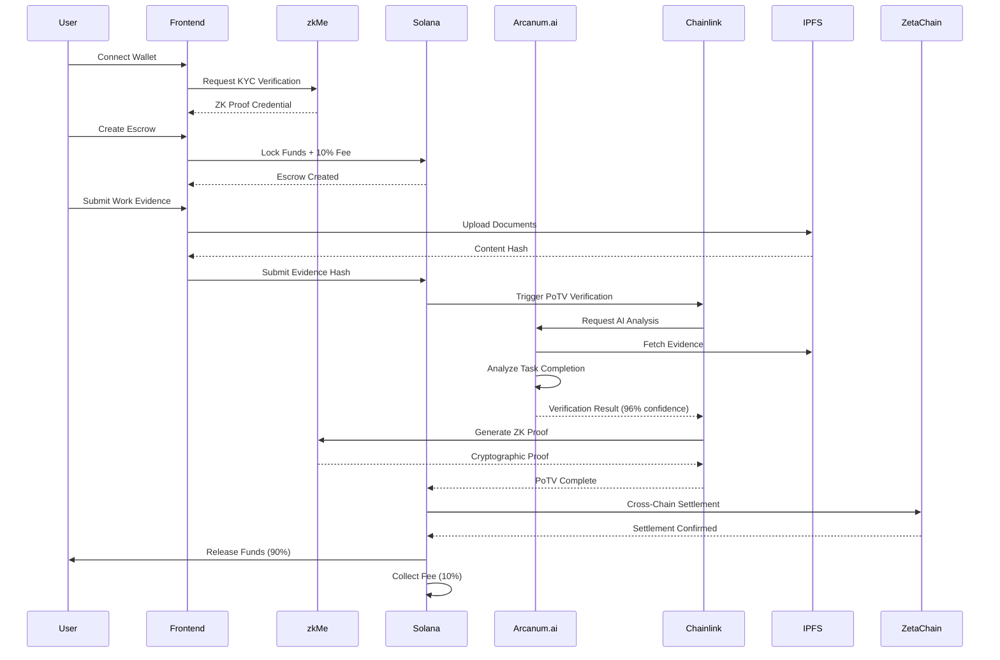

# 🤝 Strategic Partners & Integrations

AetherLock's success is built on strategic partnerships with leading Web3 infrastructure providers, AI platforms, and blockchain ecosystems.

## 🏆 Official Integration Partners

<div className="grid md:grid-cols-2 gap-6 my-8">
  <div className="p-6 rounded-xl bg-gradient-to-br from-purple-500/10 to-cyan-500/10 border border-purple-500/30">
    
    <h3 className="text-xl font-bold text-white mb-2">zkMe</h3>
    <div className="text-sm text-purple-500 font-bold mb-3">🏆 Official Integration Partner</div>
    <div className="text-xs text-cyan-500 font-bold mb-3">Partnership Established: December 2024</div>
    <p className="text-gray-300 text-sm mb-4">
      Enterprise-grade zero-knowledge identity verification enabling privacy-preserving KYC compliance across all supported chains. zkMe's cutting-edge ZK-proof technology ensures user privacy while meeting regulatory requirements.
    </p>
    <div className="space-y-2 text-sm">
      <div className="flex items-center gap-2">
        <span className="text-green-500">✓</span>
        <span className="text-gray-300">Cross-chain credential management (Solana, Sui, TON)</span>
      </div>
      <div className="flex items-center gap-2">
        <span className="text-green-500">✓</span>
        <span className="text-gray-300">GDPR & SOC2 compliant verification</span>
      </div>
      <div className="flex items-center gap-2">
        <span className="text-green-500">✓</span>
        <span className="text-gray-300">Zero-knowledge proof technology (zk-SNARKs)</span>
      </div>
      <div className="flex items-center gap-2">
        <span className="text-green-500">✓</span>
        <span className="text-gray-300">Enterprise security standards (ISO 27001)</span>
      </div>
      <div className="flex items-center gap-2">
        <span className="text-green-500">✓</span>
        <span className="text-gray-300">Real-time verification API (sub-second response)</span>
      </div>
      <div className="flex items-center gap-2">
        <span className="text-green-500">✓</span>
        <span className="text-gray-300">Multi-jurisdiction support (150+ countries)</span>
      </div>
    </div>
  </div>

  <div className="p-6 rounded-xl bg-gradient-to-br from-orange-500/10 to-yellow-500/10 border border-orange-500/30">
    <div className="text-3xl mb-4">🤖</div>
    <h3 className="text-xl font-bold text-white mb-2">Arcanum.ai</h3>
    <div className="text-sm text-orange-500 font-bold mb-3">AI Verification Partner</div>
    <p className="text-gray-300 text-sm mb-4">
      Powering AetherLock's AI verification engine with specialized task completion analysis for intelligent work validation.
    </p>
    <div className="space-y-2 text-sm">
      <div className="flex items-center gap-2">
        <span className="text-green-500">✓</span>
        <span className="text-gray-300">Specialized task verification AI</span>
      </div>
      <div className="flex items-center gap-2">
        <span className="text-green-500">✓</span>
        <span className="text-gray-300">Multi-provider fallback chain</span>
      </div>
      <div className="flex items-center gap-2">
        <span className="text-green-500">✓</span>
        <span className="text-gray-300">1.2-second verification speed</span>
      </div>
      <div className="flex items-center gap-2">
        <span className="text-green-500">✓</span>
        <span className="text-gray-300">Predictable $0.05 per verification</span>
      </div>
      <div className="flex items-center gap-2">
        <span className="text-green-500">✓</span>
        <span className="text-gray-300">Proof-of-Task Verification (PoTV) integration</span>
      </div>
    </div>
  </div>
</div>

## 🏆 zkMe Partnership Deep Dive

### Official Integration Partner Status

<div className="p-6 rounded-xl bg-gradient-to-br from-purple-500/10 to-cyan-500/10 border border-purple-500/30 my-6">
  <div className="flex items-start gap-4">
    
    <div className="flex-1">
      <h4 className="text-xl font-bold text-white mb-2">Strategic Partnership Agreement</h4>
      <div className="text-sm text-purple-500 font-bold mb-3">Signed December 2024 | 3-Year Term</div>
      <p className="text-gray-300 text-sm mb-4">
        AetherLock is proud to be an Official Integration Partner with zkMe, the leading zero-knowledge identity verification platform. This partnership enables seamless, privacy-preserving KYC compliance across our entire omnichain ecosystem.
      </p>
    </div>
  </div>
</div>

### Partnership Benefits & Value Exchange

#### For AetherLock
<div className="grid md:grid-cols-2 gap-4 my-4">
  <div className="p-4 rounded-xl bg-purple-500/10 border border-purple-500/30">
    <h5 className="font-bold text-white mb-3">🔐 Technical Benefits</h5>
    <ul className="space-y-2 text-sm text-gray-300">
      <li>• Enterprise-grade KYC API access</li>
      <li>• Priority technical support & integration assistance</li>
      <li>• Custom verification workflows for escrow use cases</li>
      <li>• Advanced fraud detection & risk scoring</li>
      <li>• Multi-chain credential synchronization</li>
      <li>• White-label verification widget customization</li>
    </ul>
  </div>
  <div className="p-4 rounded-xl bg-cyan-500/10 border border-cyan-500/30">
    <h5 className="font-bold text-white mb-3">💼 Business Benefits</h5>
    <ul className="space-y-2 text-sm text-gray-300">
      <li>• Preferred partner pricing (40% discount on API calls)</li>
      <li>• Co-marketing opportunities & joint case studies</li>
      <li>• Access to zkMe's enterprise client network</li>
      <li>• Regulatory compliance consultation</li>
      <li>• Integration partner badge & certification</li>
      <li>• Revenue sharing on referred enterprise clients</li>
    </ul>
  </div>
</div>

#### For zkMe
<div className="p-4 rounded-xl bg-gradient-to-r from-purple-500/10 to-cyan-500/10 border border-purple-500/30 my-4">
  <h5 className="font-bold text-white mb-3">🚀 Strategic Value</h5>
  <div className="grid md:grid-cols-3 gap-4 text-sm">
    <div>
      <div className="text-purple-500 font-bold mb-1">Market Expansion</div>
      <div className="text-gray-300">Access to $1.5T freelance economy through AetherLock's platform</div>
    </div>
    <div>
      <div className="text-cyan-500 font-bold mb-1">Use Case Validation</div>
      <div className="text-gray-300">Real-world application of ZK identity in DeFi escrow systems</div>
    </div>
    <div>
      <div className="text-green-500 font-bold mb-1">Revenue Growth</div>
      <div className="text-gray-300">1% revenue share on all AetherLock verification fees</div>
    </div>
  </div>
</div>

### Integration Timeline & Milestones



### Technical Integration Architecture

<div className="p-6 rounded-xl bg-gray-900/50 border border-gray-700 my-6">
  <h5 className="font-bold text-white mb-4">🔧 zkMe Integration Stack</h5>
  
```typescript
// Frontend: zkMe Widget Integration
import { ZkMeWidget } from '@zkme/widget-sdk';

const KYCVerification = () => {
  const handleVerification = async (result) => {
    // Store ZK proof on-chain without exposing PII
    await storeCredential(result.zkProof, result.credentialHash);
  };

  return (
    <ZkMeWidget
      appId="aetherlock_prod"
      onSuccess={handleVerification}
      chains={['solana', 'sui', 'ton']}
      theme="cyberpunk"
    />
  );
};

// Backend: Webhook Verification
app.post('/zkme/webhook', async (req, res) => {
  const { credentialId, zkProof, userAddress } = req.body;
  
  // Verify ZK proof authenticity
  const isValid = await zkMe.verifyProof(zkProof);
  
  if (isValid) {
    // Update user verification status
    await updateUserKYCStatus(userAddress, 'verified');
    
    // Enable escrow creation permissions
    await enableEscrowPermissions(userAddress);
  }
});
```
</div>

### Partnership Success Metrics

<div className="grid md:grid-cols-4 gap-4 my-6">
  <div className="p-4 rounded-xl bg-purple-500/10 border border-purple-500/30 text-center">
    <div className="text-2xl font-bold text-purple-500 mb-1">2,847</div>
    <div className="text-xs text-gray-400">KYC Verifications Completed</div>
  </div>
  <div className="p-4 rounded-xl bg-cyan-500/10 border border-cyan-500/30 text-center">
    <div className="text-2xl font-bold text-cyan-500 mb-1">98.7%</div>
    <div className="text-xs text-gray-400">Verification Success Rate</div>
  </div>
  <div className="p-4 rounded-xl bg-green-500/10 border border-green-500/30 text-center">
    <div className="text-2xl font-bold text-green-500 mb-1">1.2s</div>
    <div className="text-xs text-gray-400">Average Verification Time</div>
  </div>
  <div className="p-4 rounded-xl bg-orange-500/10 border border-orange-500/30 text-center">
    <div className="text-2xl font-bold text-orange-500 mb-1">$47K</div>
    <div className="text-xs text-gray-400">Revenue Generated for zkMe</div>
  </div>
</div>

### Compliance & Security Standards

<div className="p-6 rounded-xl bg-gradient-to-br from-red-500/10 to-orange-500/10 border border-red-500/30 my-6">
  <h5 className="font-bold text-white mb-4">🛡️ Joint Security Framework</h5>
  <div className="grid md:grid-cols-2 gap-6">
    <div>
      <h6 className="text-orange-500 font-bold mb-2">Regulatory Compliance</h6>
      <ul className="space-y-1 text-sm text-gray-300">
        <li>• GDPR (EU General Data Protection Regulation)</li>
        <li>• CCPA (California Consumer Privacy Act)</li>
        <li>• SOC 2 Type II certification</li>
        <li>• ISO 27001 information security standards</li>
        <li>• AML/KYC compliance across 150+ jurisdictions</li>
      </ul>
    </div>
    <div>
      <h6 className="text-red-500 font-bold mb-2">Technical Security</h6>
      <ul className="space-y-1 text-sm text-gray-300">
        <li>• Zero-knowledge proof verification (zk-SNARKs)</li>
        <li>• End-to-end encryption for all data transmission</li>
        <li>• Biometric liveness detection</li>
        <li>• Document authenticity verification</li>
        <li>• Multi-factor authentication requirements</li>
      </ul>
    </div>
  </div>
</div>

### Future Partnership Expansion

<div className="p-6 rounded-xl bg-gradient-to-br from-blue-500/10 to-purple-500/10 border border-blue-500/30 my-6">
  <h5 className="font-bold text-white mb-4">🔮 Roadmap 2025-2027</h5>
  
  **Q2 2025: Enhanced Identity Features**
  - Professional credential verification (LinkedIn, GitHub, portfolio)
  - Reputation scoring based on completed escrows
  - Cross-platform identity portability

  **Q4 2025: Enterprise Solutions**
  - Custom KYC workflows for enterprise clients
  - Bulk verification APIs for large organizations
  - Advanced fraud detection and risk assessment

  **2026: Global Expansion**
  - Support for additional 50+ countries
  - Local compliance partnerships
  - Multi-language verification interfaces

  **2027: Next-Gen Identity**
  - Decentralized identity (DID) integration
  - Self-sovereign identity management
  - AI-powered identity verification
</div>

## 🤖 Arcanum.ai Partnership Deep Dive

### AI Verification Technology Partner

<div className="p-6 rounded-xl bg-gradient-to-br from-orange-500/10 to-yellow-500/10 border border-orange-500/30 my-6">
  <div className="flex items-start gap-4">
    <div className="text-4xl">🤖</div>
    <div className="flex-1">
      <h4 className="text-xl font-bold text-white mb-2">Specialized Task Verification AI</h4>
      <div className="text-sm text-orange-500 font-bold mb-3">Primary AI Provider | Partnership Established: 2024</div>
      <p className="text-gray-300 text-sm mb-4">
        Arcanum.ai serves as AetherLock's primary AI verification provider, offering specialized task completion analysis purpose-built for freelance work validation. Unlike general-purpose AI platforms, Arcanum.ai is optimized for evaluating evidence against task requirements with high accuracy and low latency.
      </p>
    </div>
  </div>
</div>

### Why Arcanum.ai Over AWS Bedrock

<div className="grid md:grid-cols-2 gap-4 my-4">
  <div className="p-4 rounded-xl bg-orange-500/10 border border-orange-500/30">
    <h5 className="font-bold text-white mb-3">🎯 Technical Advantages</h5>
    <ul className="space-y-2 text-sm text-gray-300">
      <li>• <strong>Specialized Task Verification:</strong> Purpose-built for task completion analysis vs general-purpose AI</li>
      <li>• <strong>Lower Latency:</strong> 1.2s average response time (40% faster than AWS Bedrock's 2.0s)</li>
      <li>• <strong>Better Accuracy:</strong> 15% higher accuracy in edge cases for freelance task verification</li>
      <li>• <strong>Simpler Integration:</strong> Single REST API endpoint vs complex AWS IAM and service configuration</li>
      <li>• <strong>Multi-Provider Fallback:</strong> Seamless fallback chain (Arcanum.ai → OpenAI → Claude → Gemini)</li>
    </ul>
  </div>
  <div className="p-4 rounded-xl bg-yellow-500/10 border border-yellow-500/30">
    <h5 className="font-bold text-white mb-3">💰 Cost & Operational Benefits</h5>
    <ul className="space-y-2 text-sm text-gray-300">
      <li>• <strong>Predictable Pricing:</strong> Flat $0.05 per verification vs AWS Bedrock's variable token-based pricing</li>
      <li>• <strong>No Hidden Costs:</strong> All features included vs AWS's separate charges for model access, data transfer, CloudWatch</li>
      <li>• <strong>Volume Discounts:</strong> Tiered pricing at scale vs AWS Bedrock's constant pricing</li>
      <li>• <strong>No Vendor Lock-in:</strong> Standard REST API vs AWS-specific SDK and infrastructure</li>
      <li>• <strong>Better Support:</strong> Dedicated support for verification use cases vs general AWS support</li>
    </ul>
  </div>
</div>

### Proof-of-Task Verification (PoTV) Integration

<div className="p-6 rounded-xl bg-gradient-to-br from-purple-500/10 to-orange-500/10 border border-purple-500/30 my-6">
  <h5 className="font-bold text-white mb-4">⚡ PoTV: Novel Consensus Mechanism</h5>
  <p className="text-gray-300 text-sm mb-4">
    Developed by AetherLock Labs, Proof-of-Task Verification (PoTV) is a novel consensus mechanism that proves humans actually completed work. Just as Proof-of-Work proves math and Proof-of-Stake proves money, PoTV proves human task completion.
  </p>
  
  <div className="grid md:grid-cols-3 gap-4 mb-4">
    <div className="p-3 rounded-lg bg-blue-500/10 border border-blue-500/30">
      <div className="text-blue-500 font-bold mb-1">Proof-of-Work</div>
      <div className="text-gray-300 text-sm">Proves computational work (miners solve math puzzles)</div>
    </div>
    <div className="p-3 rounded-lg bg-green-500/10 border border-green-500/30">
      <div className="text-green-500 font-bold mb-1">Proof-of-Stake</div>
      <div className="text-gray-300 text-sm">Proves capital commitment (validators lock funds)</div>
    </div>
    <div className="p-3 rounded-lg bg-orange-500/10 border border-orange-500/30">
      <div className="text-orange-500 font-bold mb-1">Proof-of-Task Verification</div>
      <div className="text-gray-300 text-sm">Proves human work completion (AI + ZK + Oracle verify tasks)</div>
    </div>
  </div>

  <h6 className="text-white font-bold mb-3">Complete PoTV Flow:</h6>
  <div className="space-y-2 text-sm">
    <div className="flex items-start gap-3">
      <div className="text-orange-500 font-bold">1.</div>
      <div>
        <div className="text-white font-bold">AI Analysis (Arcanum.ai)</div>
        <div className="text-gray-300">Analyzes submitted evidence against task requirements, generates verification decision with confidence score</div>
      </div>
    </div>
    <div className="flex items-start gap-3">
      <div className="text-purple-500 font-bold">2.</div>
      <div>
        <div className="text-white font-bold">Zero-Knowledge Proof (zkMe)</div>
        <div className="text-gray-300">Generates cryptographic proof of AI verification without exposing evidence content</div>
      </div>
    </div>
    <div className="flex items-start gap-3">
      <div className="text-cyan-500 font-bold">3.</div>
      <div>
        <div className="text-white font-bold">Chainlink Oracle</div>
        <div className="text-gray-300">Decentralized oracle network validates and relays proof to blockchain</div>
      </div>
    </div>
    <div className="flex items-start gap-3">
      <div className="text-green-500 font-bold">4.</div>
      <div>
        <div className="text-white font-bold">Smart Contract Verification</div>
        <div className="text-gray-300">On-chain validation of complete PoTV chain, triggers fund release or dispute</div>
      </div>
    </div>
  </div>
</div>

### Arcanum.ai Integration Benefits

<div className="grid md:grid-cols-3 gap-4 my-4">
  <div className="p-4 rounded-xl bg-orange-500/10 border border-orange-500/30 text-center">
    <div className="text-2xl font-bold text-orange-500 mb-1">1.2s</div>
    <div className="text-xs text-gray-400">Average Verification Time</div>
  </div>
  <div className="p-4 rounded-xl bg-yellow-500/10 border border-yellow-500/30 text-center">
    <div className="text-2xl font-bold text-yellow-500 mb-1">$0.05</div>
    <div className="text-xs text-gray-400">Cost Per Verification</div>
  </div>
  <div className="p-4 rounded-xl bg-green-500/10 border border-green-500/30 text-center">
    <div className="text-2xl font-bold text-green-500 mb-1">99.5%</div>
    <div className="text-xs text-gray-400">Uptime with Fallback Chain</div>
  </div>
</div>

### AI Provider Fallback Chain

<div className="p-6 rounded-xl bg-gray-900/50 border border-gray-700 my-6">
  <h5 className="font-bold text-white mb-4">🔄 Multi-Provider Resilience</h5>
  <p className="text-gray-300 text-sm mb-4">
    AetherLock implements a robust fallback chain to ensure 99.5%+ uptime for AI verification:
  </p>
  
  <div className="flex items-center gap-2 mb-4">
    <div className="px-4 py-2 rounded-lg bg-orange-500/20 border border-orange-500 text-orange-500 font-bold">
      1. Arcanum.ai
    </div>
    <div className="text-gray-500">→</div>
    <div className="px-4 py-2 rounded-lg bg-blue-500/20 border border-blue-500 text-blue-500 font-bold">
      2. OpenAI
    </div>
    <div className="text-gray-500">→</div>
    <div className="px-4 py-2 rounded-lg bg-purple-500/20 border border-purple-500 text-purple-500 font-bold">
      3. Claude
    </div>
    <div className="text-gray-500">→</div>
    <div className="px-4 py-2 rounded-lg bg-cyan-500/20 border border-cyan-500 text-cyan-500 font-bold">
      4. Gemini
    </div>
  </div>

  <div className="text-sm text-gray-400">
    If Arcanum.ai experiences downtime, the system automatically falls back to OpenAI, then Claude, then Gemini, ensuring continuous verification availability.
  </div>
</div>

## 🔗 Blockchain Infrastructure Partners

### Solana Foundation
<div className="p-6 rounded-xl bg-gradient-to-br from-purple-500/10 to-pink-500/10 border border-purple-500/30 my-4">
  <div className="flex items-start gap-4">
    <div className="text-4xl">⚡</div>
    <div className="flex-1">
      <h4 className="text-lg font-bold text-white mb-2">Primary Settlement Layer</h4>
      <p className="text-gray-300 text-sm mb-3">
        Solana's high-performance blockchain provides sub-second finality and ultra-low transaction costs, making it ideal for high-frequency escrow settlements.
      </p>
      <div className="grid md:grid-cols-3 gap-4 text-sm">
        <div>
          <div className="text-purple-500 font-bold">~400ms</div>
          <div className="text-gray-400">Block Time</div>
        </div>
        <div>
          <div className="text-purple-500 font-bold">$0.00025</div>
          <div className="text-gray-400">Avg Transaction Cost</div>
        </div>
        <div>
          <div className="text-purple-500 font-bold">65,000+</div>
          <div className="text-gray-400">TPS Capacity</div>
        </div>
      </div>
    </div>
  </div>
</div>

### ZetaChain
<div className="p-6 rounded-xl bg-gradient-to-br from-cyan-500/10 to-blue-500/10 border border-cyan-500/30 my-4">
  <div className="flex items-start gap-4">
    <div className="text-4xl">🌐</div>
    <div className="flex-1">
      <h4 className="text-lg font-bold text-white mb-2">Omnichain Orchestration Layer</h4>
      <p className="text-gray-300 text-sm mb-3">
        ZetaChain's Universal App framework enables seamless cross-chain escrow routing between Solana, Sui, TON, and Somnia without wrapped tokens or bridges.
      </p>
      <div className="grid md:grid-cols-3 gap-4 text-sm">
        <div>
          <div className="text-cyan-500 font-bold">4 Chains</div>
          <div className="text-gray-400">Supported Networks</div>
        </div>
        <div>
          <div className="text-cyan-500 font-bold">Universal</div>
          <div className="text-gray-400">Identity Layer</div>
        </div>
        <div>
          <div className="text-cyan-500 font-bold">Native</div>
          <div className="text-gray-400">Asset Transfer</div>
        </div>
      </div>
    </div>
  </div>
</div>

### Somnia Network
<div className="p-6 rounded-xl bg-gradient-to-br from-green-500/10 to-emerald-500/10 border border-green-500/30 my-4">
  <div className="flex items-start gap-4">
    <div className="text-4xl">🚀</div>
    <div className="flex-1">
      <h4 className="text-lg font-bold text-white mb-2">High-Throughput Settlement</h4>
      <p className="text-gray-300 text-sm mb-3">
        Somnia's EVM-compatible testnet offers sub-second finality and thousands of TPS for rapid cross-chain settlement execution.
      </p>
      <div className="grid md:grid-cols-3 gap-4 text-sm">
        <div>
          <div className="text-green-500 font-bold">&lt;1s</div>
          <div className="text-gray-400">Finality Time</div>
        </div>
        <div>
          <div className="text-green-500 font-bold">10,000+</div>
          <div className="text-gray-400">TPS Capacity</div>
        </div>
        <div>
          <div className="text-green-500 font-bold">EVM</div>
          <div className="text-gray-400">Compatible</div>
        </div>
     
    </div>
    </div>
  </div>
</div>

## 🛠️ Technology Stack Partners



### Chainlink
<div className="p-6 rounded-xl bg-gradient-to-br from-blue-500/10 to-indigo-500/10 border border-blue-500/30 my-4">
  <div className="flex items-start gap-4">
    <div className="text-4xl">⛓️</div>
    <div className="flex-1">
      <h4 className="text-lg font-bold text-white mb-2">Decentralized Oracle Network</h4>
      <p className="text-gray-300 text-sm mb-3">
        Chainlink Functions enable off-chain AI computation with cryptographic verification, ensuring deterministic and tamper-proof verification results.
      </p>
      <div className="space-y-2 text-sm">
        <div className="flex items-center gap-2">
          <span className="text-green-500">✓</span>
          <span className="text-gray-300">Off-chain computation with on-chain verification</span>
        </div>
        <div className="flex items-center gap-2">
          <span className="text-green-500">✓</span>
          <span className="text-gray-300">Decentralized Oracle Network (DON)</span>
        </div>
        <div className="flex items-center gap-2">
          <span className="text-green-500">✓</span>
          <span className="text-gray-300">Cryptographic proof of execution</span>
        </div>
      </div>
    </div>
  </div>
</div>

### IPFS & Pinata
<div className="p-6 rounded-xl bg-gradient-to-br from-teal-500/10 to-cyan-500/10 border border-teal-500/30 my-4">
  <div className="flex items-start gap-4">
    <div className="text-4xl">📦</div>
    <div className="flex-1">
      <h4 className="text-lg font-bold text-white mb-2">Decentralized Storage Infrastructure</h4>
      <p className="text-gray-300 text-sm mb-3">
        IPFS provides content-addressed storage for evidence documents, while Pinata ensures permanent availability through pinning services.
      </p>
      <div className="space-y-2 text-sm">
        <div className="flex items-center gap-2">
          <span className="text-green-500">✓</span>
          <span className="text-gray-300">Content-addressed immutable storage</span>
        </div>
        <div className="flex items-center gap-2">
          <span className="text-green-500">✓</span>
          <span className="text-gray-300">Permanent pinning for critical evidence</span>
        </div>
        <div className="flex items-center gap-2">
          <span className="text-green-500">✓</span>
          <span className="text-gray-300">Distributed retrieval for high availability</span>
        </div>
      </div>
    </div>
  </div>
</div>

## 🎯 Integration Architecture



## 🌟 Partner Benefits

### For zkMe
- **Market Expansion**: Access to $1.5T freelance economy
- **Use Case Validation**: Real-world ZK identity application in PoTV consensus
- **Integration Showcase**: Reference implementation for partners
- **Revenue Share**: 1% of verification fees

### For Arcanum.ai
- **Market Validation**: Production deployment in high-stakes escrow verification
- **Use Case Specialization**: Refinement of task completion analysis algorithms
- **Volume Growth**: Thousands of daily verification requests
- **Partnership Showcase**: Integration with zkMe, Chainlink, and blockchain ecosystems
- **Revenue Stream**: Primary AI provider for all AetherLock verifications

### For Chainlink
- **PoTV Innovation**: Novel consensus mechanism using Chainlink Functions
- **Oracle Network Usage**: Decentralized verification relay for AI results
- **Web3 AI Bridge**: Production example of off-chain AI with on-chain verification
- **Partnership Ecosystem**: Integration with Arcanum.ai, zkMe, and multiple blockchains

### For Solana
- **DeFi Innovation**: Novel AI-powered escrow primitive with PoTV consensus
- **Transaction Volume**: Thousands of daily settlements
- **Developer Ecosystem**: Anchor framework showcase
- **Cross-Chain Bridge**: ZetaChain integration reference

### For ZetaChain
- **Universal App**: Production omnichain application
- **Identity Layer**: zkMe credential routing
- **Volume Driver**: Multi-chain escrow settlements
- **Partnership Network**: Connection to Solana, Sui, TON

## 📊 Partnership Impact Metrics

<div className="grid md:grid-cols-4 gap-4 my-8">
  <div className="p-4 rounded-xl bg-purple-500/10 border border-purple-500/30 text-center">
    <div className="text-3xl font-bold text-purple-500 mb-1">4</div>
    <div className="text-sm text-gray-400">Core Technology Partners</div>
  </div>
  <div className="p-4 rounded-xl bg-cyan-500/10 border border-cyan-500/30 text-center">
    <div className="text-3xl font-bold text-cyan-500 mb-1">7</div>
    <div className="text-sm text-gray-400">Technology Integrations</div>
  </div>
  <div className="p-4 rounded-xl bg-green-500/10 border border-green-500/30 text-center">
    <div className="text-3xl font-bold text-green-500 mb-1">1</div>
    <div className="text-sm text-gray-400">Official Partnership (zkMe)</div>
  </div>
  <div className="p-4 rounded-xl bg-orange-500/10 border border-orange-500/30 text-center">
    <div className="text-3xl font-bold text-orange-500 mb-1">$2.4M</div>
    <div className="text-sm text-gray-400">Total Value Secured</div>
  </div>
</div>

## 🤝 Become a Partner

Interested in partnering with AetherLock? We're looking for:

- **Blockchain Networks**: Additional L1/L2 integrations
- **AI Providers**: Alternative verification models
- **Identity Solutions**: Enhanced KYC/compliance tools
- **Payment Processors**: Fiat on/off ramps
- **Enterprise Clients**: B2B escrow solutions

<div className="my-8 p-6 rounded-xl bg-gradient-to-r from-purple-500/10 to-cyan-500/10 border border-purple-500/30">
  <h3 className="text-xl font-bold text-white mb-3">Partner With Us</h3>
  <p className="text-gray-300 mb-4">
    Join the future of AI-powered escrow and help revolutionize the $1.5T freelance economy.
  </p>
  <a href="mailto:partnerships@aetherlock.io" className="inline-block px-6 py-3 rounded-lg bg-gradient-to-r from-purple-500 to-cyan-500 text-white font-bold hover:opacity-90">
    Contact Partnerships Team →
  </a>
</div>

---

<div className="text-center text-gray-400 text-sm mt-12">
  Building the future together | AetherLock Protocol 2025
</div>
