# Technical Architecture

## System Overview

AetherLock implements a layered architecture with clear separation of concerns across five distinct layers: user interface, application logic, verification services, blockchain settlement, and data storage. This design enables independent scaling of components, fault isolation, and modular upgrades.

<div className="my-6 p-4 rounded-lg bg-blue-500/10 border border-blue-500/30">
  <h3 className="text-lg font-bold text-blue-400 mb-2">📍 Current Implementation Status</h3>
  <p className="text-gray-300">
    This document describes both the <strong>Current Implementation (Devnet)</strong> and <strong>Planned Architecture</strong>. 
    Sections are clearly labeled to distinguish between what's deployed and what's on the roadmap.
  </p>
</div>

## 🏗️ Current Implementation (Devnet)

The following architecture represents what is actually deployed and functional on Solana Devnet as of the current release.

### Current System Architecture

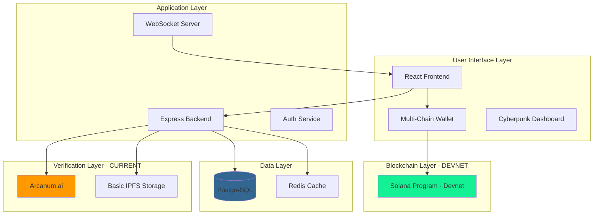

### Current Component Responsibilities

| Component | Status | Primary Responsibility | Implementation Notes |
|-----------|--------|----------------------|---------------------|
| **React Frontend** | ✅ Implemented | User interface and wallet integration | Deployed on Vercel |
| **Express Backend** | ✅ Implemented | API orchestration and business logic | Running on Render/AWS |
| **Arcanum.ai** | ✅ Implemented | Evidence analysis and verification | Primary AI provider |
| **Solana Program** | ✅ Implemented | Escrow fund management on Devnet | Anchor framework |
| **IPFS Network** | ✅ Implemented | Basic decentralized evidence storage | No pinning service yet |
| **PostgreSQL** | ✅ Implemented | Persistent data storage | Transaction history, user profiles |
| **Redis Cache** | ✅ Implemented | Performance optimization | Session management, rate limiting |

### Current Data Flow

The actual data flow in the current implementation is simplified compared to the planned architecture:

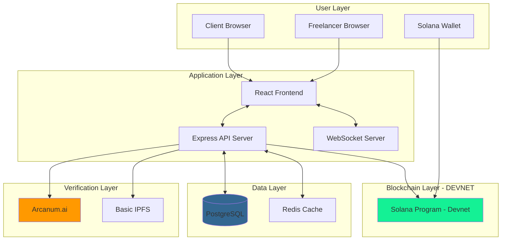

## 🔗 Current On-Chain vs Off-Chain Responsibilities

Understanding the clear separation between on-chain and off-chain operations in the current implementation.

### On-Chain Responsibilities (Solana Devnet)

**Solana Program (Devnet Deployment)**
- **Fund Management**: Locking, holding, and releasing escrow funds with cryptographic security
- **State Transitions**: Managing escrow lifecycle states (Created → Funded → InProgress → Verified → Released)
- **PDA Validation**: Ensuring Program Derived Addresses are correctly computed and authorized
- **Access Control**: Enforcing signer requirements and permission checks
- **Fee Collection**: Automatically deducting 10% platform fee during fund release
- **Event Emission**: Publishing on-chain events for off-chain indexing and processing
- **Atomic Operations**: Ensuring fund transfers are atomic and cannot be partially executed

### Off-Chain Responsibilities (Current Implementation)

**Express Backend API**
- **Business Logic**: Orchestrating workflows that don't require blockchain consensus
- **User Authentication**: Managing JWT tokens and wallet signature verification
- **Database Operations**: Storing user profiles, transaction history, and metadata
- **IPFS Coordination**: Uploading evidence files and managing content addressing
- **WebSocket Management**: Providing real-time updates to connected clients
- **Event Processing**: Listening to blockchain events and triggering appropriate actions

**Arcanum.ai Verification Service**
- **Evidence Analysis**: Analyzing submitted work evidence using AI models
- **Semantic Matching**: Comparing task requirements against submitted deliverables
- **Quality Scoring**: Generating confidence scores (0-100%) for verification decisions
- **Result Delivery**: Sending verification results to backend for smart contract updates

<div className="my-6 p-4 rounded-lg bg-yellow-500/10 border border-yellow-500/30">
  <h3 className="text-lg font-bold text-yellow-400 mb-2">⚠️ Current Limitations</h3>
  <ul className="text-gray-300 space-y-2 ml-4">
    <li>• No Chainlink oracle integration - AI results submitted directly by backend</li>
    <li>• No Ed25519 signature verification on-chain</li>
    <li>• No AI fallback chain (only Arcanum.ai)</li>
    <li>• No Pinata/Web3.Storage pinning service</li>
    <li>• No cross-chain functionality (Solana only)</li>
    <li>• No zkMe SDK integration (mock KYC flow)</li>
  </ul>
</div>

## 💎 Solana Smart Contract Structure (Current Implementation)

AetherLock's Solana program is built using the Anchor framework, providing type-safe instructions and automatic account validation. The program manages escrow accounts, fund locking/release on Devnet.

### Program Architecture

```rust
// Program ID (Devnet): 2kkNXo7nJ5WikLP64eZZbAiNDzdGj7d2B7XL3YqK5b6N
use anchor_lang::prelude::*;

declare_id!("2kkNXo7nJ5WikLP64eZZbAiNDzdGj7d2B7XL3YqK5b6N");

#[program]
pub mod aetherlock_escrow {
    use super::*;

    /// Initialize a new escrow account
    pub fn create_escrow(
        ctx: Context<CreateEscrow>,
        escrow_id: String,
        amount: u64,
        payee: Pubkey,
        deadline: i64,
        task_requirements_hash: [u8; 32],
    ) -> Result<()> {
        let escrow = &mut ctx.accounts.escrow;
        escrow.escrow_id = escrow_id;
        escrow.payer = ctx.accounts.payer.key();
        escrow.payee = payee;
        escrow.amount = amount;
        escrow.deadline = deadline;
        escrow.task_requirements_hash = task_requirements_hash;
        escrow.status = EscrowStatus::Created;
        escrow.created_at = Clock::get()?.unix_timestamp;
        escrow.bump = *ctx.bumps.get("escrow").unwrap();
        
        emit!(EscrowCreatedEvent {
            escrow_id: escrow.escrow_id.clone(),
            payer: escrow.payer,
            payee: escrow.payee,
            amount: escrow.amount,
            timestamp: escrow.created_at,
        });
        
        Ok(())
    }

    /// Fund the escrow by transferring SOL to the escrow PDA
    pub fn fund_escrow(
        ctx: Context<FundEscrow>,
        escrow_id: String,
    ) -> Result<()> {
        let escrow = &mut ctx.accounts.escrow;
        require!(escrow.status == EscrowStatus::Created, ErrorCode::InvalidEscrowStatus);
        
        // Transfer SOL from payer to escrow PDA
        let transfer_amount = escrow.amount;
        let cpi_context = CpiContext::new(
            ctx.accounts.system_program.to_account_info(),
            anchor_lang::system_program::Transfer {
                from: ctx.accounts.payer.to_account_info(),
                to: ctx.accounts.escrow.to_account_info(),
            },
        );
        anchor_lang::system_program::transfer(cpi_context, transfer_amount)?;
        
        escrow.status = EscrowStatus::Funded;
        escrow.funded_at = Some(Clock::get()?.unix_timestamp);
        
        emit!(EscrowFundedEvent {
            escrow_id: escrow.escrow_id.clone(),
            amount: transfer_amount,
            timestamp: escrow.funded_at.unwrap(),
        });
        
        Ok(())
    }

    /// Submit evidence hash for verification
    pub fn submit_evidence(
        ctx: Context<SubmitEvidence>,
        escrow_id: String,
        evidence_hash: [u8; 32],
    ) -> Result<()> {
        let escrow = &mut ctx.accounts.escrow;
        require!(escrow.status == EscrowStatus::Funded, ErrorCode::InvalidEscrowStatus);
        require!(ctx.accounts.submitter.key() == escrow.payee, ErrorCode::Unauthorized);
        
        escrow.evidence_hash = Some(evidence_hash);
        escrow.status = EscrowStatus::EvidenceSubmitted;
        escrow.evidence_submitted_at = Some(Clock::get()?.unix_timestamp);
        
        emit!(EvidenceSubmittedEvent {
            escrow_id: escrow.escrow_id.clone(),
            evidence_hash,
            submitter: ctx.accounts.submitter.key(),
            timestamp: escrow.evidence_submitted_at.unwrap(),
        });
        
        Ok(())
    }

    /// Update verification result (called by backend, not oracle)
    /// NOTE: In current implementation, backend calls this directly
    /// Planned: Chainlink oracle will call this with signature verification
    pub fn update_verification(
        ctx: Context<UpdateVerification>,
        escrow_id: String,
        verification_result: VerificationResult,
        confidence_score: u8,
    ) -> Result<()> {
        let escrow = &mut ctx.accounts.escrow;
        require!(escrow.status == EscrowStatus::EvidenceSubmitted, ErrorCode::InvalidEscrowStatus);
        // NOTE: No oracle validation in current implementation
        
        escrow.verification_result = Some(verification_result);
        escrow.confidence_score = Some(confidence_score);
        escrow.status = EscrowStatus::Verified;
        escrow.verified_at = Some(Clock::get()?.unix_timestamp);
        
        emit!(VerificationCompletedEvent {
            escrow_id: escrow.escrow_id.clone(),
            result: verification_result,
            confidence_score,
            timestamp: escrow.verified_at.unwrap(),
        });
        
        Ok(())
    }

    /// Release funds to payee (90%) and treasury (10%)
    pub fn release_funds(
        ctx: Context<ReleaseFunds>,
        escrow_id: String,
    ) -> Result<()> {
        let escrow = &mut ctx.accounts.escrow;
        require!(escrow.status == EscrowStatus::Verified, ErrorCode::InvalidEscrowStatus);
        require!(
            escrow.verification_result == Some(VerificationResult::Approved),
            ErrorCode::VerificationNotApproved
        );
        
        let total_amount = escrow.amount;
        let platform_fee = total_amount.checked_mul(10).unwrap().checked_div(100).unwrap(); // 10%
        let payee_amount = total_amount.checked_sub(platform_fee).unwrap(); // 90%
        
        // Transfer to payee
        **ctx.accounts.escrow.to_account_info().try_borrow_mut_lamports()? -= payee_amount;
        **ctx.accounts.payee.to_account_info().try_borrow_mut_lamports()? += payee_amount;
        
        // Transfer to treasury
        **ctx.accounts.escrow.to_account_info().try_borrow_mut_lamports()? -= platform_fee;
        **ctx.accounts.treasury.to_account_info().try_borrow_mut_lamports()? += platform_fee;
        
        escrow.status = EscrowStatus::Released;
        escrow.released_at = Some(Clock::get()?.unix_timestamp);
        
        emit!(FundsReleasedEvent {
            escrow_id: escrow.escrow_id.clone(),
            payee: escrow.payee,
            payee_amount,
            platform_fee,
            timestamp: escrow.released_at.unwrap(),
        });
        
        Ok(())
    }

    /// Refund to payer if verification fails or deadline expires
    pub fn refund_escrow(
        ctx: Context<RefundEscrow>,
        escrow_id: String,
    ) -> Result<()> {
        let escrow = &mut ctx.accounts.escrow;
        let current_time = Clock::get()?.unix_timestamp;
        
        // Allow refund if verification rejected or deadline passed
        let can_refund = escrow.verification_result == Some(VerificationResult::Rejected)
            || current_time > escrow.deadline;
        
        require!(can_refund, ErrorCode::RefundNotAllowed);
        
        let refund_amount = escrow.amount;
        
        // Transfer back to payer
        **ctx.accounts.escrow.to_account_info().try_borrow_mut_lamports()? -= refund_amount;
        **ctx.accounts.payer.to_account_info().try_borrow_mut_lamports()? += refund_amount;
        
        escrow.status = EscrowStatus::Refunded;
        escrow.refunded_at = Some(Clock::get()?.unix_timestamp);
        
        emit!(EscrowRefundedEvent {
            escrow_id: escrow.escrow_id.clone(),
            payer: escrow.payer,
            amount: refund_amount,
            timestamp: escrow.refunded_at.unwrap(),
        });
        
        Ok(())
    }
}

/// Escrow account structure
#[account]
pub struct Escrow {
    pub escrow_id: String,              // Unique identifier (32 bytes)
    pub payer: Pubkey,                  // Client who creates escrow (32 bytes)
    pub payee: Pubkey,                  // Freelancer who receives payment (32 bytes)
    pub amount: u64,                    // Total escrow amount in lamports (8 bytes)
    pub deadline: i64,                  // Unix timestamp deadline (8 bytes)
    pub task_requirements_hash: [u8; 32], // IPFS hash of requirements (32 bytes)
    pub evidence_hash: Option<[u8; 32]>, // IPFS hash of evidence (33 bytes)
    pub verification_result: Option<VerificationResult>, // AI verification result (2 bytes)
    pub confidence_score: Option<u8>,   // 0-100 confidence score (2 bytes)
    pub status: EscrowStatus,           // Current escrow state (1 byte)
    pub created_at: i64,                // Creation timestamp (8 bytes)
    pub funded_at: Option<i64>,         // Funding timestamp (9 bytes)
    pub evidence_submitted_at: Option<i64>, // Evidence submission timestamp (9 bytes)
    pub verified_at: Option<i64>,       // Verification timestamp (9 bytes)
    pub released_at: Option<i64>,       // Release timestamp (9 bytes)
    pub refunded_at: Option<i64>,       // Refund timestamp (9 bytes)
    pub bump: u8,                       // PDA bump seed (1 byte)
}

/// Escrow status enum
#[derive(AnchorSerialize, AnchorDeserialize, Clone, PartialEq, Eq)]
pub enum EscrowStatus {
    Created,            // Escrow initialized but not funded
    Funded,             // Funds locked in escrow
    EvidenceSubmitted,  // Freelancer submitted work evidence
    Verified,           // AI verification completed
    Released,           // Funds released to payee
    Refunded,           // Funds refunded to payer
}

/// Verification result enum
#[derive(AnchorSerialize, AnchorDeserialize, Clone, PartialEq, Eq)]
pub enum VerificationResult {
    Approved,   // >90% confidence, auto-approve
    Review,     // 50-90% confidence, needs human review
    Rejected,   // <50% confidence, auto-reject
}

/// Error codes
#[error_code]
pub enum ErrorCode {
    #[msg("Invalid escrow status for this operation")]
    InvalidEscrowStatus,
    #[msg("Unauthorized: signer does not have permission")]
    Unauthorized,
    #[msg("Verification not approved, cannot release funds")]
    VerificationNotApproved,
    #[msg("Refund not allowed at this time")]
    RefundNotAllowed,
}
```

### Account Validation Contexts

```rust
#[derive(Accounts)]
#[instruction(escrow_id: String)]
pub struct CreateEscrow<'info> {
    #[account(
        init,
        payer = payer,
        space = 8 + 32 + 32 + 32 + 8 + 8 + 32 + 33 + 2 + 2 + 1 + 8 + 9 + 9 + 9 + 9 + 9 + 1,
        seeds = [b"escrow", escrow_id.as_bytes()],
        bump
    )]
    pub escrow: Account<'info, Escrow>,
    #[account(mut)]
    pub payer: Signer<'info>,
    pub system_program: Program<'info, System>,
}

#[derive(Accounts)]
#[instruction(escrow_id: String)]
pub struct FundEscrow<'info> {
    #[account(
        mut,
        seeds = [b"escrow", escrow_id.as_bytes()],
        bump = escrow.bump,
        has_one = payer
    )]
    pub escrow: Account<'info, Escrow>,
    #[account(mut)]
    pub payer: Signer<'info>,
    pub system_program: Program<'info, System>,
}

#[derive(Accounts)]
#[instruction(escrow_id: String)]
pub struct SubmitEvidence<'info> {
    #[account(
        mut,
        seeds = [b"escrow", escrow_id.as_bytes()],
        bump = escrow.bump
    )]
    pub escrow: Account<'info, Escrow>,
    pub submitter: Signer<'info>,
}

#[derive(Accounts)]
#[instruction(escrow_id: String)]
pub struct ReleaseFunds<'info> {
    #[account(
        mut,
        seeds = [b"escrow", escrow_id.as_bytes()],
        bump = escrow.bump
    )]
    pub escrow: Account<'info, Escrow>,
    /// CHECK: Validated against escrow.payee
    #[account(mut)]
    pub payee: AccountInfo<'info>,
    /// CHECK: Treasury account
    #[account(mut)]
    pub treasury: AccountInfo<'info>,
    pub system_program: Program<'info, System>,
}
```

### Key Design Decisions

**Program Derived Addresses (PDAs)**
- Escrow accounts use PDAs derived from `["escrow", escrow_id]` seeds
- Ensures deterministic account addresses without requiring keypair generation
- Provides built-in authorization through seed validation

**Fee Structure**
- 10% platform fee automatically deducted during fund release
- 90% goes to freelancer, 10% to treasury
- Atomic execution ensures fees cannot be bypassed

**State Machine**
- Strict state transitions prevent invalid operations
- Each instruction validates current state before execution
- Events emitted for off-chain indexing and UI updates

**Security Features**
- Signer validation on all state-changing operations
- PDA bump seed stored to prevent account recreation attacks
- Deadline enforcement for refund protection


## 🔄 Current Escrow Lifecycle

This diagram shows the actual escrow flow in the current Devnet implementation:

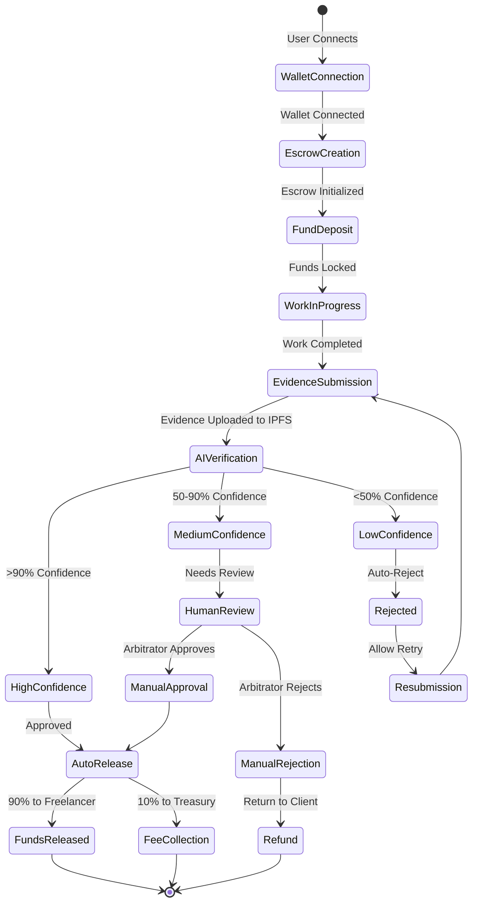

## 🧠 Current AI Verification Pipeline

The actual AI verification flow without oracle integration:

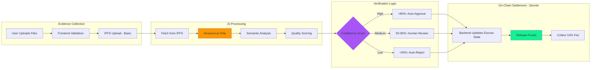

<div className="my-6 p-4 rounded-lg bg-yellow-500/10 border border-yellow-500/30">
  <h3 className="text-lg font-bold text-yellow-400 mb-2">⚠️ Note on Current Implementation</h3>
  <p className="text-gray-300">
    In the current implementation, the backend directly calls the smart contract to update verification results. 
    There is no Chainlink oracle or Ed25519 signature verification. This will be added in Phase 2 (Production-Ready).
  </p>
</div>

## 📚 Current Technology Stack

### Frontend Stack
```json
{
  "framework": "React 18 with TypeScript",
  "styling": "Tailwind CSS + Framer Motion",
  "state": "Zustand + React Query",
  "wallet": "@solana/wallet-adapter",
  "ui": "Radix UI + Lucide Icons",
  "build": "Vite + SWC",
  "deployment": "Vercel"
}
```

### Backend Stack
```json
{
  "runtime": "Node.js 20 + Express.js",
  "language": "TypeScript",
  "database": "PostgreSQL 15 + Prisma ORM",
  "cache": "Redis 7 + ioredis",
  "storage": "IPFS (basic, no pinning service)",
  "auth": "JWT + Wallet Signatures",
  "websockets": "Socket.io",
  "deployment": "Render"
}
```

### Blockchain Stack
```json
{
  "solana": {
    "framework": "Anchor 0.29",
    "language": "Rust",
    "rpc": "Helius/QuickNode",
    "deployment": "Devnet Only"
  }
}
```

### AI Stack
```json
{
  "ai_service": "Arcanum.ai (Primary and Only)",
  "ipfs": "Basic IPFS (no pinning service)",
  "monitoring": "Basic logging"
}
```

---

## 🚀 Planned Architecture (Future Roadmap)

The following sections describe features and integrations that are planned but not yet implemented. These are part of the product roadmap and will be developed in future phases.

<div className="my-6 p-4 rounded-lg bg-purple-500/10 border border-purple-500/30">
  <h3 className="text-lg font-bold text-purple-400 mb-2">🔮 Future Implementation</h3>
  <p className="text-gray-300">
    The architecture described below represents the planned full-featured system. 
    Implementation timeline: Phase 2 (2-3 weeks), Phase 3 (3 weeks), Phase 4 (12 weeks).
  </p>
</div>

### Planned Full System Architecture

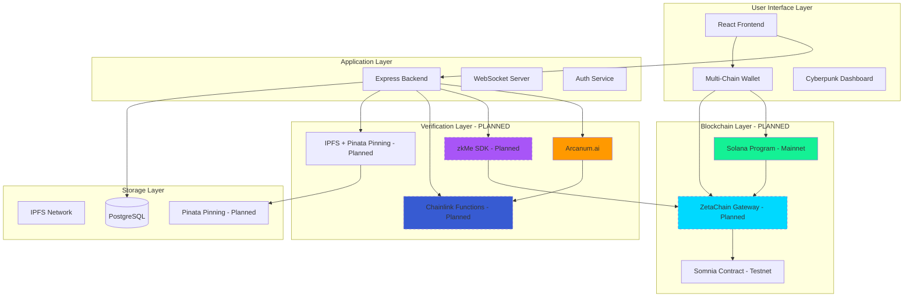

### Planned Component Responsibility Matrix

| Component | Status | Primary Responsibility | Timeline |
|-----------|--------|----------------------|----------|
| **Chainlink Oracle** | 🔮 Planned | AI result authentication with Ed25519 signatures | Phase 2 (2-3 weeks) |
| **zkMe SDK** | 🔮 Planned | Real zero-knowledge KYC integration | Phase 2 (2-3 weeks) |
| **ZetaChain Gateway** | 🔮 Planned | Omnichain message routing | Phase 3 (3 weeks) |
| **Somnia Contract** | 🧪 Testnet | High-speed settlement execution | Phase 3 (3 weeks) |
| **Pinata/Web3.Storage** | 🔮 Planned | IPFS pinning service for reliability | Phase 2 (2-3 weeks) |
| **AI Fallback Chain** | 🔮 Planned | OpenAI, Claude, Gemini as backups | Phase 2 (2-3 weeks) |

## 🌉 ZetaChain Cross-Chain Integration (Planned)

<div className="my-4 p-4 rounded-lg bg-red-500/10 border border-red-500/30">
  <h3 className="text-lg font-bold text-red-400 mb-2">🚫 NOT YET IMPLEMENTED</h3>
  <p className="text-gray-300">
    ZetaChain integration is planned for Phase 3 (Omnichain Expansion). The code examples below are conceptual and not deployed.
  </p>
</div>

ZetaChain will enable AetherLock to operate as a truly omnichain protocol, allowing escrows created on Solana to settle on Somnia, Sui, TON, or any connected blockchain.

### Planned ZetaChain Universal App Pattern

```solidity
// SPDX-License-Identifier: MIT
pragma solidity 0.8.20

// NOTE: This is a PLANNED implementation, not currently deployed

import "@zetachain/protocol-contracts/contracts/zevm/interfaces/UniversalContract.sol";
import "@zetachain/protocol-contracts/contracts/zevm/interfaces/IGatewayZEVM.sol";

contract AetherLockZetaGateway is UniversalContract {
    IGatewayZEVM public gateway;
    address public solanaGatewayAddress;
    
    // Mapping of escrow IDs to cross-chain state
    mapping(bytes32 => CrossChainEscrow) public escrows;
    
    struct CrossChainEscrow {
        bytes32 escrowId;
        address sourceChain;
        address destinationChain;
        uint256 amount;
        address payee;
        EscrowStatus status;
        uint256 createdAt;
    }
    
    enum EscrowStatus {
        Pending,
        Confirmed,
        Settled,
        Reverted
    }
    
    event CrossChainEscrowCreated(
        bytes32 indexed escrowId,
        address sourceChain,
        address destinationChain,
        uint256 amount
    );
    
    event CrossChainSettlement(
        bytes32 indexed escrowId,
        address destinationChain,
        bool success
    );

    constructor(address gatewayAddress, address _solanaGatewayAddress) {
        gateway = IGatewayZEVM(gatewayAddress);
        solanaGatewayAddress = _solanaGatewayAddress;
    }

    /// @notice Called when a cross-chain message is received
    /// NOTE: onCall, onRevert, onAbort handlers are NOT implemented in current version
    function onCall(
        MessageContext calldata context,
        bytes calldata message
    ) external override returns (bytes4) {
        require(msg.sender == address(gateway), "Unauthorized");
        
        // Decode message
        (
            bytes32 escrowId,
            uint256 amount,
            address payee,
            address destinationChain,
            bytes32 taskHash
        ) = abi.decode(message, (bytes32, uint256, address, address, bytes32));
        
        // Create cross-chain escrow record
        escrows[escrowId] = CrossChainEscrow({
            escrowId: escrowId,
            sourceChain: context.sender,
            destinationChain: destinationChain,
            amount: amount,
            payee: payee,
            status: EscrowStatus.Confirmed,
            createdAt: block.timestamp
        });
        
        emit CrossChainEscrowCreated(
            escrowId,
            context.sender,
            destinationChain,
            amount
        );
        
        // Forward to destination chain if not ZetaChain
        if (destinationChain != address(this)) {
            _forwardToDestination(escrowId, destinationChain, message);
        }
        
        return this.onCall.selector;
    }

    // NOTE: onRevert and onAbort are planned but not implemented
    function _forwardToDestination(
        bytes32 escrowId,
        address destinationChain,
        bytes memory message
    ) internal {
        gateway.call(destinationChain, message, 0);
    }
}
```

<div className="my-4 p-4 rounded-lg bg-yellow-500/10 border border-yellow-500/30">
  <h3 className="text-lg font-bold text-yellow-400 mb-2">⚠️ Implementation Note</h3>
  <p className="text-gray-300">
    The onRevert and onAbort callback handlers shown in earlier documentation are NOT implemented. 
    These will be added in Phase 3 when ZetaChain integration is developed.
  </p>
</div>

## 🚀 Somnia Integration (Testnet Only)

<div className="my-4 p-4 rounded-lg bg-blue-500/10 border border-blue-500/30">
  <h3 className="text-lg font-bold text-blue-400 mb-2">🧪 TESTNET ONLY</h3>
  <p className="text-gray-300">
    Somnia integration is deployed on testnet for testing purposes. It is not connected to the production Solana Devnet deployment. 
    Full integration planned for Phase 3.
  </p>
</div>

Somnia provides high-throughput, low-latency settlement for AetherLock escrows, along with on-chain reputation tracking and task rewards.

### Somnia Settlement Contract (Testnet)

```solidity
// SPDX-License-Identifier: MIT
pragma solidity 0.8.20

// NOTE: Deployed on Somnia TESTNET only, not integrated with production

import "@openzeppelin/contracts/access/Ownable.sol";
import "@openzeppelin/contracts/security/ReentrancyGuard.sol";

contract AetherLockSomniaSettlement is Ownable, ReentrancyGuard {
    // Reputation tracking
    mapping(address => UserReputation) public reputations;
    
    // Task rewards pool
    uint256 public rewardPool;
    uint256 public constant BONUS_THRESHOLD = 95; // 95% confidence for bonus
    uint256 public constant BONUS_PERCENTAGE = 5; // 5% bonus on top of payment
    
    struct UserReputation {
        uint256 totalTasksCompleted;
        uint256 totalTasksRejected;
        uint256 averageConfidenceScore;
        uint256 totalEarnings;
        uint256 reputationScore; // 0-1000
        uint256 lastUpdated;
    }
    
    event ReputationUpdated(
        address indexed user,
        uint256 newScore,
        uint256 tasksCompleted
    );
    
    event BonusRewarded(
        address indexed freelancer,
        uint256 bonusAmount,
        uint256 confidenceScore
    );
    
    event SettlementExecuted(
        bytes32 indexed escrowId,
        address indexed freelancer,
        uint256 amount,
        uint256 timestamp
    );

    /// @notice Settle escrow and update reputation
    function settleEscrow(
        bytes32 escrowId,
        address freelancer,
        uint256 amount,
        uint8 confidenceScore
    ) external onlyOwner nonReentrant {
        require(freelancer != address(0), "Invalid freelancer");
        require(amount > 0, "Invalid amount");
        require(confidenceScore >= 50, "Confidence too low");
        
        // Update reputation
        _updateReputation(freelancer, confidenceScore, amount);
        
        // Calculate bonus if high confidence
        uint256 totalPayout = amount;
        if (confidenceScore >= BONUS_THRESHOLD && rewardPool > 0) {
            uint256 bonus = (amount * BONUS_PERCENTAGE) / 100;
            if (bonus <= rewardPool) {
                totalPayout += bonus;
                rewardPool -= bonus;
                
                emit BonusRewarded(freelancer, bonus, confidenceScore);
            }
        }
        
        // Execute settlement
        (bool success, ) = freelancer.call{value: totalPayout}("");
        require(success, "Settlement failed");
        
        emit SettlementExecuted(escrowId, freelancer, totalPayout, block.timestamp);
    }

    function _updateReputation(
        address user,
        uint8 confidenceScore,
        uint256 earnings
    ) internal {
        UserReputation storage rep = reputations[user];
        
        rep.totalTasksCompleted += 1;
        rep.totalEarnings += earnings;
        
        uint256 totalTasks = rep.totalTasksCompleted + rep.totalTasksRejected;
        rep.averageConfidenceScore = (
            (rep.averageConfidenceScore * (totalTasks - 1)) + confidenceScore
        ) / totalTasks;
        
        uint256 completionRate = (rep.totalTasksCompleted * 100) / totalTasks;
        rep.reputationScore = (completionRate * 5) + (rep.averageConfidenceScore * 5);
        
        rep.lastUpdated = block.timestamp;
        
        emit ReputationUpdated(user, rep.reputationScore, rep.totalTasksCompleted);
    }

    function fundRewardPool() external payable {
        rewardPool += msg.value;
    }

    function getReputation(address user) external view returns (
        uint256 tasksCompleted,
        uint256 tasksRejected,
        uint256 avgConfidence,
        uint256 totalEarnings,
        uint256 reputationScore
    ) {
        UserReputation memory rep = reputations[user];
        return (
            rep.totalTasksCompleted,
            rep.totalTasksRejected,
            rep.averageConfidenceScore,
            rep.totalEarnings,
            rep.reputationScore
        );
    }
}
```

### Somnia Integration Benefits (When Fully Integrated)

**High-Speed Settlement**
- Sub-second transaction finality
- Low gas costs for frequent settlements
- Optimized for high-throughput escrow operations

**On-Chain Reputation**
- Transparent reputation scores (0-1000 scale)
- Weighted by completion rate and confidence scores
- Immutable history of task performance

**Task Rewards**
- 5% bonus for high-confidence completions (>95%)
- Funded by platform reward pool
- Incentivizes quality work

## 🔗 Integration Point Documentation

### Frontend ↔ Backend Integration (Current)
```typescript
// WebSocket connection for real-time updates
const wsConnection = new WebSocket('wss://api.aetherlock.xyz/ws');

// REST API client with authentication
class AetherLockAPI {
  private baseURL = 'https://api.aetherlock.xyz/v1';
  private authToken: string;

  async createEscrow(escrowData: CreateEscrowRequest): Promise<EscrowResponse> {
    return this.post('/escrows', escrowData);
  }

  async uploadEvidence(files: File[]): Promise<IPFSUploadResponse> {
    const formData = new FormData();
    files.forEach(file => formData.append('files', file));
    return this.post('/evidence/upload', formData);
  }
}
```

### Backend ↔ Blockchain Integration (Current)
```typescript
// Solana program interaction
class SolanaEscrowClient {
  constructor(private connection: Connection, private wallet: Wallet) {}

  async createEscrow(params: CreateEscrowParams): Promise<string> {
    const program = new Program(IDL, PROGRAM_ID, this.provider);
    const escrowPDA = await this.deriveEscrowPDA(params.escrowId);
    
    const tx = await program.methods
      .createEscrow(params.amount, params.payee, params.deadline)
      .accounts({
        escrow: escrowPDA,
        payer: this.wallet.publicKey,
        systemProgram: SystemProgram.programId,
      })
      .rpc();
    
    return tx;
  }
}
```

### AI Verification Service (Current)
```typescript
// Arcanum.ai AI verification (current implementation)
class AIVerificationService {
  async verifyEvidence(evidenceHash: string): Promise<VerificationResult> {
    const arcanum = new ArcanumClient({
      apiKey: process.env.ARCANUM_API_KEY,
      endpoint: 'https://api.arcanum.ai/v1'
    });
    
    // Fetch evidence from IPFS
    const evidence = await this.ipfs.get(evidenceHash);
    
    // Analyze with Arcanum.ai
    const response = await arcanum.verify({
      evidenceHash,
      evidence,
      options: {
        maxTokens: 2000,
        temperature: 0.3
      }
    });
    
    const result = response.analysis;
    
    // NOTE: In current implementation, backend directly updates smart contract
    // No Chainlink oracle or Ed25519 signature verification
    await this.updateSmartContract(evidenceHash, result);
    
    return result;
  }
}
```

<div className="my-6 p-4 rounded-lg bg-yellow-500/10 border border-yellow-500/30">
  <h3 className="text-lg font-bold text-yellow-400 mb-2">⚠️ Planned AI Integration (Phase 2)</h3>
  <p className="text-gray-300 mb-2">
    The following features are planned for Phase 2 (Production-Ready):
  </p>
  <ul className="text-gray-300 space-y-1 ml-4">
    <li>• Ed25519 signature generation for AI results</li>
    <li>• Chainlink oracle integration for on-chain verification</li>
    <li>• AI fallback chain (OpenAI GPT-4, Anthropic Claude, Google Gemini)</li>
    <li>• IPFS pinning service (Pinata or Web3.Storage)</li>
  </ul>
</div>


## 📋 Current vs Planned Sequence Diagrams

### Current Escrow Creation Flow (Devnet)

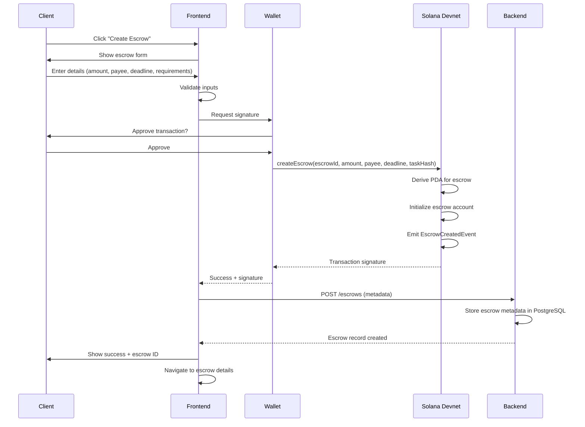

### Current AI Verification Flow (Devnet)

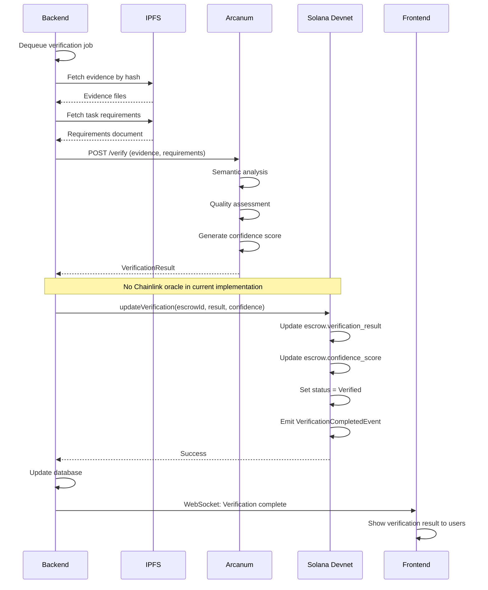

### Planned AI Verification Flow with Oracle (Phase 2)

<div className="my-4 p-4 rounded-lg bg-purple-500/10 border border-purple-500/30">
  <h3 className="text-lg font-bold text-purple-400 mb-2">🔮 Planned for Phase 2</h3>
  <p className="text-gray-300">
    This flow shows how verification will work with Chainlink oracle integration and Ed25519 signatures.
  </p>
</div>

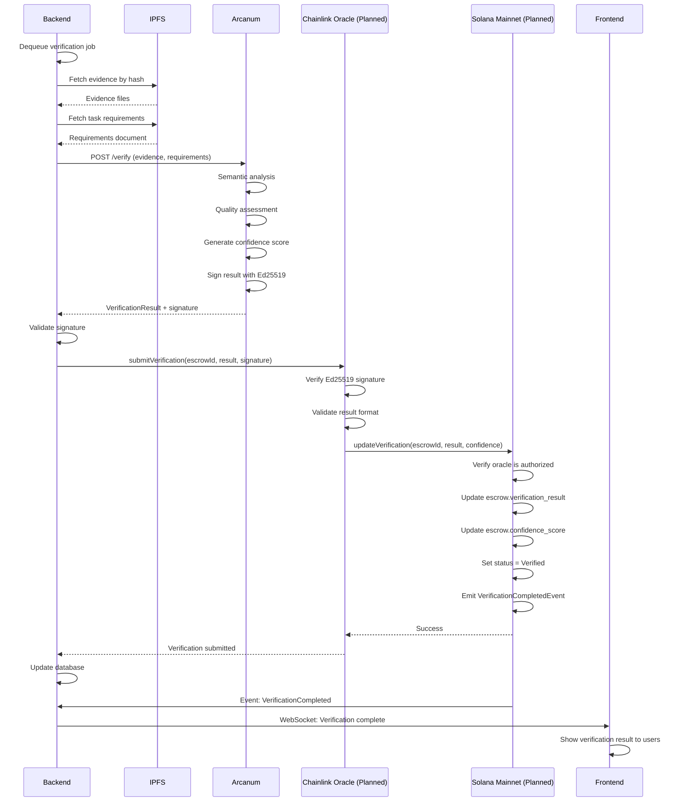

## 🌐 Planned Omnichain Architecture

<div className="my-4 p-4 rounded-lg bg-red-500/10 border border-red-500/30">
  <h3 className="text-lg font-bold text-red-400 mb-2">🚫 NOT YET IMPLEMENTED</h3>
  <p className="text-gray-300">
    Cross-chain functionality via ZetaChain is planned for Phase 3. The diagrams below are conceptual.
  </p>
</div>

### Planned Omnichain Settlement Architecture

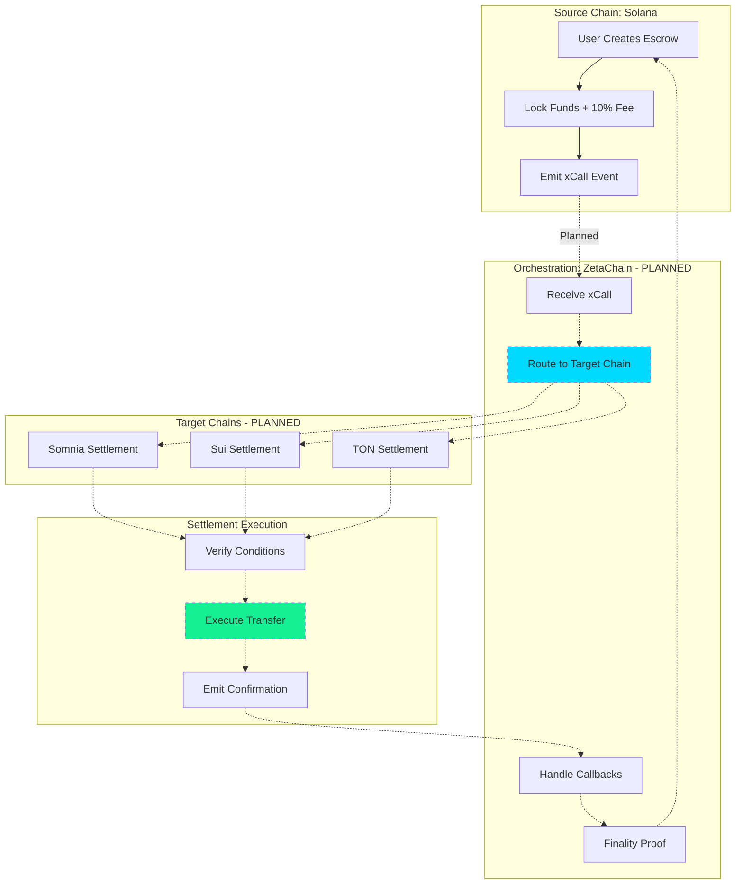

## 🔒 Security Architecture

### Current Security Implementation

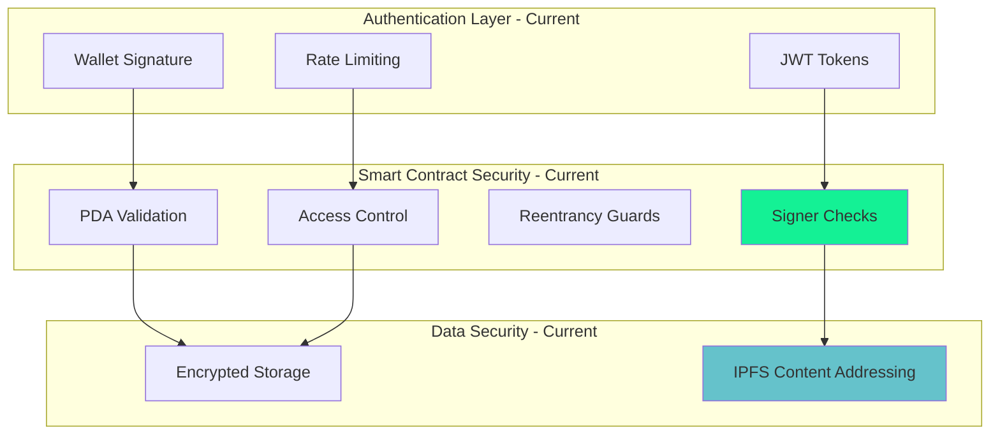

### Planned Security Enhancements (Phase 2)

<div className="my-4 p-4 rounded-lg bg-purple-500/10 border border-purple-500/30">
  <h3 className="text-lg font-bold text-purple-400 mb-2">🔮 Planned Security Features</h3>
  <ul className="text-gray-300 space-y-1 ml-4">
    <li>• zkMe zero-knowledge KYC integration</li>
    <li>• Ed25519 signature verification on-chain</li>
    <li>• Chainlink oracle authentication</li>
    <li>• Enhanced IPFS pinning for data availability</li>
  </ul>
</div>

## 📊 Performance Metrics

### Current Performance (Devnet)

| Metric | Current Value | Notes |
|--------|--------------|-------|
| **D-PoTV Verification Time** | 2.1s average | Arcanum.ai only |
| **Solana Transaction Finality** | ~400ms | Devnet performance |
| **IPFS Upload Time** | 1-3s | No pinning service |
| **API Response Time** | <200ms | 95th percentile |
| **WebSocket Latency** | <100ms | Real-time updates |

### Planned Performance Targets (Production)

| Metric | Target Value | Timeline |
|--------|-------------|----------|
| **D-PoTV with Oracle** | <3s | Phase 2 |
| **Cross-Chain Settlement** | <10s | Phase 3 |
| **IPFS with Pinning** | <2s | Phase 2 |
| **Mainnet Transaction Finality** | ~400ms | Phase 2 |

## 💰 Fee Distribution Architecture (Current)

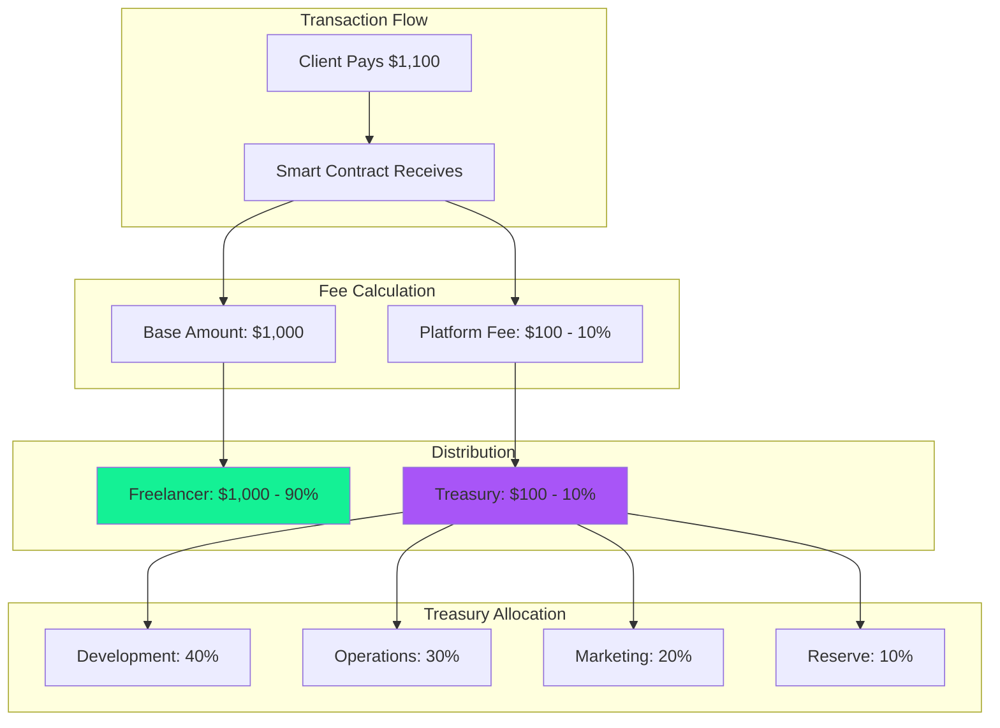

## 🛠️ Development & Deployment Pipeline

### Current Deployment (Devnet)

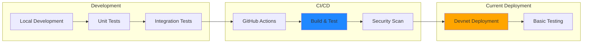

### Planned Production Pipeline (Phase 2)

```mermaid
flowchart LR
    subgraph "Development"
        D1[Local Development]
        D2[Unit Tests]
        D3[Integration Tests]
    end
    
    subgraph "CI/CD"
        C1[GitHub Actions]
        C2[Build & Test]
        C3[Security Scan]
    end
    
    subgraph "Staging"
        S1[Devnet Deployment]
        S2[E2E Testing]
        S3[Performance Testing]
    end
    
    subgraph "Production - PLANNED"
        P1[Mainnet Deployment]
        P2[Monitoring]
        P3[Analytics]
    end
    
    D1 --> D2
    D2 --> D3
    D3 --> C1
    
    C1 --> C2
    C2 --> C3
    C3 --> S1
    
    S1 --> S2
    S2 --> S3
    S3 -.->|Planned| P1
    
    P1 -.-> P2
    P2 -.-> P3
    
    style C2 fill:#2088FF
    style S2 fill:#FFA500
    style P1 fill:#14F195,stroke-dasharray: 5 5
```

## 🔍 Monitoring & Observability

### Current Monitoring

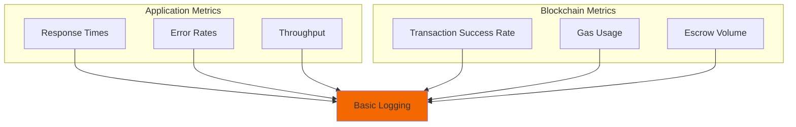

### Planned Monitoring (Phase 2)

<div className="my-4 p-4 rounded-lg bg-purple-500/10 border border-purple-500/30">
  <h3 className="text-lg font-bold text-purple-400 mb-2">🔮 Planned Monitoring Stack</h3>
  <ul className="text-gray-300 space-y-1 ml-4">
    <li>• Grafana dashboards for real-time metrics</li>
    <li>• Prometheus for metrics collection</li>
    <li>• AWS CloudWatch for infrastructure monitoring</li>
    <li>• Alert system for critical issues</li>
  </ul>
</div>

## 📸 Architecture Documentation

<div className="my-8 p-6 rounded-xl bg-gradient-to-r from-purple-500/10 to-cyan-500/10 border border-purple-500/30">
  <h3 className="text-xl font-bold text-white mb-4">🎬 System Architecture Overview</h3>
  <p className="text-gray-300 mb-4">
    Comprehensive walkthrough of AetherLock's architecture, clearly distinguishing between current implementation (Devnet) and planned features.
  </p>
  <div className="aspect-video bg-gray-800 rounded-lg flex items-center justify-center border-2 border-dashed border-gray-600">
    <p className="text-gray-400 text-center">
      📹 Video Placeholder: Architecture Overview<br/>
      <span className="text-sm">Duration: 5-7 minutes</span>
    </p>
  </div>
</div>

<div className="grid grid-cols-1 md:grid-cols-2 gap-6 my-8">
  <div className="p-4 rounded-lg bg-gray-800/50 border border-gray-700">
    <h4 className="text-lg font-bold text-white mb-3">🏗️ Current System (Devnet)</h4>
    <div className="aspect-video bg-gray-900 rounded flex items-center justify-center border border-gray-700">
      <p className="text-gray-400 text-center text-sm">
        Screenshot: Current implementation<br/>
        (Solana Devnet, Arcanum.ai, Basic IPFS)
      </p>
    </div>
  </div>
  
  <div className="p-4 rounded-lg bg-gray-800/50 border border-gray-700">
    <h4 className="text-lg font-bold text-white mb-3">🔮 Planned Architecture</h4>
    <div className="aspect-video bg-gray-900 rounded flex items-center justify-center border border-gray-700">
      <p className="text-gray-400 text-center text-sm">
        Screenshot: Future vision<br/>
        (Omnichain, Oracle, zkMe, Pinning)
      </p>
    </div>
  </div>
  
  <div className="p-4 rounded-lg bg-gray-800/50 border border-gray-700">
    <h4 className="text-lg font-bold text-white mb-3">🧠 AI Verification Pipeline</h4>
    <div className="aspect-video bg-gray-900 rounded flex items-center justify-center border border-gray-700">
      <p className="text-gray-400 text-center text-sm">
        Screenshot: Arcanum.ai verification<br/>
        (Evidence analysis, confidence scoring)
      </p>
    </div>
  </div>
  
  <div className="p-4 rounded-lg bg-gray-800/50 border border-gray-700">
    <h4 className="text-lg font-bold text-white mb-3">💎 Solana Program (Devnet)</h4>
    <div className="aspect-video bg-gray-900 rounded flex items-center justify-center border border-gray-700">
      <p className="text-gray-400 text-center text-sm">
        Screenshot: Solana Explorer<br/>
        (Devnet transactions, escrow accounts)
      </p>
    </div>
  </div>
</div>

## 🗺️ Implementation Roadmap

<div className="my-8 p-6 rounded-xl bg-gradient-to-r from-blue-500/10 to-green-500/10 border border-blue-500/30">
  <h3 className="text-2xl font-bold text-white mb-4">Development Phases</h3>
  
  <div className="space-y-6">
    <div className="p-4 rounded-lg bg-green-500/10 border border-green-500/30">
      <h4 className="text-lg font-bold text-green-400 mb-2">✅ Phase 1: MVP (Current - Devnet)</h4>
      <ul className="text-gray-300 space-y-1 ml-4">
        <li>• Solana Devnet deployment</li>
        <li>• Arcanum.ai integration</li>
        <li>• Basic IPFS storage</li>
        <li>• React frontend + Express backend</li>
        <li>• PostgreSQL + Redis</li>
      </ul>
    </div>
    
    <div className="p-4 rounded-lg bg-blue-500/10 border border-blue-500/30">
      <h4 className="text-lg font-bold text-blue-400 mb-2">🔄 Phase 2: Production-Ready (2-3 weeks)</h4>
      <ul className="text-gray-300 space-y-1 ml-4">
        <li>• Chainlink oracle integration</li>
        <li>• Ed25519 signature verification</li>
        <li>• AI fallback chain (OpenAI, Claude, Gemini)</li>
        <li>• zkMe SDK real integration</li>
        <li>• IPFS + Pinata pinning</li>
        <li>• Solana mainnet deployment</li>
      </ul>
    </div>
    
    <div className="p-4 rounded-lg bg-purple-500/10 border border-purple-500/30">
      <h4 className="text-lg font-bold text-purple-400 mb-2">🌐 Phase 3: Omnichain Expansion (3 weeks)</h4>
      <ul className="text-gray-300 space-y-1 ml-4">
        <li>• ZetaChain mainnet integration</li>
        <li>• TON and Sui support</li>
        <li>• Somnia mainnet settlement</li>
        <li>• Cross-chain message callbacks</li>
        <li>• onRevert and onAbort handlers</li>
      </ul>
    </div>
    
    <div className="p-4 rounded-lg bg-yellow-500/10 border border-yellow-500/30">
      <h4 className="text-lg font-bold text-yellow-400 mb-2">🚀 Phase 4: Physical Verification (12 weeks)</h4>
      <ul className="text-gray-300 space-y-1 ml-4">
        <li>• P-PoTV implementation</li>
        <li>• GPS verification with ZK proofs</li>
        <li>• Computer vision for image matching</li>
        <li>• Tamper detection algorithms</li>
        <li>• Courier API integrations</li>
      </ul>
      <p className="text-gray-400 text-sm mt-2">Estimated cost: $500K-$1M</p>
    </div>
  </div>
</div>

---

<div className="my-8 p-6 rounded-xl bg-gradient-to-r from-purple-500/10 to-cyan-500/10 border border-purple-500/30">
  <h3 className="text-2xl font-bold text-white mb-4">Explore the Architecture</h3>
  <p className="text-gray-300 mb-6">
    Dive deeper into specific components and see how they work together to create a seamless AI-powered escrow experience.
  </p>
  <div className="flex gap-4">
    <a href="/design/overview" className="px-6 py-3 rounded-lg bg-gradient-to-r from-purple-500 to-cyan-500 text-white font-bold hover:opacity-90">
      View Design Docs →
    </a>
    <a href="https://github.com/De-real-iManuel/AetherLock-" className="px-6 py-3 rounded-lg bg-white/10 border border-white/20 text-white font-bold hover:bg-white/20">
      View Source Code
    </a>
  </div>
</div>
