# 🏗️ Technical Architecture Deep Dive

## System Overview

AetherLock is built on a multi-layered architecture combining blockchain settlement, AI verification, zero-knowledge identity, and decentralized storage.

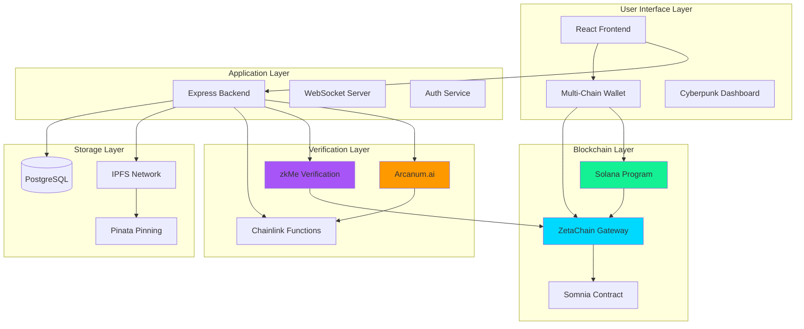

## 🏢 Component Responsibility Matrix

| Component | Primary Responsibility | Secondary Functions | Dependencies |
|-----------|----------------------|-------------------|--------------|
| **React Frontend** | User interface and wallet integration | State management, real-time updates | Wallet adapters, WebSocket |
| **Express Backend** | API orchestration and business logic | Authentication, event processing | PostgreSQL, Redis, IPFS |
| **Arcanum.ai** | Evidence analysis and verification | Confidence scoring, decision making | IPFS, Chainlink Oracle |
| **zkMe SDK** | Zero-knowledge identity verification | KYC compliance, privacy preservation | ZetaChain, Frontend |
| **Solana Program** | Escrow fund management | PDA validation, state transitions | ZetaChain Gateway |
| **ZetaChain Gateway** | Omnichain message routing | Cross-chain state synchronization | All blockchain networks |
| **Somnia Contract** | High-speed settlement execution | Transaction finality, gas optimization | ZetaChain, Treasury |
| **IPFS Network** | Decentralized evidence storage | Content addressing, availability | Pinata, Web3.Storage |
| **PostgreSQL** | Persistent data storage | Transaction history, user profiles | Backend API |
| **Redis Cache** | Performance optimization | Session management, rate limiting | Backend API |
| **Chainlink Oracle** | AI result authentication | Ed25519 signature verification | Arcanum.ai, Smart Contracts |

## 🔗 Integration Point Documentation

### Frontend ↔ Backend Integration
```typescript
// WebSocket connection for real-time updates
const wsConnection = new WebSocket('wss://api.aetherlock.xyz/ws');

// REST API client with authentication
class AetherLockAPI {
  private baseURL = 'https://api.aetherlock.xyz/v1';
  private authToken: string;

  async createEscrow(escrowData: CreateEscrowRequest): Promise<EscrowResponse> {
    return this.post('/escrows', escrowData);
  }

  async uploadEvidence(files: File[]): Promise<IPFSUploadResponse> {
    const formData = new FormData();
    files.forEach(file => formData.append('files', file));
    return this.post('/evidence/upload', formData);
  }
}
```

### Backend ↔ Blockchain Integration
```typescript
// Solana program interaction
class SolanaEscrowClient {
  constructor(private connection: Connection, private wallet: Wallet) {}

  async createEscrow(params: CreateEscrowParams): Promise<string> {
    const program = new Program(IDL, PROGRAM_ID, this.provider);
    const escrowPDA = await this.deriveEscrowPDA(params.escrowId);
    
    const tx = await program.methods
      .createEscrow(params.amount, params.payee, params.deadline)
      .accounts({
        escrow: escrowPDA,
        payer: this.wallet.publicKey,
        systemProgram: SystemProgram.programId,
      })
      .rpc();
    
    return tx;
  }
}

// ZetaChain cross-chain messaging
class ZetaChainClient {
  async sendCrossChainMessage(
    destinationChain: string,
    message: CrossChainMessage
  ): Promise<string> {
    const contract = new ethers.Contract(
      ZETACHAIN_GATEWAY_ADDRESS,
      GATEWAY_ABI,
      this.signer
    );
    
    const tx = await contract.sendMessage(
      destinationChain,
      ethers.utils.defaultAbiCoder.encode(
        ['address', 'uint256', 'bytes32'],
        [message.recipient, message.amount, message.dataHash]
      )
    );
    
    return tx.hash;
  }
}
```

### AI ↔ Oracle Integration
```typescript
// Arcanum.ai AI verification (production implementation)
// Note: AWS Bedrock was initially explored but Arcanum.ai was chosen for
// specialized task verification with better performance and simpler integration
class AIVerificationService {
  async verifyEvidence(evidenceHash: string): Promise<VerificationResult> {
    const arcanum = new ArcanumClient({
      apiKey: process.env.ARCANUM_API_KEY,
      endpoint: 'https://api.arcanum.ai/v1'
    });
    
    // Fetch evidence from IPFS
    const evidence = await this.ipfs.get(evidenceHash);
    
    // Analyze with Arcanum.ai specialized task verification
    const response = await arcanum.verify({
      evidenceHash,
      evidence,
      options: {
        maxTokens: 2000,
        temperature: 0.3
      }
    });
    
    const result = response.analysis;
    
    // Sign result with Ed25519
    const signature = await this.signResult(result);
    
    // Submit to Chainlink Oracle
    await this.chainlinkOracle.submitVerification(evidenceHash, result, signature);
    
    return result;
  }
}
```

## 📚 Technology Stack Breakdown

### Frontend Stack
```json
{
  "framework": "React 18 with TypeScript",
  "styling": "Tailwind CSS + Framer Motion",
  "state": "Zustand + React Query",
  "wallet": "@solana/wallet-adapter, @mysten/wallet-adapter",
  "ui": "Radix UI + Lucide Icons",
  "build": "Vite + SWC",
  "deployment": "Vercel Edge Functions"
}
```

### Backend Stack
```json
{
  "runtime": "Node.js 20 + Express.js",
  "language": "TypeScript",
  "database": "PostgreSQL 15 + Prisma ORM",
  "cache": "Redis 7 + ioredis",
  "storage": "IPFS + Pinata/Web3.Storage",
  "auth": "JWT + Wallet Signatures",
  "websockets": "Socket.io",
  "deployment": "Docker + AWS ECS/Render"
}
```

### Blockchain Stack
```json
{
  "solana": {
    "framework": "Anchor 0.29",
    "language": "Rust",
    "rpc": "Helius/QuickNode",
    "deployment": "Devnet/Mainnet-beta"
  },
  "zetachain": {
    "framework": "Hardhat + Ethers.js",
    "language": "Solidity 0.8.20",
    "network": "ZetaChain Testnet/Mainnet",
    "gateway": "Universal App Pattern"
  },
  "somnia": {
    "framework": "Hardhat + Ethers.js",
    "language": "Solidity 0.8.20",
    "network": "Somnia Testnet/Mainnet",
    "features": "High-throughput settlement"
  }
}
```

### AI & Oracle Stack
```json
{
  "ai_service": "Arcanum.ai (Primary)",
  "fallback_ai": "OpenAI GPT-4, Anthropic Claude, Google Gemini",
  "oracle": "Chainlink Functions",
  "signatures": "Ed25519 cryptographic proofs",
  "ipfs": "Pinata, Web3.Storage, Lighthouse",
  "monitoring": "AWS CloudWatch, Grafana"
}
```

### DevOps & Infrastructure
```json
{
  "ci_cd": "GitHub Actions",
  "containers": "Docker + Docker Compose",
  "orchestration": "AWS ECS/Kubernetes",
  "monitoring": "Grafana + Prometheus",
  "logging": "Winston + AWS CloudWatch",
  "security": "AWS Secrets Manager, Vault",
  "cdn": "Cloudflare",
  "domains": "Cloudflare DNS"
}
```

## 🔄 Complete Escrow Lifecycle

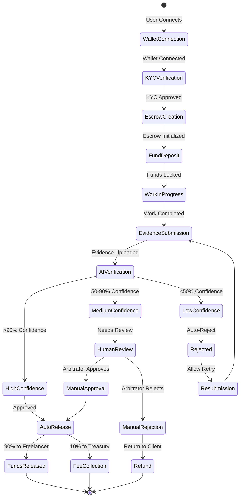

## 🧠 AI Verification Pipeline

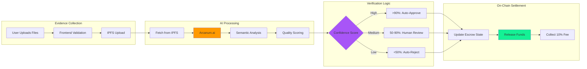

## 🔐 Zero-Knowledge KYC Flow

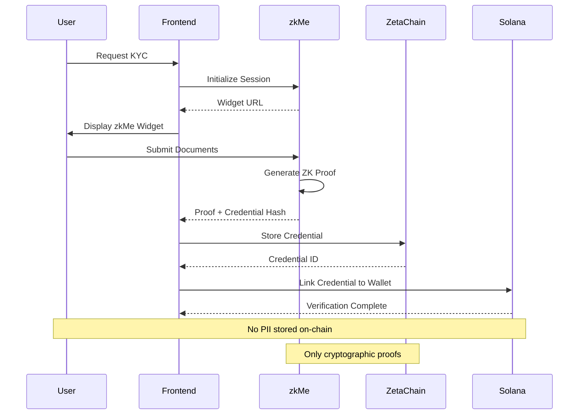

## 🌐 Omnichain Settlement Architecture

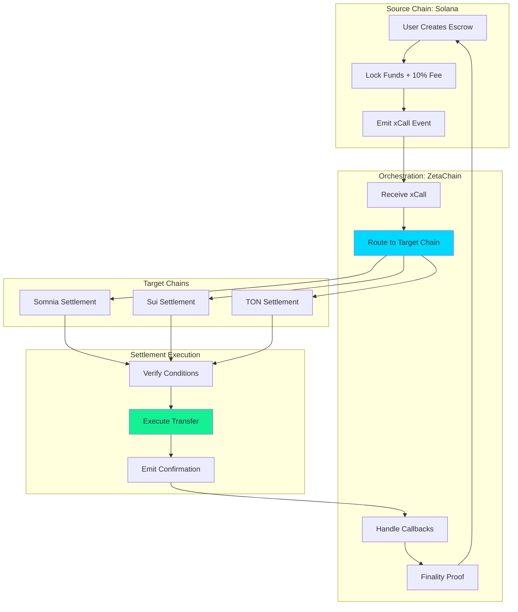

## 🌊 Comprehensive Data Flow Diagrams

### Primary Escrow Data Flow
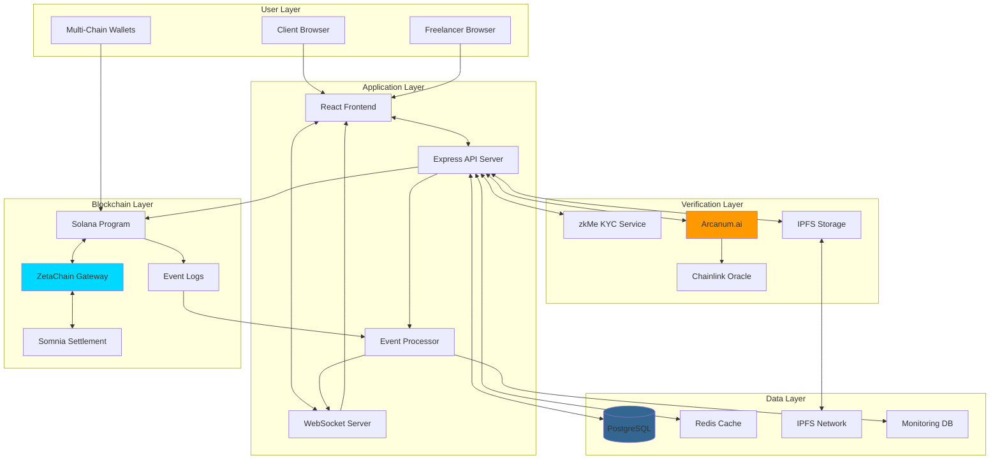

### Cross-Chain Message Flow
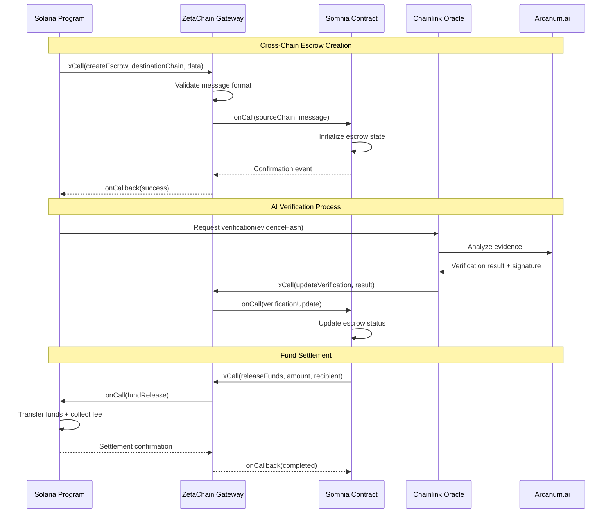

## 💾 Data Flow Architecture

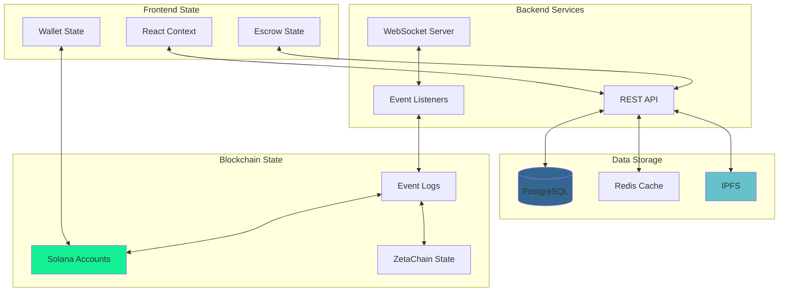

## 🔒 Security Architecture

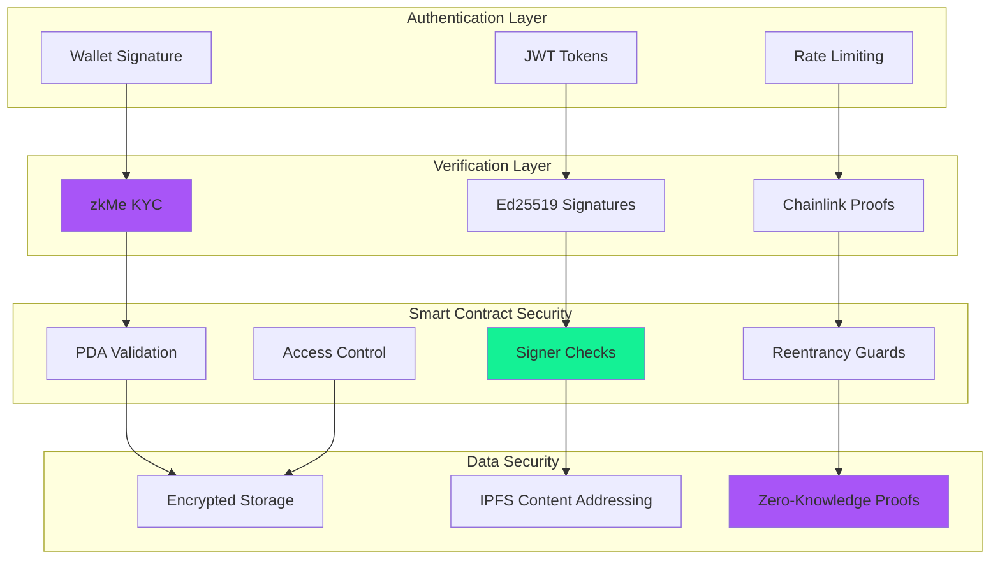

## 📊 Performance Optimization

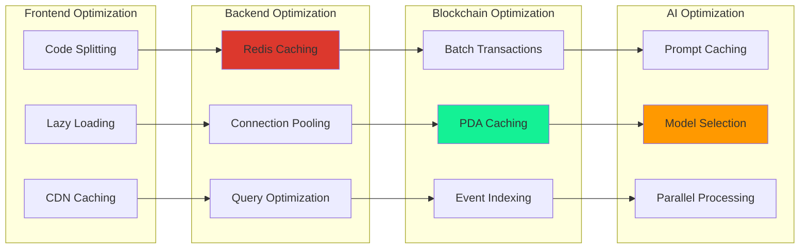

## 🎯 Proof of Task Verification (PoTv) Engine

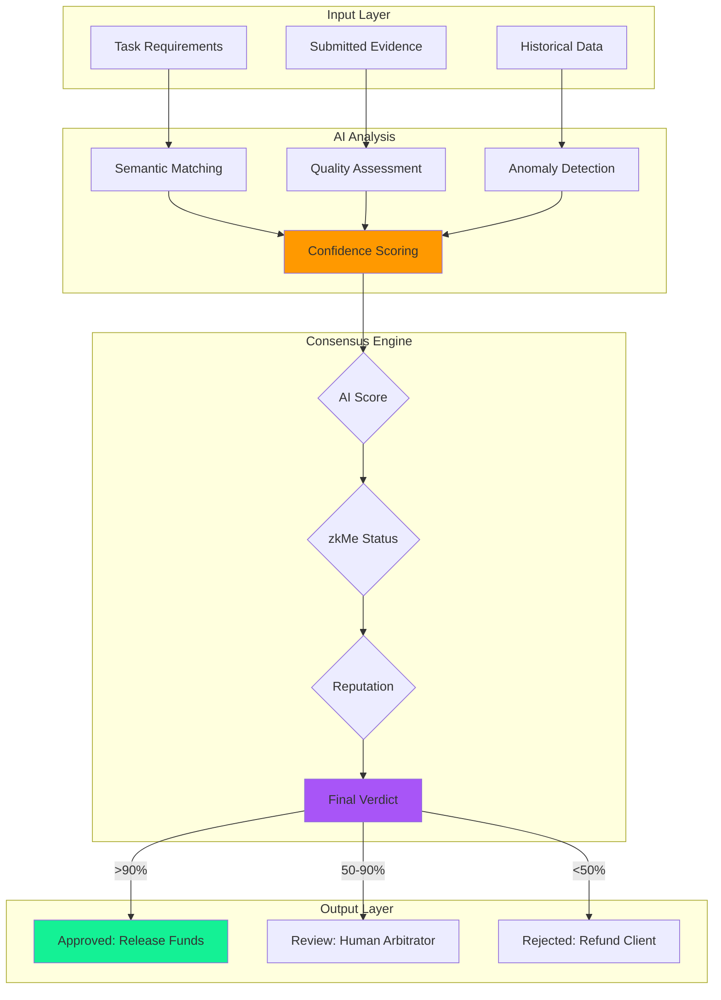

## 🔄 Event-Driven Architecture

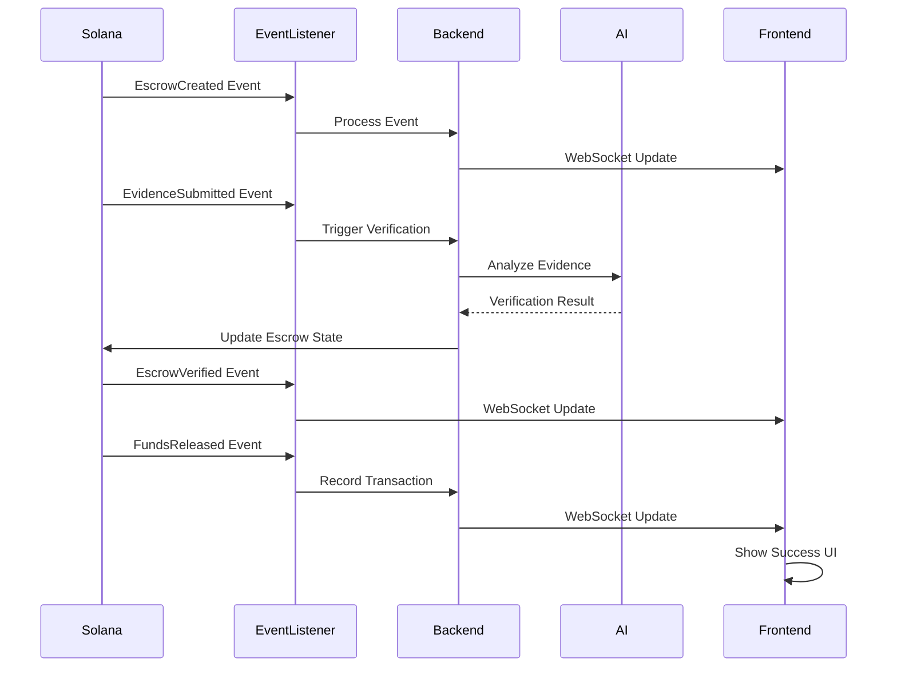

## 📈 Scalability Architecture

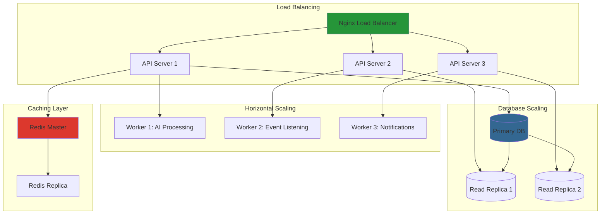

## 🛠️ Development & Deployment Pipeline

```mermaid
flowchart LR
    subgraph "Development"
        D1[Local Development]
        D2[Unit Tests]
        D3[Integration Tests]
    end
    
    subgraph "CI/CD"
        C1[GitHub Actions]
        C2[Build & Test]
        C3[Security Scan]
    end
    
    subgraph "Staging"
        S1[Devnet Deployment]
        S2[E2E Testing]
        S3[Performance Testing]
    end
    
    subgraph "Production"
        P1[Mainnet Deployment]
        P2[Monitoring]
        P3[Analytics]
    end
    
    D1 --> D2
    D2 --> D3
    D3 --> C1
    
    C1 --> C2
    C2 --> C3
    C3 --> S1
    
    S1 --> S2
    S2 --> S3
    S3 --> P1
    
    P1 --> P2
    P2 --> P3
    
    style C2 fill:#2088FF
    style S2 fill:#FFA500
    style P1 fill:#14F195
```

## 💰 Fee Distribution Architecture

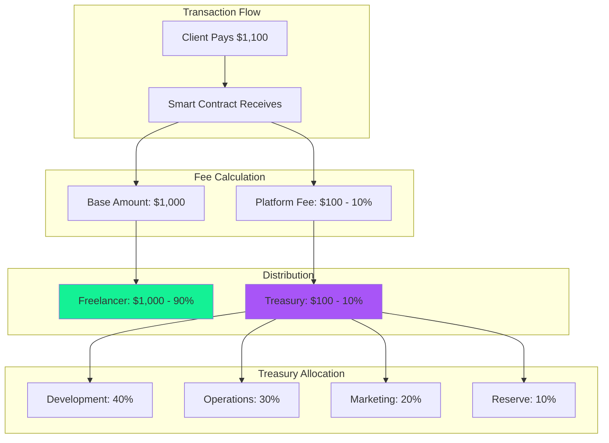

## 🔍 Monitoring & Observability

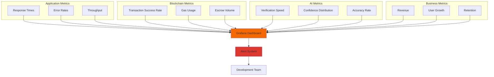

---

<div className="my-8 p-6 rounded-xl bg-gradient-to-r from-purple-500/10 to-cyan-500/10 border border-purple-500/30">
  <h3 className="text-2xl font-bold text-white mb-4">Explore the Architecture</h3>
  <p className="text-gray-300 mb-6">
    Dive deeper into specific components and see how they work together to create a seamless AI-powered escrow experience.
  </p>
  <div className="flex gap-4">
    <a href="/design/overview" className="px-6 py-3 rounded-lg bg-gradient-to-r from-purple-500 to-cyan-500 text-white font-bold hover:opacity-90">
      View Design Docs →
    </a>
    <a href="https://github.com/De-real-iManuel/AetherLock-" className="px-6 py-3 rounded-lg bg-white/10 border border-white/20 text-white font-bold hover:bg-white/20">
      View Source Code
    </a>
  </div>
</div>
