# 🏗️ Technical Architecture Deep Dive

## System Overview

AetherLock is built on a multi-layered architecture combining blockchain settlement, AI verification, zero-knowledge identity, and decentralized storage.

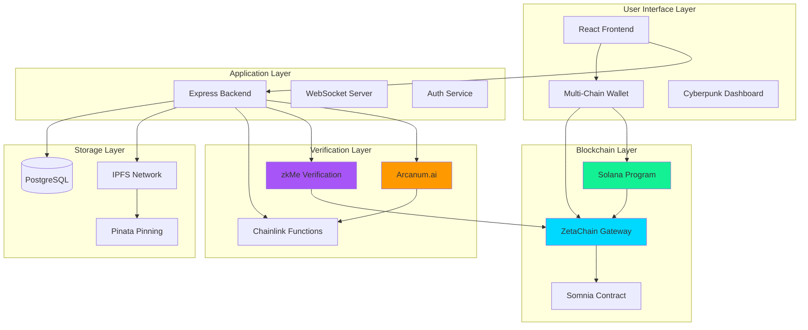
```mermaid
graph TB
    subgraph "User Interface Layer"
        UI[React Frontend]
        Wallet[Multi-Chain Wallet]
        Dashboard[Cyberpunk Dashboard]
    end
    
    subgraph "Application Layer"
        API[Express Backend]
        WS[WebSocket Server]
        Auth[Auth Service]
    end
    
    subgraph "Verification Layer"
        AI[Arcanum.ai]
        KYC[zkMe Verification]
        Oracle[Chainlink Functions]
    end
    
    subgraph "Blockchain Layer"
        Solana[Solana Program]
        Zeta[ZetaChain Gateway]
        Somnia[Somnia Contract]
    end
    
    subgraph "Storage Layer"
        IPFS[IPFS Network]
        Pinata[Pinata Pinning]
        DB[(PostgreSQL)]
    end
    
    UI --> API
    UI --> Wallet
    Wallet --> Solana
    Wallet --> Zeta
    
    API --> AI
    API --> KYC
    API --> Oracle
    API --> IPFS
    API --> DB
    
    Solana --> Zeta
    Zeta --> Somnia
    
    AI --> Oracle
    KYC --> Zeta
    IPFS --> Pinata
    
    style AI fill:#FF9900
    style KYC fill:#A855F7
    style Solana fill:#14F195
    style Zeta fill:#00D9FF
```

## 🏢 Component Responsibility Matrix

| Component | Primary Responsibility | Secondary Functions | Dependencies |
|-----------|----------------------|-------------------|--------------|
| **React Frontend** | User interface and wallet integration | State management, real-time updates | Wallet adapters, WebSocket |
| **Express Backend** | API orchestration and business logic | Authentication, event processing | PostgreSQL, Redis, IPFS |
| **Arcanum.ai** | Evidence analysis and verification | Confidence scoring, decision making | IPFS, Chainlink Oracle |
| **zkMe SDK** | Zero-knowledge identity verification | KYC compliance, privacy preservation | ZetaChain, Frontend |
| **Solana Program** | Escrow fund management | PDA validation, state transitions | ZetaChain Gateway |
| **ZetaChain Gateway** | Omnichain message routing | Cross-chain state synchronization | All blockchain networks |
| **Somnia Contract** | High-speed settlement execution | Transaction finality, gas optimization | ZetaChain, Treasury |
| **IPFS Network** | Decentralized evidence storage | Content addressing, availability | Pinata, Web3.Storage |
| **PostgreSQL** | Persistent data storage | Transaction history, user profiles | Backend API |
| **Redis Cache** | Performance optimization | Session management, rate limiting | Backend API |
| **Chainlink Oracle** | AI result authentication | Ed25519 signature verification | Arcanum.ai, Smart Contracts |

## 🔗 On-Chain vs Off-Chain Responsibilities

Understanding the clear separation between on-chain and off-chain operations is critical for security, scalability, and cost optimization in AetherLock's architecture.

### On-Chain Responsibilities (Blockchain Layer)

**Solana Program (Primary Escrow Layer)**
- **Fund Management**: Locking, holding, and releasing escrow funds with cryptographic security
- **State Transitions**: Managing escrow lifecycle states (Created → Funded → InProgress → Verified → Released)
- **PDA Validation**: Ensuring Program Derived Addresses are correctly computed and authorized
- **Access Control**: Enforcing signer requirements and permission checks
- **Fee Collection**: Automatically deducting 10% platform fee during fund release
- **Event Emission**: Publishing on-chain events for off-chain indexing and processing
- **Atomic Operations**: Ensuring fund transfers are atomic and cannot be partially executed

**ZetaChain Gateway (Cross-Chain Messaging)**
- **Message Routing**: Relaying cross-chain messages between Solana, Somnia, and other chains
- **State Synchronization**: Maintaining consistent escrow state across multiple blockchains
- **Callback Handling**: Processing onCall, onRevert, and onAbort callbacks for cross-chain operations
- **Finality Proofs**: Verifying transaction finality before executing cross-chain actions

**Somnia Contract (Optional High-Speed Settlement)**
- **Reputation Tracking**: Recording user reputation scores on-chain for transparency
- **Task Rewards**: Distributing bonus rewards for high-quality task completion
- **Fast Settlement**: Providing high-throughput settlement for time-sensitive escrows

### Off-Chain Responsibilities (Application & AI Layer)

**Express Backend API**
- **Business Logic**: Orchestrating complex workflows that don't require blockchain consensus
- **User Authentication**: Managing JWT tokens and wallet signature verification
- **Database Operations**: Storing user profiles, transaction history, and metadata
- **IPFS Coordination**: Uploading evidence files and managing content addressing
- **WebSocket Management**: Providing real-time updates to connected clients
- **Event Processing**: Listening to blockchain events and triggering appropriate actions

**Arcanum.ai Verification Service**
- **Evidence Analysis**: Analyzing submitted work evidence using AI models
- **Semantic Matching**: Comparing task requirements against submitted deliverables
- **Quality Scoring**: Generating confidence scores (0-100%) for verification decisions
- **Anomaly Detection**: Identifying potential fraud or low-quality submissions
- **Result Signing**: Creating Ed25519 signatures for verification results

**Chainlink Oracle Network**
- **AI Result Authentication**: Verifying Ed25519 signatures from Arcanum.ai
- **Off-Chain Computation**: Executing complex verification logic off-chain
- **On-Chain Delivery**: Submitting verified results to smart contracts

**zkMe KYC Service**
- **Identity Verification**: Processing KYC documents and generating zero-knowledge proofs
- **Privacy Preservation**: Ensuring no PII is stored on-chain
- **Credential Management**: Issuing and managing verifiable credentials

### Rationale for Separation

| Operation Type | Location | Reason |
|----------------|----------|--------|
| Fund Transfers | On-Chain | Requires trustless execution and atomic guarantees |
| AI Verification | Off-Chain | Computationally expensive, requires specialized models |
| Evidence Storage | Off-Chain (IPFS) | Large file storage is cost-prohibitive on-chain |
| User Profiles | Off-Chain (PostgreSQL) | Mutable data that changes frequently |
| Real-Time Updates | Off-Chain (WebSocket) | Requires low-latency bidirectional communication |
| State Transitions | On-Chain | Requires consensus and immutability |
| KYC Processing | Off-Chain (zkMe) | Privacy-sensitive, only proofs go on-chain |
| Event Logs | On-Chain | Provides immutable audit trail |

## 💎 Solana Smart Contract Structure

AetherLock's Solana program is built using the Anchor framework, providing type-safe instructions and automatic account validation. The program manages escrow accounts, fund locking/release, and cross-chain message coordination.

### Program Architecture

```rust
// Program ID (Devnet): AethXXXXXXXXXXXXXXXXXXXXXXXXXXXXXXXXXXXXXXX
use anchor_lang::prelude::*;

declare_id!("AethXXXXXXXXXXXXXXXXXXXXXXXXXXXXXXXXXXXXXXX");

#[program]
pub mod aetherlock_escrow {
    use super::*;

    /// Initialize a new escrow account
    pub fn create_escrow(
        ctx: Context<CreateEscrow>,
        escrow_id: String,
        amount: u64,
        payee: Pubkey,
        deadline: i64,
        task_requirements_hash: [u8; 32],
    ) -> Result<()> {
        let escrow = &mut ctx.accounts.escrow;
        escrow.escrow_id = escrow_id;
        escrow.payer = ctx.accounts.payer.key();
        escrow.payee = payee;
        escrow.amount = amount;
        escrow.deadline = deadline;
        escrow.task_requirements_hash = task_requirements_hash;
        escrow.status = EscrowStatus::Created;
        escrow.created_at = Clock::get()?.unix_timestamp;
        escrow.bump = *ctx.bumps.get("escrow").unwrap();
        
        emit!(EscrowCreatedEvent {
            escrow_id: escrow.escrow_id.clone(),
            payer: escrow.payer,
            payee: escrow.payee,
            amount: escrow.amount,
            timestamp: escrow.created_at,
        });
        
        Ok(())
    }

    /// Fund the escrow by transferring SOL to the escrow PDA
    pub fn fund_escrow(
        ctx: Context<FundEscrow>,
        escrow_id: String,
    ) -> Result<()> {
        let escrow = &mut ctx.accounts.escrow;
        require!(escrow.status == EscrowStatus::Created, ErrorCode::InvalidEscrowStatus);
        
        // Transfer SOL from payer to escrow PDA
        let transfer_amount = escrow.amount;
        let cpi_context = CpiContext::new(
            ctx.accounts.system_program.to_account_info(),
            anchor_lang::system_program::Transfer {
                from: ctx.accounts.payer.to_account_info(),
                to: ctx.accounts.escrow.to_account_info(),
            },
        );
        anchor_lang::system_program::transfer(cpi_context, transfer_amount)?;
        
        escrow.status = EscrowStatus::Funded;
        escrow.funded_at = Some(Clock::get()?.unix_timestamp);
        
        emit!(EscrowFundedEvent {
            escrow_id: escrow.escrow_id.clone(),
            amount: transfer_amount,
            timestamp: escrow.funded_at.unwrap(),
        });
        
        Ok(())
    }

    /// Submit evidence hash for verification
    pub fn submit_evidence(
        ctx: Context<SubmitEvidence>,
        escrow_id: String,
        evidence_hash: [u8; 32],
    ) -> Result<()> {
        let escrow = &mut ctx.accounts.escrow;
        require!(escrow.status == EscrowStatus::Funded, ErrorCode::InvalidEscrowStatus);
        require!(ctx.accounts.submitter.key() == escrow.payee, ErrorCode::Unauthorized);
        
        escrow.evidence_hash = Some(evidence_hash);
        escrow.status = EscrowStatus::EvidenceSubmitted;
        escrow.evidence_submitted_at = Some(Clock::get()?.unix_timestamp);
        
        emit!(EvidenceSubmittedEvent {
            escrow_id: escrow.escrow_id.clone(),
            evidence_hash,
            submitter: ctx.accounts.submitter.key(),
            timestamp: escrow.evidence_submitted_at.unwrap(),
        });
        
        Ok(())
    }

    /// Update verification result from Chainlink oracle
    pub fn update_verification(
        ctx: Context<UpdateVerification>,
        escrow_id: String,
        verification_result: VerificationResult,
        confidence_score: u8,
    ) -> Result<()> {
        let escrow = &mut ctx.accounts.escrow;
        require!(escrow.status == EscrowStatus::EvidenceSubmitted, ErrorCode::InvalidEscrowStatus);
        require!(ctx.accounts.oracle.key() == CHAINLINK_ORACLE_PUBKEY, ErrorCode::Unauthorized);
        
        escrow.verification_result = Some(verification_result);
        escrow.confidence_score = Some(confidence_score);
        escrow.status = EscrowStatus::Verified;
        escrow.verified_at = Some(Clock::get()?.unix_timestamp);
        
        emit!(VerificationCompletedEvent {
            escrow_id: escrow.escrow_id.clone(),
            result: verification_result,
            confidence_score,
            timestamp: escrow.verified_at.unwrap(),
        });
        
        Ok(())
    }

    /// Release funds to payee (90%) and treasury (10%)
    pub fn release_funds(
        ctx: Context<ReleaseFunds>,
        escrow_id: String,
    ) -> Result<()> {
        let escrow = &mut ctx.accounts.escrow;
        require!(escrow.status == EscrowStatus::Verified, ErrorCode::InvalidEscrowStatus);
        require!(
            escrow.verification_result == Some(VerificationResult::Approved),
            ErrorCode::VerificationNotApproved
        );
        
        let total_amount = escrow.amount;
        let platform_fee = total_amount.checked_mul(10).unwrap().checked_div(100).unwrap(); // 10%
        let payee_amount = total_amount.checked_sub(platform_fee).unwrap(); // 90%
        
        // Transfer to payee
        **ctx.accounts.escrow.to_account_info().try_borrow_mut_lamports()? -= payee_amount;
        **ctx.accounts.payee.to_account_info().try_borrow_mut_lamports()? += payee_amount;
        
        // Transfer to treasury
        **ctx.accounts.escrow.to_account_info().try_borrow_mut_lamports()? -= platform_fee;
        **ctx.accounts.treasury.to_account_info().try_borrow_mut_lamports()? += platform_fee;
        
        escrow.status = EscrowStatus::Released;
        escrow.released_at = Some(Clock::get()?.unix_timestamp);
        
        emit!(FundsReleasedEvent {
            escrow_id: escrow.escrow_id.clone(),
            payee: escrow.payee,
            payee_amount,
            platform_fee,
            timestamp: escrow.released_at.unwrap(),
        });
        
        Ok(())
    }

    /// Refund to payer if verification fails or deadline expires
    pub fn refund_escrow(
        ctx: Context<RefundEscrow>,
        escrow_id: String,
    ) -> Result<()> {
        let escrow = &mut ctx.accounts.escrow;
        let current_time = Clock::get()?.unix_timestamp;
        
        // Allow refund if verification rejected or deadline passed
        let can_refund = escrow.verification_result == Some(VerificationResult::Rejected)
            || current_time > escrow.deadline;
        
        require!(can_refund, ErrorCode::RefundNotAllowed);
        
        let refund_amount = escrow.amount;
        
        // Transfer back to payer
        **ctx.accounts.escrow.to_account_info().try_borrow_mut_lamports()? -= refund_amount;
        **ctx.accounts.payer.to_account_info().try_borrow_mut_lamports()? += refund_amount;
        
        escrow.status = EscrowStatus::Refunded;
        escrow.refunded_at = Some(Clock::get()?.unix_timestamp);
        
        emit!(EscrowRefundedEvent {
            escrow_id: escrow.escrow_id.clone(),
            payer: escrow.payer,
            amount: refund_amount,
            timestamp: escrow.refunded_at.unwrap(),
        });
        
        Ok(())
    }
}

/// Escrow account structure
#[account]
pub struct Escrow {
    pub escrow_id: String,              // Unique identifier (32 bytes)
    pub payer: Pubkey,                  // Client who creates escrow (32 bytes)
    pub payee: Pubkey,                  // Freelancer who receives payment (32 bytes)
    pub amount: u64,                    // Total escrow amount in lamports (8 bytes)
    pub deadline: i64,                  // Unix timestamp deadline (8 bytes)
    pub task_requirements_hash: [u8; 32], // IPFS hash of requirements (32 bytes)
    pub evidence_hash: Option<[u8; 32]>, // IPFS hash of evidence (33 bytes)
    pub verification_result: Option<VerificationResult>, // AI verification result (2 bytes)
    pub confidence_score: Option<u8>,   // 0-100 confidence score (2 bytes)
    pub status: EscrowStatus,           // Current escrow state (1 byte)
    pub created_at: i64,                // Creation timestamp (8 bytes)
    pub funded_at: Option<i64>,         // Funding timestamp (9 bytes)
    pub evidence_submitted_at: Option<i64>, // Evidence submission timestamp (9 bytes)
    pub verified_at: Option<i64>,       // Verification timestamp (9 bytes)
    pub released_at: Option<i64>,       // Release timestamp (9 bytes)
    pub refunded_at: Option<i64>,       // Refund timestamp (9 bytes)
    pub bump: u8,                       // PDA bump seed (1 byte)
}

/// Escrow status enum
#[derive(AnchorSerialize, AnchorDeserialize, Clone, PartialEq, Eq)]
pub enum EscrowStatus {
    Created,            // Escrow initialized but not funded
    Funded,             // Funds locked in escrow
    EvidenceSubmitted,  // Freelancer submitted work evidence
    Verified,           // AI verification completed
    Released,           // Funds released to payee
    Refunded,           // Funds refunded to payer
}

/// Verification result enum
#[derive(AnchorSerialize, AnchorDeserialize, Clone, PartialEq, Eq)]
pub enum VerificationResult {
    Approved,   // >90% confidence, auto-approve
    Review,     // 50-90% confidence, needs human review
    Rejected,   // <50% confidence, auto-reject
}

/// Error codes
#[error_code]
pub enum ErrorCode {
    #[msg("Invalid escrow status for this operation")]
    InvalidEscrowStatus,
    #[msg("Unauthorized: signer does not have permission")]
    Unauthorized,
    #[msg("Verification not approved, cannot release funds")]
    VerificationNotApproved,
    #[msg("Refund not allowed at this time")]
    RefundNotAllowed,
}
```

### Account Validation Contexts

```rust
#[derive(Accounts)]
#[instruction(escrow_id: String)]
pub struct CreateEscrow<'info> {
    #[account(
        init,
        payer = payer,
        space = 8 + 32 + 32 + 32 + 8 + 8 + 32 + 33 + 2 + 2 + 1 + 8 + 9 + 9 + 9 + 9 + 9 + 1,
        seeds = [b"escrow", escrow_id.as_bytes()],
        bump
    )]
    pub escrow: Account<'info, Escrow>,
    #[account(mut)]
    pub payer: Signer<'info>,
    pub system_program: Program<'info, System>,
}

#[derive(Accounts)]
#[instruction(escrow_id: String)]
pub struct FundEscrow<'info> {
    #[account(
        mut,
        seeds = [b"escrow", escrow_id.as_bytes()],
        bump = escrow.bump,
        has_one = payer
    )]
    pub escrow: Account<'info, Escrow>,
    #[account(mut)]
    pub payer: Signer<'info>,
    pub system_program: Program<'info, System>,
}

#[derive(Accounts)]
#[instruction(escrow_id: String)]
pub struct SubmitEvidence<'info> {
    #[account(
        mut,
        seeds = [b"escrow", escrow_id.as_bytes()],
        bump = escrow.bump
    )]
    pub escrow: Account<'info, Escrow>,
    pub submitter: Signer<'info>,
}

#[derive(Accounts)]
#[instruction(escrow_id: String)]
pub struct ReleaseFunds<'info> {
    #[account(
        mut,
        seeds = [b"escrow", escrow_id.as_bytes()],
        bump = escrow.bump
    )]
    pub escrow: Account<'info, Escrow>,
    /// CHECK: Validated against escrow.payee
    #[account(mut)]
    pub payee: AccountInfo<'info>,
    /// CHECK: Treasury account
    #[account(mut)]
    pub treasury: AccountInfo<'info>,
    pub system_program: Program<'info, System>,
}
```

### Key Design Decisions

**Program Derived Addresses (PDAs)**
- Escrow accounts use PDAs derived from `["escrow", escrow_id]` seeds
- Ensures deterministic account addresses without requiring keypair generation
- Provides built-in authorization through seed validation

**Fee Structure**
- 10% platform fee automatically deducted during fund release
- 90% goes to freelancer, 10% to treasury
- Atomic execution ensures fees cannot be bypassed

**State Machine**
- Strict state transitions prevent invalid operations
- Each instruction validates current state before execution
- Events emitted for off-chain indexing and UI updates

**Security Features**
- Signer validation on all state-changing operations
- PDA bump seed stored to prevent account recreation attacks
- Oracle pubkey validation for verification updates
- Deadline enforcement for refund protection

## 🌉 ZetaChain Cross-Chain Integration

ZetaChain enables AetherLock to operate as a truly omnichain protocol, allowing escrows created on Solana to settle on Somnia, Sui, TON, or any connected blockchain.

### ZetaChain Universal App Pattern

```solidity
// SPDX-License-Identifier: MIT
pragma solidity 0.8.20;

import "@zetachain/protocol-contracts/contracts/zevm/interfaces/UniversalContract.sol";
import "@zetachain/protocol-contracts/contracts/zevm/interfaces/IGatewayZEVM.sol";

contract AetherLockZetaGateway is UniversalContract {
    IGatewayZEVM public gateway;
    address public solanaGatewayAddress;
    
    // Mapping of escrow IDs to cross-chain state
    mapping(bytes32 => CrossChainEscrow) public escrows;
    
    struct CrossChainEscrow {
        bytes32 escrowId;
        address sourceChain;
        address destinationChain;
        uint256 amount;
        address payee;
        EscrowStatus status;
        uint256 createdAt;
    }
    
    enum EscrowStatus {
        Pending,
        Confirmed,
        Settled,
        Reverted
    }
    
    event CrossChainEscrowCreated(
        bytes32 indexed escrowId,
        address sourceChain,
        address destinationChain,
        uint256 amount
    );
    
    event CrossChainSettlement(
        bytes32 indexed escrowId,
        address destinationChain,
        bool success
    );

    constructor(address gatewayAddress, address _solanaGatewayAddress) {
        gateway = IGatewayZEVM(gatewayAddress);
        solanaGatewayAddress = _solanaGatewayAddress;
    }

    /// @notice Called when a cross-chain message is received
    /// @param context Message context including source chain and sender
    /// @param message Encoded message data
    function onCall(
        MessageContext calldata context,
        bytes calldata message
    ) external override returns (bytes4) {
        require(msg.sender == address(gateway), "Unauthorized");
        
        // Decode message
        (
            bytes32 escrowId,
            uint256 amount,
            address payee,
            address destinationChain,
            bytes32 taskHash
        ) = abi.decode(message, (bytes32, uint256, address, address, bytes32));
        
        // Create cross-chain escrow record
        escrows[escrowId] = CrossChainEscrow({
            escrowId: escrowId,
            sourceChain: context.sender,
            destinationChain: destinationChain,
            amount: amount,
            payee: payee,
            status: EscrowStatus.Confirmed,
            createdAt: block.timestamp
        });
        
        emit CrossChainEscrowCreated(
            escrowId,
            context.sender,
            destinationChain,
            amount
        );
        
        // Forward to destination chain if not ZetaChain
        if (destinationChain != address(this)) {
            _forwardToDestination(escrowId, destinationChain, message);
        }
        
        return this.onCall.selector;
    }

    /// @notice Called when a cross-chain call is reverted
    /// @param context Revert context
    /// @param message Original message that was reverted
    function onRevert(
        RevertContext calldata context,
        bytes calldata message
    ) external override {
        require(msg.sender == address(gateway), "Unauthorized");
        
        // Decode escrow ID from message
        (bytes32 escrowId, , , , ) = abi.decode(
            message,
            (bytes32, uint256, address, address, bytes32)
        );
        
        // Update escrow status to reverted
        CrossChainEscrow storage escrow = escrows[escrowId];
        require(escrow.escrowId == escrowId, "Escrow not found");
        
        escrow.status = EscrowStatus.Reverted;
        
        // Notify source chain to refund
        _notifySourceChainRefund(escrow.sourceChain, escrowId);
        
        emit CrossChainSettlement(escrowId, escrow.destinationChain, false);
    }

    /// @notice Called when a cross-chain call is aborted
    /// @param escrowId The escrow that was aborted
    function onAbort(bytes32 escrowId) external {
        require(msg.sender == address(gateway), "Unauthorized");
        
        CrossChainEscrow storage escrow = escrows[escrowId];
        require(escrow.escrowId == escrowId, "Escrow not found");
        require(escrow.status == EscrowStatus.Pending, "Invalid status");
        
        escrow.status = EscrowStatus.Reverted;
        
        // Refund on source chain
        _notifySourceChainRefund(escrow.sourceChain, escrowId);
    }

    /// @notice Settle escrow on destination chain after verification
    /// @param escrowId The escrow to settle
    /// @param verificationProof Proof from Chainlink oracle
    function settleEscrow(
        bytes32 escrowId,
        bytes calldata verificationProof
    ) external {
        CrossChainEscrow storage escrow = escrows[escrowId];
        require(escrow.status == EscrowStatus.Confirmed, "Invalid status");
        
        // Verify proof from Chainlink oracle
        require(_verifyChainlinkProof(verificationProof), "Invalid proof");
        
        // Send settlement message to destination chain
        bytes memory settlementMessage = abi.encode(
            escrowId,
            escrow.amount,
            escrow.payee
        );
        
        gateway.call(
            escrow.destinationChain,
            settlementMessage,
            0 // No gas limit, use default
        );
        
        escrow.status = EscrowStatus.Settled;
        
        emit CrossChainSettlement(escrowId, escrow.destinationChain, true);
    }

    function _forwardToDestination(
        bytes32 escrowId,
        address destinationChain,
        bytes memory message
    ) internal {
        gateway.call(destinationChain, message, 0);
    }

    function _notifySourceChainRefund(
        address sourceChain,
        bytes32 escrowId
    ) internal {
        bytes memory refundMessage = abi.encode(escrowId, true);
        gateway.call(sourceChain, refundMessage, 0);
    }

    function _verifyChainlinkProof(
        bytes calldata proof
    ) internal view returns (bool) {
        // Verify Ed25519 signature from Chainlink oracle
        // Implementation depends on Chainlink Functions setup
        return true; // Simplified for example
    }
}
```

### Cross-Chain Message Flow

**onCall Flow (Successful Path)**
1. Solana program emits cross-chain escrow creation event
2. ZetaChain gateway receives message via `onCall`
3. Gateway validates message format and sender
4. Creates cross-chain escrow record on ZetaChain
5. Forwards message to destination chain (e.g., Somnia)
6. Destination chain confirms receipt
7. Returns success callback to Solana

**onRevert Flow (Failure Path)**
1. Destination chain rejects message (insufficient gas, invalid state, etc.)
2. ZetaChain gateway receives revert notification
3. Gateway calls `onRevert` with original message
4. Updates escrow status to `Reverted`
5. Sends refund notification to Solana
6. Solana program refunds client

**onAbort Flow (Timeout Path)**
1. Cross-chain message times out (no response from destination)
2. ZetaChain gateway calls `onAbort`
3. Updates escrow status to `Reverted`
4. Triggers automatic refund on source chain

### Integration Benefits

- **Omnichain Flexibility**: Escrows can settle on any connected blockchain
- **Atomic Guarantees**: Either full settlement or full refund, no partial states
- **Gas Optimization**: Pay gas only on source chain, ZetaChain handles routing
- **Failure Recovery**: Automatic revert and refund on any failure

## 🚀 Somnia Integration (Optional High-Speed Settlement)

Somnia provides high-throughput, low-latency settlement for AetherLock escrows, along with on-chain reputation tracking and task rewards.

### Somnia Settlement Contract

```solidity
// SPDX-License-Identifier: MIT
pragma solidity 0.8.20;

import "@openzeppelin/contracts/access/Ownable.sol";
import "@openzeppelin/contracts/security/ReentrancyGuard.sol";

contract AetherLockSomniaSettlement is Ownable, ReentrancyGuard {
    // Reputation tracking
    mapping(address => UserReputation) public reputations;
    
    // Task rewards pool
    uint256 public rewardPool;
    uint256 public constant BONUS_THRESHOLD = 95; // 95% confidence for bonus
    uint256 public constant BONUS_PERCENTAGE = 5; // 5% bonus on top of payment
    
    struct UserReputation {
        uint256 totalTasksCompleted;
        uint256 totalTasksRejected;
        uint256 averageConfidenceScore;
        uint256 totalEarnings;
        uint256 reputationScore; // 0-1000
        uint256 lastUpdated;
    }
    
    event ReputationUpdated(
        address indexed user,
        uint256 newScore,
        uint256 tasksCompleted
    );
    
    event BonusRewarded(
        address indexed freelancer,
        uint256 bonusAmount,
        uint256 confidenceScore
    );
    
    event SettlementExecuted(
        bytes32 indexed escrowId,
        address indexed freelancer,
        uint256 amount,
        uint256 timestamp
    );

    /// @notice Settle escrow and update reputation
    /// @param escrowId Unique escrow identifier
    /// @param freelancer Address receiving payment
    /// @param amount Payment amount
    /// @param confidenceScore AI verification confidence (0-100)
    function settleEscrow(
        bytes32 escrowId,
        address freelancer,
        uint256 amount,
        uint8 confidenceScore
    ) external onlyOwner nonReentrant {
        require(freelancer != address(0), "Invalid freelancer");
        require(amount > 0, "Invalid amount");
        require(confidenceScore >= 50, "Confidence too low");
        
        // Update reputation
        _updateReputation(freelancer, confidenceScore, amount);
        
        // Calculate bonus if high confidence
        uint256 totalPayout = amount;
        if (confidenceScore >= BONUS_THRESHOLD && rewardPool > 0) {
            uint256 bonus = (amount * BONUS_PERCENTAGE) / 100;
            if (bonus <= rewardPool) {
                totalPayout += bonus;
                rewardPool -= bonus;
                
                emit BonusRewarded(freelancer, bonus, confidenceScore);
            }
        }
        
        // Execute settlement
        (bool success, ) = freelancer.call{value: totalPayout}("");
        require(success, "Settlement failed");
        
        emit SettlementExecuted(escrowId, freelancer, totalPayout, block.timestamp);
    }

    /// @notice Update user reputation based on task completion
    function _updateReputation(
        address user,
        uint8 confidenceScore,
        uint256 earnings
    ) internal {
        UserReputation storage rep = reputations[user];
        
        // Update task counts
        rep.totalTasksCompleted += 1;
        rep.totalEarnings += earnings;
        
        // Update average confidence score (weighted average)
        uint256 totalTasks = rep.totalTasksCompleted + rep.totalTasksRejected;
        rep.averageConfidenceScore = (
            (rep.averageConfidenceScore * (totalTasks - 1)) + confidenceScore
        ) / totalTasks;
        
        // Calculate reputation score (0-1000)
        // Formula: (completion_rate * 500) + (avg_confidence * 5)
        uint256 completionRate = (rep.totalTasksCompleted * 100) / totalTasks;
        rep.reputationScore = (completionRate * 5) + (rep.averageConfidenceScore * 5);
        
        rep.lastUpdated = block.timestamp;
        
        emit ReputationUpdated(user, rep.reputationScore, rep.totalTasksCompleted);
    }

    /// @notice Record rejected task for reputation
    function recordRejection(address user) external onlyOwner {
        UserReputation storage rep = reputations[user];
        rep.totalTasksRejected += 1;
        
        // Recalculate reputation score
        uint256 totalTasks = rep.totalTasksCompleted + rep.totalTasksRejected;
        uint256 completionRate = (rep.totalTasksCompleted * 100) / totalTasks;
        rep.reputationScore = (completionRate * 5) + (rep.averageConfidenceScore * 5);
        
        rep.lastUpdated = block.timestamp;
        
        emit ReputationUpdated(user, rep.reputationScore, rep.totalTasksCompleted);
    }

    /// @notice Fund the reward pool
    function fundRewardPool() external payable {
        rewardPool += msg.value;
    }

    /// @notice Get user reputation details
    function getReputation(address user) external view returns (
        uint256 tasksCompleted,
        uint256 tasksRejected,
        uint256 avgConfidence,
        uint256 totalEarnings,
        uint256 reputationScore
    ) {
        UserReputation memory rep = reputations[user];
        return (
            rep.totalTasksCompleted,
            rep.totalTasksRejected,
            rep.averageConfidenceScore,
            rep.totalEarnings,
            rep.reputationScore
        );
    }
}
```

### Somnia Integration Benefits

**High-Speed Settlement**
- Sub-second transaction finality
- Low gas costs for frequent settlements
- Optimized for high-throughput escrow operations

**On-Chain Reputation**
- Transparent reputation scores (0-1000 scale)
- Weighted by completion rate and confidence scores
- Immutable history of task performance

**Task Rewards**
- 5% bonus for high-confidence completions (>95%)
- Funded by platform reward pool
- Incentivizes quality work

**Why Somnia?**
- **Speed**: 400,000+ TPS for instant settlements
- **Cost**: Minimal gas fees compared to Ethereum L1
- **Compatibility**: EVM-compatible, easy integration
- **Scalability**: Handles high escrow volume without congestion

## 🔗 Integration Point Documentation

### Frontend ↔ Backend Integration
```typescript
// WebSocket connection for real-time updates
const wsConnection = new WebSocket('wss://api.aetherlock.xyz/ws');

// REST API client with authentication
class AetherLockAPI {
  private baseURL = 'https://api.aetherlock.xyz/v1';
  private authToken: string;

  async createEscrow(escrowData: CreateEscrowRequest): Promise<EscrowResponse> {
    return this.post('/escrows', escrowData);
  }

  async uploadEvidence(files: File[]): Promise<IPFSUploadResponse> {
    const formData = new FormData();
    files.forEach(file => formData.append('files', file));
    return this.post('/evidence/upload', formData);
  }
}
```

### Backend ↔ Blockchain Integration
```typescript
// Solana program interaction
class SolanaEscrowClient {
  constructor(private connection: Connection, private wallet: Wallet) {}

  async createEscrow(params: CreateEscrowParams): Promise<string> {
    const program = new Program(IDL, PROGRAM_ID, this.provider);
    const escrowPDA = await this.deriveEscrowPDA(params.escrowId);
    
    const tx = await program.methods
      .createEscrow(params.amount, params.payee, params.deadline)
      .accounts({
        escrow: escrowPDA,
        payer: this.wallet.publicKey,
        systemProgram: SystemProgram.programId,
      })
      .rpc();
    
    return tx;
  }
}

// ZetaChain cross-chain messaging
class ZetaChainClient {
  async sendCrossChainMessage(
    destinationChain: string,
    message: CrossChainMessage
  ): Promise<string> {
    const contract = new ethers.Contract(
      ZETACHAIN_GATEWAY_ADDRESS,
      GATEWAY_ABI,
      this.signer
    );
    
    const tx = await contract.sendMessage(
      destinationChain,
      ethers.utils.defaultAbiCoder.encode(
        ['address', 'uint256', 'bytes32'],
        [message.recipient, message.amount, message.dataHash]
      )
    );
    
    return tx.hash;
  }
}
```

### AI ↔ Oracle Integration
```typescript
// Arcanum.ai AI verification (production implementation)
// Note: AWS Bedrock was initially explored but Arcanum.ai was chosen for
// specialized task verification with better performance and simpler integration
class AIVerificationService {
  async verifyEvidence(evidenceHash: string): Promise<VerificationResult> {
    const arcanum = new ArcanumClient({
      apiKey: process.env.ARCANUM_API_KEY,
      endpoint: 'https://api.arcanum.ai/v1'
    });
    
    // Fetch evidence from IPFS
    const evidence = await this.ipfs.get(evidenceHash);
    
    // Analyze with Arcanum.ai specialized task verification
    const response = await arcanum.verify({
      evidenceHash,
      evidence,
      options: {
        maxTokens: 2000,
        temperature: 0.3
      }
    });
    
    const result = response.analysis;
    
    // Sign result with Ed25519
    const signature = await this.signResult(result);
    
    // Submit to Chainlink Oracle
    await this.chainlinkOracle.submitVerification(evidenceHash, result, signature);
    
    return result;
  }
}
```

## 📚 Technology Stack Breakdown

### Frontend Stack
```json
{
  "framework": "React 18 with TypeScript",
  "styling": "Tailwind CSS + Framer Motion",
  "state": "Zustand + React Query",
  "wallet": "@solana/wallet-adapter, @mysten/wallet-adapter",
  "ui": "Radix UI + Lucide Icons",
  "build": "Vite + SWC",
  "deployment": "Vercel Edge Functions"
}
```

### Backend Stack
```json
{
  "runtime": "Node.js 20 + Express.js",
  "language": "TypeScript",
  "database": "PostgreSQL 15 + Prisma ORM",
  "cache": "Redis 7 + ioredis",
  "storage": "IPFS + Pinata/Web3.Storage",
  "auth": "JWT + Wallet Signatures",
  "websockets": "Socket.io",
  "deployment": "Docker + AWS ECS/Render"
}
```

### Blockchain Stack
```json
{
  "solana": {
    "framework": "Anchor 0.29",
    "language": "Rust",
    "rpc": "Helius/QuickNode",
    "deployment": "Devnet/Mainnet-beta"
  },
  "zetachain": {
    "framework": "Hardhat + Ethers.js",
    "language": "Solidity 0.8.20",
    "network": "ZetaChain Testnet/Mainnet",
    "gateway": "Universal App Pattern"
  },
  "somnia": {
    "framework": "Hardhat + Ethers.js",
    "language": "Solidity 0.8.20",
    "network": "Somnia Testnet/Mainnet",
    "features": "High-throughput settlement"
  }
}
```

### AI & Oracle Stack
```json
{
  "ai_service": "Arcanum.ai (Primary)",
  "fallback_ai": "OpenAI GPT-4, Anthropic Claude, Google Gemini",
  "oracle": "Chainlink Functions",
  "signatures": "Ed25519 cryptographic proofs",
  "ipfs": "Pinata, Web3.Storage, Lighthouse",
  "monitoring": "AWS CloudWatch, Grafana"
}
```

### DevOps & Infrastructure
```json
{
  "ci_cd": "GitHub Actions",
  "containers": "Docker + Docker Compose",
  "orchestration": "AWS ECS/Kubernetes",
  "monitoring": "Grafana + Prometheus",
  "logging": "Winston + AWS CloudWatch",
  "security": "AWS Secrets Manager, Vault",
  "cdn": "Cloudflare",
  "domains": "Cloudflare DNS"
}
```

## 🔄 Complete Escrow Lifecycle

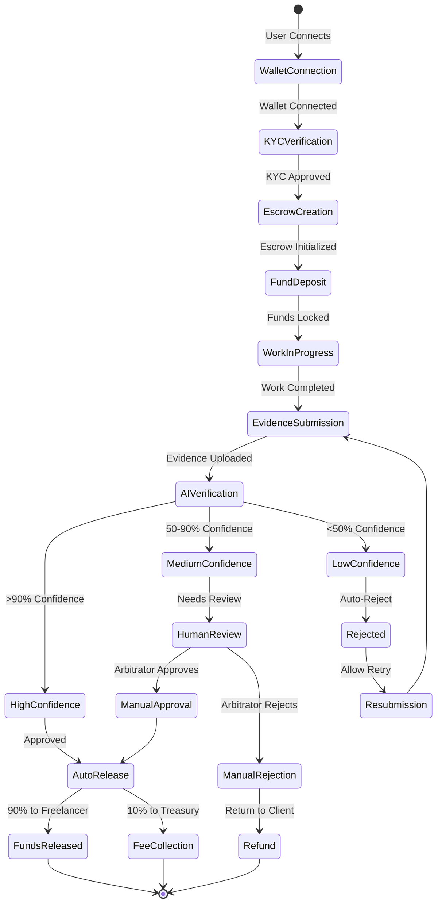
```mermaid
stateDiagram-v2
    [*] --> WalletConnection: User Connects
    WalletConnection --> KYCVerification: Wallet Connected
    KYCVerification --> EscrowCreation: KYC Approved
    
    EscrowCreation --> FundDeposit: Escrow Initialized
    FundDeposit --> WorkInProgress: Funds Locked
    
    WorkInProgress --> EvidenceSubmission: Work Completed
    EvidenceSubmission --> AIVerification: Evidence Uploaded
    
    AIVerification --> HighConfidence: >90% Confidence
    AIVerification --> MediumConfidence: 50-90% Confidence
    AIVerification --> LowConfidence: <50% Confidence
    
    HighConfidence --> AutoRelease: Approved
    MediumConfidence --> HumanReview: Needs Review
    LowConfidence --> Rejected: Auto-Reject
    
    HumanReview --> ManualApproval: Arbitrator Approves
    HumanReview --> ManualRejection: Arbitrator Rejects
    
    ManualApproval --> AutoRelease
    AutoRelease --> FundsReleased: 90% to Freelancer
    AutoRelease --> FeeCollection: 10% to Treasury
    
    ManualRejection --> Refund: Return to Client
    Rejected --> Resubmission: Allow Retry
    Resubmission --> EvidenceSubmission
    
    FundsReleased --> [*]
    FeeCollection --> [*]
    Refund --> [*]
```

## 🧠 AI Verification Pipeline

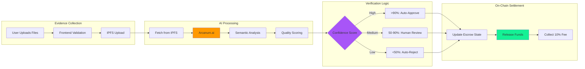
```mermaid
flowchart LR
    subgraph "Evidence Collection"
        A[User Uploads Files]
        B[Frontend Validation]
        C[IPFS Upload]
    end
    
    subgraph "AI Processing"
        D[Fetch from IPFS]
        E[Arcanum.ai]
        F[Semantic Analysis]
        G[Quality Scoring]
    end
    
    subgraph "Verification Logic"
        H{Confidence Score}
        I[>90%: Auto-Approve]
        J[50-90%: Human Review]
        K[<50%: Auto-Reject]
    end
    
    subgraph "On-Chain Settlement"
        L[Update Escrow State]
        M[Release Funds]
        N[Collect 10% Fee]
    end
    
    A --> B
    B --> C
    C --> D
    D --> E
    E --> F
    F --> G
    G --> H
    
    H -->|High| I
    H -->|Medium| J
    H -->|Low| K
    
    I --> L
    J --> L
    K --> L
    
    L --> M
    M --> N
    
    style E fill:#FF9900
    style H fill:#A855F7
    style M fill:#14F195
```

## 🔐 Zero-Knowledge KYC Flow

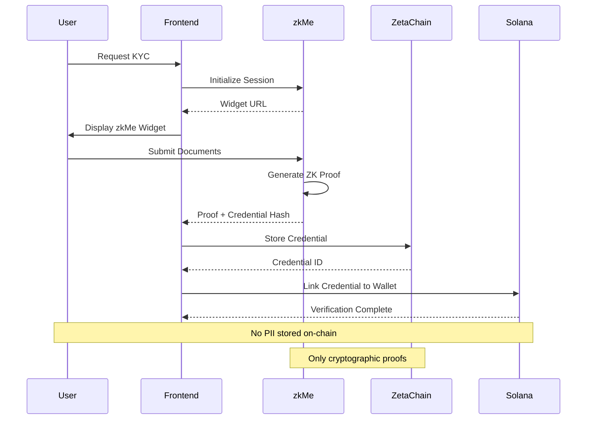
```mermaid
sequenceDiagram
    participant User
    participant Frontend
    participant zkMe
    participant ZetaChain
    participant Solana
    
    User->>Frontend: Request KYC
    Frontend->>zkMe: Initialize Session
    zkMe-->>Frontend: Widget URL
    
    Frontend->>User: Display zkMe Widget
    User->>zkMe: Submit Documents
    zkMe->>zkMe: Generate ZK Proof
    
    zkMe-->>Frontend: Proof + Credential Hash
    Frontend->>ZetaChain: Store Credential
    ZetaChain-->>Frontend: Credential ID
    
    Frontend->>Solana: Link Credential to Wallet
    Solana-->>Frontend: Verification Complete
    
    Note over User,Solana: No PII stored on-chain
    Note over zkMe,ZetaChain: Only cryptographic proofs
```

## 🌐 Omnichain Settlement Architecture

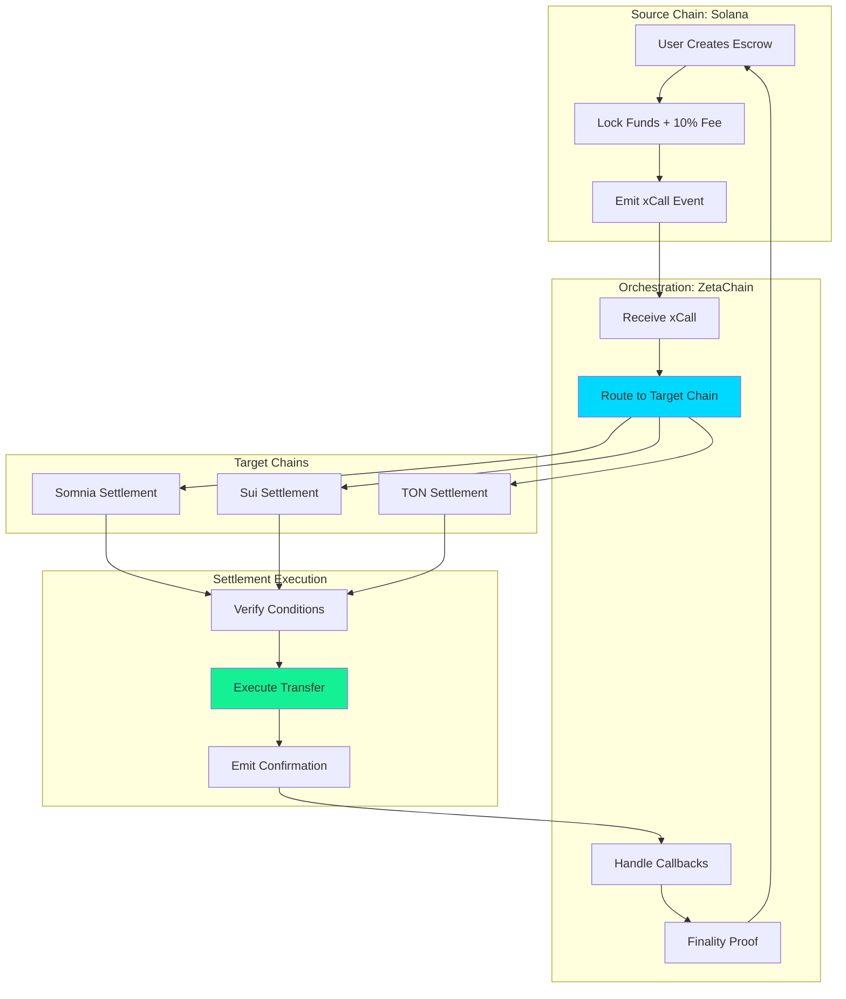
```mermaid
graph TB
    subgraph "Source Chain: Solana"
        S1[User Creates Escrow]
        S2[Lock Funds + 10% Fee]
        S3[Emit xCall Event]
    end
    
    subgraph "Orchestration: ZetaChain"
        Z1[Receive xCall]
        Z2[Route to Target Chain]
        Z3[Handle Callbacks]
        Z4[Finality Proof]
    end
    
    subgraph "Target Chains"
        T1[Somnia Settlement]
        T2[Sui Settlement]
        T3[TON Settlement]
    end
    
    subgraph "Settlement Execution"
        E1[Verify Conditions]
        E2[Execute Transfer]
        E3[Emit Confirmation]
    end
    
    S1 --> S2
    S2 --> S3
    S3 --> Z1
    
    Z1 --> Z2
    Z2 --> T1
    Z2 --> T2
    Z2 --> T3
    
    T1 --> E1
    T2 --> E1
    T3 --> E1
    
    E1 --> E2
    E2 --> E3
    E3 --> Z3
    Z3 --> Z4
    Z4 --> S1
    
    style Z2 fill:#00D9FF
    style E2 fill:#14F195
```

## 🌊 Comprehensive Data Flow Diagrams

### Primary Escrow Data Flow
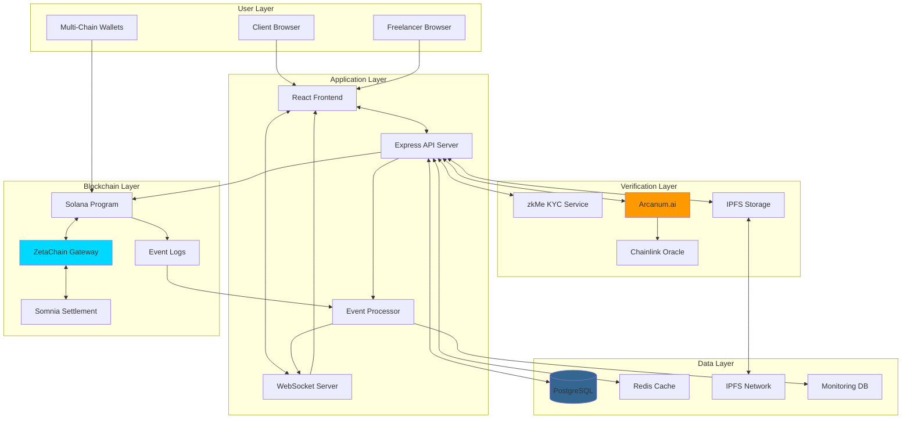
```mermaid
flowchart TD
    subgraph "User Layer"
        U1[Client Browser]
        U2[Freelancer Browser]
        U3[Multi-Chain Wallets]
    end
    
    subgraph "Application Layer"
        A1[React Frontend]
        A2[Express API Server]
        A3[WebSocket Server]
        A4[Event Processor]
    end
    
    subgraph "Verification Layer"
        V1[zkMe KYC Service]
        V2[Arcanum.ai]
        V3[Chainlink Oracle]
        V4[IPFS Storage]
    end
    
    subgraph "Blockchain Layer"
        B1[Solana Program]
        B2[ZetaChain Gateway]
        B3[Somnia Settlement]
        B4[Event Logs]
    end
    
    subgraph "Data Layer"
        D1[(PostgreSQL)]
        D2[Redis Cache]
        D3[IPFS Network]
        D4[Monitoring DB]
    end
    
    U1 --> A1
    U2 --> A1
    U3 --> B1
    
    A1 <--> A2
    A1 <--> A3
    A2 --> A4
    
    A2 <--> V1
    A2 <--> V2
    A2 <--> V4
    V2 --> V3
    
    A2 --> B1
    B1 <--> B2
    B2 <--> B3
    B1 --> B4
    
    A2 <--> D1
    A2 <--> D2
    V4 <--> D3
    A4 --> D4
    
    B4 --> A4
    A4 --> A3
    A3 --> A1
    
    style V2 fill:#FF9900
    style B2 fill:#00D9FF
    style D1 fill:#336791
```

### Cross-Chain Message Flow
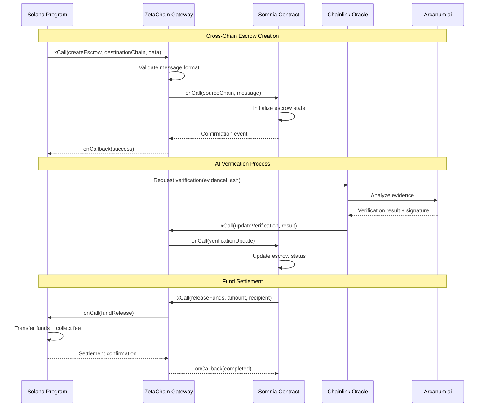
```mermaid
sequenceDiagram
    participant Solana as Solana Program
    participant ZetaGW as ZetaChain Gateway
    participant Somnia as Somnia Contract
    participant Oracle as Chainlink Oracle
    participant AI as Arcanum.ai
    
    Note over Solana,AI: Cross-Chain Escrow Creation
    Solana->>ZetaGW: xCall(createEscrow, destinationChain, data)
    ZetaGW->>ZetaGW: Validate message format
    ZetaGW->>Somnia: onCall(sourceChain, message)
    Somnia->>Somnia: Initialize escrow state
    Somnia-->>ZetaGW: Confirmation event
    ZetaGW-->>Solana: onCallback(success)
    
    Note over Solana,AI: AI Verification Process
    Solana->>Oracle: Request verification(evidenceHash)
    Oracle->>AI: Analyze evidence
    AI-->>Oracle: Verification result + signature
    Oracle->>ZetaGW: xCall(updateVerification, result)
    ZetaGW->>Somnia: onCall(verificationUpdate)
    Somnia->>Somnia: Update escrow status
    
    Note over Solana,AI: Fund Settlement
    Somnia->>ZetaGW: xCall(releaseFunds, amount, recipient)
    ZetaGW->>Solana: onCall(fundRelease)
    Solana->>Solana: Transfer funds + collect fee
    Solana-->>ZetaGW: Settlement confirmation
    ZetaGW-->>Somnia: onCallback(completed)
```

## 💾 Data Flow Architecture

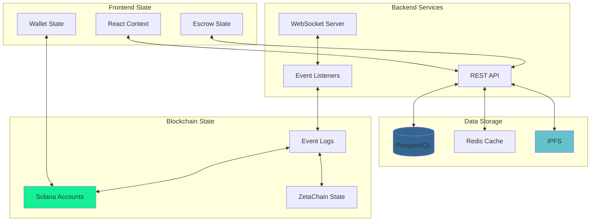
```mermaid
flowchart TD
    subgraph "Frontend State"
        A[React Context]
        B[Wallet State]
        C[Escrow State]
    end
    
    subgraph "Backend Services"
        D[REST API]
        E[WebSocket Server]
        F[Event Listeners]
    end
    
    subgraph "Data Storage"
        G[(PostgreSQL)]
        H[Redis Cache]
        I[IPFS]
    end
    
    subgraph "Blockchain State"
        J[Solana Accounts]
        K[ZetaChain State]
        L[Event Logs]
    end
    
    A <--> D
    B <--> J
    C <--> D
    
    D <--> G
    D <--> H
    D <--> I
    
    E <--> F
    F <--> L
    L <--> J
    L <--> K
    
    style G fill:#336791
    style I fill:#65C2CB
    style J fill:#14F195
```

## 🔒 Security Architecture

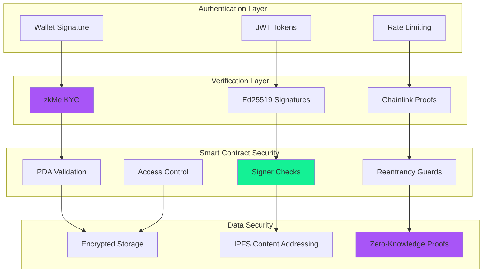
```mermaid
graph TB
    subgraph "Authentication Layer"
        A1[Wallet Signature]
        A2[JWT Tokens]
        A3[Rate Limiting]
    end
    
    subgraph "Verification Layer"
        V1[zkMe KYC]
        V2[Ed25519 Signatures]
        V3[Chainlink Proofs]
    end
    
    subgraph "Smart Contract Security"
        SC1[PDA Validation]
        SC2[Signer Checks]
        SC3[Reentrancy Guards]
        SC4[Access Control]
    end
    
    subgraph "Data Security"
        D1[Encrypted Storage]
        D2[IPFS Content Addressing]
        D3[Zero-Knowledge Proofs]
    end
    
    A1 --> V1
    A2 --> V2
    A3 --> V3
    
    V1 --> SC1
    V2 --> SC2
    V3 --> SC3
    
    SC1 --> D1
    SC2 --> D2
    SC3 --> D3
    SC4 --> D1
    
    style V1 fill:#A855F7
    style SC2 fill:#14F195
    style D3 fill:#A855F7
```

## 📊 Performance Optimization

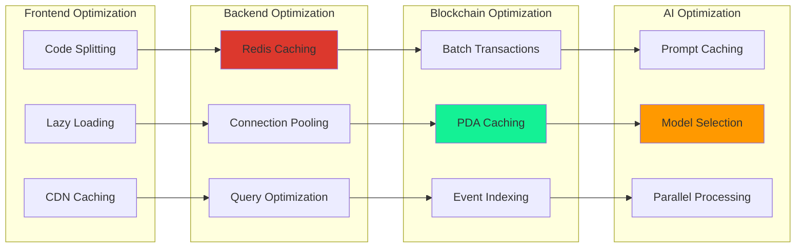
```mermaid
graph LR
    subgraph "Frontend Optimization"
        F1[Code Splitting]
        F2[Lazy Loading]
        F3[CDN Caching]
    end
    
    subgraph "Backend Optimization"
        B1[Redis Caching]
        B2[Connection Pooling]
        B3[Query Optimization]
    end
    
    subgraph "Blockchain Optimization"
        BC1[Batch Transactions]
        BC2[PDA Caching]
        BC3[Event Indexing]
    end
    
    subgraph "AI Optimization"
        AI1[Prompt Caching]
        AI2[Model Selection]
        AI3[Parallel Processing]
    end
    
    F1 --> B1
    F2 --> B2
    F3 --> B3
    
    B1 --> BC1
    B2 --> BC2
    B3 --> BC3
    
    BC1 --> AI1
    BC2 --> AI2
    BC3 --> AI3
    
    style B1 fill:#DC382D
    style BC2 fill:#14F195
    style AI2 fill:#FF9900
```

## 🎯 Proof of Task Verification (PoTv) Engine

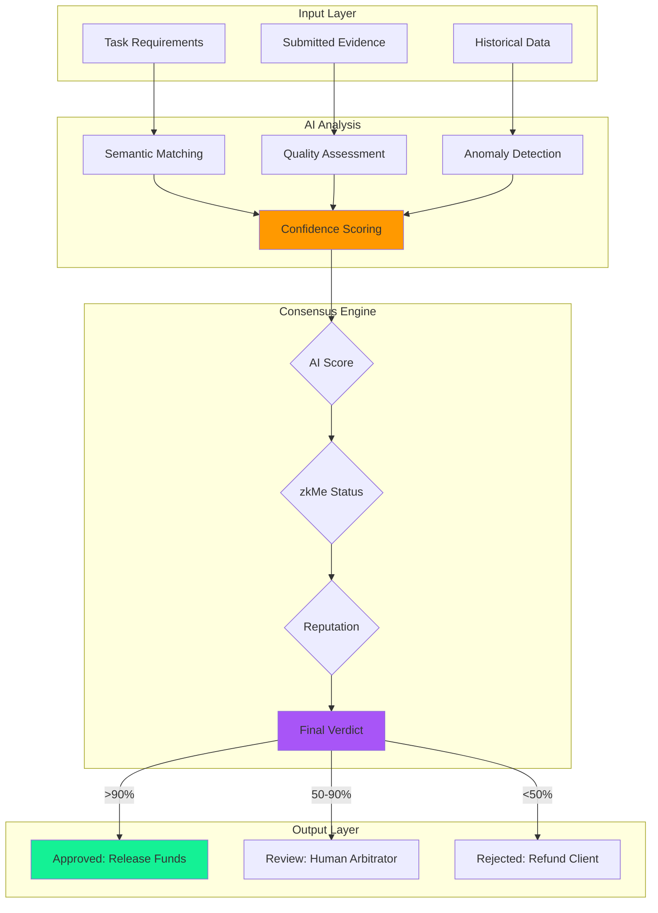
```mermaid
flowchart TB
    subgraph "Input Layer"
        I1[Task Requirements]
        I2[Submitted Evidence]
        I3[Historical Data]
    end
    
    subgraph "AI Analysis"
        A1[Semantic Matching]
        A2[Quality Assessment]
        A3[Anomaly Detection]
        A4[Confidence Scoring]
    end
    
    subgraph "Consensus Engine"
        C1{AI Score}
        C2{zkMe Status}
        C3{Reputation}
        C4[Final Verdict]
    end
    
    subgraph "Output Layer"
        O1[Approved: Release Funds]
        O2[Review: Human Arbitrator]
        O3[Rejected: Refund Client]
    end
    
    I1 --> A1
    I2 --> A2
    I3 --> A3
    
    A1 --> A4
    A2 --> A4
    A3 --> A4
    
    A4 --> C1
    C1 --> C2
    C2 --> C3
    C3 --> C4
    
    C4 -->|>90%| O1
    C4 -->|50-90%| O2
    C4 -->|<50%| O3
    
    style A4 fill:#FF9900
    style C4 fill:#A855F7
    style O1 fill:#14F195
```

## 📋 Detailed Sequence Diagrams

### Escrow Creation Flow

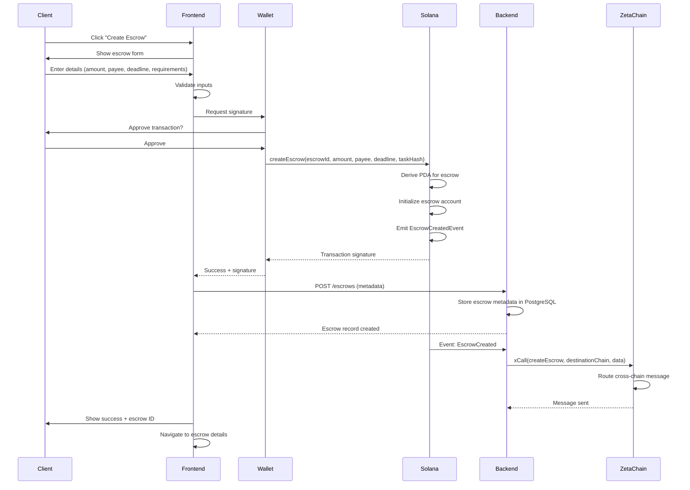
```mermaid
sequenceDiagram
    participant Client
    participant Frontend
    participant Wallet
    participant Solana
    participant Backend
    participant ZetaChain
    
    Client->>Frontend: Click "Create Escrow"
    Frontend->>Client: Show escrow form
    Client->>Frontend: Enter details (amount, payee, deadline, requirements)
    Frontend->>Frontend: Validate inputs
    
    Frontend->>Wallet: Request signature
    Wallet->>Client: Approve transaction?
    Client->>Wallet: Approve
    
    Wallet->>Solana: createEscrow(escrowId, amount, payee, deadline, taskHash)
    Solana->>Solana: Derive PDA for escrow
    Solana->>Solana: Initialize escrow account
    Solana->>Solana: Emit EscrowCreatedEvent
    Solana-->>Wallet: Transaction signature
    
    Wallet-->>Frontend: Success + signature
    Frontend->>Backend: POST /escrows (metadata)
    Backend->>Backend: Store escrow metadata in PostgreSQL
    Backend-->>Frontend: Escrow record created
    
    Solana->>Backend: Event: EscrowCreated
    Backend->>ZetaChain: xCall(createEscrow, destinationChain, data)
    ZetaChain->>ZetaChain: Route cross-chain message
    ZetaChain-->>Backend: Message sent
    
    Frontend->>Client: Show success + escrow ID
    Frontend->>Frontend: Navigate to escrow details
```

### Task Submission Flow

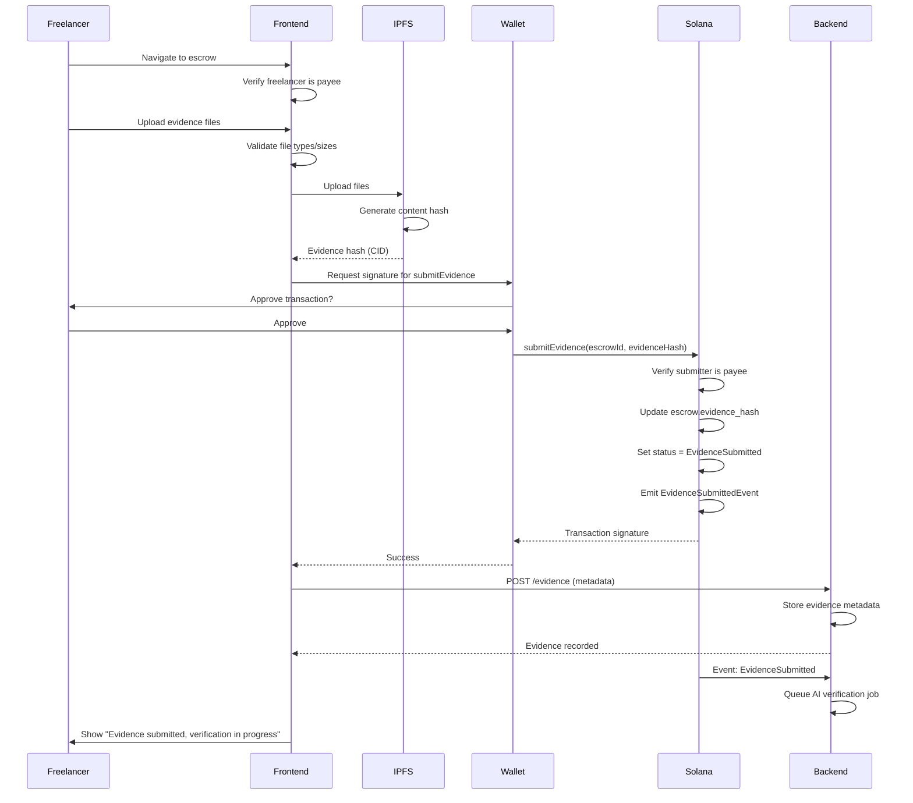
```mermaid
sequenceDiagram
    participant Freelancer
    participant Frontend
    participant IPFS
    participant Wallet
    participant Solana
    participant Backend
    
    Freelancer->>Frontend: Navigate to escrow
    Frontend->>Frontend: Verify freelancer is payee
    Freelancer->>Frontend: Upload evidence files
    
    Frontend->>Frontend: Validate file types/sizes
    Frontend->>IPFS: Upload files
    IPFS->>IPFS: Generate content hash
    IPFS-->>Frontend: Evidence hash (CID)
    
    Frontend->>Wallet: Request signature for submitEvidence
    Wallet->>Freelancer: Approve transaction?
    Freelancer->>Wallet: Approve
    
    Wallet->>Solana: submitEvidence(escrowId, evidenceHash)
    Solana->>Solana: Verify submitter is payee
    Solana->>Solana: Update escrow.evidence_hash
    Solana->>Solana: Set status = EvidenceSubmitted
    Solana->>Solana: Emit EvidenceSubmittedEvent
    Solana-->>Wallet: Transaction signature
    
    Wallet-->>Frontend: Success
    Frontend->>Backend: POST /evidence (metadata)
    Backend->>Backend: Store evidence metadata
    Backend-->>Frontend: Evidence recorded
    
    Solana->>Backend: Event: EvidenceSubmitted
    Backend->>Backend: Queue AI verification job
    
    Frontend->>Freelancer: Show "Evidence submitted, verification in progress"
```

### AI Verification Flow

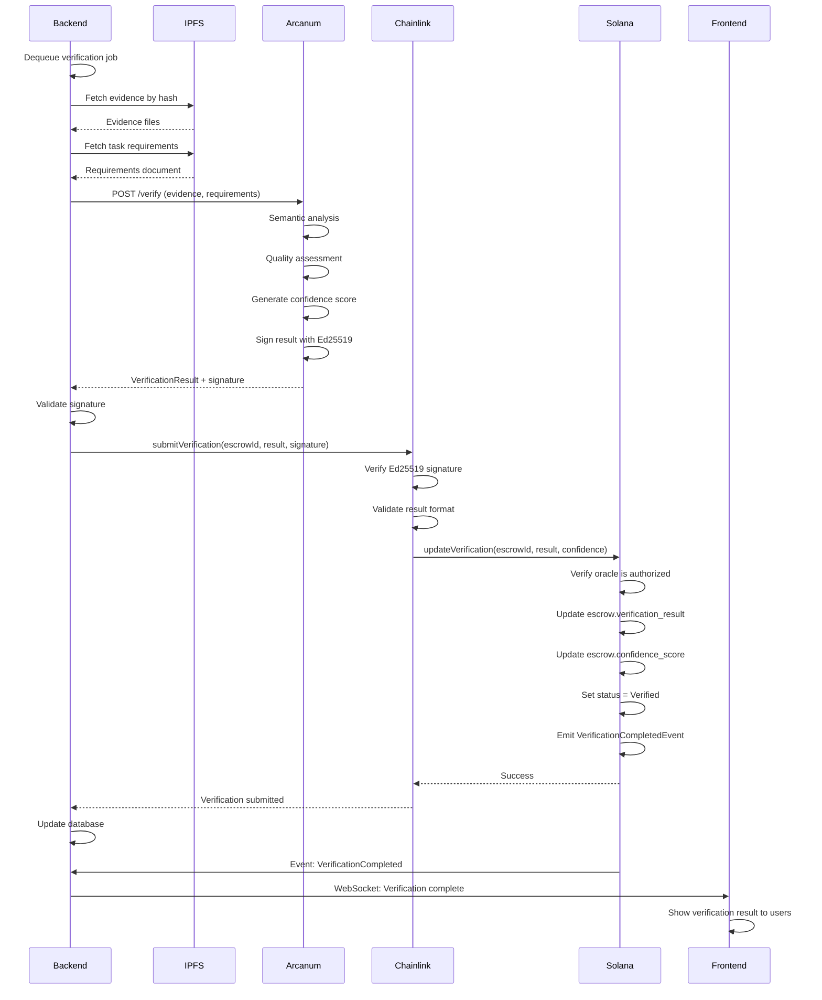
```mermaid
sequenceDiagram
    participant Backend
    participant IPFS
    participant Arcanum
    participant Chainlink
    participant Solana
    participant Frontend
    
    Backend->>Backend: Dequeue verification job
    Backend->>IPFS: Fetch evidence by hash
    IPFS-->>Backend: Evidence files
    
    Backend->>IPFS: Fetch task requirements
    IPFS-->>Backend: Requirements document
    
    Backend->>Arcanum: POST /verify (evidence, requirements)
    Arcanum->>Arcanum: Semantic analysis
    Arcanum->>Arcanum: Quality assessment
    Arcanum->>Arcanum: Generate confidence score
    Arcanum->>Arcanum: Sign result with Ed25519
    Arcanum-->>Backend: VerificationResult + signature
    
    Backend->>Backend: Validate signature
    Backend->>Chainlink: submitVerification(escrowId, result, signature)
    Chainlink->>Chainlink: Verify Ed25519 signature
    Chainlink->>Chainlink: Validate result format
    
    Chainlink->>Solana: updateVerification(escrowId, result, confidence)
    Solana->>Solana: Verify oracle is authorized
    Solana->>Solana: Update escrow.verification_result
    Solana->>Solana: Update escrow.confidence_score
    Solana->>Solana: Set status = Verified
    Solana->>Solana: Emit VerificationCompletedEvent
    Solana-->>Chainlink: Success
    
    Chainlink-->>Backend: Verification submitted
    Backend->>Backend: Update database
    
    Solana->>Backend: Event: VerificationCompleted
    Backend->>Frontend: WebSocket: Verification complete
    Frontend->>Frontend: Show verification result to users
```

### Cross-Chain Release Flow

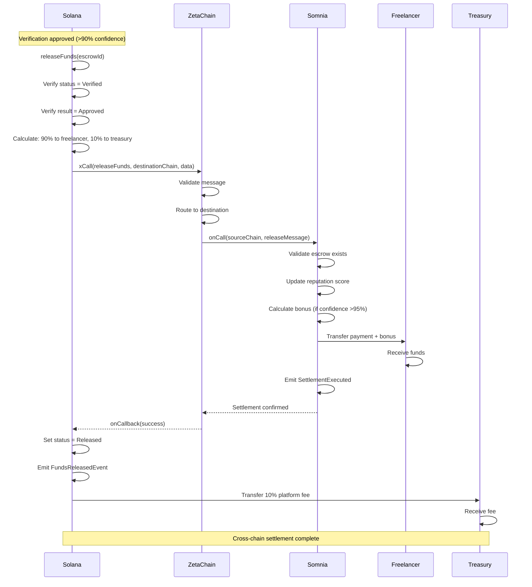
```mermaid
sequenceDiagram
    participant Solana
    participant ZetaChain
    participant Somnia
    participant Freelancer
    participant Treasury
    
    Note over Solana: Verification approved (>90% confidence)
    
    Solana->>Solana: releaseFunds(escrowId)
    Solana->>Solana: Verify status = Verified
    Solana->>Solana: Verify result = Approved
    Solana->>Solana: Calculate: 90% to freelancer, 10% to treasury
    
    Solana->>ZetaChain: xCall(releaseFunds, destinationChain, data)
    ZetaChain->>ZetaChain: Validate message
    ZetaChain->>ZetaChain: Route to destination
    
    ZetaChain->>Somnia: onCall(sourceChain, releaseMessage)
    Somnia->>Somnia: Validate escrow exists
    Somnia->>Somnia: Update reputation score
    Somnia->>Somnia: Calculate bonus (if confidence >95%)
    
    Somnia->>Freelancer: Transfer payment + bonus
    Freelancer->>Freelancer: Receive funds
    
    Somnia->>Somnia: Emit SettlementExecuted
    Somnia-->>ZetaChain: Settlement confirmed
    
    ZetaChain-->>Solana: onCallback(success)
    Solana->>Solana: Set status = Released
    Solana->>Solana: Emit FundsReleasedEvent
    
    Solana->>Treasury: Transfer 10% platform fee
    Treasury->>Treasury: Receive fee
    
    Note over Solana,Treasury: Cross-chain settlement complete
```

## 🔄 Event-Driven Architecture

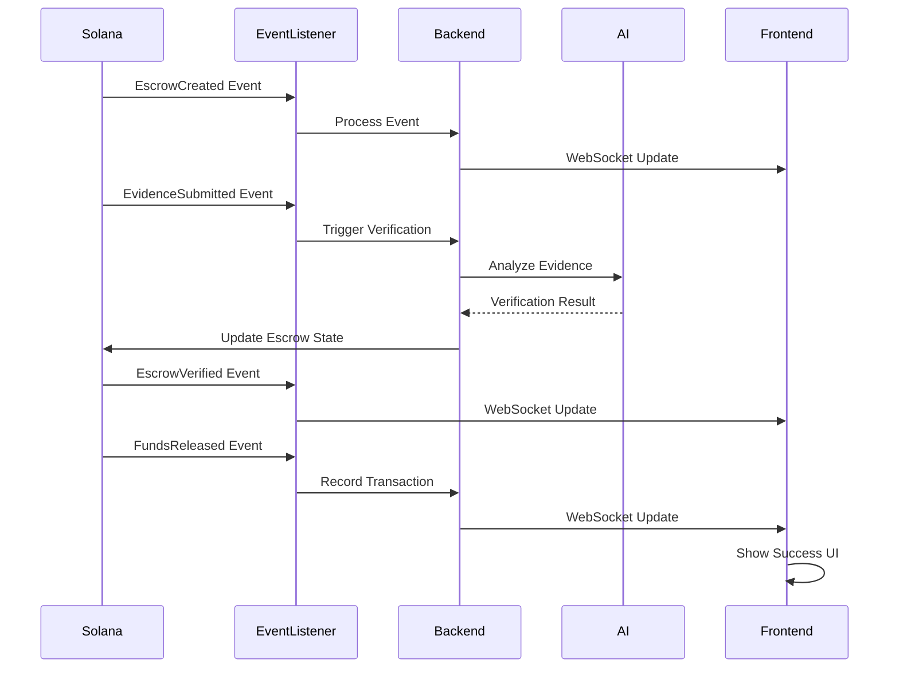
```mermaid
sequenceDiagram
    participant Solana
    participant EventListener
    participant Backend
    participant AI
    participant Frontend
    
    Solana->>EventListener: EscrowCreated Event
    EventListener->>Backend: Process Event
    Backend->>Frontend: WebSocket Update
    
    Solana->>EventListener: EvidenceSubmitted Event
    EventListener->>Backend: Trigger Verification
    Backend->>AI: Analyze Evidence
    AI-->>Backend: Verification Result
    Backend->>Solana: Update Escrow State
    Solana->>EventListener: EscrowVerified Event
    EventListener->>Frontend: WebSocket Update
    
    Solana->>EventListener: FundsReleased Event
    EventListener->>Backend: Record Transaction
    Backend->>Frontend: WebSocket Update
    Frontend->>Frontend: Show Success UI
```

## 📈 Scalability Architecture

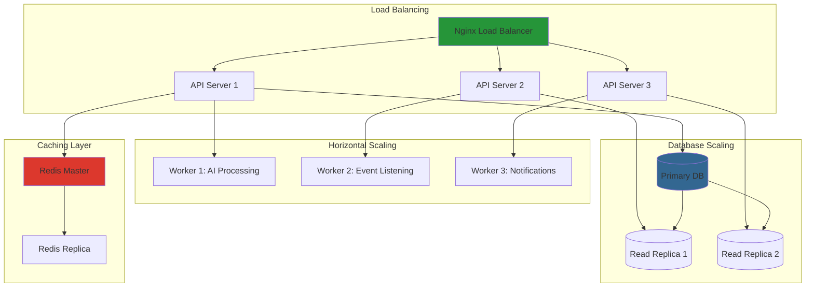
```mermaid
graph TB
    subgraph "Load Balancing"
        LB[Nginx Load Balancer]
        API1[API Server 1]
        API2[API Server 2]
        API3[API Server 3]
    end
    
    subgraph "Horizontal Scaling"
        W1[Worker 1: AI Processing]
        W2[Worker 2: Event Listening]
        W3[Worker 3: Notifications]
    end
    
    subgraph "Database Scaling"
        Master[(Primary DB)]
        Replica1[(Read Replica 1)]
        Replica2[(Read Replica 2)]
    end
    
    subgraph "Caching Layer"
        Redis1[Redis Master]
        Redis2[Redis Replica]
    end
    
    LB --> API1
    LB --> API2
    LB --> API3
    
    API1 --> W1
    API2 --> W2
    API3 --> W3
    
    API1 --> Master
    API2 --> Replica1
    API3 --> Replica2
    
    Master --> Replica1
    Master --> Replica2
    
    API1 --> Redis1
    Redis1 --> Redis2
    
    style LB fill:#269539
    style Master fill:#336791
    style Redis1 fill:#DC382D
```

## 🛠️ Development & Deployment Pipeline


```mermaid
flowchart LR
    subgraph "Development"
        D1[Local Development]
        D2[Unit Tests]
        D3[Integration Tests]
    end
    
    subgraph "CI/CD"
        C1[GitHub Actions]
        C2[Build & Test]
        C3[Security Scan]
    end
    
    subgraph "Staging"
        S1[Devnet Deployment]
        S2[E2E Testing]
        S3[Performance Testing]
    end
    
    subgraph "Production"
        P1[Mainnet Deployment]
        P2[Monitoring]
        P3[Analytics]
    end
    
    D1 --> D2
    D2 --> D3
    D3 --> C1
    
    C1 --> C2
    C2 --> C3
    C3 --> S1
    
    S1 --> S2
    S2 --> S3
    S3 --> P1
    
    P1 --> P2
    P2 --> P3
    
    style C2 fill:#2088FF
    style S2 fill:#FFA500
    style P1 fill:#14F195
```

## 💰 Fee Distribution Architecture

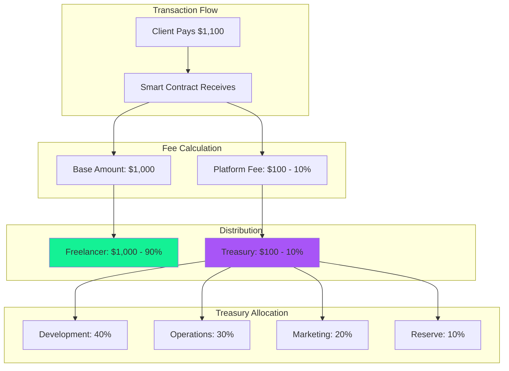
```mermaid
graph TD
    subgraph "Transaction Flow"
        T1[Client Pays $1,100]
        T2[Smart Contract Receives]
    end
    
    subgraph "Fee Calculation"
        F1[Base Amount: $1,000]
        F2[Platform Fee: $100 - 10%]
    end
    
    subgraph "Distribution"
        D1[Freelancer: $1,000 - 90%]
        D2[Treasury: $100 - 10%]
    end
    
    subgraph "Treasury Allocation"
        A1[Development: 40%]
        A2[Operations: 30%]
        A3[Marketing: 20%]
        A4[Reserve: 10%]
    end
    
    T1 --> T2
    T2 --> F1
    T2 --> F2
    
    F1 --> D1
    F2 --> D2
    
    D2 --> A1
    D2 --> A2
    D2 --> A3
    D2 --> A4
    
    style D1 fill:#14F195
    style D2 fill:#A855F7
```

## 🔍 Monitoring & Observability

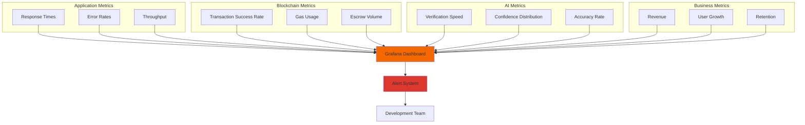
```mermaid
graph TB
    subgraph "Application Metrics"
        M1[Response Times]
        M2[Error Rates]
        M3[Throughput]
    end
    
    subgraph "Blockchain Metrics"
        B1[Transaction Success Rate]
        B2[Gas Usage]
        B3[Escrow Volume]
    end
    
    subgraph "AI Metrics"
        A1[Verification Speed]
        A2[Confidence Distribution]
        A3[Accuracy Rate]
    end
    
    subgraph "Business Metrics"
        BM1[Revenue]
        BM2[User Growth]
        BM3[Retention]
    end
    
    M1 --> Dashboard[Grafana Dashboard]
    M2 --> Dashboard
    M3 --> Dashboard
    
    B1 --> Dashboard
    B2 --> Dashboard
    B3 --> Dashboard
    
    A1 --> Dashboard
    A2 --> Dashboard
    A3 --> Dashboard
    
    BM1 --> Dashboard
    BM2 --> Dashboard
    BM3 --> Dashboard
    
    Dashboard --> Alerts[Alert System]
    Alerts --> Team[Development Team]
    
    style Dashboard fill:#F46800
    style Alerts fill:#DC382D
```

## 📸 Architecture Screenshots & Media

<div className="my-8 p-6 rounded-xl bg-gradient-to-r from-purple-500/10 to-cyan-500/10 border border-purple-500/30">
  <h3 className="text-xl font-bold text-white mb-4">🎬 System Architecture Overview Video</h3>
  <p className="text-gray-300 mb-4">
    Watch a comprehensive walkthrough of AetherLock's multi-layered architecture, from frontend to blockchain settlement.
  </p>
  <div className="aspect-video bg-gray-800 rounded-lg flex items-center justify-center border-2 border-dashed border-gray-600">
    <p className="text-gray-400 text-center">
      📹 Video Placeholder: Architecture Overview<br/>
      <span className="text-sm">Duration: 5-7 minutes</span>
    </p>
  </div>
</div>

<div className="grid grid-cols-1 md:grid-cols-2 gap-6 my-8">
  <div className="p-4 rounded-lg bg-gray-800/50 border border-gray-700">
    <h4 className="text-lg font-bold text-white mb-3">🏗️ System Layer Diagram</h4>
    <div className="aspect-video bg-gray-900 rounded flex items-center justify-center border border-gray-700">
      <p className="text-gray-400 text-center text-sm">
        Screenshot: Interactive system layer visualization<br/>
        (UI, Application, Verification, Blockchain, Storage)
      </p>
    </div>
  </div>
  
  <div className="p-4 rounded-lg bg-gray-800/50 border border-gray-700">
    <h4 className="text-lg font-bold text-white mb-3">🔗 Cross-Chain Message Flow</h4>
    <div className="aspect-video bg-gray-900 rounded flex items-center justify-center border border-gray-700">
      <p className="text-gray-400 text-center text-sm">
        Screenshot: ZetaChain gateway routing visualization<br/>
        (Solana → ZetaChain → Somnia)
      </p>
    </div>
  </div>
  
  <div className="p-4 rounded-lg bg-gray-800/50 border border-gray-700">
    <h4 className="text-lg font-bold text-white mb-3">🧠 AI Verification Pipeline</h4>
    <div className="aspect-video bg-gray-900 rounded flex items-center justify-center border border-gray-700">
      <p className="text-gray-400 text-center text-sm">
        Screenshot: Arcanum.ai verification dashboard<br/>
        (Evidence analysis, confidence scoring, decision logic)
      </p>
    </div>
  </div>
  
  <div className="p-4 rounded-lg bg-gray-800/50 border border-gray-700">
    <h4 className="text-lg font-bold text-white mb-3">💎 Solana Program Explorer</h4>
    <div className="aspect-video bg-gray-900 rounded flex items-center justify-center border border-gray-700">
      <p className="text-gray-400 text-center text-sm">
        Screenshot: Solana Explorer showing escrow transactions<br/>
        (Program instructions, account states, events)
      </p>
    </div>
  </div>
</div>

<div className="my-8 p-6 rounded-xl bg-gradient-to-r from-cyan-500/10 to-green-500/10 border border-cyan-500/30">
  <h3 className="text-xl font-bold text-white mb-4">📊 Performance Metrics Dashboard</h3>
  <p className="text-gray-300 mb-4">
    Real-time monitoring of system performance, transaction throughput, and verification accuracy.
  </p>
  <div className="aspect-video bg-gray-800 rounded-lg flex items-center justify-center border-2 border-dashed border-gray-600">
    <p className="text-gray-400 text-center">
      📊 Screenshot Placeholder: Grafana Dashboard<br/>
      <span className="text-sm">Metrics: TPS, latency, success rate, AI confidence distribution</span>
    </p>
  </div>
</div>

---

<div className="my-8 p-6 rounded-xl bg-gradient-to-r from-purple-500/10 to-cyan-500/10 border border-purple-500/30">
  <h3 className="text-2xl font-bold text-white mb-4">Explore the Architecture</h3>
  <p className="text-gray-300 mb-6">
    Dive deeper into specific components and see how they work together to create a seamless AI-powered escrow experience.
  </p>
  <div className="flex gap-4">
    <a href="/design/overview" className="px-6 py-3 rounded-lg bg-gradient-to-r from-purple-500 to-cyan-500 text-white font-bold hover:opacity-90">
      View Design Docs →
    </a>
    <a href="https://github.com/De-real-iManuel/AetherLock-" className="px-6 py-3 rounded-lg bg-white/10 border border-white/20 text-white font-bold hover:bg-white/20">
      View Source Code
    </a>
  </div>
</div>
